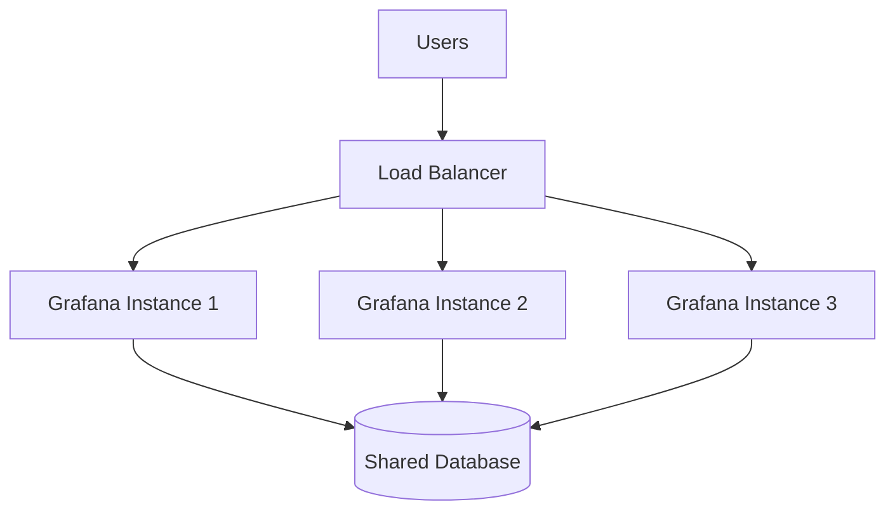

# Load Balancing in Grafana

## Introduction

Load balancing is a critical technique for distributing network traffic across multiple servers to ensure high availability, reliability, and optimal performance of your Grafana deployment. As your monitoring needs grow and more users access your Grafana dashboards simultaneously, a single Grafana instance may become a bottleneck or a single point of failure.

This guide will explore how to implement load balancing for Grafana, the benefits it provides, and various strategies to ensure your monitoring platform remains responsive and resilient even under heavy load.

## Why Load Balance Grafana?

Before diving into implementation details, let's understand why load balancing is essential for Grafana deployments:

1. **High Availability**: If one Grafana server fails, the load balancer redirects traffic to healthy servers, minimizing downtime.
2. **Scalability**: Easily add more Grafana instances to handle increased user load without service disruption.
3. **Performance**: Distribute queries across multiple servers to prevent any single instance from becoming overwhelmed.
4. **Maintenance Flexibility**: Perform updates or maintenance on individual servers without taking the entire service offline.

## Load Balancing Architecture for Grafana

A typical load-balanced Grafana setup consists of:



In this architecture:
- Multiple Grafana instances run simultaneously
- A load balancer distributes incoming user requests
- All instances connect to the same database to maintain consistent state
- Grafana instances can be added or removed without affecting service availability

## Prerequisites for Load Balancing Grafana

Before implementing load balancing for Grafana, ensure you have:

1. A shared database (MySQL, PostgreSQL) for Grafana configuration storage
2. A consistent configuration across all Grafana instances
3. A load balancer (NGINX, HAProxy, cloud-based solutions like AWS ELB)
4. Shared storage for plugins and dashboards (optional but recommended)

## Step-by-Step Implementation

### 1. Set Up a Shared Database

First, configure Grafana to use an external database instead of the default SQLite:

```ini
[database]
type = mysql
host = your-mysql-server:3306
name = grafana
user = grafana_user
password = your_secure_password
```

This ensures all Grafana instances work with the same configuration data.

### 2. Configure Grafana Instances

Make sure each Grafana instance has identical configuration. Key settings for a load-balanced environment:

```ini
[server]
# Each instance should have a unique node name
instance_name = grafana-01

# Use the same root_url across all instances
root_url = https://grafana.yourdomain.com

[auth]
# For consistent authentication across instances
login_cookie_name = grafana_session
cookie_secure = true
disable_login_form = false
```

### 3. Setting Up NGINX as a Load Balancer

Below is a basic NGINX configuration for Grafana load balancing:

```nginx
upstream grafana {
    server grafana-01:3000 max_fails=3 fail_timeout=30s;
    server grafana-02:3000 max_fails=3 fail_timeout=30s;
    server grafana-03:3000 max_fails=3 fail_timeout=30s;
}

server {
    listen 80;
    server_name grafana.yourdomain.com;
    
    location / {
        proxy_pass http://grafana;
        proxy_http_version 1.1;
        proxy_set_header Host $http_host;
        proxy_set_header X-Real-IP $remote_addr;
        proxy_set_header X-Forwarded-For $proxy_add_x_forwarded_for;
        proxy_set_header X-Forwarded-Proto $scheme;
    }
}
```

This configuration:
- Defines an upstream group of three Grafana servers
- Monitors server health and temporarily removes failed servers
- Forwards traffic with proper headers to maintain session integrity

### 4. Setting Up HAProxy as an Alternative

If you prefer HAProxy, here's a sample configuration:

```
frontend grafana_frontend
    bind *:80
    mode http
    default_backend grafana_backend

backend grafana_backend
    mode http
    balance roundrobin
    option httpchk GET /api/health
    http-check expect status 200
    server grafana-01 grafana-01:3000 check
    server grafana-02 grafana-02:3000 check
    server grafana-03 grafana-03:3000 check
```

This configuration:
- Creates a frontend listening on port 80
- Sets up a backend with round-robin load balancing
- Uses Grafana's health API to verify server status

## Load Balancing Strategies

Depending on your requirements, you can implement different load balancing strategies:

### Round Robin

The simplest strategy, routing requests sequentially to each server. Good for servers with equal capability.

Example HAProxy configuration:
```
backend grafana_backend
    balance roundrobin
    server grafana-01 grafana-01:3000 check
    server grafana-02 grafana-02:3000 check
```

### Least Connections

Routes requests to the server with the fewest active connections. Useful when requests vary in processing time.

Example HAProxy configuration:
```
backend grafana_backend
    balance leastconn
    server grafana-01 grafana-01:3000 check
    server grafana-02 grafana-02:3000 check
```

### IP Hash

Routes requests from the same client IP to the same server. Useful for maintaining session consistency.

Example NGINX configuration:
```nginx
upstream grafana {
    ip_hash;
    server grafana-01:3000;
    server grafana-02:3000;
}
```

## Session Management

Grafana uses stateful sessions, so you'll need to address session management in a load-balanced environment:

### Option 1: Sticky Sessions

Configure your load balancer to direct a user to the same Grafana instance for their entire session:

NGINX example:
```nginx
upstream grafana {
    ip_hash;  # Use IP-based sticky sessions
    server grafana-01:3000;
    server grafana-02:3000;
}
```

HAProxy example:
```
backend grafana_backend
    balance roundrobin
    cookie SERVERID insert indirect nocache
    server grafana-01 grafana-01:3000 check cookie server1
    server grafana-02 grafana-02:3000 check cookie server2
```

### Option 2: Shared Session Store

Configure Grafana to use Redis for session storage:

```ini
[session]
provider = redis
provider_config = addr=redis:6379,pool_size=100,db=0,prefix=grafana:
cookie_name = grafana_sess
```

## Monitoring Your Load-Balanced Setup

It's essential to monitor your load balancer and Grafana instances. Key metrics to track:

1. **Response Time**: The time taken to respond to requests
2. **Error Rate**: The percentage of requests resulting in errors
3. **Connection Count**: Number of active connections per server
4. **CPU/Memory Usage**: Resource utilization on each Grafana instance

You can use Grafana itself to monitor these metrics! Create a dashboard that pulls data from your load balancer and server metrics.

Example Prometheus query to monitor NGINX:
```
rate(nginx_http_requests_total{server="grafana_upstream"}[1m])
```

## Practical Example: Docker Compose Setup

Here's a complete Docker Compose example for a load-balanced Grafana setup:

```yaml
version: '3'

services:
  db:
    image: postgres:13
    environment:
      POSTGRES_USER: grafana
      POSTGRES_PASSWORD: password
      POSTGRES_DB: grafana
    volumes:
      - postgres-data:/var/lib/postgresql/data

  redis:
    image: redis:alpine
    
  grafana-01:
    image: grafana/grafana:latest
    depends_on:
      - db
      - redis
    volumes:
      - ./grafana.ini:/etc/grafana/grafana.ini
    environment:
      GF_PATHS_CONFIG: /etc/grafana/grafana.ini
      
  grafana-02:
    image: grafana/grafana:latest
    depends_on:
      - db
      - redis
    volumes:
      - ./grafana.ini:/etc/grafana/grafana.ini
    environment:
      GF_PATHS_CONFIG: /etc/grafana/grafana.ini
      
  nginx:
    image: nginx:latest
    ports:
      - "80:80"
    volumes:
      - ./nginx.conf:/etc/nginx/conf.d/default.conf
    depends_on:
      - grafana-01
      - grafana-02

volumes:
  postgres-data:
```

With the corresponding `nginx.conf`:

```nginx
upstream grafana {
    server grafana-01:3000;
    server grafana-02:3000;
}

server {
    listen 80;
    
    location / {
        proxy_pass http://grafana;
        proxy_set_header Host $host;
        proxy_set_header X-Real-IP $remote_addr;
        proxy_set_header X-Forwarded-For $proxy_add_x_forwarded_for;
        proxy_set_header X-Forwarded-Proto $scheme;
    }
}
```

## Common Challenges and Solutions

### Challenge: Different Plugins Across Instances

**Solution**: Use a shared volume for the plugins directory:

```yaml
volumes:
  - grafana-plugins:/var/lib/grafana/plugins
```

### Challenge: Load Balancer Health Checks Failing

**Solution**: Configure Grafana's health check endpoint:

```ini
[security]
# Disable login requirement for the health check
disable_initial_admin_creation = true
```

Then use `/api/health` as your health check endpoint.

### Challenge: Inconsistent Dashboard Access

**Solution**: Ensure all Grafana instances use the same database and have identical configuration for authentication and authorization.

## Performance Tuning Tips

1. **Adjust Worker Processes**: In NGINX, set `worker_processes` to match your CPU cores.

2. **Optimize Connection Timeouts**:
   ```nginx
   proxy_connect_timeout 60s;
   proxy_send_timeout 60s;
   proxy_read_timeout 60s;
   ```

3. **Buffer Settings**:
   ```nginx
   proxy_buffer_size 128k;
   proxy_buffers 4 256k;
   proxy_busy_buffers_size 256k;
   ```

4. **Enable Compression**:
   ```nginx
   gzip on;
   gzip_types text/plain text/css application/json application/javascript text/xml;
   ```

## Summary

Load balancing Grafana is essential for maintaining high availability and performance as your monitoring needs grow. By distributing user requests across multiple Grafana instances, you can ensure consistent access to your dashboards even during peak usage or server failures.

Key takeaways:
- Use a shared database to maintain consistent state across instances
- Configure session management through sticky sessions or a shared session store
- Implement health checks to detect and handle server failures
- Monitor your load balancer and Grafana instances for optimal performance

With these principles in place, you can scale your Grafana deployment to handle growing demands while maintaining reliability and performance.

## Further Resources

- [Grafana High Availability documentation](https://grafana.com/docs/grafana/latest/setup-grafana/set-up-for-high-availability/)
- [NGINX Load Balancing documentation](https://docs.nginx.com/nginx/admin-guide/load-balancer/http-load-balancer/)
- [HAProxy Configuration Manual](http://cbonte.github.io/haproxy-dconv/2.4/configuration.html)

## Exercises

1. Set up a test environment with two Grafana instances behind an NGINX load balancer using Docker Compose.
2. Implement and test different load balancing strategies (round robin, least connections, IP hash) and compare their performance.
3. Configure Grafana alerting in a load-balanced environment and verify alerts are only sent once.
4. Create a Grafana dashboard to monitor the health and performance of your load-balanced Grafana setup.
5. Simulate a server failure and observe how the load balancer handles the failover.