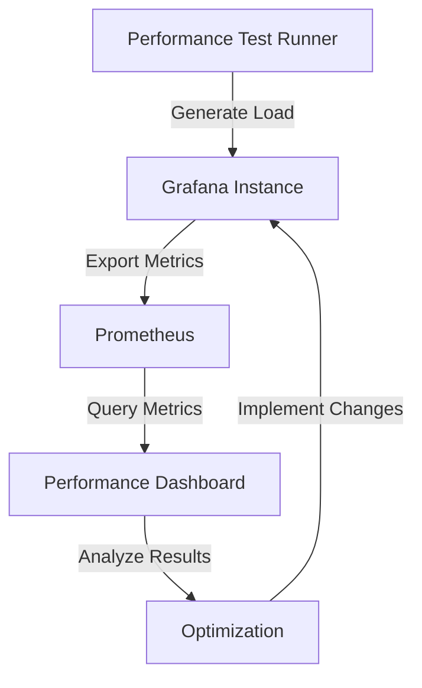

# Performance Testing in Grafana

## Introduction

Performance testing is a critical aspect of working with Grafana that ensures your dashboards, visualizations, and data queries operate efficiently even as your system scales. As applications grow and collect more data, poorly optimized Grafana implementations can suffer from slow load times, unresponsive interfaces, and excessive resource consumption.

In this guide, you'll learn how to systematically test and improve the performance of your Grafana deployments. We'll explore methods to identify bottlenecks, measure key performance indicators, and implement best practices that keep your monitoring system responsive and efficient.

## Why Performance Testing Matters

Performance testing in Grafana helps you:

- **Ensure dashboard responsiveness** under various load conditions
- **Identify slow queries** that impact user experience
- **Optimize resource usage** on both client and server sides
- **Plan for scaling** as your monitoring needs grow
- **Validate improvements** when making changes to dashboards or data sources

## Key Performance Metrics for Grafana

Before diving into testing methodologies, it's important to understand what metrics to track:

1. **Dashboard load time**: How long it takes for dashboards to fully load
2. **Query execution time**: Duration of individual data source queries
3. **Resource utilization**: CPU, memory, and network usage
4. **Concurrent user capacity**: How many users can simultaneously use the system
5. **Panel render time**: How long visualizations take to display

## Setting Up a Performance Testing Environment

### Prerequisites

To follow along with this guide, you'll need:

- A Grafana instance (v9.0 or later recommended)
- Access to Grafana's built-in metrics
- Basic knowledge of Prometheus or another time-series database
- [k6](https://k6.io/) or another load testing tool (optional)

### Creating a Test Dashboard

Start by creating a dedicated dashboard for monitoring Grafana's own performance:

```javascript
// Example dashboard JSON structure (partial)
{
  "title": "Grafana Performance Monitor",
  "panels": [
    {
      "title": "Dashboard Load Times",
      "type": "graph",
      "datasource": "Prometheus",
      "targets": [
        {
          "expr": "grafana_api_dashboard_get_milliseconds_sum / grafana_api_dashboard_get_milliseconds_count",
          "legendFormat": "Average Load Time"
        }
      ]
    }
    // Additional panels would be defined here
  ]
}
```

## Enabling Grafana's Internal Metrics

Grafana exposes internal metrics that are invaluable for performance testing. To enable them:

1. Edit your Grafana configuration file (`grafana.ini`):

```ini
[metrics]
enabled = true
interval_seconds = 10
```

2. Restart your Grafana instance to apply changes:

```bash
sudo systemctl restart grafana-server
```

3. Access metrics at `http://your-grafana-instance/metrics` (requires admin privileges)

## Creating a Prometheus Data Source for Monitoring

To collect and visualize Grafana's performance data, set up Prometheus:

1. Configure Prometheus to scrape Grafana's metrics endpoint:

```yaml
scrape_configs:
  - job_name: 'grafana'
    scrape_interval: 15s
    static_configs:
      - targets: ['grafana:3000']
```

2. Add Prometheus as a data source in Grafana
3. Create dashboards to visualize the performance metrics

## Query Performance Testing

### Identifying Slow Queries

The most common performance bottleneck in Grafana is slow-running queries. To identify them:

1. Enable query performance logging in Grafana:

```ini
[log]
filters = rendering:debug query:debug
```

2. Check logs for slow queries:

```bash
grep "Slow query" /var/log/grafana/grafana.log
```

3. Use the Query Inspector in Grafana UI to examine execution times:

```javascript
// Sample Query Inspector output
{
  "query": "SELECT mean(\"value\") FROM \"measurement\" WHERE time >= now() - 24h GROUP BY time(1m)",
  "execution_time_ms": 3254,
  "result_row_count": 1440
}
```

### Testing Query Optimizations

Once you've identified slow queries, test potential optimizations:

1. Use time bucketing appropriately
2. Add database indices for frequently queried fields
3. Implement data downsampling for historical data
4. Test different time ranges to understand scaling characteristics

Here's an example of before and after optimization for an InfluxDB query:

**Before optimization:**
```sql
SELECT mean("cpu_usage") FROM "system" WHERE ("host" =~ /.*/) AND time >= now() - 30d GROUP BY time(10s), "host"
```

**After optimization:**
```sql
SELECT mean("cpu_usage") FROM "system" WHERE ("host" =~ /^web-.*/) AND time >= now() - 30d GROUP BY time(1m), "host"
```

## Load Testing Grafana

To understand how your Grafana instance performs under load:

### Using k6 for Load Testing

[k6](https://k6.io/) is an excellent tool for simulating user load on Grafana:

```javascript
// k6-grafana-test.js
import http from 'k6/http';
import { check, sleep } from 'k6';

export const options = {
  stages: [
    { duration: '2m', target: 10 }, // Ramp up to 10 users
    { duration: '5m', target: 10 }, // Stay at 10 users
    { duration: '2m', target: 0 },  // Ramp down to 0 users
  ],
};

export default function() {
  const dashboardId = 'your-dashboard-id';
  const BASE_URL = 'http://your-grafana-instance';
  
  // Login to Grafana (adjust accordingly)
  const loginRes = http.post(`${BASE_URL}/login`, {
    user: 'admin',
    password: 'admin',
  });
  
  check(loginRes, {
    'logged in successfully': (r) => r.status === 200,
  });
  
  // Load dashboard
  const dashboardRes = http.get(
    `${BASE_URL}/d/${dashboardId}?orgId=1&from=now-1h&to=now`
  );
  
  check(dashboardRes, {
    'dashboard loaded': (r) => r.status === 200,
  });
  
  // Wait for typical user think time
  sleep(Math.random() * 3 + 2);
}
```

Run the test with:

```bash
k6 run k6-grafana-test.js
```

### Interpreting Load Test Results

After running load tests, analyze metrics like:

- Response times at different percentiles (p95, p99)
- Error rates
- System resource utilization

## Visualizing Performance Data

Create a Grafana dashboard to visualize your performance test results:



## Common Performance Bottlenecks and Solutions

### 1. Too Many Panels on a Dashboard

**Problem:** Dashboards with numerous panels load slowly and consume excessive browser resources.

**Solution:** 
- Limit panels to 10-15 per dashboard
- Use variables to make dashboards more dynamic instead of adding more panels
- Split large dashboards into multiple, focused dashboards

### 2. Inefficient Queries

**Problem:** Complex queries with large time ranges or high cardinality can significantly slow down Grafana.

**Solution:**
- Use appropriate time aggregation in queries
- Limit the use of wildcards in queries
- Implement pre-aggregation in your data source when possible

Example of query optimization:

```sql
-- Before: High cardinality, no time bucket alignment
SELECT "value" FROM "measurements" 
WHERE "environment" = 'production'
AND time > now() - 24h

-- After: Reduced cardinality, aligned time buckets
SELECT mean("value") FROM "measurements" 
WHERE "environment" = 'production'
AND time > now() - 24h 
GROUP BY time(1m)
```

### 3. Refresh Rate Too High

**Problem:** Setting dashboard refresh rates too frequently can overload both Grafana and data sources.

**Solution:**
- Set appropriate refresh intervals based on data change frequency
- Use different refresh rates for different panels when possible
- Consider using streaming data for real-time dashboards instead of frequent polling

## Best Practices for Performance Optimization

1. **Dashboard Design:**
   - Keep dashboards focused on specific use cases
   - Use template variables to make dashboards more versatile
   - Consider user needs when determining panel layout and density

2. **Query Optimization:**
   - Test queries independently before adding to dashboards
   - Use appropriate time aggregation
   - Limit the number of series returned by each query

3. **Resource Management:**
   - Monitor Grafana's resource usage regularly
   - Implement caching where appropriate
   - Consider horizontal scaling for large deployments

4. **Regular Performance Testing:**
   - Establish baseline performance metrics
   - Test after significant changes
   - Automate performance tests when possible

## Hands-on Exercise: Dashboard Performance Tuning

### Exercise 1: Measure Current Performance

1. Create a simple dashboard with 5-10 panels of different visualization types
2. Enable Grafana's internal metrics
3. Record baseline load times and resource usage
4. Identify the slowest panels and queries

### Exercise 2: Optimize Dashboard

1. Modify the slowest queries identified in Exercise 1
2. Implement appropriate caching settings
3. Adjust panel layout and time ranges
4. Re-test and document improvements

## Summary

Performance testing is an essential practice for maintaining responsive and efficient Grafana deployments. By systematically measuring, analyzing, and optimizing your dashboards and queries, you can ensure a smooth monitoring experience even as your system scales.

Remember that performance optimization is an ongoing process rather than a one-time task. Regular testing and tuning will help you maintain optimal performance as your monitoring needs evolve.

## Additional Resources

- [Grafana Official Documentation on Performance](https://grafana.com/docs/grafana/latest/setup-grafana/optimize-grafana/)
- [Query Optimization Techniques for Time-Series Databases](https://grafana.com/blog/2019/03/25/timeseries-database-optimization-techniques/)
- [k6 Documentation for Load Testing](https://k6.io/docs/)
- [Prometheus Query Optimization Guide](https://prometheus.io/docs/practices/rules/)

## Next Steps

Now that you understand performance testing in Grafana, consider:

1. Setting up automated performance tests for your critical dashboards
2. Learning more about specific data source query optimization
3. Exploring Grafana's alerting capabilities to proactively monitor performance