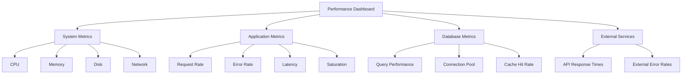

# Performance Monitoring

## Introduction

Performance monitoring is a critical aspect of maintaining healthy and efficient systems. It involves tracking, analyzing, and optimizing the performance metrics of your applications, servers, and infrastructure. Grafana excels at visualizing these metrics in real-time, helping you identify bottlenecks, troubleshoot issues, and make data-driven decisions to improve overall system performance.

In this guide, we'll explore how to set up effective performance monitoring using Grafana, from connecting to data sources to building comprehensive dashboards that give you visibility into your entire stack.

## Why Performance Monitoring Matters

Before diving into the technical details, let's understand why performance monitoring is essential:

- **Proactive Issue Detection**: Identify problems before they affect your users
- **Resource Optimization**: Understand resource usage patterns to allocate resources efficiently
- **Capacity Planning**: Use historical data to predict future needs
- **Troubleshooting**: Diagnose and resolve performance issues faster
- **Benchmark Performance**: Establish performance baselines and track improvements

## Setting Up Data Sources for Performance Monitoring

Grafana supports numerous data sources that provide performance metrics. The most common ones include:

### Prometheus

Prometheus is a powerful monitoring system with a dimensional data model and flexible query language (PromQL).

To add Prometheus as a data source:

1. Navigate to **Configuration** > **Data Sources**
2. Click **Add data source**
3. Select **Prometheus**
4. Enter the URL of your Prometheus server
5. Click **Save & Test**

```javascript
// Example PromQL query to monitor CPU usage
rate(node_cpu_seconds_total{mode!="idle"}[1m])
```

### Graphite

Graphite is a monitoring tool that stores numeric time-series data and renders graphs of this data.

```javascript
// Example Graphite query to monitor memory usage
servers.production.*.memory.used
```

### InfluxDB

InfluxDB is a time series database designed to handle high write and query loads.

```javascript
// Example InfluxDB query using Flux
from(bucket: "telegraf")
  |> range(start: -1h)
  |> filter(fn: (r) => r._measurement == "cpu")
  |> filter(fn: (r) => r._field == "usage_system")
  |> aggregateWindow(every: 1m, fn: mean)
```

## Key Performance Metrics to Monitor

Let's explore the essential metrics you should track for comprehensive performance monitoring:

### System-Level Metrics

#### CPU Usage

CPU usage shows how much processing power your system is using. High CPU usage might indicate inefficient code or the need for scaling.

```javascript
// PromQL query for CPU usage
100 - (avg by (instance) (rate(node_cpu_seconds_total{mode="idle"}[1m])) * 100)
```

#### Memory Usage

Memory metrics help you identify memory leaks and determine if your applications have sufficient memory.

```javascript
// PromQL query for memory usage percentage
(node_memory_MemTotal_bytes - node_memory_MemAvailable_bytes) / node_memory_MemTotal_bytes * 100
```

#### Disk I/O

Monitoring disk performance helps identify storage bottlenecks.

```javascript
// PromQL query for disk reads/writes
rate(node_disk_read_bytes_total[1m])
rate(node_disk_written_bytes_total[1m])
```

#### Network Traffic

Network metrics help detect connectivity issues and bandwidth constraints.

```javascript
// PromQL query for network traffic
rate(node_network_receive_bytes_total[1m])
rate(node_network_transmit_bytes_total[1m])
```

### Application-Level Metrics

#### Request Rate

The number of requests your application receives per second.

```javascript
// PromQL query for HTTP request rate
sum(rate(http_requests_total[1m])) by (handler)
```

#### Error Rate

The percentage of requests that result in errors.

```javascript
// PromQL query for error rate
sum(rate(http_requests_total{status=~"5.."}[1m])) / sum(rate(http_requests_total[1m])) * 100
```

#### Latency

The time it takes to respond to requests.

```javascript
// PromQL query for request latency
histogram_quantile(0.95, sum(rate(http_request_duration_seconds_bucket[5m])) by (le))
```

#### Saturation

How "full" your service is, often measured as a percentage of maximum capacity.

## Building Effective Performance Dashboards

Now that we understand the key metrics, let's create dashboards in Grafana to visualize them.

### Dashboard Organization

A well-organized dashboard helps you quickly identify issues:

1. Start with high-level metrics at the top
2. Group related metrics together
3. Use consistent naming and color schemes
4. Add descriptions to panels for context

### Creating a Basic Performance Dashboard

Here's how to create a simple but effective performance dashboard:

1. Click **Create** > **Dashboard**
2. Add a new panel by clicking **Add panel**
3. Select your data source (e.g., Prometheus)
4. Define your query (e.g., CPU usage)
5. Configure visualization type (usually Graph or Gauge)
6. Set appropriate thresholds and alerts
7. Repeat for other metrics

### Dashboard Example

Let's create a diagram showing a typical performance monitoring dashboard structure:



## Setting Up Alerts

Monitoring isn't complete without alerts that notify you when metrics cross certain thresholds.

### Alert Configuration in Grafana

To create an alert:

1. Edit a panel in your dashboard
2. Navigate to the **Alert** tab
3. Click **Create Alert**
4. Define conditions (e.g., "CPU usage is above 80% for 5 minutes")
5. Set notification channels (email, Slack, etc.)
6. Save your alert

```javascript
// Example alert condition in Grafana UI
WHEN max() OF query(A, 5m, now) IS ABOVE 80
```

### Alert Notifications

Configure notification channels to receive alerts:

1. Go to **Alerting** > **Notification channels**
2. Click **New channel**
3. Select type (Email, Slack, PagerDuty, etc.)
4. Configure settings
5. Test the notification
6. Save the channel

## Best Practices for Performance Monitoring

Follow these best practices to get the most out of your performance monitoring:

### 1. Establish Baselines

Before you can identify anomalies, you need to know what "normal" looks like for your system. Collect data over time to establish baseline performance metrics.

### 2. Use the RED Method

Monitor these three key metrics for every service:

- **Rate**: The number of requests per second
- **Errors**: The number of failed requests
- **Duration**: The amount of time requests take

### 3. Implement the USE Method

For resources like CPU, memory, and I/O, monitor:

- **Utilization**: Percentage of time the resource is busy
- **Saturation**: The degree to which the resource has extra work
- **Errors**: The count of error events

### 4. Keep Dashboards Simple

Avoid cluttering dashboards with too many panels. Focus on the most critical metrics and use drill-down dashboards for detailed analysis.

### 5. Automate Response to Common Issues

Set up automated responses to common performance issues, such as scaling resources or restarting services.

## Real-World Performance Monitoring Example

Let's walk through a practical example of monitoring a web application:

### Scenario: E-commerce Website

Your e-commerce site experiences slowdowns during peak hours. Let's set up monitoring to identify the bottleneck.

#### Step 1: Identify Key Metrics

For an e-commerce site, these might include:
- Page load time
- Database query time
- Payment processing time
- Error rates by service

#### Step 2: Set Up Data Collection

Install Prometheus exporters on your servers and configure your application to expose metrics.

```javascript
// Example Node.js code to expose metrics
const client = require('prom-client');
const register = new client.Registry();

// Create a gauge for response time
const httpRequestDuration = new client.Histogram({
  name: 'http_request_duration_seconds',
  help: 'Duration of HTTP requests in seconds',
  labelNames: ['route', 'method', 'status'],
  buckets: [0.1, 0.3, 0.5, 0.7, 1, 3, 5, 7, 10]
});

register.registerMetric(httpRequestDuration);

// Middleware to track response time
app.use((req, res, next) => {
  const end = httpRequestDuration.startTimer();
  res.on('finish', () => {
    end({ route: req.path, method: req.method, status: res.statusCode });
  });
  next();
});

// Expose metrics endpoint
app.get('/metrics', async (req, res) => {
  res.set('Content-Type', register.contentType);
  res.end(await register.metrics());
});
```

#### Step 3: Create a Dashboard

Build a dashboard that shows:
- User experience metrics at the top
- Application performance in the middle
- System resources at the bottom

#### Step 4: Set Up Alerts

Configure alerts for critical thresholds, such as:
- Page load time > 3 seconds
- Error rate > 1%
- CPU usage > 80%

#### Step 5: Analyze and Optimize

After collecting data, you might discover that database queries slow down during peak hours. You can then optimize those queries or add caching.

## Troubleshooting Common Performance Issues

Let's look at some common performance problems and how to diagnose them with Grafana:

### High CPU Usage

**Symptoms in Grafana**: Consistently high CPU usage graph

**Potential Causes**:
- Inefficient code or algorithms
- Insufficient resources
- Background processes consuming CPU

**Solution**: Profile your application to identify CPU-intensive operations, optimize code, or scale resources.

### Memory Leaks

**Symptoms in Grafana**: Steadily increasing memory usage that doesn't decrease after garbage collection

**Potential Causes**:
- Objects not being garbage collected
- Improper resource management

**Solution**: Use memory profiling tools to identify leaking objects, fix code issues, or implement proper cleanup.

### Slow Database Queries

**Symptoms in Grafana**: High database response time, increasing latency

**Potential Causes**:
- Missing indexes
- Inefficient queries
- Database contention

**Solution**: Add indexes, optimize queries, or implement caching.

## Summary

Performance monitoring with Grafana provides visibility into your systems and applications, helping you detect and resolve issues before they impact users. By following the best practices outlined in this guide, you can set up effective monitoring that gives you actionable insights into your infrastructure's performance.

Remember these key points:

- Connect Grafana to appropriate data sources for your stack
- Monitor both system-level and application-level metrics
- Build organized dashboards that highlight the most important metrics
- Set up alerts for critical thresholds
- Establish baselines to detect anomalies
- Use the RED and USE methods for comprehensive monitoring

## Additional Resources

To deepen your knowledge of performance monitoring with Grafana, explore these resources:

- **Grafana Documentation**: Learn more about advanced features like annotations and template variables
- **Prometheus Documentation**: Master PromQL for more complex queries
- **SRE Books**: "Site Reliability Engineering" and "The Art of Monitoring" provide excellent insights into monitoring practices
- **Dashboard Examples**: Explore the Grafana dashboard marketplace for inspiration

## Exercises

1. Set up a Prometheus data source in Grafana and create a basic dashboard showing CPU, memory, disk, and network metrics.
2. Create a dashboard for monitoring a web application, including request rate, error rate, and latency.
3. Configure alerts for critical metrics and test the notification system.
4. Use template variables to create a dashboard that can switch between different environments (development, staging, production).
5. Identify a performance bottleneck in your application using Grafana and implement a solution to resolve it.