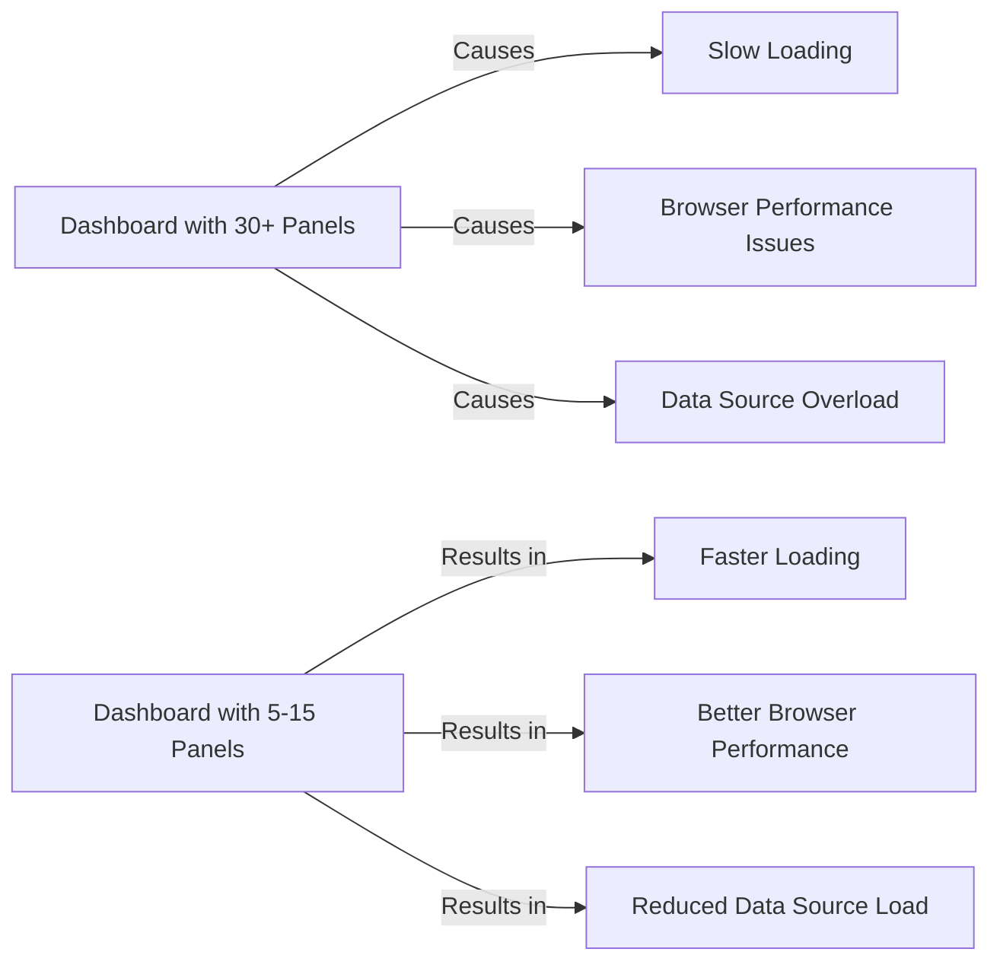

# Performance Best Practices

## Introduction

Performance optimization is a critical aspect of working with Grafana dashboards, especially as your monitoring environment grows in complexity. This guide covers essential best practices to ensure your Grafana implementation remains fast, responsive, and resource-efficient, even when handling large volumes of data or supporting many concurrent users.

Poor performance in Grafana often manifests as slow-loading dashboards, unresponsive UI elements, or excessive resource consumption on both client and server sides. By implementing the practices outlined in this guide, you'll create a better experience for your users while reducing infrastructure costs.

## Dashboard Design Optimization

### Limit the Number of Panels

One of the most common causes of dashboard performance issues is having too many panels.

**Best Practice**: Keep dashboards focused with 5-15 panels per dashboard.

**Why it matters**: Each panel makes separate data source queries, increasing load on both Grafana and your data sources.



### Use Dashboard Variables Wisely

While variables make dashboards interactive, they can impact performance if used inefficiently.

**Best Practice**: Cache variable queries and limit the number of options.

```jsx
// Example of variable configuration with caching
{
  "name": "server",
  "type": "query",
  "datasource": "Prometheus",
  "refresh": 2, // 2 = On dashboard load (cached)
  "query": "label_values(node_cpu_seconds_total, instance)",
  "regex": "",
  "sort": 1
}
```

When a variable is set to refresh "On dashboard load", Grafana caches the results, improving performance for subsequent loads.

### Optimize Time Ranges

**Best Practice**: Set appropriate default time ranges based on data resolution and retention.

```jsx
// Example default time range configuration in dashboard JSON
"time": {
  "from": "now-6h",
  "to": "now"
}
```

**Why it matters**: Excessively large time ranges can cause queries to scan unnecessary amounts of data, leading to slower performance and potential timeouts.

## Query Optimization

### Prometheus Query Optimization

When working with Prometheus, query efficiency directly impacts dashboard performance.

**Best Practice**: Use rate() before aggregating with sum() for counter metrics.

**Inefficient Query**:
```
sum(node_cpu_seconds_total{mode="idle"})
```

**Optimized Query**:
```
sum(rate(node_cpu_seconds_total{mode="idle"}[5m]))
```

**Why it matters**: Applying `rate()` before `sum()` reduces the data that needs to be processed, as rate calculations happen on individual time series before they're combined.

### Use Step Parameter Appropriately

**Best Practice**: Match step interval to your panel width and time range.

```jsx
// Example API query with step parameter
GET /api/v1/query_range?query=rate(http_requests_total[5m])&start=1607424000&end=1607510400&step=60
```

**Guideline**: For a 24-hour time range on a standard panel, a step of 5-10 minutes is often appropriate.

### SQL Query Optimization

For SQL data sources, consider these optimizations:

**Best Practice**: Use appropriate time filters and limit result sets.

**Inefficient Query**:
```sql
SELECT timestamp, value FROM metrics;
```

**Optimized Query**:
```sql
SELECT timestamp, value 
FROM metrics 
WHERE timestamp BETWEEN $__timeFrom() AND $__timeTo()
ORDER BY timestamp
LIMIT 1000;
```

The Grafana macros `$__timeFrom()` and `$__timeTo()` ensure you're only querying data within the dashboard's current time range.

## Caching Strategies

### Configure Query Caching

Grafana Enterprise offers query caching capabilities that can significantly improve performance.

**Best Practice**: Enable caching for appropriate queries and set reasonable TTL (Time To Live) values.

```jsx
// Example Grafana configuration for query caching
[caching]
enabled = true
ttl = 60s  # Cache results for 60 seconds
```

### Browser Caching

**Best Practice**: Configure proper browser caching for static assets.

Example Nginx configuration for static asset caching:

```
location /public {
    proxy_pass http://localhost:3000;
    proxy_set_header Host $host;
    expires 30d;
    add_header Cache-Control "public, max-age=2592000";
}
```

## Resource Management

### Configure Proper Resource Limits

**Best Practice**: Set appropriate resource limits based on your instance size and usage patterns.

```ini
# Example resource configuration in grafana.ini

[dataproxy]
timeout = 30
dial_timeout = 10
keep_alive_seconds = 30

[alerting]
max_concurrent_render = 5

[rendering]
concurrent_render_limit = 10
```

### Monitor Grafana's Own Performance

**Best Practice**: Set up monitoring for Grafana itself using its internal metrics.

```jsx
// Example Prometheus query to monitor Grafana API response times
grafana_api_response_time_seconds{quantile="0.9"}
```

Create a separate dashboard dedicated to monitoring your Grafana instance's performance, tracking metrics like:
- Query performance
- Memory usage
- HTTP request rates and errors
- Rendering performance

## Real-World Examples

### Example 1: Large-Scale Production Dashboard

A company monitoring 1000+ servers initially experienced dashboard load times of 20+ seconds. After implementing these optimizations:

1. Breaking one large dashboard into several focused ones
2. Optimizing Prometheus queries with proper rate() and aggregation
3. Implementing query caching

The result was dashboard load times under 2 seconds and a 70% reduction in Prometheus server load.

### Example 2: High-Cardinality Data Challenge

A team dealing with high-cardinality metrics (thousands of series) improved performance by:

1. Using the topk() function to focus on the most important series
2. Implementing recording rules in Prometheus for common queries
3. Using template variables with regex filters to narrow scope

```jsx
// Example of using topk() to limit cardinality
topk(10, sum by(service) (rate(http_request_duration_seconds_count[5m])))
```

## Summary

Optimizing Grafana performance requires attention to several areas:

1. **Dashboard Design**: Limit panels, use variables wisely, set appropriate time ranges
2. **Query Optimization**: Write efficient queries for your specific data sources
3. **Caching**: Implement caching at multiple levels
4. **Resource Management**: Configure appropriate limits and monitor performance

By implementing these best practices, you'll create dashboards that are not only informative but also responsive and efficient, even when scaling to monitor large infrastructures.

## Additional Resources

- Grafana Labs Documentation on Performance
- Prometheus Query Optimization Guide
- Database-specific query optimization guides for your data sources
- The Grafana Community forums for sharing optimization techniques

## Practice Exercises

1. Take an existing dashboard and identify at least three performance optimizations you could apply.
2. Compare the load time and resource usage before and after applying these optimizations.
3. Create a dashboard to monitor your Grafana instance's performance metrics.
4. Analyze a slow query and rewrite it for better performance.