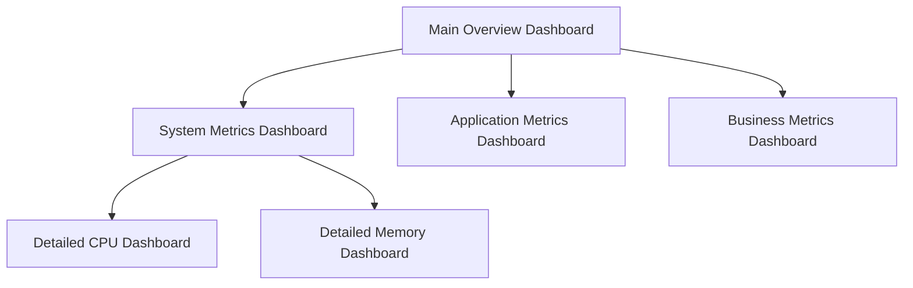

# Dashboard Optimization

## Introduction

Dashboard optimization is a critical aspect of Grafana performance management. As dashboards grow in complexity with multiple panels, queries, and visualizations, they can become slow to load and interact with. This guide will walk you through effective strategies to optimize your Grafana dashboards, ensuring they remain fast, responsive, and resource-efficient even as your monitoring needs scale.

## Why Dashboard Optimization Matters

Unoptimized dashboards can lead to several issues:

- Slow loading times
- Excessive resource consumption
- Poor user experience
- Increased server load
- Timeout errors when retrieving data

By implementing optimization techniques, you can create dashboards that load quickly, respond smoothly to user interactions, and efficiently visualize your metrics.

## Key Optimization Strategies

### 1. Query Optimization

The foundation of dashboard performance begins with efficient queries.

#### Time Range Selection

```javascript
// Instead of querying all data
const query = 'sum(rate(http_requests_total[1h]))';

// Optimize by using appropriate time ranges
const optimizedQuery = 'sum(rate(http_requests_total[$__interval]))';
```

Using Grafana variables like `$__interval` allows your queries to adapt to the dashboard's time range automatically.

#### Query Reduction Techniques

- **Use aggregation**: Pre-aggregate data when possible
- **Apply filters early**: Filter at the database level, not in Grafana
- **Limit time series**: Avoid queries that return hundreds of series

### 2. Panel Configuration

Properly configured panels can significantly improve dashboard performance.

#### Adjust Refresh Rates

Set appropriate refresh rates based on data update frequency:

| Data Type | Suggested Refresh Rate |
|-----------|------------------------|
| Real-time metrics | 5-10s |
| Hourly metrics | 5-15m |
| Daily metrics | 1h+ |

Avoid setting unnecessarily frequent refresh rates as they increase load on both Grafana and your data sources.

#### Panel Rendering Options

```javascript
// Panel JSON configuration with optimized rendering
{
  "options": {
    "legend": {
      "showLegend": false,  // Disable legend for simple visualizations
      "asTable": false      // Table legends use more resources
    },
    "tooltips": {
      "mode": "single"      // Single mode is more efficient than all-series
    }
  }
}
```

### 3. Dashboard Structure

How you organize your dashboard affects its performance.

#### Use Multiple Dashboards

Instead of creating massive dashboards with dozens of panels, split them into logical sections:



Use dashboard links to navigate between them seamlessly.

#### Implement Dashboard Variables

Variables allow users to filter data efficiently:

```javascript
// Variable definition example
{
  "templating": {
    "list": [
      {
        "name": "server",
        "label": "Server",
        "query": "label_values(node_cpu_seconds_total, instance)",
        "type": "query"
      }
    ]
  }
}
```

This lets users load only the data they need to see, improving performance.

### 4. Data Source Optimization

Your data sources play a crucial role in dashboard performance.

#### Connection Pooling

For SQL-based data sources, ensure connection pooling is properly configured:

```yaml
# Example PostgreSQL data source configuration
apiVersion: 1
datasources:
  - name: PostgreSQL
    type: postgres
    url: postgres:5432
    database: metrics
    user: grafana
    jsonData:
      maxOpenConns: 100      # Maximum open connections
      maxIdleConns: 20       # Maximum idle connections
      connMaxLifetime: 14400 # Connection max lifetime in seconds
```

#### Query Caching

Enable and configure query caching when available:

```javascript
// Example query with caching directive
{
  "targets": [
    {
      "expr": "sum(rate(http_requests_total[5m]))",
      "format": "time_series",
      "intervalFactor": 2,
      "refId": "A",
      "instant": false,
      "cacheTimeout": "60s"  // Cache results for 60 seconds
    }
  ]
}
```

### 5. Browser Rendering Optimization

The browser plays a significant role in dashboard performance.

#### Limit Animation and Interactivity

For large dashboards, limit animations and interactive elements:

```javascript
// Panel configuration with reduced animation
{
  "options": {
    "animation": {
      "enabled": false  // Disable animations for better performance
    }
  }
}
```

#### Use Efficient Visualization Types

Choose visualization types appropriate for your data volume:

| Data Volume | Recommended Visualization |
|-------------|---------------------------|
| High-cardinality (100+ series) | Heatmap, Table |
| Medium-cardinality (10-100 series) | Graph, Bar chart |
| Low-cardinality (1-10 series) | Time series, Stat, Gauge |

## Practical Example: Optimizing a System Monitoring Dashboard

Let's walk through optimizing a system monitoring dashboard:

### Before Optimization

```javascript
// Original query - inefficient
{
  "targets": [
    {
      "expr": "node_cpu_seconds_total{mode!=\"idle\"}",  // Returns data for all CPUs, all modes
      "legendFormat": "{{instance}} - {{mode}}",         // Creates many legend entries
      "refId": "A"
    }
  ]
}
```

This query returns too many time series and creates a cluttered legend.

### After Optimization

```javascript
// Optimized query
{
  "targets": [
    {
      "expr": "sum by (mode) (rate(node_cpu_seconds_total{instance=~\"$instance\", mode!=\"idle\"}[$__interval]))",
      "legendFormat": "{{mode}}",
      "refId": "A"
    }
  ]
}
```

This optimized version:
1. Uses a variable (`$instance`) to filter data
2. Adds aggregation with `sum by`
3. Uses `rate()` and `$__interval` for proper scaling
4. Simplifies the legend format

## Performance Testing Tools

Grafana provides several tools to help identify performance issues:

### Query Inspector

Access the query inspector by:
1. Edit the panel
2. Click on the "Query Inspector" button
3. Run queries to see execution time and returned data volume

### Browser Developer Tools

Use your browser's developer tools to identify rendering bottlenecks:
1. Open browser dev tools (F12 in most browsers)
2. Go to the Performance tab
3. Record while loading your dashboard
4. Look for long tasks and rendering bottlenecks

## Common Optimization Pitfalls

Avoid these common mistakes:

1. **Too many panels**: Each panel makes separate queries to your data sources
2. **Excessive precision**: Displaying numbers with 5+ decimal places rarely adds value
3. **Inefficient queries**: Using regex when simple equality would work
4. **Ignoring cardinality**: High-cardinality metrics can overwhelm dashboards
5. **Insufficient data aggregation**: Displaying raw data points instead of aggregated values

## Advanced Optimization Techniques

For dashboards that need additional performance improvements:

### Server-Side Rendering

For large dashboards, consider enabling server-side rendering:

```yaml
# grafana.ini configuration
[rendering]
server_url = http://renderer:8081/render
callback_url = http://grafana:3000/
```

### Precomputed Metrics

For complex calculations, consider moving them to your data collection pipeline:

```javascript
// Instead of complex PromQL in Grafana
sum(rate(http_requests_total{status=~"5.."}[$__interval])) / sum(rate(http_requests_total[$__interval]))

// Create a recording rule in Prometheus
// prometheus.yml
groups:
  - name: example
    rules:
    - record: job:http_error_rate:5m
      expr: sum(rate(http_requests_total{status=~"5.."}[5m])) / sum(rate(http_requests_total[5m]))
```

Then use the precomputed metric in Grafana:

```javascript
// Simplified Grafana query
job:http_error_rate:5m
```

## Summary

Dashboard optimization is an ongoing process that requires attention to queries, panel configuration, data sources, and browser rendering. By implementing the strategies covered in this guide, you can create Grafana dashboards that remain responsive and efficient even as your monitoring needs grow.

Remember these key principles:

- Optimize queries first - they're usually the biggest performance bottleneck
- Use variables and templating to limit data retrieval
- Break large dashboards into smaller, focused ones
- Choose appropriate visualization types for your data volume
- Test and measure performance regularly

## Additional Resources

- Practice creating efficient PromQL/SQL queries for your data sources
- Review your existing dashboards and apply these optimization techniques
- Implement dashboard variables to make your dashboards more efficient and user-friendly
- Set up a test environment to measure dashboard performance before and after optimization