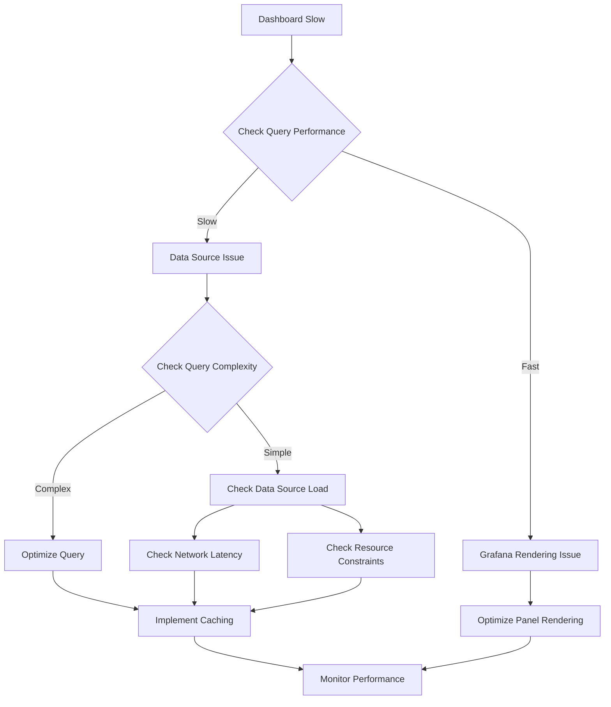

# Data Source Performance

## Introduction

Data sources are the foundation of any Grafana implementation. They connect your visualization platform to the systems that store your metrics, logs, and other types of data. The performance of these data sources directly impacts the user experience of your Grafana dashboards. Slow-loading visualizations can frustrate users and reduce the effectiveness of your monitoring solution.

In this guide, we'll explore how data source performance affects your Grafana experience, common performance bottlenecks, and techniques to optimize data retrieval and processing for smoother, more responsive dashboards.

## Why Data Source Performance Matters

Before diving into optimization techniques, let's understand why data source performance is critical:

1. **Dashboard Load Time**: Slow data sources lead to dashboards that take longer to load and refresh
2. **User Experience**: Performance issues can make interactive features like variable selection feel sluggish
3. **Resource Consumption**: Inefficient queries can overload both Grafana and your data sources
4. **Scalability**: As your monitoring needs grow, performance issues become more pronounced

## Common Data Sources and Performance Characteristics

Different data sources have different performance profiles:

### Time Series Databases

- **Prometheus**: Optimized for time series data with efficient compression
- **InfluxDB**: High performance for time-stamped data with retention policies
- **Graphite**: Specializes in numeric time-series data with whisper files

### SQL Databases

- **MySQL/PostgreSQL**: General-purpose databases that require careful query optimization
- **Microsoft SQL Server**: Can handle time series data but needs indexing strategies
- **AWS RDS**: Managed database with performance depending on instance type

### Cloud Services

- **CloudWatch**: AWS metrics service with API limits and quotas
- **Azure Monitor**: Microsoft's monitoring service with query limitations
- **Google Cloud Monitoring**: Google's metrics with performance tied to project scale

## Diagnosing Data Source Performance Issues

Before optimizing, you need to identify where performance problems originate:



### Using Query Inspector

Grafana provides a built-in Query Inspector tool that helps diagnose performance issues:

1. Open your dashboard
2. Click on the panel title
3. Select "Inspect" > "Query"
4. Examine the "Query performance" tab

Here's what to look for:

```
Query timing breakdown:
- Request: 120ms
- Data processing: 45ms
- Rendering: 200ms
```

If the request time is high, your data source might be the bottleneck.

## Optimizing Data Source Queries

### Time Range Optimization

One of the most impactful optimizations is limiting the time range of your queries:

```sql
-- Before optimization
SELECT value FROM metrics 
WHERE time >= '2023-01-01' AND time <= '2023-12-31'

-- After optimization (last 24 hours only)
SELECT value FROM metrics 
WHERE time >= NOW() - INTERVAL 1 DAY
```

### Data Aggregation

Pre-aggregating data can dramatically improve performance:

```sql
-- Before optimization (raw data points)
SELECT time, cpu_usage FROM server_metrics
WHERE time >= NOW() - INTERVAL 1 DAY

-- After optimization (5-minute averages)
SELECT 
  time_bucket('5 minutes', time) AS time_bucket,
  AVG(cpu_usage) AS avg_cpu
FROM server_metrics
WHERE time >= NOW() - INTERVAL 1 DAY
GROUP BY time_bucket
ORDER BY time_bucket
```

### Filtering Optimization

Be specific about what you're querying:

```javascript
// Prometheus example - before
rate(http_requests_total[5m])

// Prometheus example - after (with label filters)
rate(http_requests_total{status="200", handler="/api/v1/query"}[5m])
```

## Implementing Caching Strategies

Caching can significantly improve performance by reducing the load on your data sources.

### Query Caching

Grafana provides a query caching feature that stores query results temporarily:

```javascript
// In grafana.ini or environment variables
[unified_alerting.screenshots]
capture = true

[caching]
enabled = true
ttl = 60
```

### Data Source Level Caching

Some data sources have their own caching mechanisms:

- **Prometheus**: Recording rules pre-compute expensive queries
- **InfluxDB**: Continuous queries aggregate data in the background
- **Redis**: Can be used as a cache layer in front of slower data sources

Example Prometheus recording rule:

```yaml
groups:
  - name: example
    interval: 5m
    rules:
      - record: job:http_requests:rate5m
        expr: rate(http_requests_total[5m])
```

## Real-World Performance Optimization Example

Let's walk through a complete example of optimizing a dashboard for a web application monitoring system:

### Initial Setup

A dashboard with panels showing:
- HTTP request rate
- Error rate
- Response time
- CPU and memory usage
- Database query performance

### Problem Identification

The dashboard takes 15+ seconds to load with the following issues:
1. HTTP requests panel retrieves all endpoints (100+)
2. Error rate calculation performs complex regex operations
3. Response time shows individual times for thousands of requests
4. Infrastructure metrics poll 1-second resolution data for 7 days

### Step-by-Step Optimization

**Step 1: Query Optimization**

For the HTTP requests panel, change the Prometheus query from:

```
sum(rate(http_requests_total[5m])) by (handler)
```

To:

```
sum(rate(http_requests_total{handler=~"^/api/v1/.*"}[5m])) by (handler)
```

This limits the results to just API endpoints, reducing the data transfer.

**Step 2: Time Range Adjustment**

For the infrastructure metrics, adjust the time range:

```javascript
// Dashboard JSON snippet
{
  "time": {
    "from": "now-24h",
    "to": "now"
  },
  "refresh": "5m"
}
```

This reduces the amount of data being queried by default.

**Step 3: Data Aggregation**

For the response time panel, use averages instead of individual requests:

```
avg_over_time(http_request_duration_seconds{quantile="0.95"}[5m])
```

**Step 4: Implement Caching**

Add Redis as a caching layer:

```yaml
# docker-compose.yml
services:
  redis:
    image: redis:6
    ports:
      - "6379:6379"
```

Configure Grafana to use Redis for caching:

```ini
[caching.redis]
url = redis://localhost:6379/0
```

**Results:**

After these optimizations:
- Dashboard load time reduced from 15+ seconds to under 3 seconds
- Data transferred reduced by 80%
- CPU usage on the Prometheus server decreased by 45%

## Best Practices for Data Source Performance

### Query Design

- Always include time range filters
- Use label filters and selectors
- Avoid operations that scan all metrics
- Limit the number of series returned

### Data Retention

- Implement appropriate data retention policies
- Use downsampling for older data
- Consider multi-level retention strategies

### Resource Allocation

- Allocate sufficient resources to your data sources
- Scale horizontally when possible
- Consider dedicated instances for critical data sources

### Monitoring the Monitors

Create a dashboard to monitor your Grafana and data source performance:

- Query execution time
- Query rate and errors
- Grafana server resource usage
- Data source availability

## Troubleshooting Common Issues

### High Cardinality Problems

High cardinality (too many unique series) can severely impact performance:

```
# Problematic query - high cardinality
sum(rate(http_requests_total[5m])) by (user_id)  # If you have thousands of users

# Better approach
sum(rate(http_requests_total[5m])) by (user_type)  # Group by user type instead
```

### Network Latency

If your data source is in a different location:

1. Consider deploying Grafana closer to your data sources
2. Use data source proxies or replicas
3. Implement more aggressive caching

### Resource Constraints

If your data source is under-resourced:

1. Increase CPU and memory allocation
2. Scale up or out depending on the data source
3. Implement read replicas for database data sources

## Summary

Data source performance is crucial for a smooth Grafana experience. By understanding the performance characteristics of your data sources, implementing proper query optimization, and using caching strategies, you can significantly improve dashboard loading times and overall user experience.

Remember these key points:

1. Different data sources have different performance profiles
2. Query optimization is usually the most effective improvement
3. Time range and cardinality are often the biggest factors
4. Caching can dramatically improve perceived performance
5. Monitor your monitoring system to catch issues early

## Additional Resources

Here are some exercises to help reinforce your learning:

1. Analyze a slow dashboard using Query Inspector and identify the bottleneck
2. Optimize a Prometheus query that returns too many time series
3. Implement a recording rule for a frequently-used expensive query
4. Set up query caching in your Grafana instance
5. Create a "meta-monitoring" dashboard to track your Grafana performance

## Next Steps

Now that you understand data source performance, you might want to explore:

- Advanced query optimization techniques
- Custom data source development
- High availability Grafana setups
- Automated performance testing