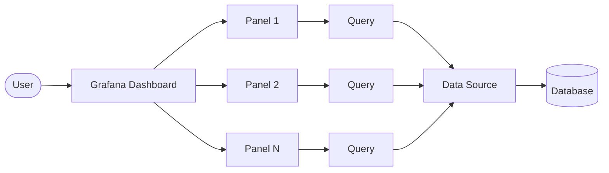
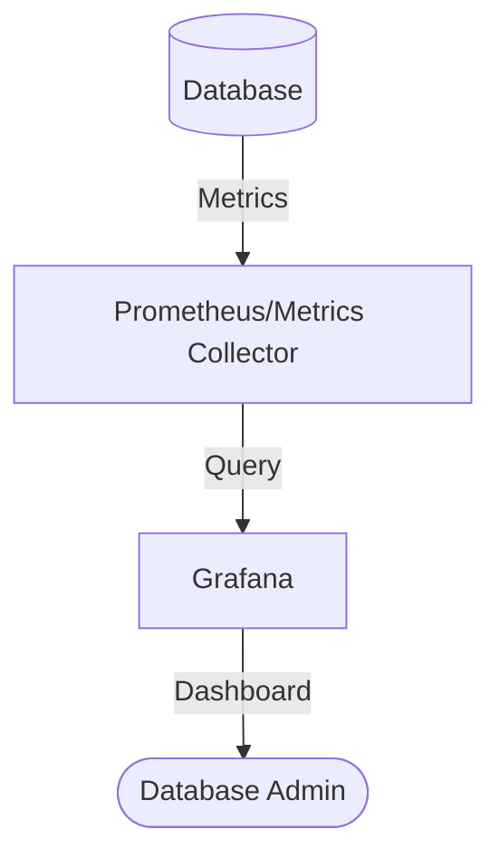

# Database Performance

## Introduction

Database performance is a critical aspect of creating efficient and responsive Grafana dashboards. As Grafana connects to various data sources to visualize metrics and logs, the performance of these underlying databases directly impacts the user experience. This guide explores essential concepts, techniques, and best practices for optimizing database performance when working with Grafana.

Whether you're connecting Grafana to traditional SQL databases, time-series databases like Prometheus or InfluxDB, or other data sources, understanding how to optimize these connections will help you build dashboards that load quickly and operate smoothly, even with large datasets.

## Understanding Database Performance in Grafana

Grafana is fundamentally a visualization tool that relies on querying external data sources. The performance of your Grafana dashboards depends on:

1. How efficiently your database stores and indexes data
2. The optimization level of your queries
3. The amount of data being processed and transferred
4. The caching mechanisms in place

### How Grafana Interacts with Databases



Each panel in a Grafana dashboard executes one or more queries against a data source, which connects to an underlying database. When a user loads a dashboard or adjusts the time range, Grafana sends these queries and waits for the results before rendering visualizations.

## Common Database Performance Issues

### 1. Slow Query Execution

The most common performance bottleneck in Grafana dashboards is slow-running queries. This can happen due to:

- Unoptimized queries fetching too much data
- Missing indexes on frequently queried fields
- Complex aggregations or computations performed on large datasets
- Inefficient joins between multiple tables

### 2. Excessive Data Transfer

Transferring large amounts of data between the database and Grafana can cause:

- Increased network latency
- Higher memory usage on the Grafana server
- Slower dashboard rendering
- Potential browser performance issues

### 3. Resource Contention

When multiple users access dashboards simultaneously:

- Database connections may become limited
- CPU and memory resources on the database server can get overwhelmed
- Lock contention may occur in the database

## Optimizing Database Performance

### Query Optimization Techniques

#### 1. Time Range Filtering

Always ensure your queries include time range filters that match Grafana's dashboard time selector:

```sql
-- Example of time range filtering in SQL
SELECT metric, timestamp, value 
FROM measurements 
WHERE timestamp >= $__timeFrom() AND timestamp <= $__timeTo()
```

#### 2. Limit Data Points

Too many data points can overwhelm both Grafana and the browser. Use techniques to reduce data points:

```sql
-- Example of data point reduction in SQL
SELECT 
  time_bucket('5m', timestamp) AS time,
  AVG(value) AS avg_value
FROM metrics
WHERE timestamp >= $__timeFrom() AND timestamp <= $__timeTo()
GROUP BY time_bucket('5m', timestamp)
ORDER BY time
```

#### 3. Use Appropriate Indexes

Ensure your database tables have indexes on frequently queried columns:

```sql
-- Example of creating an index in SQL
CREATE INDEX idx_metrics_timestamp ON metrics(timestamp);
```

#### 4. Pre-aggregation

For large datasets, consider pre-aggregating data:

```sql
-- Example of a query using pre-aggregated data
SELECT 
  timestamp,
  sum_value
FROM hourly_aggregates
WHERE timestamp >= $__timeFrom() AND timestamp <= $__timeTo()
```

### Database-specific Optimizations

#### InfluxDB

```
// Example of an optimized InfluxDB query
from(bucket: "metrics")
  |> range(start: v.timeRangeStart, stop: v.timeRangeStop)
  |> filter(fn: (r) => r._measurement == "cpu")
  |> filter(fn: (r) => r._field == "usage_idle")
  |> aggregateWindow(every: v.windowPeriod, fn: mean)
```

#### Prometheus

```
# Example of an optimized Prometheus query
rate(http_requests_total{job="api-server"}[5m])
```

#### MySQL/PostgreSQL

```sql
-- Example of an optimized SQL query with window functions
SELECT 
  time_bucket('1h', timestamp) AS hour,
  AVG(value) AS avg_value,
  MAX(value) AS max_value
FROM metrics
WHERE timestamp >= $__timeFrom() AND timestamp <= $__timeTo()
  AND metric_name = 'cpu_usage'
GROUP BY hour
ORDER BY hour
```

## Implementing Grafana-specific Performance Techniques

### 1. Query Caching

Enable Grafana's built-in query caching to reduce database load:

```yaml
# grafana.ini configuration for query caching
[unified_alerting.screenshots]
capture = true

[caching]
enabled = true
```

### 2. Template Variables Optimization

Use template variables wisely to avoid excessive query load:

```
// Example template variable query that's efficient
SHOW TAG VALUES FROM "cpu" WITH KEY = "host" WHERE $__timeFilter
```

### 3. Panel Refresh Rates

Set appropriate refresh intervals for your panels instead of using very frequent updates:

```javascript
// In the dashboard JSON
"refresh": "1m"
```

### 4. Query Inspector

Use Grafana's Query Inspector to identify slow queries:

1. Open a panel
2. Click on the panel title
3. Select "Inspect" > "Query"
4. Analyze the query execution time and result size

## Real-world Example: Optimizing a Dashboard

Let's walk through optimizing a dashboard that monitors application performance.

### Before Optimization

```sql
-- Initial query (slow)
SELECT 
  timestamp,
  value
FROM application_metrics
WHERE metric_name = 'response_time'
ORDER BY timestamp
```

Issues:
- No time range filtering
- Retrieving all data points
- No aggregation for long time ranges
- Missing indexes

### After Optimization

```sql
-- Optimized query
SELECT 
  time_bucket(CASE 
    WHEN $__interval = '1s' THEN '1s'::interval
    WHEN $__interval < '1m'::interval THEN '10s'::interval
    WHEN $__interval < '10m'::interval THEN '1m'::interval
    WHEN $__interval < '1h'::interval THEN '5m'::interval
    ELSE '1h'::interval
  END, timestamp) AS time,
  AVG(value) AS avg_value,
  MAX(value) AS max_value,
  MIN(value) AS min_value
FROM application_metrics
WHERE 
  metric_name = 'response_time'
  AND timestamp >= $__timeFrom() 
  AND timestamp <= $__timeTo()
GROUP BY time
ORDER BY time
```

Improvements:
- Added time range filtering using Grafana variables
- Dynamic resolution based on the dashboard's time range
- Aggregation to reduce data points
- Retrieves multiple statistics in a single query

## Database Performance Monitoring with Grafana

You can use Grafana itself to monitor your database performance:



Create dashboards to monitor:
- Query execution time
- Connection pool utilization
- Cache hit ratios
- I/O operations
- CPU and memory usage

## Best Practices Summary

1. **Query Optimization**
   - Always include time range filters
   - Limit the number of returned data points
   - Use appropriate aggregation based on time range
   - Leverage database-specific optimization features

2. **Database Configuration**
   - Create proper indexes for queried columns
   - Configure appropriate connection pooling
   - Allocate sufficient resources to database servers
   - Consider read replicas for heavy dashboard usage

3. **Grafana Configuration**
   - Enable query caching
   - Set reasonable refresh intervals
   - Use template variables efficiently
   - Consider breaking complex dashboards into multiple simpler ones

4. **Data Management**
   - Implement data retention policies
   - Consider downsampling historical data
   - Use appropriate data types for metrics
   - Partition large tables by time ranges

## Exercises

1. Analyze a slow-performing Grafana dashboard and identify the bottleneck queries using Query Inspector.
2. Optimize a SQL query for a time-series dashboard by implementing proper time filtering and aggregation.
3. Compare the performance of the same dashboard using different data sources (e.g., InfluxDB vs. Prometheus).
4. Create a dashboard to monitor the performance of your database that Grafana is using.

## Additional Resources

- [Grafana Official Documentation on Query Optimization](https://grafana.com/docs/)
- [Time-Series Database Optimization Techniques](https://grafana.com/docs/)
- [Performance Tuning for SQL Databases](https://grafana.com/docs/)
- [Prometheus Query Optimization](https://prometheus.io/docs/practices/rules/)

Remember that database performance optimization is an ongoing process. As your data volume grows and usage patterns change, you'll need to continually assess and refine your approach to maintain optimal performance.