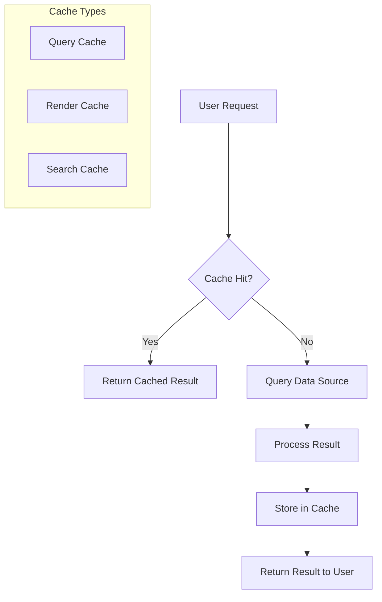

# Cache Configuration

## Introduction

Caching is a critical component of Grafana's performance architecture. When properly configured, caches can dramatically reduce database load, speed up dashboard rendering, and improve the overall user experience. This guide explains how Grafana's various caching mechanisms work and how to configure them for optimal performance.

## Why Caching Matters in Grafana

Grafana dashboards often query large datasets from various data sources. Without caching, each dashboard refresh would re-execute these potentially expensive queries, leading to:

- Increased load on your data sources
- Slower dashboard loading times
- Reduced scalability for environments with many users

Proper cache configuration helps mitigate these issues by storing and reusing query results.

## Types of Caches in Grafana

Grafana implements several different caching mechanisms:

### 1. Query Cache

The query cache stores the results of data source queries. When enabled, Grafana checks this cache before sending a query to the data source.

### 2. Render Cache

The render cache stores rendered panel images, which is particularly useful for frequently viewed dashboards.

### 3. Session Cache

Stores user session data to reduce authentication overhead.

### 4. Search Cache

Caches dashboard search results to speed up the navigation experience.

## Configuring the Query Cache

The query cache is one of the most impactful caches to configure for performance optimization.

### Basic Configuration

To enable the query cache in your `grafana.ini` file:

```ini
[caching]
enabled = true
```

### Advanced Configuration Options

For more granular control, you can use these additional settings:

```ini
[caching]
enabled = true
ttl = 60s                  # Time to live for cached items
memory_storage = true      # Use memory for storage
memory_cache_limit = 100   # Limit in MB for memory cache
redis_addr = 127.0.0.1:6379  # Redis server address if using Redis backend
```

### Redis-Based Caching

For larger Grafana deployments, Redis provides a scalable caching solution:

```ini
[caching]
enabled = true
storage = redis
redis_addr = redis:6379
```

## Per-Data Source Cache Configuration

Different data sources may have different caching requirements. Grafana allows per-data source cache configuration:

```yaml
apiVersion: 1
datasources:
  - name: Prometheus
    type: prometheus
    jsonData:
      httpMethod: POST
      cacheLevel: "Query"
      cacheMaxAge: "60s"   # Cache TTL specific to this data source
      cacheStrategy: "Fraction"  # Strategy for caching
```

## Monitoring Cache Performance

To ensure your cache is performing as expected, monitor these metrics:

1. Cache hit ratio: The percentage of requests served from cache
2. Cache size: Current memory usage of the cache
3. Cache evictions: Number of items removed from cache due to memory constraints

You can view these metrics in Grafana itself:

```bash
curl http://localhost:3000/api/metrics | grep cache
```

Example output:

```
grafana_cache_hit_total{cache="render"} 2543
grafana_cache_miss_total{cache="render"} 487
grafana_cache_memory_bytes{cache="search"} 15728640
```

## Optimizing Cache Settings

### Query Cache TTL Tuning

The Time To Live (TTL) setting is critical for balancing freshness and performance:

```ini
[caching]
ttl = 60s  # Cache items expire after 60 seconds
```

Considerations for setting TTL:

- **Shorter TTL**: More up-to-date data but less caching benefit
- **Longer TTL**: Better performance but potentially stale data

### Memory Management

For large deployments, manage memory carefully:

```ini
[caching]
memory_cache_limit = 500  # 500MB limit for memory cache
```

If you see many cache evictions, consider:
- Increasing the memory limit
- Switching to Redis for distributed caching
- Fine-tuning per-data source caching

## Practical Example: Dashboard Optimization

Let's optimize a dashboard that queries Prometheus for system metrics.

### Before Optimization

Dashboard with 10 panels, each querying Prometheus every 10s:
- 10 panels × 6 queries/minute × 10 users = 600 queries/minute to Prometheus

### After Cache Optimization

With proper caching (60s TTL):
- First user triggers 10 queries/minute
- 9 other users served from cache
- Result: ~10-20 queries/minute to Prometheus

Configuration used:

```ini
[caching]
enabled = true
ttl = 60s
```

Additional data source configuration:

```yaml
# datasources.yaml
apiVersion: 1
datasources:
  - name: Prometheus
    type: prometheus
    jsonData:
      cacheLevel: "Query"
      cacheMaxAge: "60s"
```

## Advanced: Cache Visualization with Mermaid

This diagram shows how the different cache layers interact in Grafana:



## Troubleshooting Common Cache Issues

### Issue: Low Cache Hit Rate

If your cache hit rate is low:

1. Check if TTL is too short
2. Verify caching is enabled for your specific data sources
3. Consider if query parameters are too unique (timestamps, user-specific filters)

### Issue: High Memory Usage

If cache memory usage is too high:

```ini
[caching]
memory_cache_limit = 200  # Reduce memory limit
ttl = 30s                 # Reduce TTL to expire items faster
```

### Issue: Stale Data

If users report stale data:

1. Reduce cache TTL
2. Implement cache invalidation on data updates
3. Use the cache control header in API responses

## When Not to Use Caching

Caching isn't always beneficial:

- Real-time monitoring dashboards requiring up-to-the-second data
- Dashboards with highly variable query parameters
- Development environments where data freshness trumps performance

## Summary

Effective cache configuration is essential for optimizing Grafana performance, especially in environments with many users or complex dashboards. Key takeaways:

- Enable query caching for most production deployments
- Configure appropriate TTL based on data freshness requirements
- Consider Redis for large, distributed deployments
- Monitor cache performance metrics regularly
- Tune settings based on your specific usage patterns

By implementing these cache configuration strategies, you can significantly improve Grafana's responsiveness while reducing the load on your underlying data sources.

## Additional Resources

- [Grafana Official Documentation on Caching](https://grafana.com/docs/)
- [Redis Cache Configuration Guide](https://redis.io/documentation)
- [Prometheus Query Optimization](https://prometheus.io/docs/practices/rules/)

## Exercises

1. Enable query caching in your Grafana instance and measure the performance difference
2. Set up Redis caching for a multi-server Grafana deployment
3. Tune cache TTL settings for different data sources in your environment
4. Implement dashboard-specific caching strategies based on refresh requirements