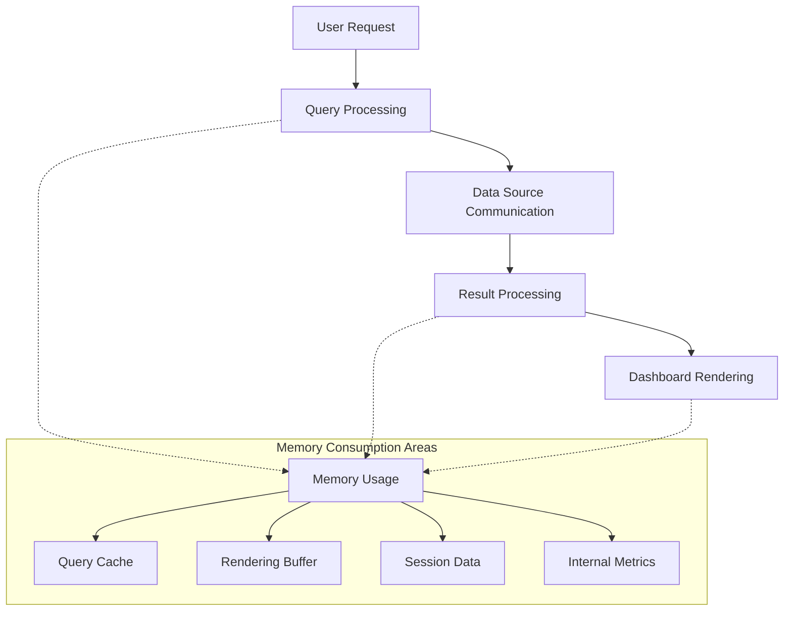

# Memory Management in Grafana

## Introduction

Memory management is a critical aspect of maintaining high-performing Grafana deployments. As your Grafana instance grows with more dashboards, users, and data sources, effective memory management becomes essential to prevent slowdowns, crashes, and service disruptions.

In this guide, we'll explore how Grafana utilizes memory, common memory-related issues, and strategies to optimize memory usage for better performance. Whether you're running Grafana on a resource-constrained environment or scaling it for enterprise use, understanding these concepts will help you maintain a responsive and reliable monitoring platform.

## Understanding Memory Usage in Grafana

Grafana is a metrics visualization and monitoring tool that requires memory for various operations:

1. **Dashboard Rendering** - Processing and visualizing metrics data
2. **Query Processing** - Handling requests to various data sources
3. **User Sessions** - Maintaining active user sessions and configurations
4. **Caching** - Storing frequently accessed data to improve performance

Let's examine how Grafana uses memory during typical operations:



## Common Memory-Related Issues

### Memory Leaks

Memory leaks occur when Grafana allocates memory that is not properly released, leading to gradually increasing memory consumption until performance degrades or the service crashes.

Signs of memory leaks include:

- Steadily increasing memory usage without corresponding increase in usage
- Performance degradation over time
- Service crashes after extended uptime

### High Memory Consumption

Even without leaks, Grafana can consume significant memory due to:

- Large number of concurrent users
- Complex dashboards with many panels
- Large query results
- High dashboard refresh rates

## Monitoring Grafana's Memory Usage

Before optimizing, you need to understand your Grafana instance's memory patterns.

### Using Grafana's Internal Metrics

Grafana exposes its own metrics that you can use to monitor memory usage:

```bash
# Example curl command to fetch memory metrics from Grafana
curl http://your-grafana-host:3000/api/metrics | grep memory
```

Sample output:

```
# HELP process_resident_memory_bytes Resident memory size in bytes.
# TYPE process_resident_memory_bytes gauge
process_resident_memory_bytes 2.29728e+08
# HELP process_virtual_memory_bytes Virtual memory size in bytes.
# TYPE process_virtual_memory_bytes gauge
process_virtual_memory_bytes 7.71309568e+08
```

### Creating a Memory Dashboard

You can create a dashboard to monitor Grafana's memory usage over time:

```javascript
// Example Prometheus query for Grafana memory usage
{
  "datasource": "Prometheus",
  "targets": [
    {
      "expr": "process_resident_memory_bytes{job=\"grafana\"}",
      "legendFormat": "Resident Memory"
    },
    {
      "expr": "go_memstats_alloc_bytes{job=\"grafana\"}",
      "legendFormat": "Allocated Memory"
    }
  ]
}
```

## Optimizing Memory Usage

### Server Configuration

Grafana offers several configuration options to control memory usage:

```ini
# In grafana.ini

[server]
# Limit concurrent requests to prevent memory spikes
max_http_conn = 100

[dataproxy]
# Limit size of responses from data sources
response_limit = 10000000

[dashboards]
# Control how many versions to keep
versions_to_keep = 20
```

### Runtime Optimization

#### Query Optimization

Inefficient queries can consume excessive memory:

```sql
-- Inefficient query (fetches too much data)
SELECT * FROM metrics WHERE time > now() - 7d

-- Optimized query (filters and aggregates)
SELECT mean(value) FROM metrics 
WHERE time > now() - 7d 
GROUP BY time(1h)
```

#### Dashboard Design Best Practices

Design dashboards with memory efficiency in mind:

- **Limit the time range** - Avoid excessively large time ranges
- **Use appropriate refresh rates** - High refresh rates increase memory usage
- **Be selective with panels** - Each panel consumes memory
- **Use variables efficiently** - Multi-value variables can generate large queries

```jsx
// Example of configuring a reasonable refresh rate
<Panel 
  refreshRate="1m"
  timeRange={{from: 'now-3h', to: 'now'}}
/>
```

### Container Environment Optimization

When running Grafana in containers, properly set memory limits:

```yaml
# Docker Compose example
version: '3'
services:
  grafana:
    image: grafana/grafana:latest
    deploy:
      resources:
        limits:
          memory: 1G
        reservations:
          memory: 512M
```

For Kubernetes:

```yaml
# Kubernetes manifest snippet
resources:
  requests:
    memory: "512Mi"
  limits:
    memory: "1Gi"
```

## Handling Memory Issues

### Identifying Memory Leaks

To identify memory leaks, monitor memory usage over time:

```javascript
// Prometheus query to detect potential memory leaks
rate(go_memstats_alloc_bytes_total{job="grafana"}[1h])
```

If this value consistently increases without leveling off, you may have a memory leak.

### Resolving High Memory Usage

1. **Restart Grafana Service** - A temporary solution to clear memory:

```bash
# For systemd-based systems
sudo systemctl restart grafana-server

# For Docker
docker restart grafana
```

2. **Implement Memory Limits** - Prevent Grafana from consuming all available memory:

```bash
# Using systemd
sudo systemctl edit grafana-server
```

Add:

```
[Service]
MemoryLimit=1G
```

3. **Optimize Dashboards** - Review and optimize your most resource-intensive dashboards

## Practical Example: Monitoring and Troubleshooting

Let's walk through a complete example of identifying and resolving memory issues:

1. **Set up monitoring**:

```jsx
// Panel query to track Grafana memory usage
const query = {
  expr: 'process_resident_memory_bytes{instance="grafana:3000"}'
};
```

2. **Identify problematic patterns**:

Look for:
- Steady increases without user activity
- Spikes during certain operations
- Correlation with specific dashboard usage

3. **Implement targeted optimizations**:

```ini
# Example grafana.ini optimization
[metrics]
# Reduce metrics resolution to save memory
interval_seconds = 30

[dashboards]
# Limit concurrent dashboard rendering
concurrent_render_limit = 5
```

## Advanced Memory Management

### Garbage Collection Tuning

Grafana runs on Go, which uses garbage collection for memory management. You can tune this with environment variables:

```bash
# Increase GC frequency (can help with memory but increases CPU usage)
export GOGC=20

# Set to start Grafana with custom GC settings
docker run -e "GOGC=20" grafana/grafana:latest
```

### Horizontal Scaling

For high-load environments, consider scaling horizontally instead of vertically:

```yaml
# Kubernetes horizontal scaling example
apiVersion: apps/v1
kind: Deployment
metadata:
  name: grafana
spec:
  replicas: 3
  # ...rest of deployment spec
```

With a load balancer distributing requests across multiple Grafana instances.

## Summary

Effective memory management is crucial for maintaining a high-performing Grafana deployment. By understanding how Grafana uses memory, monitoring usage patterns, and implementing appropriate optimizations, you can prevent memory-related issues and ensure your visualization platform remains responsive.

Remember these key points:

1. Monitor Grafana's memory usage proactively
2. Optimize dashboard designs and queries
3. Configure appropriate memory limits
4. Implement best practices for your deployment environment
5. Address issues promptly when detected

## Additional Resources and Exercises

### Resources

- [Grafana Official Documentation on Performance](https://grafana.com/docs/grafana/latest/administration/performance/)
- [Prometheus Client for Go Memory Metrics](https://prometheus.io/docs/guides/go-application/)
- [Grafana Labs Blog on Scaling Grafana](https://grafana.com/blog/)

### Exercises

1. **Memory Monitoring Setup**: Create a dashboard that monitors your Grafana instance's memory usage over time.

2. **Performance Testing**: Design a test to measure how memory usage changes with different numbers of concurrent users.

3. **Optimization Challenge**: Take an existing complex dashboard and optimize it to reduce memory consumption by at least 30%.

4. **Alerting Implementation**: Set up alerts that notify you when Grafana's memory usage exceeds certain thresholds.

5. **Scaling Exercise**: Deploy Grafana in a clustered environment and compare memory usage patterns to a single instance.