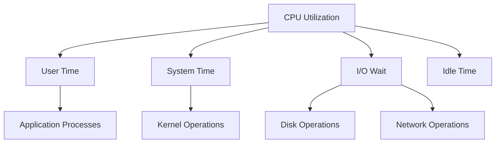

# CPU Utilization

## Introduction

CPU utilization is a fundamental metric in system performance monitoring that measures the percentage of time a CPU spends executing non-idle tasks. Understanding CPU utilization is crucial for identifying performance bottlenecks, capacity planning, and ensuring the optimal operation of your applications and infrastructure.

In this guide, we'll explore how to effectively monitor and visualize CPU utilization using Grafana, a popular open-source analytics and monitoring platform. Whether you're managing a small application or a large-scale distributed system, mastering CPU utilization monitoring in Grafana will help you maintain peak performance and quickly address potential issues.

## Understanding CPU Utilization

### What is CPU Utilization?

CPU utilization represents the percentage of time that a CPU is busy processing instructions, as opposed to waiting (idle state). It's typically expressed as a percentage from 0% (completely idle) to 100% (fully utilized).

CPU utilization can be broken down into several components:

- **User time**: CPU time spent running user-space processes
- **System time**: CPU time spent on kernel operations
- **I/O wait**: Time spent waiting for I/O operations to complete
- **Idle time**: Time when the CPU is not processing any instructions
- **Nice time**: Time spent running processes with adjusted priorities
- **Interrupt time**: Time spent handling hardware interrupts

### Why Monitor CPU Utilization?

Monitoring CPU utilization helps you:

1. **Identify performance bottlenecks**: Consistently high CPU usage may indicate applications that need optimization
2. **Plan capacity**: Understanding usage patterns helps determine when to scale resources
3. **Detect anomalies**: Unexpected CPU spikes may signal problems like infinite loops or resource leaks
4. **Optimize costs**: Proper resource allocation ensures you're not over-provisioning infrastructure
5. **Track application health**: Changes in CPU patterns can indicate application issues before they impact users

## Setting Up CPU Utilization Monitoring in Grafana

### Prerequisites

Before proceeding, ensure you have:

- A running Grafana instance (version 8.0 or higher recommended)
- A data source configured (Prometheus, InfluxDB, or other supported time-series database)
- Metrics collection set up for your systems (via node_exporter, Telegraf, or similar tools)

### Creating a Basic CPU Utilization Dashboard

Let's create a simple yet effective CPU utilization dashboard in Grafana:

1. Log in to your Grafana instance
2. Click on the "+" icon in the sidebar and select "Dashboard"
3. Click "Add new panel"
4. Configure the panel to display CPU utilization

#### For Prometheus Data Source (with node_exporter)

```
100 - (avg by (instance) (irate(node_cpu_seconds_total{mode="idle"}[5m])) * 100)
```

This query calculates the percentage of CPU utilization by subtracting the idle percentage from 100%.

#### For InfluxDB (with Telegraf)

```
SELECT mean("usage_idle")
FROM "cpu"
WHERE $timeFilter
GROUP BY time($__interval), "host"
```

To get the utilization percentage, you'd use:

```
SELECT 100 - mean("usage_idle")
FROM "cpu"
WHERE $timeFilter
GROUP BY time($__interval), "host"
```

### Visualizing Different CPU Metrics

For a more comprehensive view, create separate panels for different CPU metrics:

#### User CPU Time

For Prometheus:
```
rate(node_cpu_seconds_total{mode="user"}[5m]) * 100
```

#### System CPU Time

For Prometheus:
```
rate(node_cpu_seconds_total{mode="system"}[5m]) * 100
```

#### I/O Wait Time

For Prometheus:
```
rate(node_cpu_seconds_total{mode="iowait"}[5m]) * 100
```

## Advanced CPU Utilization Visualizations

### Multi-Core CPU Visualization

Modern systems often have multiple CPU cores. To visualize utilization across all cores:

```
avg by (mode, cpu) (irate(node_cpu_seconds_total[5m])) * 100
```

This query can be used with a heatmap visualization to create a color-coded map of all CPU cores and their states.

### CPU Saturation Alerts

Set up alerts for when CPU utilization exceeds thresholds:

1. Edit your CPU utilization panel
2. Go to the "Alert" tab
3. Configure conditions like:
   - "Alert when CPU utilization is above 80% for 5 minutes"
   - "Alert when CPU utilization increases by more than 30% in 1 minute"

For example, a Prometheus alert query might look like:

```
avg(rate(node_cpu_seconds_total{mode!="idle"}[5m])) by (instance) * 100 > 80
```

### CPU Usage Patterns and Anomaly Detection

Grafana can help identify unusual CPU patterns:

1. Create a panel with historical CPU data
2. Add a moving average to identify the baseline
3. Use Grafana's outlier detection to highlight anomalies

## Practical Examples

### Example 1: Diagnosing High CPU Usage

Let's walk through a typical scenario of diagnosing high CPU usage:

1. **Observe the dashboard**: You notice CPU utilization has spiked to 95% on one of your servers
2. **Check specific metrics**: Look at the breakdown between user, system, and wait times
3. **Correlate with other metrics**: Check if memory usage, network traffic, or disk I/O also show anomalies
4. **Identify processes**: Use a top processes panel to identify which applications are consuming CPU
5. **Take action**: Based on findings, you might restart a service, optimize code, or scale resources

### Example 2: Capacity Planning

Here's how to use CPU utilization data for capacity planning:

1. **Collect historical data**: Monitor CPU utilization over weeks or months
2. **Analyze patterns**: Identify peak usage times and trends
3. **Create projections**: Use Grafana's prediction functions to forecast future usage
4. **Set thresholds**: Establish when to add resources based on projected growth
5. **Document findings**: Create reports showing current usage and future needs

To visualize CPU trends in Grafana, you can use the following query with a trend line:

```
avg_over_time(cpu_usage_percent[$__interval]) and predict_linear(cpu_usage_percent[12h], 86400)
```

## Creating a Complete CPU Dashboard

Let's combine everything we've learned to create a comprehensive CPU dashboard:

### Dashboard Structure

1. **Overview row**:
   - CPU Utilization gauge (current value)
   - CPU Usage trend (last 24 hours)
   - Core count and basic system info

2. **Detailed Metrics row**:
   - Per-core utilization heatmap
   - User/System/I/O Wait breakdowns
   - Context switches and interrupts

3. **Correlation row**:
   - CPU vs. Memory usage
   - CPU vs. Disk I/O
   - CPU vs. Network traffic

### Sample Dashboard Visualization

Here's a visual representation of how the different metrics relate:



## Troubleshooting High CPU Utilization

When you encounter high CPU utilization, follow these steps:

1. **Determine the type of high utilization**:
   - User CPU: Application issues
   - System CPU: Kernel or driver issues
   - I/O Wait: Disk or network bottlenecks

2. **Check for specific patterns**:
   - Consistent high usage: Underprovisioned resources or inefficient applications
   - Spikes: Periodic jobs or resource contention
   - Gradual increase: Memory leaks or growing workloads

3. **Common solutions**:
   - Optimize application code
   - Scale resources (vertical or horizontal)
   - Distribute workload
   - Set resource limits
   - Upgrade hardware

### Grafana CPU Troubleshooting Dashboard

Create a specialized troubleshooting dashboard with:

```
# Top processes by CPU usage
topk(10, sum by (process) (rate(process_cpu_seconds_total[5m])))

# CPU usage trend with annotations for deployments
rate(node_cpu_seconds_total{mode!="idle"}[5m])

# Context switches per second
rate(node_context_switches_total[5m])
```

## Best Practices for CPU Utilization Monitoring

1. **Set appropriate thresholds**: Not all high CPU is bad; understand your workload's characteristics
2. **Monitor all components**: CPU usage alone doesn't tell the full story
3. **Correlate metrics**: Connect CPU metrics with application performance
4. **Use templates**: Create reusable dashboard templates for different server types
5. **Implement multi-level alerts**: Set warning and critical thresholds
6. **Track historical trends**: Compare current usage to past patterns
7. **Document baselines**: Know what "normal" looks like for your systems

## Summary

CPU utilization monitoring is a critical aspect of performance management in any IT environment. With Grafana, you can:

- Visualize real-time and historical CPU usage
- Break down utilization by type (user, system, I/O wait)
- Monitor multiple cores and servers simultaneously
- Set alerts for abnormal conditions
- Correlate CPU metrics with other system indicators
- Plan capacity based on usage trends

By following the guidelines in this tutorial, you'll be able to create comprehensive CPU monitoring dashboards that help maintain optimal performance and quickly address issues before they impact users.

## Additional Resources

- Explore more about [Grafana visualizations](https://grafana.com/docs/grafana/latest/visualizations/)
- Learn about [PromQL](https://prometheus.io/docs/prometheus/latest/querying/basics/) for advanced queries
- Understand [system performance fundamentals](https://www.brendangregg.com/usemethod.html)

## Exercises

1. Create a basic CPU utilization dashboard showing overall usage
2. Add panels to show breakdowns of user, system, and I/O wait times
3. Configure alerts for when CPU usage exceeds 85% for more than 10 minutes
4. Create a dashboard that correlates CPU usage with memory, disk, and network metrics
5. Build a capacity planning report using historical CPU data