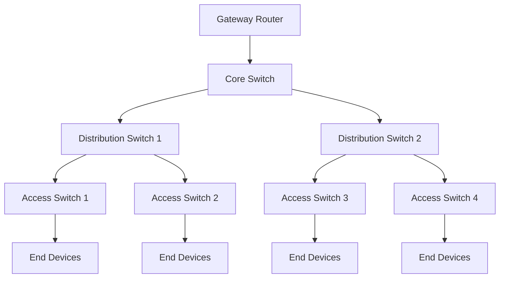

# Network Performance

## Introduction

Network performance monitoring is a critical aspect of maintaining healthy IT infrastructure. In this tutorial, you'll learn how to effectively use Grafana to visualize and analyze various network performance metrics. Understanding network performance helps identify bottlenecks, plan capacity, and ensure optimal user experience across your applications and services.

## Understanding Network Performance Metrics

Before diving into Grafana dashboards, let's understand the key metrics that define network performance:

### Bandwidth

Bandwidth represents the maximum data transfer rate of a network connection, typically measured in bits per second (bps).

### Throughput

Throughput is the actual amount of data transferred over a network in a given time period. It's often lower than the theoretical bandwidth due to various overheads.

### Latency

Latency measures the time it takes for data to travel from source to destination, typically measured in milliseconds (ms).

### Packet Loss

Packet loss occurs when data packets fail to reach their destination, expressed as a percentage of packets lost compared to packets sent.

### Jitter

Jitter represents the variation in latency over time, indicating network stability.

## Setting Up Network Performance Monitoring in Grafana

### Prerequisites

To follow along with this tutorial, you'll need:

- A running Grafana instance (v8.0+)
- A data source configured (Prometheus, InfluxDB, or other supported sources)
- Basic network monitoring tools (like Ping, MTR, or dedicated network monitoring agents)

### Configuring Data Sources

First, let's configure a data source that collects network metrics:

1. Navigate to **Configuration** → **Data Sources** in your Grafana instance
2. Click **Add data source**
3. Select an appropriate data source (Prometheus is commonly used)
4. Configure the connection details

### Creating a Network Performance Dashboard

Let's create a comprehensive dashboard for monitoring network performance:

```javascript
// Dashboard JSON configuration snippet
{
  "dashboard": {
    "title": "Network Performance Overview",
    "panels": [
      // Throughput panel
      {
        "title": "Network Throughput",
        "type": "graph",
        "gridPos": {"h": 8, "w": 12, "x": 0, "y": 0},
        "targets": [
          {
            "expr": "rate(node_network_transmit_bytes_total[5m])",
            "legendFormat": "{{device}} - TX",
            "refId": "A"
          },
          {
            "expr": "rate(node_network_receive_bytes_total[5m])",
            "legendFormat": "{{device}} - RX",
            "refId": "B"
          }
        ],
        "yaxes": [
          {
            "format": "Bps",
            "label": "Throughput"
          }
        ]
      }
      // Additional panels would follow here
    ]
  }
}
```

## Key Network Visualizations

### Latency Heatmap

Latency heatmaps provide a powerful way to visualize the distribution of network latency over time:

```javascript
// Latency heatmap panel configuration
{
  "title": "Network Latency Distribution",
  "type": "heatmap",
  "options": {
    "calculate": true,
    "yAxis": {
      "min": 0,
      "max": 500,
      "unit": "ms"
    }
  },
  "targets": [
    {
      "expr": "histogram_quantile(0.95, sum(rate(ping_latency_ms_bucket[5m])) by (le))",
      "format": "heatmap",
      "legendFormat": "{{le}}"
    }
  ]
}
```

The heatmap displays color intensity based on the frequency of latency measurements in specific ranges, helping you identify patterns and anomalies.

### Network Topology Visualization

For complex networks, topology visualization helps understand the relationships between nodes:



Grafana supports network topology visualization through plugins like `grafana-worldmap-panel` or `grafana-piechart-panel`.

## Creating Alerting Rules

Set up alerts to be notified of network performance issues:

1. Edit any panel in your dashboard
2. Go to the **Alert** tab
3. Configure alert conditions based on network metrics

Example alert rule:

```javascript
// Alert when latency exceeds threshold
{
  "alertRuleTags": {},
  "conditions": [
    {
      "evaluator": {
        "params": [200],
        "type": "gt"
      },
      "operator": {
        "type": "and"
      },
      "query": {
        "params": ["A", "5m", "now"]
      },
      "reducer": {
        "params": [],
        "type": "avg"
      },
      "type": "query"
    }
  ],
  "executionErrorState": "alerting",
  "for": "5m",
  "frequency": "1m",
  "handler": 1,
  "name": "High Latency Alert",
  "noDataState": "no_data",
  "notifications": []
}
```

## Advanced Network Performance Monitoring

### Packet Loss Analysis

Create a panel to monitor packet loss across your network:

```javascript
// Packet loss panel configuration
{
  "title": "Packet Loss Percentage",
  "type": "gauge",
  "options": {
    "thresholds": [
      {
        "color": "green",
        "value": null
      },
      {
        "color": "yellow",
        "value": 1
      },
      {
        "color": "red",
        "value": 5
      }
    ]
  },
  "targets": [
    {
      "expr": "100 * (1 - (sum(rate(node_network_receive_packets_total[5m])) / sum(rate(node_network_transmit_packets_total[5m]))))",
      "legendFormat": "Packet Loss %"
    }
  ]
}
```

### Network Saturation Monitoring

Monitor network interface saturation to identify potential bottlenecks:

```javascript
// Network saturation panel
{
  "title": "Network Interface Saturation",
  "type": "graph",
  "targets": [
    {
      "expr": "rate(node_network_transmit_bytes_total[5m]) / node_network_speed_bytes * 100",
      "legendFormat": "{{device}} - Utilization %"
    }
  ],
  "yaxes": [
    {
      "format": "percent",
      "max": 100,
      "min": 0
    }
  ]
}
```

## Real-World Use Case: Troubleshooting Network Issues

Let's walk through a practical example of using Grafana to troubleshoot network performance problems:

1. **Symptom**: Users report slow application response times
2. **Investigation using Grafana**:
   - Check the latency dashboard to identify unusual spikes
   - Review bandwidth utilization for potential saturation
   - Analyze packet loss metrics across network segments
   - Correlate network metrics with application performance

3. **Resolution Workflow**:

```javascript
// Custom troubleshooting dashboard
{
  "title": "Network Troubleshooting",
  "panels": [
    // Latency overview
    {
      "title": "Network Latency by Segment",
      "type": "graph",
      "targets": [
        {
          "expr": "avg(ping_latency_ms) by (target)",
          "legendFormat": "{{target}}"
        }
      ]
    },
    // Bandwidth utilization
    {
      "title": "Bandwidth Utilization",
      "type": "graph",
      "targets": [
        {
          "expr": "sum(rate(node_network_transmit_bytes_total[5m]) + rate(node_network_receive_bytes_total[5m])) by (device)",
          "legendFormat": "{{device}}"
        }
      ]
    },
    // Error counters
    {
      "title": "Network Errors",
      "type": "graph",
      "targets": [
        {
          "expr": "sum(rate(node_network_transmit_errs_total[5m])) by (device)",
          "legendFormat": "{{device}} - TX Errors"
        },
        {
          "expr": "sum(rate(node_network_receive_errs_total[5m])) by (device)",
          "legendFormat": "{{device}} - RX Errors"
        }
      ]
    }
  ]
}
```

By correlating these metrics, you can identify whether the issue is caused by network congestion, hardware problems, or external factors.

## Best Practices for Network Performance Monitoring

1. **Establish baselines**: Monitor your network during normal operations to establish baseline performance metrics
2. **Set appropriate thresholds**: Configure alerts based on deviations from baseline values
3. **Monitor trends**: Track performance metrics over time to identify gradual degradation
4. **End-to-end monitoring**: Monitor the entire network path, not just individual components
5. **Correlate with application metrics**: Combine network and application metrics for comprehensive analysis

## Summary

In this tutorial, you've learned how to:
- Understand key network performance metrics
- Configure Grafana to monitor network performance
- Create effective visualizations for network metrics
- Set up alerting for proactive monitoring
- Apply these concepts to real-world troubleshooting scenarios

Effective network performance monitoring in Grafana helps maintain reliable and responsive IT infrastructure. By visualizing network metrics in intuitive dashboards, you can quickly identify and resolve issues before they impact users.

## Additional Resources

- [Grafana Documentation](https://grafana.com/docs/)
- [PromQL for Network Metrics](https://prometheus.io/docs/prometheus/latest/querying/basics/)
- [Network Monitoring Best Practices](https://grafana.com/blog/)

## Exercises

1. Create a dashboard that displays both network and application performance metrics side by side
2. Set up an alert that triggers when network latency exceeds a specific threshold for more than 5 minutes
3. Build a visualization that shows the correlation between network throughput and application response time
4. Create a heatmap that displays network latency distribution by time of day