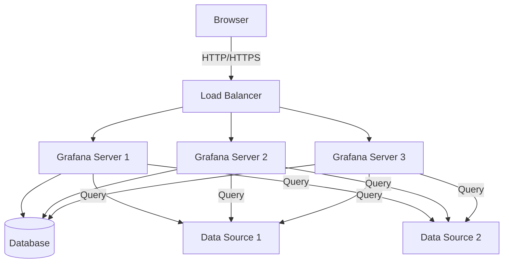
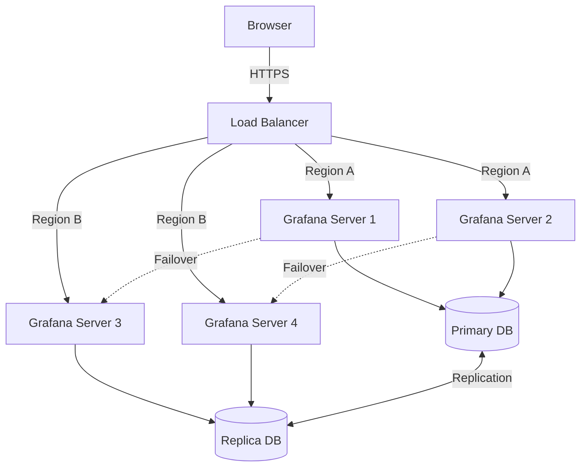

# Scaling Strategies

## Introduction

As your Grafana implementation grows from a single-instance dashboard to an enterprise monitoring solution, you'll encounter performance challenges that require thoughtful scaling strategies. This guide explores how to effectively scale Grafana to handle increased load, larger datasets, and more users while maintaining optimal performance.

Scaling Grafana isn't just about adding more hardware—it involves strategic decisions about architecture, database optimization, and resource allocation. Whether you're preparing for growth or already experiencing performance issues, understanding these scaling strategies will help you build a robust monitoring infrastructure.

## Understanding Grafana's Architecture

Before diving into scaling strategies, it's important to understand Grafana's architecture and how its components interact.



Grafana consists of:
- **Web server**: Handles HTTP requests and serves the frontend
- **Database**: Stores dashboards, users, and other metadata
- **Data source connections**: Interfaces with various time-series databases and other data sources

Each component presents different scaling challenges and opportunities.

## Vertical Scaling Strategies

Vertical scaling (scaling up) involves adding more resources to your existing Grafana servers.

### Hardware Optimization

Start by optimizing the hardware resources on your Grafana server:

```bash
# Check current CPU usage
top

# Check memory usage
free -h

# Check disk I/O
iostat -x 1
```

Consider these upgrades when vertical scaling:

1. **Increase RAM**: Memory is crucial for Grafana's query caching and rendering capabilities
2. **Upgrade CPU**: More cores help with concurrent requests and dashboard rendering
3. **SSD Storage**: Faster disk I/O improves database performance
4. **Network Bandwidth**: Ensures smooth communication with data sources

### Configuration Tuning

Optimize Grafana's configuration for better resource utilization:

```ini
# Example grafana.ini optimizations

[server]
# Increase HTTP connection limits
max_connection = 100

[dashboards]
# Limit concurrent dashboard render requests
concurrent_render_limit = 10

[database]
# Increase database connection pool
max_open_conn = 300
max_idle_conn = 100
```

Key parameters to tune:
- Connection pool sizes
- Query timeouts
- Caching settings
- Concurrent request limits

## Horizontal Scaling Strategies

Horizontal scaling (scaling out) involves adding more Grafana instances to distribute the load.

### Load Balancing

Set up multiple Grafana instances behind a load balancer:

```bash
# Example NGINX load balancer configuration
upstream grafana {
  server grafana-01:3000;
  server grafana-02:3000;
  server grafana-03:3000;
}

server {
  listen 80;
  server_name grafana.example.com;
  
  location / {
    proxy_pass http://grafana;
    proxy_set_header Host $host;
    proxy_set_header X-Real-IP $remote_addr;
  }
}
```

When implementing load balancing, consider:
- **Session persistence**: Ensure users maintain their sessions
- **Health checks**: Automatically remove unhealthy instances
- **SSL termination**: Offload SSL processing to the load balancer

### Database Scaling

As Grafana scales, the database often becomes a bottleneck. Consider these approaches:

1. **Database Replication**: Set up read replicas to distribute query load

```ini
# Primary database configuration in grafana.ini
[database]
type = mysql
host = primary-db:3306
name = grafana
user = grafana
password = password

# Read-only connection for reports and non-critical queries
[database.readonly]
type = mysql
host = replica-db:3306
name = grafana
user = grafana_readonly
password = password
```

2. **Database Partitioning**: Split large tables by time periods or other logical divisions

3. **Database Type Selection**: Choose the appropriate database for your scale:
   - SQLite: Suitable for single instances or small deployments
   - MySQL/PostgreSQL: Better for multi-instance deployments
   - Cloud-managed databases: For simplified scaling and management

## High Availability Setup

For mission-critical environments, implement a high availability (HA) Grafana setup:



Key components of an HA setup:

1. **Redundant Grafana Instances**: Deploy across multiple availability zones or regions
2. **Database Redundancy**: Set up database replication with automated failover
3. **Shared Storage**: Use network storage for image rendering and plugins
4. **Monitoring the Monitor**: Set up external monitoring of your Grafana instances

### Configuration Example

```yaml
# Docker Compose example for HA setup
version: '3'
services:
  grafana-1:
    image: grafana/grafana:latest
    volumes:
      - grafana_config:/etc/grafana
      - grafana_data:/var/lib/grafana
    environment:
      - GF_SERVER_ROOT_URL=https://grafana.example.com
      - GF_DATABASE_TYPE=mysql
      - GF_DATABASE_HOST=db-primary.example.com
      - GF_DATABASE_NAME=grafana
      - GF_DATABASE_USER=grafana
      - GF_DATABASE_PASSWORD=secure-password
      - GF_SECURITY_ADMIN_PASSWORD=admin-password
    restart: always

  grafana-2:
    # Similar configuration as grafana-1
    # ...

volumes:
  grafana_config:
    driver: nfs
    driver_opts:
      share: nfs-server:/grafana/config
  grafana_data:
    driver: nfs
    driver_opts:
      share: nfs-server:/grafana/data
```

## Data Source Scaling Strategies

Data sources can often be the real performance bottleneck in large Grafana deployments.

### Query Optimization

Optimize your queries to reduce load on data sources:

```sql
-- Instead of this (scans all data)
SELECT * FROM metric WHERE time > now() - 30d

-- Use this (leverages time-based partitioning)
SELECT * FROM metric WHERE time > now() - 30d AND time < now()
AND host IN ('server1', 'server2')
LIMIT 10000
```

Key optimization techniques:
- Add time range constraints
- Use data source-specific optimizations
- Implement appropriate filtering
- Limit returned data points

### Data Federation and Aggregation

For large datasets, consider:

1. **Pre-aggregation**: Store pre-calculated summaries for long time ranges
2. **Federation**: Use tools like Prometheus federation or InfluxDB Flux to combine data sources
3. **Downsampling**: Reduce data resolution for older data

```yaml
# Example Prometheus recording rules for pre-aggregation
groups:
  - name: cpu_aggregation
    rules:
      - record: instance:cpu:rate5m
        expr: rate(node_cpu_seconds_total{mode!="idle"}[5m])
      - record: instance:cpu:rate1h
        expr: rate(node_cpu_seconds_total{mode!="idle"}[1h])
```

## Caching Strategies

Implement caching at various levels to reduce repetitive work.

### Query Caching

Enable Grafana's built-in query caching:

```ini
# In grafana.ini

[unified_alerting.query_caching]
enabled = true

# Configure Redis as cache backend
[caching]
enabled = true
backend = redis
redis_url = redis://redis-cache:6379/0
```

### Result Caching

For frequently accessed dashboards, implement response caching:

```nginx
# NGINX caching configuration
proxy_cache_path /path/to/cache levels=1:2 keys_zone=grafana_cache:10m max_size=1g inactive=60m;

server {
  # ...
  location / {
    proxy_pass http://grafana;
    proxy_cache grafana_cache;
    proxy_cache_valid 200 1m;
    proxy_cache_use_stale error timeout updating http_500 http_502 http_503 http_504;
    proxy_cache_lock on;
    
    # Skip caching for API calls and live updates
    proxy_cache_bypass $arg_nocache $arg_refresh;
    proxy_no_cache $http_pragma $http_authorization;
  }
}
```

## Containerization and Orchestration

For modern deployments, containerization offers excellent scaling capabilities.

### Docker-based Deployment

```yaml
# docker-compose.yml for Grafana cluster
version: '3'
services:
  grafana-1:
    image: grafana/grafana:latest
    ports:
      - "3001:3000"
    environment:
      - GF_SERVER_ROOT_URL=https://grafana.example.com
      # Database and other configurations...
    volumes:
      - grafana1_data:/var/lib/grafana
    deploy:
      resources:
        limits:
          cpus: '2'
          memory: 2G
        
  grafana-2:
    # Similar configuration
    ports:
      - "3002:3000"
    # ...

volumes:
  grafana1_data:
  grafana2_data:
```

### Kubernetes Orchestration

For enterprise-scale deployments, Kubernetes offers powerful scaling capabilities:

```yaml
# Grafana deployment in Kubernetes
apiVersion: apps/v1
kind: Deployment
metadata:
  name: grafana
spec:
  replicas: 3
  selector:
    matchLabels:
      app: grafana
  template:
    metadata:
      labels:
        app: grafana
    spec:
      containers:
      - name: grafana
        image: grafana/grafana:latest
        ports:
        - containerPort: 3000
        resources:
          limits:
            cpu: "1"
            memory: "1Gi"
          requests:
            cpu: "500m"
            memory: "500Mi"
        env:
          - name: GF_DATABASE_TYPE
            value: "mysql"
          # Other environment variables...
        volumeMounts:
        - name: grafana-storage
          mountPath: /var/lib/grafana
      volumes:
      - name: grafana-storage
        persistentVolumeClaim:
          claimName: grafana-pvc
---
apiVersion: v1
kind: Service
metadata:
  name: grafana
spec:
  selector:
    app: grafana
  ports:
  - port: 80
    targetPort: 3000
  type: LoadBalancer
```

### Auto-scaling

Implement auto-scaling based on metrics:

```yaml
# Kubernetes HorizontalPodAutoscaler
apiVersion: autoscaling/v2
kind: HorizontalPodAutoscaler
metadata:
  name: grafana-hpa
spec:
  scaleTargetRef:
    apiVersion: apps/v1
    kind: Deployment
    name: grafana
  minReplicas: 2
  maxReplicas: 10
  metrics:
  - type: Resource
    resource:
      name: cpu
      target:
        type: Utilization
        averageUtilization: 70
  - type: Resource
    resource:
      name: memory
      target:
        type: Utilization
        averageUtilization: 80
```

## Monitoring Your Grafana Deployment

Set up comprehensive monitoring of your Grafana infrastructure to identify scaling needs proactively.

### Key Metrics to Monitor

```bash
# Prometheus query examples for Grafana monitoring

# HTTP request rate
rate(grafana_http_request_total[5m])

# HTTP response time
histogram_quantile(0.95, sum(rate(grafana_http_request_duration_seconds_bucket[5m])) by (le, handler))

# Database connection pool utilization
grafana_database_open_connections
```

Important metrics to track:
- Request rates and latencies
- Database connection pool usage
- Memory and CPU utilization
- Dashboard render times
- Data source query performance

## Real-world Scaling Example: From Startup to Enterprise

Let's examine a practical scaling journey:

### Phase 1: Single Instance (0-50 users)
- Single Grafana server with SQLite database
- Direct connections to data sources
- Basic hardware: 2 CPU cores, 4GB RAM

### Phase 2: Team Growth (50-200 users)
- Single Grafana server with PostgreSQL database
- Configured caching
- Upgraded hardware: 4 CPU cores, 8GB RAM
- Regular performance optimization
- Monitoring of Grafana itself

### Phase 3: Department Scale (200-1000 users)
- 3-node Grafana cluster with load balancer
- Optimized PostgreSQL with read replicas
- Resource-intensive dashboards use pre-aggregation
- Redis for centralized session management and caching
- Hardware per node: 8 CPU cores, 16GB RAM

### Phase 4: Enterprise Scale (1000+ users)
- Multi-region Kubernetes-based deployment with autoscaling
- Managed database service with auto-scaling
- Global load balancing with geo-distribution
- Dedicated instances for specific teams/functions
- Extensive monitoring and alerting on the Grafana infrastructure itself

## Troubleshooting Common Scaling Issues

As you scale, you might encounter these common issues:

### Slow Dashboard Loading

If dashboards load slowly:

```bash
# Check query performance in slow query log
tail -f /var/log/grafana/grafana.log | grep "slow query"

# Enable query logging temporarily
echo 'update data_source set json_data=json_set(json_data, "$.queryLogging", true);' | sqlite3 /var/lib/grafana/grafana.db
```

Solutions:
- Optimize complex queries
- Implement query caching
- Add indexes to databases
- Increase query timeouts for complex dashboards

### Connection Pool Exhaustion

If you see database connection errors:

```ini
# Increase connection pool in grafana.ini
[database]
max_open_conn = 300
max_idle_conn = 150
conn_max_lifetime = 14400
```

### High CPU Usage During Rendering

For render-intensive deployments:

```bash
# Check rendering logs
grep "rendering" /var/log/grafana/grafana.log

# Configure external image renderer
[rendering]
server_url = http://renderer:8081/render
callback_url = http://grafana:3000/
```

Consider implementing a dedicated rendering service using the Grafana Image Renderer.

## Summary

Scaling Grafana effectively requires a multi-faceted approach that addresses hardware resources, architecture, database optimization, and caching strategies. As your monitoring needs grow, you can gradually evolve from a single-instance deployment to a distributed, highly available enterprise solution.

Remember these key principles:
1. Start with vertical scaling and configuration optimization
2. Progress to horizontal scaling when needed
3. Address database scaling early—it's often the first bottleneck
4. Implement appropriate caching strategies
5. Monitor your Grafana infrastructure to identify bottlenecks
6. Consider containerization for flexibility and scaling
7. Optimize data source queries and implement aggregation

By applying these scaling strategies, you can ensure that your Grafana deployment remains performant and reliable, even as your monitoring requirements grow exponentially.

## Exercises and Further Learning

### Exercises

1. **Performance Baseline**: Set up metrics collection on your Grafana server and establish current performance baselines.
2. **Load Testing**: Use tools like Apache JMeter to simulate increasing user loads and identify breaking points.
3. **High Availability Setup**: Configure a minimal HA setup with two Grafana instances and a load balancer.
4. **Query Optimization**: Analyze your slowest dashboards and optimize their queries.

### Further Resources

- [Grafana Official Documentation on Performance](https://grafana.com/docs/grafana/latest/setup-grafana/configure-grafana/#database)
- [Database Performance Tuning](https://grafana.com/docs/grafana/latest/setup-grafana/configure-grafana/#database)
- [Grafana Enterprise Scaling Solutions](https://grafana.com/grafana/enterprise/)
- [Kubernetes and Grafana](https://grafana.com/docs/grafana/latest/setup-grafana/installation/kubernetes/)