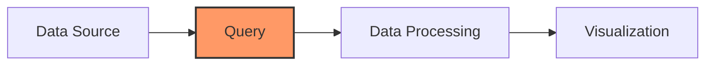

# Query Basics

## Introduction

Queries are the foundation of data visualization in Grafana. They allow you to retrieve, filter, and transform data from various sources before displaying it in panels and dashboards. Understanding how queries work is essential for creating effective visualizations that provide meaningful insights from your data.

In this guide, we'll explore the fundamental concepts of querying in Grafana, how different data sources handle queries, and the basic operations you can perform to shape your data for visualization.

## What is a Query?

A query is a request for data that follows a specific syntax or format depending on the data source. When you create a panel in Grafana, you define one or more queries that:

1. Specify which data source to use
2. Define what data to retrieve from that source
3. Determine how to process or transform that data

Here's a simplified view of how queries work in Grafana:



## Data Sources and Query Languages

Each data source in Grafana supports its own query language or interface. Here are some common examples:

| Data Source | Query Language/Interface |
|-------------|--------------------------|
| Prometheus  | PromQL                   |
| MySQL/PostgreSQL | SQL                |
| Elasticsearch | Lucene Query String or Query DSL |
| InfluxDB    | InfluxQL or Flux        |
| Graphite    | Graphite Query Language |

## The Query Editor

Every data source in Grafana has its own query editor that is designed specifically for that data source's query language. However, they all share some common elements:

1. **Data source selector** - Choose which configured data source to query
2. **Query options** - Configure how the query behaves
3. **Query builder/editor** - Write or build your query
4. **Format options** - Determine how results are returned and displayed

Let's look at a basic example using Prometheus, a popular time-series database:

```
rate(http_requests_total{job="api-server"}[5m])
```

This query:
- Selects the `http_requests_total` metric
- Filters for the job labeled "api-server"
- Calculates the per-second rate of change over 5-minute windows

## Basic Query Operations

Regardless of the data source, most queries involve these fundamental operations:

### 1. Selection

Selecting the metrics, fields, or tables you want to query:

```sql
SELECT temperature, humidity FROM sensors
```

### 2. Filtering

Narrowing down the data to what you're interested in:

```
cpu_usage_idle{hostname="web-server-01"}
```

### 3. Time Range Application

Queries in Grafana automatically apply the dashboard's time range to your queries. For example, in SQL:

```sql
SELECT time, value FROM metrics 
WHERE time >= $__timeFrom() AND time <= $__timeTo()
```

### 4. Aggregation

Combining multiple data points to reduce granularity or highlight patterns:

```
avg_over_time(temperature[1h])
```

### 5. Transformation

Changing the structure or values of the data:

```
100 - cpu_usage_idle
```

## Variables in Queries

Grafana supports template variables that make your queries dynamic. Variables start with a `$` symbol and can be used in most query languages:

```
http_requests_total{instance="$server"}
```

When a dashboard user changes the value of the `$server` variable, the query automatically updates to show data for the selected server.

## Practical Example: Monitoring Web Server Performance

Let's say we want to monitor a web server's performance. Here's how we might build queries for different data sources:

### Prometheus Example

To track HTTP request rates:

```
sum(rate(http_requests_total{job="webserver"}[5m])) by (status_code)
```

This query:
- Sums the rate of HTTP requests over 5-minute intervals
- Groups the results by HTTP status code

### SQL Example

To track database response times:

```sql
SELECT 
  $__timeGroup(time_column, '5m') as time,
  avg(response_time) as avg_response_time
FROM queries
WHERE $__timeFilter(time_column)
GROUP BY 1
ORDER BY 1
```

This query:
- Groups data into 5-minute buckets
- Calculates the average response time in each bucket
- Applies the dashboard's time filter automatically

## Query Inspector

Grafana includes a Query Inspector tool that allows you to:

1. See the exact query sent to your data source
2. View the raw data returned before visualization
3. Identify performance issues or errors in your queries

To access it, click on the panel title and select "Inspect" > "Query".

## Common Query Pitfalls

### 1. Performance Issues

Queries that are too broad or lack proper indexing can cause slow dashboard performance:

```sql
-- Problematic query (scans all data)
SELECT * FROM massive_table

-- Better approach (specific columns, with filtering)
SELECT timestamp, value FROM massive_table WHERE host = 'production-1'
```

### 2. Mismatched Time Zones

Be aware of time zone differences between your data source and Grafana:

```sql
-- Explicitly converting timestamps
SELECT time_column AT TIME ZONE 'UTC' as time, value FROM metrics
```

### 3. Missing Data Handling

Different data sources handle gaps in data differently. Consider using fill methods:

```
SELECT time, value, COALESCE(value, 0) as value_no_gaps FROM metrics
```

## Summary

Queries are the foundation of Grafana visualizations, acting as the bridge between your data sources and your dashboards. Understanding the basics of how queries work across different data sources will help you create more effective and insightful visualizations.

The key points to remember:
- Each data source has its own query language and editor
- Most queries involve selection, filtering, aggregation, and transformation
- Template variables make queries dynamic and interactive
- The Query Inspector helps you debug and optimize your queries

## Next Steps

Now that you understand the basics of querying in Grafana, you might want to explore:

- Query optimization techniques for better performance
- Advanced transformations using Grafana's built-in transformation features
- Combining data from multiple sources in a single visualization

## Exercises

1. Connect Grafana to a sample data source and write a basic query
2. Create a dashboard variable and use it in a query
3. Use the Query Inspector to examine the raw results of a query
4. Write a query that calculates the rate of change for a metric
5. Create queries that show the same data in different time aggregations (hourly, daily, weekly)