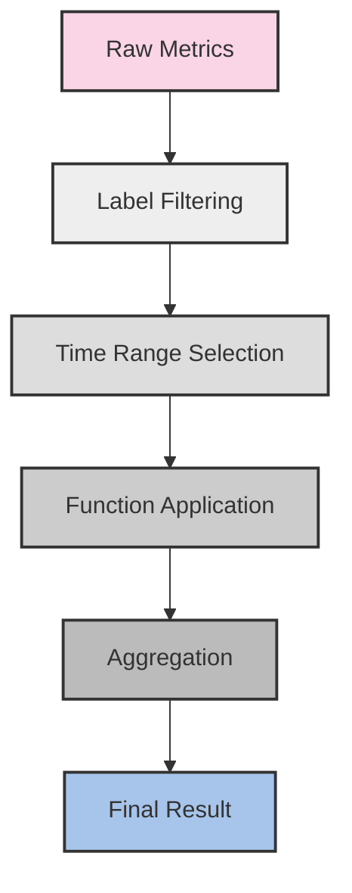

# PromQL Basics

## Introduction

PromQL (Prometheus Query Language) is the powerful query language used in Prometheus and Grafana to retrieve and manipulate time-series data. If you're working with Grafana dashboards connected to Prometheus data sources, understanding PromQL is essential for creating effective visualizations and alerts.

In this guide, we'll explore the fundamentals of PromQL, its syntax, and how to construct queries that help you extract meaningful insights from your metrics data.

## What is PromQL?

PromQL is a functional query language specifically designed for time-series data. It allows you to:

- Select and filter time-series data
- Perform mathematical operations on data
- Aggregate data across multiple time series
- Calculate rates of change
- Create complex expressions for monitoring and alerting

Let's dive into the basics of writing PromQL queries.

## PromQL Data Types

Before we start writing queries, it's important to understand the four main data types in PromQL:

1. **Instant Vector** - A set of time series containing a single sample for each time series, all sharing the same timestamp
2. **Range Vector** - A set of time series containing a range of data points over time
3. **Scalar** - A simple numeric floating-point value
4. **String** - A simple string value (rarely used in PromQL)

## Basic Query Syntax

### Selecting Metrics

The most basic PromQL query is simply the name of a metric:

```promql
http_requests_total
```

This query returns an instant vector containing all time series with the metric name `http_requests_total`.

### Using Labels and Label Matchers

To filter time series, you can use label matchers:

```promql
http_requests_total{status="200", method="GET"}
```

This query selects only the time series with the metric name `http_requests_total` where `status` equals "200" and `method` equals "GET".

PromQL supports several matching operators:

- `=`: Exact match
- `!=`: Does not match
- `=~`: Regex match
- `!~`: Does not match regex

Example with regex matching:

```promql
http_requests_total{status=~"5.."}
```

This matches all HTTP requests with status codes starting with 5 (5xx errors).

## Range Vectors

To select data points over time, you can use range vectors by appending a time range selector:

```promql
http_requests_total[5m]
```

This selects all data points for `http_requests_total` over the last 5 minutes.

Common time units:
- `s` - seconds
- `m` - minutes
- `h` - hours
- `d` - days
- `w` - weeks
- `y` - years

## Operators and Functions

### Arithmetic Operators

PromQL supports basic arithmetic operators:

```promql
node_memory_total - node_memory_free
```

This calculates the used memory by subtracting free memory from total memory.

### Aggregation Operators

To combine multiple time series, you can use aggregation operators:

```promql
sum(http_requests_total) by (status)
```

This sums up all HTTP requests grouped by status code.

Common aggregation operators:
- `sum`
- `min`
- `max`
- `avg`
- `count`
- `topk`
- `bottomk`

### Rate Function

One of the most commonly used functions is `rate`, which calculates the per-second average rate of increase:

```promql
rate(http_requests_total[5m])
```

This gives you the per-second rate of HTTP requests over the last 5 minutes.

## Practical Examples

Let's look at some real-world examples of PromQL queries that you might use in Grafana dashboards:

### Example 1: Error Rate Percentage

```promql
sum(rate(http_requests_total{status=~"5.."}[5m])) / sum(rate(http_requests_total[5m])) * 100
```

This query calculates the percentage of HTTP 5xx errors relative to all requests over the last 5 minutes.

### Example 2: CPU Usage by Node

```promql
100 - (avg by (instance) (irate(node_cpu_seconds_total{mode="idle"}[5m])) * 100)
```

This query calculates the CPU usage percentage for each instance by measuring how much the CPU is NOT idle.

### Example 3: Memory Usage Percentage

```promql
(node_memory_MemTotal_bytes - node_memory_MemFree_bytes - node_memory_Cached_bytes) / node_memory_MemTotal_bytes * 100
```

This calculates the memory usage percentage by determining how much memory is neither free nor cached.

## Complex Patterns

### Delta vs Rate

For counters, you'll often need to choose between `rate()` and `delta()`:

- `rate()` - calculates per-second average rate of increase
- `delta()` - calculates absolute increase in value

Example:
```promql
# Per-second rate of CPU time spent in user mode
rate(node_cpu_seconds_total{mode="user"}[5m])

# Absolute increase in CPU time spent in user mode
delta(node_cpu_seconds_total{mode="user"}[5m])
```

### Predicting Resource Exhaustion

You can use linear prediction to estimate when a resource might run out:

```promql
predict_linear(node_filesystem_free_bytes[1h], 4 * 3600)
```

This predicts the amount of free disk space 4 hours in the future based on the trend from the last hour.

## PromQL in Grafana

When using PromQL in Grafana:

1. Select your Prometheus data source
2. Choose "Metrics browser" or "Code" as the query type
3. Enter your PromQL expression
4. Use the time range selector in Grafana to adjust the query time frame

## Common Pitfalls and Best Practices

### Pitfalls to Avoid

1. **Using `increase()` over very short intervals** - This can lead to inaccurate results due to scrape intervals
2. **Comparing metrics with different labels** - Ensure label sets match when performing operations between metrics
3. **Forgetting to use rate functions for counters** - Always use `rate()`, `irate()`, or `increase()` with counter metrics

### Best Practices

1. **Start simple** - Begin with basic queries and gradually add complexity
2. **Use comments** - Document complex queries for future reference
3. **Watch for cardinality** - High-cardinality metrics can impact performance
4. **Use template variables** - In Grafana, leverage template variables to make queries reusable

## Visualizing PromQL Query Execution

The following diagram illustrates how a PromQL query is processed:



## Summary

PromQL is a powerful query language that enables you to extract meaningful insights from your time-series data in Grafana. In this guide, we've covered:

- PromQL data types and basic syntax
- Filtering metrics using labels
- Working with range vectors
- Using operators and functions
- Creating practical queries for real-world scenarios

By mastering these fundamentals, you'll be able to create effective Grafana dashboards and alerts that provide valuable insights into your systems' performance.

## Additional Resources

- [Prometheus Documentation](https://prometheus.io/docs/prometheus/latest/querying/basics/)
- [Grafana PromQL Cheat Sheet](https://grafana.com/docs/grafana-cloud/data-configuration/prometheus/promql/)
- [PromLabs PromQL Tutorial](https://promlabs.com/promql-tutorial/)

## Exercises

1. Write a PromQL query to show the rate of HTTP requests per second, grouped by endpoint.
2. Create a query to calculate the 95th percentile response time for your application.
3. Develop a query that alerts when disk usage exceeds 80% and is predicted to reach 100% within 24 hours.
4. Write a query to show the top 5 processes consuming the most CPU.
5. Create a query to calculate the request success rate (non-5xx responses) as a percentage.