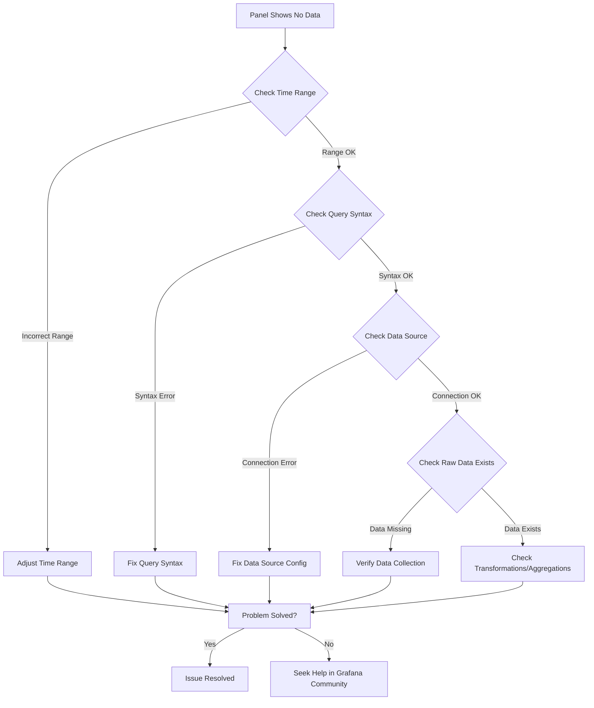

# Query Troubleshooting

## Introduction

When working with Grafana dashboards, you'll inevitably encounter situations where your queries don't return the expected results. Query troubleshooting is an essential skill for anyone working with Grafana, as it helps you identify and resolve issues that prevent your visualizations from displaying accurate data.

In this guide, we'll explore common query problems in Grafana, their causes, and strategies to fix them. Whether you're dealing with empty panels, unexpected results, or performance issues, this troubleshooting guide will help you get your dashboards back on track.

## Common Query Issues and Solutions

### No Data or Empty Panels

One of the most common issues in Grafana is panels that display "No data" or appear empty.

#### Possible Causes:

1. **Time Range Issues**: The selected time range doesn't contain any data.
2. **Query Syntax Errors**: Mistakes in your query syntax.
3. **Data Source Configuration**: Incorrect data source settings.
4. **Missing Data**: The queried metrics or data points don't exist.

#### Troubleshooting Steps:

1. **Check Time Range**

   Verify that your dashboard's time range includes periods when data should be available.

   ```jsx
   // Example of adjusting time range via URL parameters
   https://your-grafana-instance/d/dashboard-id?from=now-6h&to=now
   ```

2. **Examine Query Inspector**

   Grafana's Query Inspector is a powerful tool for diagnosing issues:

   ```
   1. Click on the panel title
   2. Select "Inspect" → "Query"
   3. Click "Refresh" to see the raw query and response
   ```

   <div className="alert alert--info">
     <p>
       The Query Inspector shows both the exact query sent to your data source and the raw response, making it easier to identify where things are going wrong.
     </p>
   </div>

3. **Validate Data Source Health**

   Check if your data source is working correctly:

   ```
   1. Go to Configuration → Data Sources
   2. Select your data source
   3. Click "Test" to verify the connection
   ```

### Incorrect or Unexpected Results

Sometimes your panel shows data, but the values are unexpected or seem incorrect.

#### Possible Causes:

1. **Aggregation Issues**: Wrong or missing aggregation functions.
2. **Filtering Problems**: Incorrect filters or label matchers.
3. **Join or Transformation Errors**: Issues in combining multiple queries.
4. **Unit Conversion**: Mismatched units or scaling factors.

#### Troubleshooting Steps:

1. **Break Down Complex Queries**

   Split complex queries into simpler parts to identify which component is causing issues.

   For example, if using Prometheus and experiencing issues with this query:
   
   ```jsx
   sum(rate(http_requests_total{status=~"5.."}[5m])) / sum(rate(http_requests_total[5m])) * 100
   ```

   Break it down:
   
   ```jsx
   // First verify the total requests query works
   sum(rate(http_requests_total[5m]))
   
   // Then check the error requests query
   sum(rate(http_requests_total{status=~"5.."}[5m]))
   
   // Finally combine them
   ```

2. **Check Label Filters**

   Verify that your label filters aren't too restrictive or have typos.
   
   ```jsx
   // This might return no data if "environmnet" is misspelled
   http_requests_total{environmnet="production"}
   
   // Correct spelling
   http_requests_total{environment="production"}
   ```

3. **Investigate Data with Explore**

   Use Grafana's Explore feature to interactively debug your queries.

### Performance Issues

Slow-loading dashboards can indicate query performance problems.

#### Possible Causes:

1. **Time Range Too Large**: Querying too much data at once.
2. **High Cardinality**: Too many unique series being returned.
3. **Complex Calculations**: Resource-intensive operations in queries.
4. **Data Source Limitations**: Resource constraints on your data source.

#### Troubleshooting Steps:

1. **Optimize Query Time Ranges**

   Use appropriate time aggregations for longer time ranges.
   
   ```jsx
   // InfluxDB example - 1h aggregation when looking at 7d of data
   SELECT mean("value") FROM "measurement" WHERE time >= now() - 7d GROUP BY time(1h)
   ```

2. **Reduce Cardinality**

   Use aggregation and specific label filters to reduce the number of series.
   
   ```jsx
   // Prometheus example - aggregate by instance to reduce cardinality
   sum by (instance) (rate(http_requests_total[5m]))
   ```

3. **Check Query Metrics**

   In the Query Inspector, look at the statistics tab to see query execution time.

## Data Source Specific Troubleshooting

### Prometheus Troubleshooting

Prometheus has its own set of common issues when querying time series data.

#### Common Problems:

1. **Rate() Function Misuse**
   
   The `rate()` function requires a time range vector:
   
   ```jsx
   // Incorrect - missing time range
   rate(http_requests_total)
   
   // Correct
   rate(http_requests_total[5m])
   ```

2. **PromQL Regex Matching**
   
   Remember that PromQL uses a different regex syntax:
   
   ```jsx
   // Match all status codes starting with 4
   http_requests_total{status=~"4.."}
   
   // Match either 'error' or 'critical' severity
   alerts_triggered{severity=~"error|critical"}
   ```

3. **Counter Resets**
   
   Use `increase()` instead of `rate()` for sparse counters:
   
   ```jsx
   // Better for counters that increment infrequently
   increase(infrequent_batch_jobs_total[1h])
   ```

### SQL Data Source Troubleshooting

When working with SQL data sources like MySQL, PostgreSQL, or SQL Server, different issues arise.

#### Common Problems:

1. **Time Column Formatting**
   
   Make sure your time column is properly formatted:
   
   ```jsx
   // PostgreSQL example
   SELECT 
     time_column::timestamp as time, 
     value 
   FROM metrics 
   WHERE time_column BETWEEN $__timeFrom() AND $__timeTo() 
   ORDER BY time_column
   ```

2. **Macro Substitution**
   
   Verify that Grafana macros are properly expanded:
   
   ```jsx
   // Check Query Inspector to see how $__timeGroup expands
   SELECT 
     $__timeGroup(time_column, '1h'), 
     avg(value) as avg_value 
   FROM metrics 
   GROUP BY 1
   ```

## Using Mermaid for Query Flow Analysis

When troubleshooting complex query issues, it can be helpful to visualize the data flow. Here's a flowchart representing a typical troubleshooting process:



## Advanced Troubleshooting Techniques

### Using Variables for Dynamic Testing

Grafana dashboard variables can help you troubleshoot by allowing quick comparisons between different metrics or configurations.

```jsx
// Create a test variable with multiple query options
Name: test_query
Type: Query
Values: 
  option1 = rate(http_requests_total[5m])
  option2 = increase(http_requests_total[5m])
```

Then use it in your panel:

```jsx
${test_query}
```

### Setting Up Debug Panels

Create dedicated panels for debugging that show raw data:

```jsx
// Table panel showing raw data points
SELECT 
  time_column, 
  metric_value, 
  dimension1, 
  dimension2 
FROM metrics 
ORDER BY time_column DESC 
LIMIT 100
```

### Debug with Alerting Testing

Use Grafana's alert testing feature to validate query logic:

```
1. Go to Alerting → New Alert Rule
2. Define your query
3. Test the rule without saving
```

## Summary

Effective query troubleshooting in Grafana involves a systematic approach to identifying and resolving issues. By understanding common problems and using the built-in tools like Query Inspector and Explore, you can quickly diagnose and fix issues with your visualizations.

Remember these key points:

1. Always check the basics first: time range, data source health, and query syntax
2. Break down complex queries into simpler components
3. Use Grafana's built-in debugging tools
4. Understand the specific quirks of your data source
5. Optimize for performance when dealing with large datasets

Mastering query troubleshooting will make you more efficient in creating and maintaining Grafana dashboards, resulting in more reliable and insightful visualizations.

## Additional Resources

- Practice troubleshooting by intentionally creating problematic queries
- Join the [Grafana Community Forums](https://community.grafana.com/) to discuss specific issues
- Review the official Grafana documentation for your specific data source

## Exercises

1. Create a dashboard with a panel showing "No data" due to an incorrect time range, then fix it.
2. Intentionally write a query with a syntax error, use the Query Inspector to identify the issue, and then resolve it.
3. Create two versions of the same query - one with poor performance and one optimized. Compare their execution times in the Query Inspector.
4. Practice using variables to quickly toggle between different query approaches when troubleshooting.