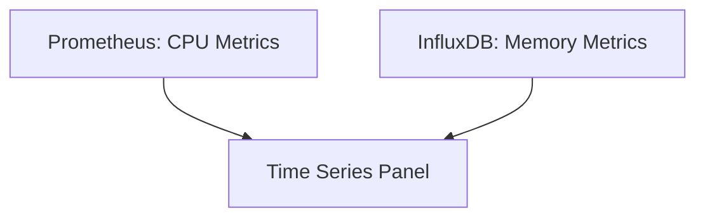
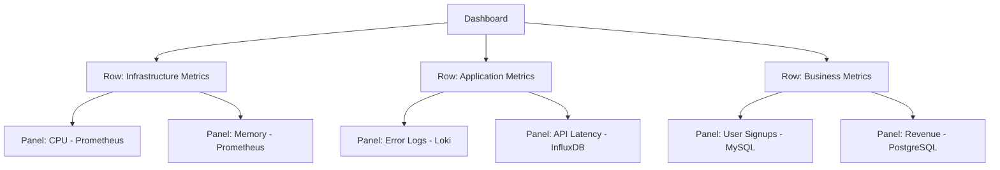

# Multi-Data Source Queries

## Introduction

One of Grafana's most powerful features is its ability to query and visualize data from multiple sources in a single dashboard. Unlike many monitoring solutions that are tied to a specific database or data format, Grafana acts as a unifying layer that can bring together metrics, logs, and traces from various systems into cohesive visualizations.

In this guide, we'll explore how to leverage multi-data source queries in Grafana. You'll learn how to combine data from different sources, create mixed visualizations, and build comprehensive dashboards that provide complete visibility into your systems.

## Understanding Multi-Data Source Dashboards

### What Are Multi-Data Source Queries?

Multi-data source queries allow you to:

- Query different data sources within the same dashboard
- Combine metrics from diverse systems in a single panel
- Compare related data that lives in separate databases
- Create comprehensive views of your entire infrastructure

### When to Use Multiple Data Sources

Consider using multiple data sources when you:

- Need to correlate metrics across different systems
- Have data spread across specialized databases (e.g., Prometheus for metrics, Loki for logs)
- Want to transition from one data source to another
- Need to visualize business metrics alongside technical metrics

## Basic Multi-Data Source Dashboard

The simplest approach to multi-data source querying is to create different panels that each use their own data source.

### Example: Creating a Dashboard with Multiple Data Sources

Let's create a dashboard that shows:
- Server metrics from Prometheus
- Application logs from Loki
- API response times from InfluxDB

1. Create a new dashboard
2. Add a graph panel for server CPU metrics:

```
# In the first panel
Data Source: Prometheus
Query: rate(node_cpu_seconds_total{mode="user"}[5m])
```

3. Add a logs panel for application errors:

```
# In the second panel
Data Source: Loki
Query: {app="myapp"} |= "error"
```

4. Add another graph panel for API response times:

```
# In the third panel
Data Source: InfluxDB
Query: SELECT mean("response_time") FROM "api_metrics" WHERE $timeFilter GROUP BY time($__interval)
```

With this approach, you've created a dashboard that pulls data from three different sources, giving you a comprehensive view of your system.

## Advanced: Using the "Mixed" Data Source

Grafana offers a special "Mixed" data source that allows you to query different data sources within a single panel. This is useful when you want to overlay or compare data from different sources.

### Setting Up Mixed Data Source Queries

1. Add a new panel to your dashboard
2. Select "Mixed" as the data source
3. Add your first query (e.g., from Prometheus)
4. Click "Add Query" to add another query
5. For the new query, select a different data source (e.g., InfluxDB)
6. Configure both queries as needed

### Example: Comparing Metrics from Different Sources

Let's say you want to compare CPU usage from both Prometheus and InfluxDB on the same graph:

```
# Query A
Data Source: Prometheus
Query: rate(node_cpu_seconds_total{mode="user"}[5m])

# Query B
Data Source: InfluxDB
Query: SELECT mean("cpu_usage") FROM "server_metrics" WHERE $timeFilter GROUP BY time($__interval)
```

This will overlay both metrics on the same graph, allowing for direct comparison.

## Using Transformations with Multi-Data Source Queries

Grafana's transformation feature is particularly powerful when working with multiple data sources, as it allows you to combine, restructure, and enhance the queried data.

### Example: Joining Data from Different Sources

Let's say you have:
- User activity metrics in Prometheus
- User profile data in MySQL

You can join these data sets using transformations:

1. Create a panel with "Mixed" data source
2. Add your Prometheus query for user activity
3. Add your MySQL query for user information
4. Apply a "Join by field" transformation:

```
# Query A (Prometheus)
Data Source: Prometheus
Query: sum by(user_id) (rate(user_actions_total[5m]))

# Query B (MySQL)
Data Source: MySQL
Query: SELECT user_id, user_name, department FROM users

# Then apply the "Join by field" transformation on "user_id"
```

This will give you activity metrics enriched with user information from your database.

## Using Dashboard Variables with Multiple Data Sources

Dashboard variables become even more powerful when working with multiple data sources, as they can drive queries across different systems.

### Example: Creating a Data Source Selector Variable

```
Name: data_source
Type: Query
Data source: -- Dashboard --
Query: prometheus,influxdb,loki
```

Then, in your panels, you can reference `${data_source}` to dynamically switch between data sources.

### Example: Creating a Server Variable for Multiple Data Sources

```
Name: server
Type: Query
Data source: Prometheus
Query: label_values(node_cpu_seconds_total, instance)
Include All option: true
```

Now you can use `$server` in both Prometheus and InfluxDB queries (if they share the same server naming convention).

## Visualizing Data from Multiple Sources

### Time Series Panel

The Time Series panel is excellent for comparing metrics from different data sources:



### Dashboard Structure Example

A common structure for multi-data source dashboards might be:



## Practical Example: Full-Stack Monitoring Dashboard

Let's create a comprehensive dashboard that monitors a web application stack:

1. **Infrastructure Layer (Prometheus)**
   - Server CPU, Memory, Disk metrics
   - Network traffic and latency

2. **Application Layer (Mixed Sources)**
   - Application logs (Loki)
   - Application metrics (Prometheus)
   - Database query performance (MySQL data source)

3. **User Experience Layer (InfluxDB + Grafana Plugin)**
   - Page load times
   - User interactions
   - Conversion rates

### Example Implementation:

```
# Infrastructure Panel
Data Source: Prometheus
Query: sum by (instance) (rate(node_cpu_seconds_total{mode!="idle"}[5m])) / count by (instance) (node_cpu_seconds_total{mode="idle"})

# Application Errors Panel
Data Source: Loki
Query: {app="webapp"} |= "error" | rate[5m]

# Database Performance Panel
Data Source: MySQL
Query: SELECT query_name, avg_execution_time FROM performance_schema.events_statements_summary_by_digest ORDER BY avg_execution_time DESC LIMIT 10

# User Experience Panel
Data Source: InfluxDB
Query: SELECT mean("page_load_time") FROM "user_metrics" WHERE $timeFilter GROUP BY time($__interval), "page"
```

## Troubleshooting Multi-Data Source Queries

When working with multiple data sources, you might encounter these common issues:

### Time Range Alignment

Different data sources might handle time ranges differently. To ensure alignment:
- Use the dashboard time picker variables (`$__from` and `$__to`) in your queries
- Be aware of timezone differences between data sources
- Consider using the "Time shift" query option for sources that need alignment

### Data Type Compatibility

When joining or comparing data from different sources:
- Pay attention to units (e.g., seconds vs. milliseconds)
- Use transformations to normalize data
- Use math expressions to convert between units when needed

## Best Practices

### Optimize Performance

- Limit the number of queries per panel
- Be careful with high-cardinality metrics across multiple sources
- Consider using caching for frequently accessed datasets

### Design for Clarity

- Group related panels by data source
- Use consistent naming conventions across data sources
- Add documentation to explain data relationships

### Maintainability

- Use dashboard variables to make your queries flexible
- Document the purpose of each data source
- Consider creating reusable query snippets for common patterns

## Summary

Multi-data source queries in Grafana provide a powerful way to bring together disparate data into unified visualizations. By leveraging Grafana's ability to query and combine data from various sources, you can create comprehensive dashboards that provide complete visibility into your systems.

Key takeaways:
- You can use multiple data sources within a single dashboard
- The "Mixed" data source allows queries from different sources in the same panel
- Transformations help combine and reshape data from multiple sources
- Dashboard variables work across different data sources
- Proper design ensures clarity and maintainability

## Additional Resources

- Practice creating dashboards that combine metrics from Prometheus with logs from Loki
- Experiment with the various transformation options to join data from different sources
- Try creating a business KPI dashboard that combines technical metrics with business data
- Explore Grafana's alerting capabilities across multiple data sources

As you become more comfortable with Grafana, you'll find that multi-data source queries open up endless possibilities for monitoring and visualization, allowing you to create truly comprehensive dashboards that tell the complete story of your systems.