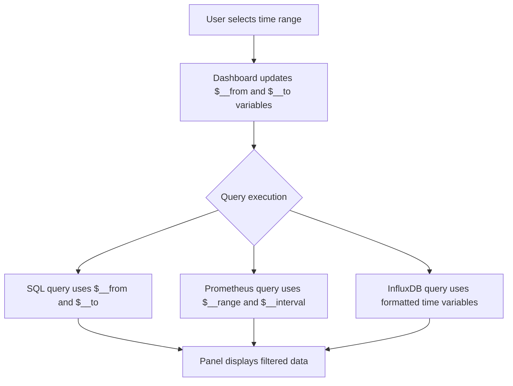

# Time Range Variables

## Introduction

Time range variables are powerful features in Grafana that allow you to reference the dashboard's currently selected time range within your queries. This enables you to create truly dynamic dashboards that adapt to different time selections without modifying the underlying queries manually.

When you build dashboards in Grafana, the ability to analyze data across different time periods is essential. Time range variables provide a way to incorporate the selected time range into your queries automatically, making your visualizations more flexible and interactive.

## Understanding Dashboard Time Range

Before diving into time range variables, let's understand how time works in Grafana dashboards:

Every Grafana dashboard has a time range selector in the upper right corner:

- You can select predefined ranges like "Last 6 hours" or "Last 7 days"
- You can define custom time ranges with specific start and end times
- You can use relative time ranges like "now-24h to now"

This selected time range globally affects all panels in your dashboard, filtering data to show only what falls within that time window.

## Built-in Time Range Variables

Grafana automatically provides several built-in variables related to the dashboard's time range:

| Variable | Description | Example Value |
|----------|-------------|---------------|
| `$__from` | Start timestamp of the current dashboard time selection | `1647341400000` |
| `$__to` | End timestamp of the current dashboard time selection | `1647363000000` |
| `$__interval` | Calculated interval based on time range and panel width | `1h` or `30s` |
| `$__range` | Total time range in time units | `12h` |

These variables are available in all query editors without any additional configuration.

## Using Time Range Variables in Queries

### SQL Databases

For SQL databases like MySQL, PostgreSQL, or MS SQL Server:

```sql
SELECT
  time_column,
  value_column
FROM
  metrics_table
WHERE
  time_column BETWEEN FROM_UNIXTIME(${__from:date}/1000) AND FROM_UNIXTIME(${__to:date}/1000)
ORDER BY
  time_column
```

### InfluxDB

For InfluxDB time series database:

```
SELECT mean("value") 
FROM "measurement" 
WHERE time >= ${__from:date:iso} AND time <= ${__to:date:iso} 
GROUP BY time(${__interval})
```

### Prometheus

For Prometheus:

```
sum(rate(http_requests_total{job="api"}[$__interval])) by (method, path)
```

### Elasticsearch

For Elasticsearch:

```
{
  "query": {
    "bool": {
      "filter": [
        {
          "range": {
            "@timestamp": {
              "gte": "${__from:date:iso}",
              "lte": "${__to:date:iso}",
              "format": "strict_date_optional_time"
            }
          }
        }
      ]
    }
  }
}
```

## Time Range Formatting Options

Grafana provides several formatting options for time range variables:

| Format | Description | Example |
|--------|-------------|---------|
| `${__from}` | Unix timestamp in milliseconds | `1647341400000` |
| `${__from:date}` | Unix timestamp in seconds | `1647341400` |
| `${__from:date:iso}` | ISO 8601 format | `2022-03-15T10:30:00Z` |
| `${__from:date:seconds}` | Unix timestamp in seconds | `1647341400` |
| `${__from:date:yyyy-MM-dd}` | Custom date format | `2022-03-15` |

Similar formatting options apply to `$__to` variable as well.

## Practical Example: Calculating Rates Over Time Periods

Let's create a practical example where we calculate the rate of events over different time periods dynamically.

Imagine you have a metrics dashboard for an e-commerce application and want to show sales rates at different time granularities:

```sql
-- Query that adapts to show hourly, daily or weekly sales rates based on time selection
SELECT
  date_trunc('${__interval:raw}', order_time) as time_bucket,
  count(*) / (extract(epoch from '${__range:raw}'::interval) / 3600) as hourly_sales_rate,
  sum(order_total) as total_sales
FROM
  orders
WHERE
  order_time BETWEEN to_timestamp(${__from:date}/1000) AND to_timestamp(${__to:date}/1000)
GROUP BY
  time_bucket
ORDER BY
  time_bucket
```

This query automatically:
1. Groups data by the appropriate interval based on the dashboard's time range
2. Calculates a normalized hourly sales rate by dividing by the selected time range
3. Filters data to only include the current time selection

## Creating Custom Time Range Variables

While the built-in time range variables are powerful, sometimes you need custom time ranges relative to the dashboard time:

1. Navigate to **Dashboard settings** > **Variables** > **New**
2. Set the following options:
   - Name: `custom_range_start`
   - Type: `Custom`
   - Label: `Custom Range Start`
   - Query: `${__from:date:iso}`
   - Hide: `Variable`

3. Create another variable:
   - Name: `custom_range_end`
   - Type: `Custom`
   - Label: `Custom Range End`
   - Query: `${__to:date:iso}`
   - Hide: `Variable`

Now you can use these variables in your queries, and they'll update automatically when the dashboard time range changes.

## Advanced Use Case: Comparing Time Periods

A powerful application of time range variables is comparing metrics across different time periods. Let's create a query that compares current data with data from the same period yesterday:

```sql
-- Current period data
SELECT
  time_column as time,
  value_column as current_value
FROM
  metrics
WHERE
  time_column BETWEEN FROM_UNIXTIME(${__from:date}/1000) AND FROM_UNIXTIME(${__to:date}/1000)

UNION ALL

-- Previous period data (same time yesterday)
SELECT
  time_column + INTERVAL '1 day' as time,
  value_column as previous_value
FROM
  metrics
WHERE
  time_column BETWEEN FROM_UNIXTIME(${__from:date}/1000) - INTERVAL '1 day' AND FROM_UNIXTIME(${__to:date}/1000) - INTERVAL '1 day'
```

This query returns two series that can be overlaid in the same panel to show today's and yesterday's data together.

## Visualizing Time Range Selection Flow

Here's a diagram showing how time range selections impact queries:



## Common Challenges and Solutions

### Timezone Issues

Time range variables use UTC by default. To adjust for local timezones:

```sql
-- PostgreSQL example adjusting for timezone
SELECT
  time_column AT TIME ZONE 'UTC' AT TIME ZONE 'America/New_York' as local_time,
  value_column
FROM
  metrics
WHERE
  time_column BETWEEN to_timestamp(${__from:date}/1000) AND to_timestamp(${__to:date}/1000)
```

### Performance Optimization

For large datasets, optimize queries by:

1. Using appropriate time indexes
2. Pre-filtering data at the database level
3. Using materialized views for common time periods

```sql
-- Optimized query with indexed time column
SELECT
  date_trunc('hour', time_column) as hour,
  avg(value_column) as avg_value
FROM
  metrics
WHERE
  -- Using an indexed time column improves performance
  time_column >= to_timestamp(${__from:date}/1000)
  AND time_column <= to_timestamp(${__to:date}/1000)
GROUP BY
  hour
ORDER BY
  hour
```

## Summary

Time range variables make your Grafana dashboards truly dynamic by automatically adapting queries to the selected time range. They:

- Provide flexibility to analyze data across different time periods
- Reduce the need for manual query modifications
- Enable advanced use cases like period-over-period comparisons
- Work across all data sources in Grafana

By mastering time range variables, you can create more interactive and user-friendly dashboards that allow deep exploration of your time series data.

## Additional Resources

- Practice incorporating time range variables into different query types
- Experiment with custom formatting of time variables
- Try building a dashboard with period-over-period comparisons
- Explore how time range variables can be combined with other template variables for even more powerful dashboards

## Exercise

Create a dashboard that displays both the current day's metrics and the metrics from the same day last week, using time range variables to dynamically adjust both queries. Implement this for a metrics dashboard showing website traffic, allowing users to compare traffic patterns across weeks.