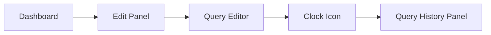

# Query History in Grafana

## Introduction

Query History is a powerful feature in Grafana that allows you to track, search, and reuse queries you've previously executed. As you build dashboards and explore data, you'll often write multiple queries - some successful, some not. Instead of rewriting queries from scratch or maintaining a separate record, Query History automatically saves all your queries, making your workflow more efficient.

This feature is especially helpful when:
- You need to recover a query after accidental changes
- You want to reuse complex queries in different panels
- You're iterating on query development and want to compare different versions
- You need to share queries with team members

## Understanding Query History Basics

Query History works across all Grafana data sources including Prometheus, InfluxDB, Loki, MySQL, and others. Let's explore how to access and use this feature.

### Accessing Query History

To access Query History:

1. Open any Grafana dashboard or create a new one
2. Click on "Add panel" or edit an existing panel
3. In the query editor, look for the clock icon in the top toolbar
4. Click on the clock icon to toggle the Query History panel



### Query History Interface

The Query History panel is divided into several components:

- **Search bar**: Filter queries by content or comments
- **Data source selector**: Filter queries by data source
- **Query list**: Chronological list of your previous queries
- **Query details**: Preview of the selected query
- **Action buttons**: Star, copy, or comment on queries

## Working with Query History

Now let's explore the practical ways to use Query History in your Grafana workflow.

### Viewing and Searching Queries

When you open Query History, you'll see a list of all your previous queries sorted by time, with the most recent at the top. Each entry shows:

- The data source used (Prometheus, Loki, etc.)
- A snippet of the query text
- When it was last run
- Any comments you've added
- Whether it's starred

To find specific queries:

```js
// Example: Search all Prometheus queries containing "memory"
// In the search field:
dataSource:"Prometheus" memory
```

### Starring Important Queries

If you have queries you use frequently or want to keep for reference:

1. Hover over a query in the history list
2. Click the star icon to mark it as a favorite
3. Use the "Starred" tab to quickly access your favorite queries

### Adding Comments

Adding descriptive comments helps you remember what a query does:

1. Select a query from the history
2. Click the comment icon (speech bubble)
3. Enter your comment in the text field
4. Click "Save comment"

```jsx
// Example comment
"This query shows memory usage spikes over the last 24 hours with 1m resolution"
```

### Reusing Queries

To reuse a query from your history:

1. Find the query in your history list
2. Click on it to view details
3. Click "Use query" to apply it to the current panel
4. Alternatively, click the copy icon to copy the query to your clipboard

### Managing Query History Settings

Grafana allows you to customize how Query History works:

1. Go to **Configuration → Preferences**
2. Scroll down to the "Query history" section
3. Set your preferred retention period (default is 7 days)
4. Choose whether to keep starred queries indefinitely

## Practical Examples

Let's look at some real-world examples of how Query History can improve your workflow.

### Example 1: Iterative Query Development

When developing complex queries, you often make incremental changes:

```
# First attempt - basic CPU usage
rate(node_cpu_seconds_total{mode="idle"}[1m])

# Second attempt - filter by instance
rate(node_cpu_seconds_total{mode="idle",instance="server-01:9100"}[1m])

# Final query - calculate CPU usage percentage
100 - (avg by(instance) (rate(node_cpu_seconds_total{mode="idle"}[1m])) * 100)
```

With Query History, you can easily:
1. See your progression of query development
2. Go back to any version if a change doesn't work as expected
3. Compare different approaches

### Example 2: Cross-Panel Query Reuse

When building dashboards with related panels:

1. Create and perfect a query in one panel
2. Access Query History to find the query
3. Copy the query to use as a starting point for related panels
4. Modify as needed for the new context

### Example 3: Sharing Queries with Team Members

When collaborating on dashboards:

1. Develop a useful query
2. Star it and add a detailed comment
3. Show your colleague where to find it in Query History
4. They can copy and use it in their own panels

## Advanced Features

### Query History Tabs

The Query History panel includes several tabs to help organize your queries:

- **Query history**: All queries, newest first
- **Starred**: Only queries you've marked as favorites
- **Comments**: Only queries with comments

### Bulk Actions

You can perform actions on multiple queries:

1. Use the checkboxes to select multiple queries
2. Use the bulk action buttons to:
   - Delete selected queries
   - Star/unstar multiple queries

### Persistent Storage

Query History is stored in your browser's local storage by default, but when you're signed in to Grafana, your query history is also saved to the Grafana database and available across devices and browsers.

## Common Issues and Troubleshooting

### Missing Queries

If you don't see expected queries in your history:

- Check if you've exceeded the retention period (default 7 days)
- Verify you're logged in if using across multiple devices
- Make sure you haven't filtered out the queries with search settings

### Browser Storage Limitations

If using local storage only (not logged in):

- Browser storage limits may restrict very large query histories
- Clearing browser data will erase your local query history

## Summary

Query History is an essential productivity tool for Grafana users that:

- Automatically saves all your queries for easy reference
- Allows you to search, filter, and organize your query collection
- Makes it simple to reuse and iterate on complex queries
- Helps with collaboration by providing a way to document and share queries

By leveraging Query History effectively, you'll spend less time rewriting queries and more time gaining insights from your data.

## Additional Resources

- Try using keyboard shortcuts: Press `Ctrl+K` (or `Cmd+K` on Mac) in the query editor to quickly access your query history
- Practice star and comment features to organize your most useful queries
- Experiment with different search techniques to quickly find specific queries

## Exercise: Query History Workflow

1. Create three different queries on a Grafana dashboard
2. Star one of them and add a comment
3. Close the dashboard and open a new one
4. Use Query History to find and reuse one of your previous queries
5. Try searching for specific terms in your query history