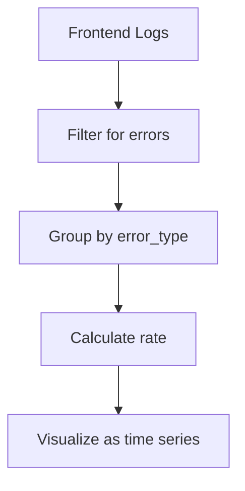
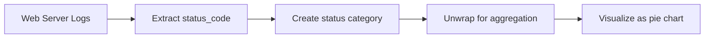

# LogQL Basics

## Introduction

LogQL (Log Query Language) is the query language used by Grafana Loki, a horizontally scalable, highly available log aggregation system. LogQL draws inspiration from PromQL (Prometheus Query Language) but is specifically designed for working with log data. Whether you're troubleshooting application issues, monitoring system behavior, or analyzing user activities, LogQL provides a powerful way to extract meaningful insights from your logs.

In this tutorial, we'll explore the fundamentals of LogQL, its syntax, and how to use it effectively to query and analyze your logs in Grafana.

## What is LogQL?

LogQL is a structured query language that allows you to:

1. **Search** for specific log entries using labels and text patterns
2. **Filter** log data based on various criteria
3. **Extract** fields from log content
4. **Aggregate** and analyze log data using metrics

LogQL queries consist of two main parts:
- **Log pipeline**: Filters and processes logs
- **Metric pipeline** (optional): Performs statistical analysis on the filtered logs

## LogQL Syntax Basics

### Log Stream Selector

The most basic LogQL query uses a log stream selector, which uses labels to filter log streams:

```sql
{app="frontend", environment="production"}
```

This query returns all logs from the streams that have both `app="frontend"` and `environment="production"` labels.

### Label Matching Operators

LogQL supports various label matching operators:

| Operator | Description | Example |
|----------|-------------|---------|
| `=` | Exactly equal | `{app="frontend"}` |
| `!=` | Not equal | `{app!="backend"}` |
| `=~` | Regex match | `{app=~"front.*"}` |
| `!~` | Regex not match | `{app!~"back.*"}` |

### Log Line Filtering

To filter logs based on their content, you can use a text search after the stream selector:

```sql
{app="frontend"} |= "error"
```

This query returns all logs from the `app="frontend"` stream that contain the word "error".

LogQL provides several filter operators:

| Operator | Description |
|----------|-------------|
| `|=` | Log line contains string |
| `!=` | Log line does not contain string |
| `|~` | Log line matches regex |
| `!~` | Log line does not match regex |

### Combining Multiple Filters

You can chain multiple filters to create more complex queries:

```sql
{app="frontend", environment="production"} 
  |= "error" 
  != "timeout" 
  |~ "user_id=[0-9]+"
```

This query:
1. Selects logs from the frontend production environment
2. That contain the word "error"
3. But do not contain the word "timeout"
4. And match the regex pattern for a user ID

## Advanced Log Querying

### Extracting Fields with Parsers

LogQL allows you to extract specific fields from your logs using parsers:

#### JSON Parser

If your logs are in JSON format:

```sql
{app="frontend"} | json
```

This automatically extracts all fields from the JSON. You can also extract specific fields:

```sql
{app="frontend"} | json field_1="value", field_2="another_value"
```

#### Regex Parser

For logs that aren't in JSON format, you can use regex patterns to extract fields:

```sql
{app="frontend"} | regexp `(?P<user_id>\w+) logged in at (?P<timestamp>\d+)`
```

This extracts `user_id` and `timestamp` fields from logs matching the pattern.

### Line Format

The `line_format` expression allows you to reformat log lines:

```sql
{app="frontend"} 
  | json 
  | line_format "User {{.user_id}} encountered {{.error_type}} at {{.timestamp}}"
```

This creates a more readable log line using the extracted JSON fields.

### Labels Format

The `label_format` expression lets you create new labels from existing ones:

```sql
{app="frontend"} 
  | json 
  | label_format error_category="{{.error_type}}-{{.severity}}"
```

This creates a new label called `error_category` by combining the `error_type` and `severity` fields.

## Working with Metrics

LogQL can convert logs into metrics, enabling powerful analysis capabilities.

### Range Vector Aggregation

```sql
sum(rate({app="frontend"} |= "error" [5m])) by (error_type)
```

This counts the number of error logs per error type over 5-minute intervals.

### Count Operation

```sql
count_over_time({app="frontend"} [1h])
```

This counts the number of log entries for the frontend app over the last hour.

### Unwrapped Range Aggregations

```sql
sum by (status_code) (
  rate({app="frontend"} | json | unwrap status_code [5m])
)
```

This extracts the `status_code` field from JSON logs and calculates its rate over 5-minute windows, grouped by status code.

## Real-World Examples

### Monitoring Application Errors

```sql
sum(rate({app="frontend", environment="production"} |= "error" [15m])) by (error_type)
```

This query:
1. Selects logs from the production frontend environment containing "error"
2. Calculates the rate of errors over 15-minute windows
3. Groups the results by error type
4. Sums the rates for each error type

You can visualize this as a time series panel to monitor error rates over time:



### Analyzing HTTP Status Codes

```sql
{app="web-server"} 
  | json 
  | status_code != "" 
  | label_format http_status_category="{{.status_code}}" 
  | unwrap http_status_category
```

This extracts HTTP status codes from web server logs and creates a visualization of status code distribution:



### Troubleshooting Login Failures

```sql
{app="auth-service"} 
  |= "login failed" 
  | json 
  | line_format "Failed login: {{.username}} from {{.ip_address}} - {{.reason}}"
```

This reformats login failure logs to make them more readable during troubleshooting sessions.

## Performance Tips

1. **Use Label Selectors Efficiently**: Always include label selectors to filter logs at the storage level before processing.

2. **Limit Time Ranges**: Use narrower time ranges when possible, especially for heavy queries.

3. **Avoid High-Cardinality Labels**: Be cautious with labels that have many unique values as they can impact performance.

4. **Use Line Filters Early**: Place the most restrictive line filters first in your query to reduce the amount of data processed.

```sql
# Good query - filters early
{app="frontend"} |= "error" |= "critical" | json

# Less efficient - processes more data
{app="frontend"} | json | line_format "{{.message}}" |= "error" |= "critical"
```

## Summary

LogQL is a powerful query language that enables you to search, filter, and analyze log data in Grafana Loki. Starting with basic log stream selectors and text filters, you can build increasingly sophisticated queries that extract specific information, transform log data, and even generate metrics.

Key concepts covered in this tutorial:
- Log stream selection using labels
- Filtering log content with operators
- Extracting and formatting fields
- Converting logs to metrics
- Real-world application examples

## Practice Exercises

1. Write a LogQL query to find all logs from the "backend" application containing the word "exception".

2. Create a query that extracts and counts HTTP status codes from nginx logs.

3. Develop a query that monitors failed authentication attempts and groups them by user and source IP.

4. Write a query that calculates the 95th percentile of response times from your application logs.

## Additional Resources

- [Official Grafana Loki Documentation](https://grafana.com/docs/loki/latest/logql/)
- [LogQL Cheat Sheet](https://grafana.com/docs/loki/latest/logql/cheat_sheet/)
- [Grafana Community Forums](https://community.grafana.com/)

As you continue your Grafana learning journey, mastering LogQL will significantly enhance your ability to extract value from your log data, troubleshoot issues more effectively, and build comprehensive monitoring dashboards.