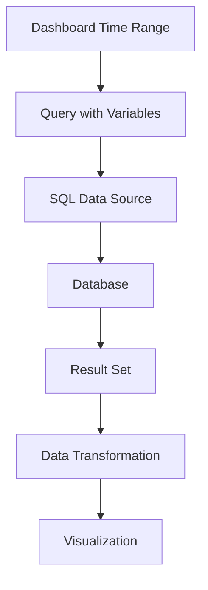

# SQL Queries in Grafana

## Introduction

SQL (Structured Query Language) is a powerful tool for interacting with relational databases. When used with Grafana, SQL queries allow you to extract, manipulate, and visualize data from various database sources like MySQL, PostgreSQL, Microsoft SQL Server, and more. This guide will walk you through the fundamentals of writing SQL queries specifically for use in Grafana dashboards.

Whether you're monitoring application performance, analyzing business metrics, or creating operational dashboards, understanding how to craft effective SQL queries in Grafana is essential for getting the most value from your data.

## SQL Basics for Grafana

### Connecting to a Database

Before writing queries, you need to set up a data source connection in Grafana. Each SQL database type has its own data source plugin in Grafana:

- MySQL
- PostgreSQL
- Microsoft SQL Server
- Oracle
- SQLite
- AWS RDS

Once you've configured your data source, you can start writing SQL queries in Grafana's query editor.

### Query Structure

A basic SQL query in Grafana follows this structure:

```sql
SELECT column1, column2, time_column
FROM table_name
WHERE condition
ORDER BY time_column
```

Key components:

- **SELECT**: Specifies which columns to retrieve
- **FROM**: Indicates which table(s) to query
- **WHERE**: Filters data based on conditions
- **ORDER BY**: Sorts the results (typically by time for time-series visualizations)

## Time Series Queries

Time series visualizations are Grafana's specialty. To create effective time series queries:

### Time Filtering

Grafana provides special macros for time filtering. The most common is the `$__timeFilter` macro:

```sql
SELECT 
  time_column, 
  value_column
FROM metrics_table
WHERE $__timeFilter(time_column)
ORDER BY time_column
```

This automatically restricts the query to the dashboard's selected time range.

### Interval Grouping

For aggregating data over time intervals, use the `$__timeGroup` macro:

```sql
SELECT
  $__timeGroup(time_column, '5m') as time,
  avg(cpu_usage) as avg_cpu
FROM server_metrics
WHERE $__timeFilter(time_column)
GROUP BY 1
ORDER BY 1
```

This groups data into 5-minute buckets, perfect for time series charts.

## Template Variables

Template variables make your dashboards dynamic and interactive. Here's how to use them in SQL queries:

### Creating a Variable

First, define a variable in the dashboard settings. For example, a variable called `server` might be defined with:

```sql
SELECT DISTINCT hostname FROM servers
```

### Using Variables in Queries

Then use it in your queries with syntax like:

```sql
SELECT
  time,
  cpu_usage,
  memory_usage
FROM metrics
WHERE hostname = '$server'
AND $__timeFilter(time)
```

### Multi-Value Variables

For multi-value selections, use the `IN` operator:

```sql
SELECT
  time,
  avg(cpu_usage) as cpu
FROM metrics
WHERE hostname IN ($server)
AND $__timeFilter(time)
GROUP BY time
```

## Advanced SQL Techniques for Grafana

### Subqueries

Subqueries can help with complex data extraction:

```sql
SELECT
  time,
  value
FROM metrics
WHERE server_id IN (
  SELECT id FROM servers WHERE datacenter = 'us-west'
)
AND $__timeFilter(time)
```

### Joins

Joining tables can enrich your visualizations:

```sql
SELECT
  m.time,
  m.value,
  s.name as server_name
FROM metrics m
JOIN servers s ON m.server_id = s.id
WHERE $__timeFilter(m.time)
```

### Window Functions

Window functions are powerful for trend analysis:

```sql
SELECT
  time,
  value,
  avg(value) OVER (ORDER BY time ROWS BETWEEN 6 PRECEDING AND CURRENT ROW) as moving_avg
FROM metrics
WHERE $__timeFilter(time)
```

## Real-World Examples

### Server Performance Dashboard

This query provides data for a server performance dashboard:

```sql
SELECT
  $__timeGroup(time, '1m') as time,
  hostname,
  avg(cpu_usage) as cpu,
  avg(memory_usage) as memory,
  avg(disk_usage) as disk
FROM server_metrics
WHERE hostname IN ($servers)
AND $__timeFilter(time)
GROUP BY time, hostname
ORDER BY time
```

### Application Error Monitoring

Track application errors over time:

```sql
SELECT
  $__timeGroup(created_at, '1h') as time,
  error_type,
  count(*) as error_count
FROM application_errors
WHERE application = '$app'
AND $__timeFilter(created_at)
GROUP BY time, error_type
ORDER BY time
```

### Business Metrics Dashboard

Monitor key business metrics:

```sql
SELECT
  $__timeGroup(order_date, '1d') as date,
  sum(order_total) as revenue,
  count(*) as order_count,
  sum(order_total) / count(*) as average_order_value
FROM orders
WHERE $__timeFilter(order_date)
GROUP BY date
ORDER BY date
```

## Common SQL Functions for Data Visualization

### Aggregation Functions

These are essential for summarizing data:

- `COUNT()`: Counts the number of rows
- `SUM()`: Adds values together
- `AVG()`: Calculates the average
- `MIN()/MAX()`: Finds minimum/maximum values
- `PERCENTILE_CONT()`: Calculates percentiles (syntax varies by database)

### Time Functions

Different databases have different time functions:

**MySQL:**
```sql
DATE_FORMAT(time_column, '%Y-%m-%d') as day
```

**PostgreSQL:**
```sql
to_char(time_column, 'YYYY-MM-DD') as day
```

**SQL Server:**
```sql
FORMAT(time_column, 'yyyy-MM-dd') as day
```

## Optimizing SQL Queries in Grafana

For best performance:

1. **Limit data returned**: Only select columns you need
2. **Use appropriate indexes**: Ensure time columns are indexed
3. **Pre-aggregate data**: Consider materialized views for complex calculations
4. **Use time filtering**: Always include time filters
5. **Test query performance**: Use EXPLAIN to understand query execution

## Query Troubleshooting

Common issues and solutions:

### Query Timeout

If your query times out:
- Reduce the time range
- Add more specific filters
- Use more efficient JOINs
- Consider pre-aggregated tables

### Incorrect Data

If data looks wrong:
- Check your time zones
- Verify aggregation functions
- Inspect raw data with LIMIT
- Ensure proper time filtering

## SQL Query Flow in Grafana



## Summary

SQL queries in Grafana provide a powerful way to extract and visualize data from relational databases. By mastering SQL fundamentals, time-series techniques, and template variables, you can create dynamic and informative dashboards that deliver real value from your data.

To become proficient with SQL in Grafana:
- Start with simple queries and build complexity gradually
- Learn the specific syntax for your database type
- Use Grafana's built-in macros for time filtering
- Leverage template variables for interactive dashboards
- Optimize your queries for performance

## Additional Resources

- [Grafana SQL Data Sources Documentation](https://grafana.com/docs/)
- [SQL Tutorial for Data Analysis](https://mode.com/sql-tutorial/)
- [Database-Specific SQL References](https://dev.mysql.com/doc/refman/8.0/en/sql-statements.html)

## Practice Exercises

1. Create a query that shows hourly averages of a metric over the past 24 hours
2. Write a query using template variables to filter by multiple dimensions
3. Develop a query that uses a moving average window function
4. Create a query that joins metrics data with metadata from another table
5. Build a query that compares current metrics with the same period last week