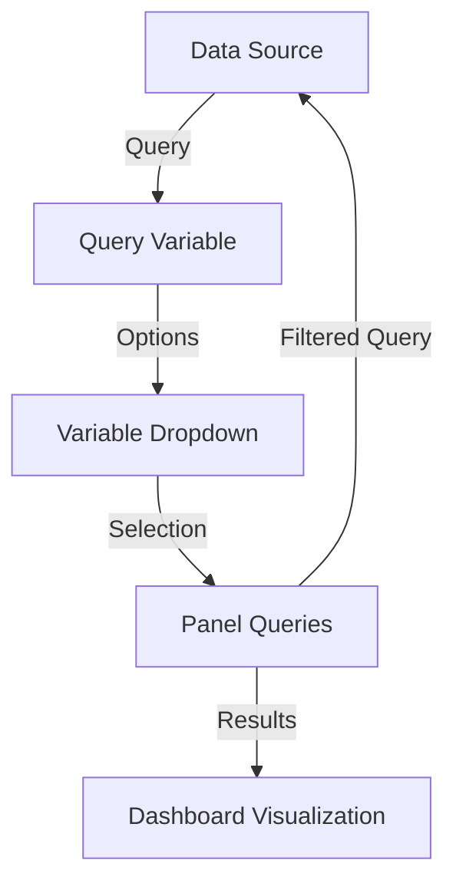

# Query Variables

## Introduction

Query variables are one of the most powerful features in Grafana's dashboarding system. They allow you to create dynamic dashboards where users can filter and manipulate the displayed data without editing the underlying queries. Query variables retrieve their options from a data source query, making them particularly useful for values that change frequently or are too numerous to list manually.

In this guide, you'll learn how to create and implement query variables in your Grafana dashboards, enabling you to build more interactive and flexible visualizations.

## What Are Query Variables?

Query variables are special variables in Grafana that:

- Derive their values directly from a data source
- Update automatically when the underlying data changes
- Can be used to filter data in dashboard panels
- Allow users to select from a dropdown of dynamically generated options

Unlike constant or custom variables, query variables pull their possible values directly from your data sources, making them ideal for attributes like server names, sensor IDs, or application instances that may change over time.

## Creating a Query Variable

Let's walk through the process of creating a query variable:

1. Navigate to the dashboard where you want to add the variable
2. Click the gear icon in the top right to open dashboard settings
3. Select "Variables" from the left sidebar
4. Click "Add variable"
5. Configure the variable with the following settings:

```
Name: server
Label: Server
Type: Query
Data source: your_data_source_name
Refresh: On Dashboard Load
Query: YOUR_QUERY_HERE
```

### Example Queries for Different Data Sources

#### Prometheus Example

For a Prometheus data source, to get all available instance names:

```
label_values(node_cpu_seconds_total, instance)
```

This query will return all unique values of the "instance" label from the "node_cpu_seconds_total" metric.

#### MySQL Example

For a MySQL data source, to get all table names in a database:

```sql
SHOW TABLES
```

#### InfluxDB Example

For an InfluxDB data source, to get all available "host" tag values:

```
SHOW TAG VALUES FROM "cpu" WITH KEY = "host"
```

## Using Query Variables in Dashboard Panels

Once you've created a query variable, you can use it in your panel queries to filter data dynamically.

### Using Variables in Prometheus Queries

If you've created a variable called `server`, you can use it in a Prometheus query like this:

```
node_cpu_seconds_total{instance="$server"}
```

The `$server` will be replaced with the user's selection from the dropdown.

### Using Variables in SQL Queries

For SQL data sources, you might use your variable like this:

```sql
SELECT time, value FROM metrics 
WHERE host = '$server' 
AND time > $__timeFrom() AND time < $__timeTo()
```

## Multi-Value Selection

Query variables support selecting multiple values, which is useful when you want to compare metrics across different servers or entities.

To enable multi-value selection:

1. In the variable configuration, enable "Multi-value" 
2. Optionally, enable "Include All option" to allow selecting all values at once

When using a multi-value variable in queries, you'll often need special syntax:

### Prometheus Multi-Value Example

```
node_cpu_seconds_total{instance=~"${server:regex}"}
```

The `:regex` modifier converts the multiple selections into a regular expression pattern that Prometheus can use.

## Chained Variables

One of the most powerful features of query variables is the ability to chain them together, where the options of one variable depend on the selection of another.

### Example of Chained Variables

1. First variable `datacenter` queries for all available datacenters
2. Second variable `server` uses `$datacenter` in its query to only show servers from the selected datacenter:

```
label_values(node_cpu_seconds_total{datacenter="$datacenter"}, instance)
```

This creates a hierarchical selection where choosing a datacenter filters the available server options.

## Real-World Example: Monitoring Application Performance

Let's walk through a complete example of using query variables to monitor application performance across different environments and services.

### Step 1: Create Environment Variable

Create a query variable called `environment` to list all environments:

```
label_values(application_response_time_seconds, environment)
```

This might return values like: `production`, `staging`, `development`

### Step 2: Create Service Variable (Chained)

Create a second query variable called `service` that's filtered by the selected environment:

```
label_values(application_response_time_seconds{environment="$environment"}, service)
```

This might return values like: `auth-service`, `user-service`, `payment-service`

### Step 3: Create Endpoint Variable (Chained)

Create a third query variable called `endpoint` that's filtered by both environment and service:

```
label_values(application_response_time_seconds{environment="$environment", service="$service"}, endpoint)
```

### Step 4: Use Variables in Dashboard Panels

Now create a graph panel with a query like:

```
application_response_time_seconds{environment="$environment", service="$service", endpoint="$endpoint"}
```

This setup allows users to:
1. Select an environment
2. See only services available in that environment
3. See only endpoints available in the selected service
4. View metrics specific to their selection

## Visualizing Data Flow with Query Variables

Let's visualize how query variables process data:



## Advanced Query Variable Techniques

### Using Regex in Variable Definition

You can use regex to transform the values returned by the query:

```
Query: label_values(node_cpu_seconds_total, instance)
Regex: /(.*):.*/
```

This would extract only the hostname part before the colon from values like `server01:9100`.

### Variable Format Options

When referencing variables in queries, you can use formatting options:

- `${var}` - Default variable interpolation
- `${var:regex}` - Regex-compatible formatting for multi-value variables
- `${var:csv}` - Comma-separated values
- `${var:raw}` - Raw unquoted value
- `${var:json}` - JSON stringified values

### Example with Format Options

For a multi-value server variable with values "server1" and "server2":

```
# Default: {instance="server1"} or {instance="server2"}
instance="$server"

# Regex format: {instance=~"server1|server2"}
instance=~"${server:regex}"

# CSV format: {instance="server1,server2"}
instance="${server:csv}"
```

## Troubleshooting Query Variables

### Common Issues and Solutions

1. **No values returned by query variable**
   - Check data source connectivity
   - Verify query syntax
   - Ensure the query returns at least one row/value

2. **Variable updates too frequently**
   - Adjust the "Refresh" setting to "On Dashboard Load" instead of "On Time Range Change"

3. **Query variable is slow to load**
   - Optimize your query to return fewer results
   - Consider caching results at the data source level

## Summary

Query variables are a fundamental tool for creating dynamic, interactive Grafana dashboards. They allow you to:

- Pull options directly from your data sources
- Create dashboards that adapt to changing infrastructure
- Build hierarchical filtering with chained variables
- Give users the ability to explore data without editing queries

By mastering query variables, you'll be able to create more flexible, reusable dashboards that provide value across different teams and use cases.

## Additional Resources

- Practice creating query variables with different data sources
- Experiment with variable format options for different query types
- Try building a dashboard with chained variables for hierarchical filtering
- Explore template functions like `$__timeFilter()` in combination with variables

## Exercise

Create a dashboard that monitors system metrics with the following query variables:
1. A variable that lists all hosts
2. A variable that lists available CPUs for the selected host
3. A panel that shows CPU usage filtered by these variables

This exercise will help solidify your understanding of how query variables can be used to create flexible monitoring dashboards.