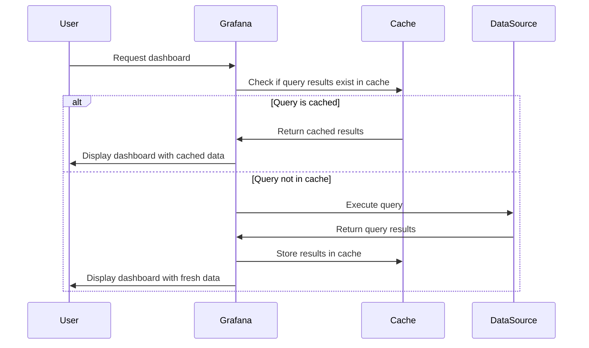

# Query Caching

## Introduction

Query caching is a powerful feature in Grafana that stores the results of database queries temporarily, allowing subsequent identical queries to be served from memory rather than hitting the data source again. This optimization significantly improves dashboard loading times and reduces the load on your underlying databases.

When you have dashboards that are viewed frequently but display data that doesn't change often, query caching provides substantial performance benefits. In this guide, we'll explore how query caching works in Grafana, how to configure it, and best practices for maximizing its benefits.

## Understanding Query Caching

### What is Query Caching?

Query caching is a technique where the results of expensive operations (like database queries) are stored temporarily. When the same query is requested again within a specified time period, Grafana serves the stored result instead of executing the query against the data source.



### Benefits of Query Caching

1. **Improved Dashboard Performance**: Dashboards load faster because queries don't need to be re-executed.
2. **Reduced Database Load**: Your data sources experience less load, which is particularly important for large-scale deployments.
3. **Lower Costs**: For cloud databases that charge by query, caching can significantly reduce costs.
4. **Better User Experience**: Users enjoy more responsive dashboards with consistent loading times.

## Configuring Query Caching in Grafana

Grafana provides several ways to configure query caching, depending on your deployment type and specific needs.

### Enabling Query Caching

#### Server-Side Configuration

Query caching can be enabled in your Grafana configuration file (`grafana.ini`):

```ini
[caching]
enabled = true
```

For Docker deployments, you can use environment variables:

```bash
GF_CACHING_ENABLED=true
```

#### Setting Cache TTL (Time-To-Live)

The default TTL determines how long query results remain valid in the cache:

```ini
[caching]
ttl = 60s  # Cache results for 60 seconds
```

### Per-Data Source Configuration

Query caching can also be configured per data source:

1. Navigate to **Configuration > Data Sources**
2. Select the data source you want to configure
3. Find the **Query Caching** section
4. Enable caching and set the TTL


## Query Caching in Action

Let's look at some examples of how query caching works in practice.

### Example: Dashboard with Time-Series Data

Consider a dashboard that displays CPU usage over time:

```javascript
// Example query (in Prometheus format)
rate(node_cpu_seconds_total{mode="idle"}[1m])
```

When this dashboard is loaded:

1. Grafana checks if this query (with the exact same time range and variables) exists in the cache
2. If found in cache and not expired, Grafana uses the cached result
3. If not in cache, Grafana executes the query against Prometheus and caches the result

### Cache Keys

Grafana generates unique cache keys based on:
- Query string
- Time range
- Template variables
- Data source ID

This ensures that only truly identical queries hit the cache.

### Observing Cache Status

You can verify if a query was served from cache using the query inspector:

1. Click on the panel title
2. Select **Inspect > Query**
3. Look for the **Cache Status** field

## Best Practices for Query Caching

### When to Use Query Caching

Query caching works best for:

- Dashboards that are viewed frequently
- Queries that are computationally expensive
- Data that doesn't change rapidly
- Read-only or monitoring dashboards

### When to Avoid Query Caching

Query caching may not be suitable for:

- Real-time monitoring requiring up-to-the-second data
- Dashboards with rapidly changing data
- Exploratory analysis where users frequently change queries

### Optimizing Cache TTL

Setting an appropriate TTL is crucial for balancing performance with data freshness:

| Data Change Frequency | Recommended TTL |
|-----------------------|-----------------|
| Changes rarely (hours) | 5-60 minutes |
| Changes occasionally (minutes) | 30-300 seconds |
| Changes frequently (seconds) | 5-30 seconds or disable |

## Advanced Configurations

### Memory vs. Redis Backend

Grafana supports different cache backends:

```ini
[caching]
backend = memory  # Default in-memory cache
```

For distributed setups, Redis is recommended:

```ini
[caching]
backend = redis
redis_url = redis://redis:6379/0
```

### Invalidating the Cache

In some cases, you might need to manually invalidate the cache:

```bash
# Using Grafana API
curl -X POST -H "Authorization: Bearer $GRAFANA_API_KEY" https://your-grafana-instance/api/admin/cache/clean
```

## Troubleshooting

### Common Issues

#### Cache Not Working

Check the following:
- Verify caching is enabled in configuration
- Ensure the query is exactly the same (including variables)
- Check if the TTL is appropriate for your use case

#### Excessive Memory Usage

If the in-memory cache is using too much memory:
- Reduce the TTL
- Consider switching to Redis backend
- Limit which data sources use caching

## Summary

Query caching is a powerful feature in Grafana that improves dashboard performance by storing and reusing query results. By properly configuring caching based on your specific needs, you can significantly enhance the user experience while reducing the load on your databases.

When implementing query caching, remember to:
- Match TTL settings to your data's rate of change
- Monitor cache hit rates to ensure effectiveness
- Use appropriate cache backends for your deployment scale

Query caching is just one of several performance optimization techniques available in Grafana. Combined with other best practices, it helps create a responsive and efficient monitoring experience for all users.

## Additional Resources

- [Grafana Official Documentation on Caching](https://grafana.com/docs/grafana/latest/setup-grafana/configure-grafana/#caching)
- [Performance Optimization Techniques in Grafana](https://grafana.com/docs/grafana/latest/administration/performance-optimization/)
- [Redis Cache Configuration](https://grafana.com/docs/grafana/latest/setup-grafana/configure-grafana/#redis-cache)

## Exercises

1. Enable query caching on a local Grafana instance and measure the performance difference.
2. Experiment with different TTL settings for a dashboard and observe the trade-offs.
3. Create a dashboard that displays cache hit rates to monitor cache effectiveness.
4. Compare the performance impact of caching for different types of data sources (SQL vs. time series databases).