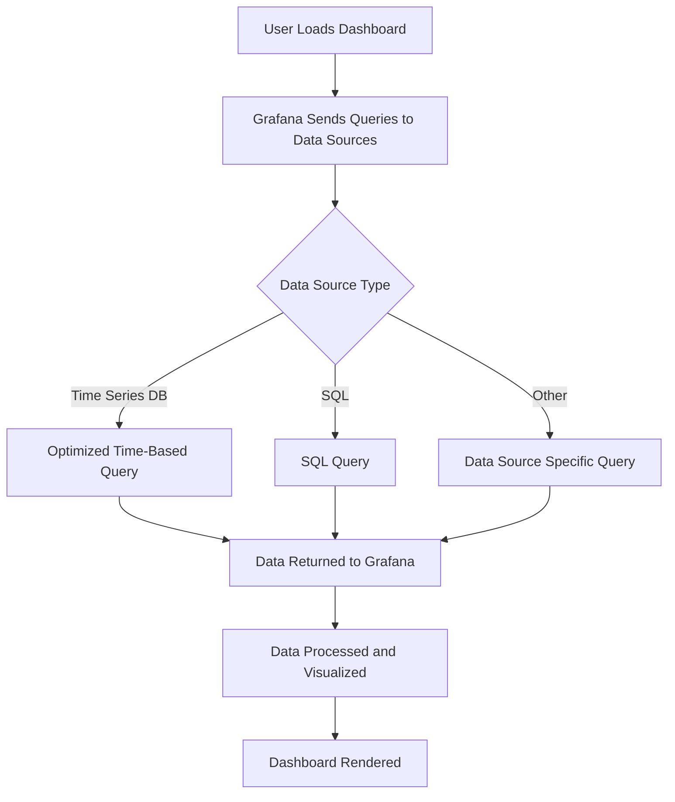

# Query Performance

## Introduction

Understanding query performance is critical when working with Grafana dashboards. As your visualizations pull data from various sources, inefficient queries can lead to slow dashboard loading times, timeouts, and a poor user experience. This guide will help you understand how Grafana handles queries, identify performance bottlenecks, and implement best practices to optimize your dashboard's performance.

## Why Query Performance Matters

When you create a visualization in Grafana, it executes queries against your data sources to retrieve the necessary data. Poor query performance can:

- Slow down dashboard loading and refresh times
- Increase load on your data sources
- Lead to timeouts and failed visualizations
- Create a frustrating user experience
- Potentially increase costs (especially with cloud-based data sources)

## Understanding Query Execution in Grafana

Before we dive into optimization, let's understand how Grafana processes queries:



Key points to understand:

1. **Parallel Execution**: By default, Grafana executes queries in parallel to improve performance.
2. **Data Source Processing**: Each data source has its own query language and optimization requirements.
3. **Time Range Impact**: The selected time range directly affects the amount of data processed.
4. **Panel Refresh**: Each panel refresh triggers new queries to the data sources.

## Identifying Performance Issues

### Query Inspector

Grafana provides a built-in Query Inspector that helps you analyze query performance:

1. Open your dashboard in edit mode
2. Select the panel you want to inspect
3. Click on the panel title and select "Inspect" > "Query"

The Query Inspector shows:

- Query execution time
- Raw query sent to the data source
- Response data
- Query statistics

Example Query Inspector output:

```
Query execution time: 1.25s
Query: SELECT time, value FROM metrics WHERE host='server1' AND time > now() - 24h
Returned rows: 1,440
Data points: 1,440
```

### Browser Developer Tools

You can also use your browser's developer tools to identify network bottlenecks:

1. Open your browser's developer tools (F12 in most browsers)
2. Go to the Network tab
3. Load or refresh your dashboard
4. Look for slow requests, particularly those to your data sources

## Common Performance Bottlenecks

### 1. Time Range Selection

One of the most common causes of slow queries is selecting an overly broad time range:

```javascript
// Inefficient: Querying an entire year of data at 10s resolution
from: "now-1y"
to: "now"
interval: "10s"

// More efficient: Using appropriate resolution for long time ranges
from: "now-1y"
to: "now"
interval: "$__interval" // Let Grafana adjust the interval automatically
```

### 2. Inefficient Queries

Poorly structured queries can severely impact performance:

```sql
-- Inefficient: Using wildcard searches
SELECT * FROM metrics WHERE host LIKE 'web%'

-- More efficient: Using specific field selection and exact matches
SELECT timestamp, cpu_usage FROM metrics WHERE host = 'web-server-01'
```

### 3. Too Many Queries

Each panel executes at least one query. Dashboards with many panels can overwhelm your data sources:

```
// A dashboard with 20 panels refreshing every 10s
20 panels × 6 refreshes/min = 120 queries/minute
```

## Best Practices for Query Optimization

### 1. Use Appropriate Time Intervals

Match your query interval to your visualization needs:

```javascript
// For a 30-day view, using hourly intervals instead of minutes
from: "now-30d"
to: "now"
interval: "1h"
```

### 2. Implement Data Aggregation

Pre-aggregate data when possible:

```sql
-- Instead of raw data points:
SELECT time, value FROM metrics WHERE time > now() - 24h

-- Use aggregation:
SELECT time_bucket('5m', time) as time, avg(value) as value 
FROM metrics 
WHERE time > now() - 24h 
GROUP BY time_bucket('5m', time)
```

### 3. Filter Data Effectively

Apply filters early in your query chain:

```javascript
// Inefficient approach: Filter in Grafana after retrieving all data
query: "SELECT * FROM server_metrics"
// Then apply filter in Grafana UI

// Efficient approach: Filter in the query
query: "SELECT * FROM server_metrics WHERE server_id IN ('srv1', 'srv2', 'srv3')"
```

### 4. Use Query Caching

Many data sources support query caching. In Grafana, you can configure caching at the data source level:

```yaml
# Example Prometheus data source configuration with caching
apiVersion: 1
datasources:
  - name: Prometheus
    type: prometheus
    url: http://prometheus:9090
    jsonData:
      httpMethod: POST
      timeInterval: "5s"
      queryTimeout: "30s"
      exemplarTraceIdDestinations:
        - name: traceID
          datasourceUid: my_jaeger_uid
```

### 5. Implement Template Variables Wisely

Template variables can impact performance, especially with large datasets:

```javascript
// Inefficient: Getting all possible values
// This might return thousands of options
$variable = query_result(SELECT DISTINCT hostname FROM hosts)

// More efficient: Limit the scope
$variable = query_result(SELECT DISTINCT hostname FROM hosts WHERE datacenter = 'us-east' LIMIT 100)
```

## Data Source Specific Optimizations

### Prometheus

```javascript
// Use rate() for counters instead of raw values
rate(http_requests_total{job="api-server"}[5m])

// Avoid using group_left/group_right for large datasets
// Instead, use recording rules for complex queries
```

### InfluxDB

```sql
-- Use the SLIMIT clause to limit the number of series returned
SELECT mean("value") FROM "cpu" WHERE time > now() - 1h GROUP BY time(1m) SLIMIT 10

-- Specify fields explicitly instead of using SELECT *
SELECT "usage_idle" FROM "cpu" WHERE time > now() - 1h
```

### MySQL/PostgreSQL

```sql
-- Ensure your time column is properly indexed
CREATE INDEX idx_time ON metrics(time);

-- Use CTEs for complex queries
WITH hourly_data AS (
  SELECT date_trunc('hour', time) as hour, avg(value) as avg_value
  FROM metrics
  WHERE time > now() - 24h
  GROUP BY date_trunc('hour', time)
)
SELECT hour, avg_value FROM hourly_data
```

## Real-World Example: Optimizing a System Monitoring Dashboard

Let's walk through optimizing a typical system monitoring dashboard:

### Before Optimization

A dashboard with:
- 10 panels showing CPU, memory, disk, and network metrics
- Time range: 7 days
- Refresh rate: 10 seconds
- Raw queries without aggregation

Issues:
- Dashboard loading time: 8-12 seconds
- High data source load
- Occasional timeouts

### After Optimization

1. **Adjusted time intervals**:
   ```javascript
   // Before
   interval: "10s"
   
   // After
   interval: "$__interval" // Automatically adjusts based on time range and panel width
   ```

2. **Implemented data downsampling**:
   ```sql
   -- Before
   SELECT cpu_usage FROM system_metrics WHERE time > now() - 7d
   
   -- After
   SELECT time_bucket('5m', time) as time, avg(cpu_usage) as cpu_usage
   FROM system_metrics 
   WHERE time > now() - 7d
   GROUP BY time_bucket('5m', time)
   ```

3. **Added caching and pre-aggregation**:
   - Set up 1-minute cache for frequently accessed metrics
   - Created continuous aggregates/recording rules for common queries

4. **Optimized refresh rates**:
   - Changed global refresh from 10s to 1m
   - Set more frequent refreshes only for critical panels

Results:
- Dashboard loading time: 1-2 seconds
- Reduced data source load by 75%
- No more timeouts
- Better user experience

## Troubleshooting Query Performance

If you're still experiencing performance issues:

1. **Query Tracing**: Use the Query Inspector to identify slow queries
2. **Data Source Logs**: Check logs from your data sources for errors or warnings
3. **Resource Monitoring**: Monitor CPU and memory usage of your data sources
4. **Connection Pooling**: Ensure proper connection pooling for database data sources
5. **Network Latency**: Check for network issues between Grafana and your data sources

## Summary

Optimizing query performance in Grafana requires:

1. Understanding how Grafana processes queries
2. Identifying performance bottlenecks using tools like Query Inspector
3. Implementing best practices:
   - Use appropriate time intervals
   - Implement data aggregation
   - Filter data effectively
   - Utilize query caching
   - Design template variables wisely
4. Applying data source-specific optimizations
5. Ongoing monitoring and troubleshooting

By following these guidelines, you can create dashboards that load quickly, refresh efficiently, and provide a smooth user experience.

## Exercises

1. Use the Query Inspector to identify the slowest query in one of your dashboards
2. Optimize a query by adding appropriate filtering and aggregation
3. Implement variable-based time intervals using `$__interval`
4. Compare dashboard loading times before and after optimization

## Additional Resources

- [Grafana Query Optimization Documentation](https://grafana.com/docs/grafana/latest/dashboards/build-dashboards/best-practices/)
- [Prometheus Query Optimization](https://prometheus.io/docs/prometheus/latest/querying/basics/)
- [InfluxDB Query Language Optimization](https://docs.influxdata.com/influxdb/cloud/query-data/optimize-queries/)
- [SQL Query Performance Tuning](https://use-the-index-luke.com/)