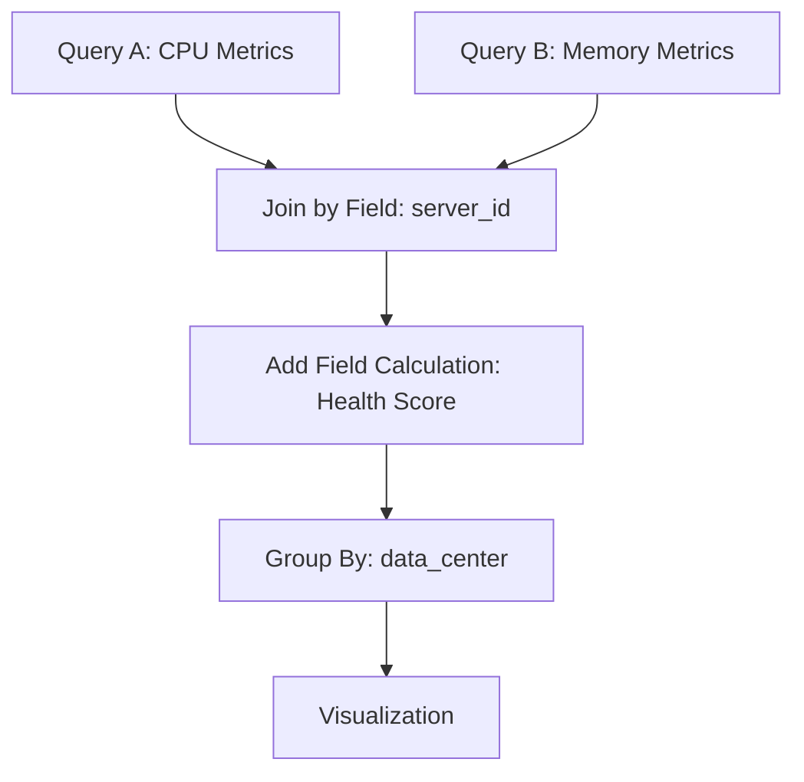

# Query Transformations

## Introduction

Query transformations in Grafana allow you to manipulate, combine, and reshape the data returned by your data source queries before it's visualized. This powerful feature helps you create more insightful dashboards without having to modify the underlying data or write complex queries.

Think of transformations as a post-processing layer that sits between your query results and your visualizations. They enable you to:
- Combine data from multiple queries
- Rename fields for better readability
- Filter out unnecessary data
- Perform calculations across queries
- Restructure data to fit specific visualization requirements

In this guide, we'll explore how to use query transformations effectively in Grafana to enhance your data visualization capabilities.

## Basic Concepts

### What Are Transformations?

Transformations take the raw data returned by your queries and apply various operations to modify it. They're applied in the order they appear in the transformations list, with each transformation receiving the result of the previous one.

### Where to Find Transformations

In Grafana's panel editor, you can find transformations in the Query tab:

1. Edit a panel
2. Navigate to the "Transform" tab (located between "Query" and "Panel" tabs)
3. Click the "Add transformation" button

## Common Transformations

Let's explore some of the most useful transformations available in Grafana.

### Rename Fields

This transformation allows you to change the names of fields in your query results, making them more readable in visualizations.

**Example:**

If your query returns fields with technical names like `cpu.usage.system`, you can rename them to more user-friendly names like "System CPU Usage".

```
Original field name: cpu.usage.system
Transformed field name: System CPU Usage
```

### Filter by Name

This transformation lets you include or exclude fields based on their names using regex patterns.

**Example:**

To show only CPU-related metrics from a query that returns multiple system metrics:

```
Include pattern: ^cpu\..*
```

This will keep only fields that start with "cpu."

### Filter by Value

This transformation allows you to filter data points based on their values.

**Example:**

To only show data points where CPU usage is above 80%:

```
Field: cpu.usage.system
Condition: > 80
```

### Reduce

The reduce transformation allows you to calculate aggregate values (like mean, sum, or max) across your time series data.

**Example:**

```
Input data:
Time     | cpu.usage
-------------------
12:01 PM | 75%
12:02 PM | 82%
12:03 PM | 78%

Applied reduction: mean

Result:
cpu.usage (mean) | 78.33%
```

### Series to Rows

This transformation pivots time series data, converting each series into a row. This is particularly useful when you want to display time series data in a table format.

**Example:**

```
Input data:
Series 1: cpu.usage.system [75%, 82%, 78%]
Series 2: cpu.usage.user [45%, 48%, 50%]

After transformation:
Time     | cpu.usage.system | cpu.usage.user
-----------------------------------------
12:01 PM | 75%              | 45%
12:02 PM | 82%              | 48%
12:03 PM | 78%              | 50%
```

### Group By

Group By allows you to group your data based on field values and calculate aggregates for each group.

**Example:**

```
Input data:
Server  | Status  | Response Time
-----------------------------
server1 | healthy | 50ms
server2 | error   | 500ms
server3 | healthy | 75ms
server4 | error   | 450ms

Group by: Status
Calculate: Mean Response Time

Result:
Status  | Mean Response Time
---------------------------
healthy | 62.5ms
error   | 475ms
```

## Advanced Transformations

### Join by Field

This transformation combines data from multiple queries based on matching field values.

**Example:**

```
Query A results:
Server  | CPU Usage
-------------------
server1 | 75%
server2 | 82%

Query B results:
Server  | Memory Usage
----------------------
server1 | 60%
server2 | 45%

After Join (by Server):
Server  | CPU Usage | Memory Usage
--------------------------------
server1 | 75%       | 60%
server2 | 82%       | 45%
```

### Organize Fields

This transformation allows you to reorder, hide and rename fields in a single operation.

**Example:**

```
Original fields: [timestamp, cpu.user, cpu.system, memory.used, memory.free]

After Organize:
- Renamed: cpu.user → "User CPU", cpu.system → "System CPU"
- Reordered: timestamp, "User CPU", "System CPU", memory.used, memory.free
- Hidden: memory.free
```

### Add Field from Calculation

This transformation creates a new field based on a calculation across existing fields.

**Example:**

```
Original fields:
memory.used = 8GB
memory.total = 16GB

New field (calculation): memory.used / memory.total * 100
Result: "Memory Usage %" = 50%
```

## Real-world Applications

### Example 1: Server Health Dashboard

Let's create a dashboard that shows server health metrics by combining CPU and memory data from different queries.

1. Create two queries:
   - Query A: Fetches CPU metrics for all servers
   - Query B: Fetches memory metrics for all servers

2. Apply "Join by Field" transformation:
   - Join field: server_id
   - This combines CPU and memory data for each server

3. Apply "Add Field from Calculation" transformation:
   - Create a "Health Score" field: (100 - cpu_usage) * 0.5 + (100 - memory_usage_percent) * 0.5
   - This gives us a 0-100 score based on CPU and memory usage

4. Apply "Group By" transformation:
   - Group by: data_center
   - Calculate: mean(Health Score)
   - Now we can see average health by data center



### Example 2: Error Rate Analysis

Let's create a dashboard to analyze error rates across different services:

1. Create a query that fetches request counts and error counts
2. Apply "Add Field from Calculation" transformation:
   - Create "Error Rate" field: errors / requests * 100
3. Apply "Filter by Value" transformation:
   - Show only services with Error Rate > 1%
4. Apply "Sort By" transformation:
   - Sort by Error Rate descending
   - This highlights the most problematic services first

## Common Patterns and Best Practices

1. **Layer transformations** - Start with simple transformations and build complexity gradually
2. **Use debug mode** - Enable the debug mode (available in the transform tab) to see the result of each transformation step
3. **Performance considerations** - Complex transformations on large datasets can affect dashboard performance
4. **Document your transformations** - Add panel descriptions explaining your transformation logic for future reference
5. **Keep raw data panels** - Maintain panels with untransformed data alongside your transformed visualizations

## Troubleshooting

### Common Issues

1. **Transformations not reflecting in visualization**
   - Ensure the visualization type supports your data structure
   - Try using the "Debug" mode to inspect data at each transformation step

2. **Join transformation not working**
   - Verify that the join fields exist in both datasets
   - Check for exact name matches (joins are case-sensitive)

3. **Calculations returning null**
   - Inspect your data for null values that might be affecting calculations
   - Use the "Filter by Name/Value" transformations to remove nulls before calculations

## Summary

Query transformations provide a powerful way to manipulate and enhance your data directly within Grafana without modifying the source data or writing complex queries. They allow you to:

- Combine data from multiple sources
- Create calculated fields
- Restructure data to fit visualization needs
- Filter and focus on relevant metrics

By mastering transformations, you can create more insightful dashboards that better communicate your data's story. Remember that transformations are applied in order, and each transformation works with the result of the previous one, allowing you to build complex data manipulation pipelines.

## Next Steps

Now that you understand query transformations, try:

1. Creating a dashboard that combines metrics from different data sources
2. Building a calculation that derives business KPIs from technical metrics
3. Experimenting with different transformation combinations to see their effects

## Additional Resources

- Grafana Documentation: [Transformations](https://grafana.com/docs/grafana/latest/panels/transformations/)
- Community Showcase: Browse the Grafana community dashboards for examples of transformations in action
- Practice Exercises: Try replicating the real-world examples provided in this guide using your own data