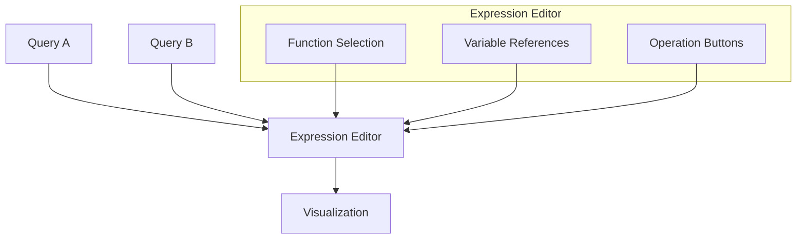

# Query Expressions

## Introduction

Query expressions in Grafana are powerful tools that allow you to manipulate, combine, and transform data directly within the Grafana interface. Rather than relying solely on the raw data provided by your data sources, expressions enable you to perform calculations, create new series, and build complex visualizations by combining data in novel ways.

Think of expressions as a layer between your data source and visualization that lets you reshape your data precisely to your needs. This capability is especially valuable when your data source doesn't provide the exact format or calculations you require for your visualization.

## Understanding Query Expressions

Query expressions in Grafana are built on a mathematical and logical foundation that allows you to:

1. Perform calculations on existing queries
2. Combine multiple queries into new data series
3. Transform time series data
4. Create alerts based on complex conditions
5. Filter and manipulate data without changing the source

### Expression Types

Grafana supports several types of expressions:

#### Math Expressions

Math expressions allow you to perform arithmetic operations on your query results.

```
$A * 2
$A + $B
$A / 100
```

In these examples:
- `$A` and `$B` refer to the results of other queries in your dashboard
- Operations include addition, subtraction, multiplication, and division

#### Reduce Expressions

Reduce expressions take multiple values from a time series and reduce them to a single value.

```
reduce($A, "mean")
reduce($A, "max")
reduce($A, "min")
reduce($A, "sum")
```

#### Resample Expressions

Resample expressions allow you to change the time interval of your data.

```
resample($A, "10s", "mean")
```

This example resamples query A to 10-second intervals using mean values.

#### Classic Conditions

Classic conditions let you create boolean (true/false) results based on comparisons.

```
$A > 80
$A < $B
$A == 0
```

## Getting Started with Query Expressions

Let's walk through how to add and use expressions in Grafana:

### Adding an Expression

1. Navigate to your dashboard and edit the panel you want to work with
2. In the query editor, click the "Add query" button
3. Select "Expression" from the dropdown menu
4. You'll see a new query row with expression options

### Basic Expression Example

Let's imagine you have a query that returns CPU usage as a percentage, and you want to convert it to a decimal value:

1. Create your first query to get CPU usage (call it A)
2. Add an expression query
3. In the expression field, enter: `$A / 100`
4. Your expression will now return the CPU usage as a decimal value

## Practical Examples

### Example 1: Calculating Rate of Change

Suppose you have a counter that continuously increases (like total network bytes). To see the rate of change:

```
($A - timeShift($A, "1m")) / 60
```

This expression:
1. Takes the current value (`$A`)
2. Subtracts the value from 1 minute ago (`timeShift($A, "1m")`)
3. Divides by 60 to get the per-second rate

### Example 2: Combining Multiple Data Sources

If you have server response time from two different services and want to calculate the difference:

```
$A - $B
```

Where:
- `$A` is the query for Service A response time
- `$B` is the query for Service B response time

This gives you a new series showing the difference between services.

### Example 3: Creating a Health Score

You can create a composite "health score" by combining multiple metrics:

```
(clamp_min(100 - $cpu_usage, 0) * 0.4) + (clamp_min(100 - $memory_usage, 0) * 0.3) + (clamp_min(100 - $disk_usage, 0) * 0.3)
```

This expression:
1. Inverts each usage percentage (100 - usage)
2. Applies different weights to each component (40% for CPU, 30% each for memory and disk)
3. Ensures no negative values with `clamp_min()`
4. Combines them into a score from 0-100

## Advanced Query Expressions

As you become more comfortable with basic expressions, you can create more complex calculations:

### Conditional Expressions

You can use conditional logic in your expressions:

```
$A > 80 ? 1 : 0
```

This returns 1 when A is greater than 80, and 0 otherwise.

### Thresholds and Alerts

Expressions are particularly useful for creating alert conditions:

```
reduce_mean($A) > 90
```

This expression returns true when the mean value of query A exceeds 90.

## Common Expression Functions

Here are some frequently used functions in Grafana expressions:

| Function | Description | Example |
|----------|-------------|---------|
| `abs()` | Absolute value | `abs($A)` |
| `log()` | Natural logarithm | `log($A)` |
| `round()` | Round to nearest integer | `round($A)` |
| `ceil()` | Round up | `ceil($A)` |
| `floor()` | Round down | `floor($A)` |
| `min()` | Minimum of two values | `min($A, $B)` |
| `max()` | Maximum of two values | `max($A, $B)` |

## Expression Editor Interface

The expression editor in Grafana provides a dedicated interface for building expressions:



The expression editor includes:
1. A text field for entering expressions
2. Auto-completion for functions and operators
3. Reference buttons for existing queries
4. Quick access to common functions

## Best Practices for Query Expressions

1. **Start Simple**: Begin with basic expressions and gradually build complexity
2. **Name Your Queries**: Use descriptive names instead of A, B, C for better readability
3. **Comment Your Expressions**: For complex expressions, add comments to explain your logic
4. **Break Down Complex Expressions**: Use multiple expression steps for complex calculations
5. **Test Incrementally**: Verify each part of a complex expression works as expected
6. **Consider Performance**: Very complex expressions may impact dashboard performance

## Troubleshooting Expressions

Common issues with expressions include:

### Syntax Errors

If your expression has incorrect syntax, Grafana will display an error. Check for:
- Missing parentheses
- Incorrect function names
- Invalid operators

### Type Errors

Expressions require compatible data types. For example, you can't multiply a string by a number.

### No Data Errors

If your reference query returns no data, your expression will also return no data.

## Summary

Query expressions in Grafana provide a powerful way to transform and combine data directly within the Grafana interface. By mastering expressions, you can:

- Create custom calculations that aren't available in your data sources
- Combine data from different sources
- Transform data to better fit your visualization needs
- Build complex alert conditions

These capabilities make expressions an essential tool for advanced Grafana users, allowing you to move beyond simple data display to create truly insightful and information-rich dashboards.

## Additional Resources

- Practice using expressions with different data sources
- Try to implement a dashboard that uses expressions to create a composite view of system health
- Experiment with different expression types to see which best suits your needs

## Exercise Ideas

1. Create an expression that converts bytes to megabytes (divide by 1,048,576)
2. Build an expression that shows the percentage difference between two queries
3. Create a "severity score" that increases exponentially as a metric approaches a critical threshold
4. Implement an expression that shows whether a system is in compliance with SLAs