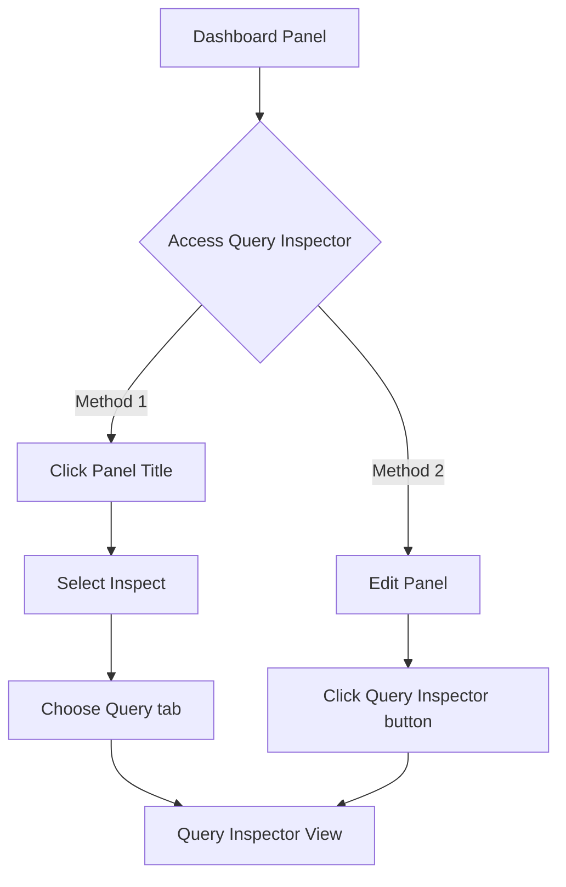

# Query Inspector

## Introduction

The Query Inspector is one of Grafana's most powerful troubleshooting tools. It lets you peek under the hood of your dashboards to examine the exact queries being sent to your data sources, view the raw response data, and analyze query performance metrics. Whether you're debugging problematic panels, optimizing slow dashboards, or simply wanting to understand how Grafana interacts with your data sources, the Query Inspector is your go-to tool.

## What is the Query Inspector?

The Query Inspector is a built-in Grafana tool that allows you to:

- Examine the raw queries sent to your data sources
- View the complete response data returned (before Grafana transforms it)
- Review query performance statistics
- Modify and re-run queries for testing
- Copy queries for external use or sharing

Think of it as a window into the communication between Grafana and your data sources, giving you transparency into this otherwise hidden process.

## Accessing the Query Inspector

There are two ways to access the Query Inspector:

1. **From a panel**: Click on the panel title to open the panel menu, then select "Inspect" → "Query".

2. **From edit mode**: While editing a panel, click the "Query Inspector" button in the query editor toolbar.



## Query Inspector Interface

Once opened, the Query Inspector provides several tabs:

- **Query**: Shows the actual queries being sent to the data source
- **Response**: Displays the raw data returned from the data source
- **Stats**: Shows performance metrics for query execution
- **Query History**: Lists recently run queries (when enabled)

### Understanding the Query Tab

The Query tab shows you the exact query that Grafana sends to your data source. Depending on your data source, this might be:

- SQL for MySQL, PostgreSQL, or SQL Server
- Prometheus query language
- InfluxDB query language
- Elasticsearch query DSL
- And many others

Here's an example of what you might see with a Prometheus data source:

```
{
  "expr": "sum(rate(http_requests_total{job=\"api-server\"}[5m])) by (method, path)",
  "range": true,
  "instant": false,
  "datasource": {
    "type": "prometheus",
    "uid": "abc123"
  },
  "format": "time_series"
}
```

This view is particularly useful when:
- Troubleshooting why a query isn't returning expected data
- Understanding how Grafana translates your visual query builder selections into actual queries
- Sharing query details with colleagues or in support tickets

## Working with the Response Tab

The Response tab shows the raw data returned from your data source before Grafana applies any transformations or visualizations. This can help you:

1. Verify that the data source is returning the expected data
2. Understand the structure of the data Grafana is working with
3. Identify issues with the data that might affect visualization

For example, with a Prometheus data source, you might see:

```json
{
  "status": "success",
  "data": {
    "resultType": "matrix",
    "result": [
      {
        "metric": {
          "method": "GET",
          "path": "/api/users"
        },
        "values": [
          [1629456000, "23.5"],
          [1629456060, "25.1"],
          [1629456120, "24.8"]
        ]
      },
      {
        "metric": {
          "method": "POST",
          "path": "/api/users"
        },
        "values": [
          [1629456000, "3.2"],
          [1629456060, "2.9"],
          [1629456120, "3.5"]
        ]
      }
    ]
  }
}
```

## Analyzing Query Performance with the Stats Tab

The Stats tab provides valuable performance metrics about your queries:

- **Query Time**: How long the query took to execute
- **Request Time**: Total time including network overhead
- **Data Processing Time**: How long Grafana took to process the response
- **Rows**: Number of data points or records returned

This information is crucial for optimizing dashboard performance. A slow dashboard often has queries that:
- Return too much data
- Have inefficient filtering
- Perform complex calculations
- Cover very large time ranges

Example Stats output might look like:

```
Query: Prometheus
Time range: Last 6 hours
Query Time: 1.235s
Request Time: 1.312s
Data Processing Time: 0.077s
Rows: 5,432
```

## Practical Use Cases

### Use Case 1: Debugging Missing Data

If a panel shows "No data" or unexpected results:

1. Open the Query Inspector
2. Check the Query tab to verify the query looks correct
3. Examine the Response tab to see if any data is being returned
4. Look for errors or empty result sets

Common issues you might find:
- Incorrect time range selection
- Filter conditions eliminating all data
- Syntax errors in queries
- Permissions issues with the data source

### Use Case 2: Optimizing Slow Dashboards

For dashboards that load slowly:

1. Open Query Inspector for problematic panels
2. Use the Stats tab to identify slow queries
3. Check how many rows are being returned
4. Look for ways to optimize by:
   - Narrowing time ranges
   - Adding more specific filters
   - Using aggregations to reduce data points
   - Using time buckets appropriate for the selected time range

### Use Case 3: Learning Query Languages

The Query Inspector is an excellent learning tool:

1. Create a panel using the visual query editor
2. Open the Query Inspector to see how your visual selections translate to actual query code
3. Make changes in the visual editor and observe how the query changes
4. Experiment with modifying the raw query in the Query Inspector

## Advanced Techniques

### Modifying and Re-running Queries

The Query Inspector allows you to modify queries and re-run them without changing your panel:

1. Edit the query in the Query tab
2. Click "Run Query" to execute it
3. View the results in the Response tab

This is useful for:
- Testing potential fixes for issues
- Experimenting with query optimizations
- Learning query syntax through trial and error

### Query Exports

You can export queries from the Query Inspector for:
- Sharing with team members
- Documentation purposes
- Using in external tools
- Creating support tickets

Simply click the "Copy to clipboard" button next to the query.

### Comparing Multiple Panels

If you're troubleshooting why two similar panels show different results:

1. Open Query Inspector for the first panel
2. Copy the query and response
3. Repeat for the second panel
4. Compare the queries to identify differences
5. Compare the responses to understand data variations

## Troubleshooting Common Issues with Query Inspector

### Issue: Empty Response

If your Response tab shows an empty result:

1. Check time range selection
2. Verify filter conditions aren't too restrictive
3. Ensure the query syntax is correct
4. Confirm the data source has data for the specified period

### Issue: Error Messages

Common error messages and solutions:

- **Timeout errors**: Your query is too complex or returning too much data. Try narrowing the time range or adding filters.
- **Access denied**: Check permissions for the data source.
- **Syntax errors**: Verify query format is correct for the data source.
- **Data source unavailable**: Check connection settings and data source health.

### Issue: Unexpected Results

If you're getting unexpected data:

1. Examine the raw response to understand what's being returned
2. Check for data transformations applied in the panel settings
3. Verify field mappings if using an unfamiliar data source
4. Look for hidden null values or unexpected data types

## Summary

The Query Inspector is an essential tool in every Grafana user's toolkit. It provides visibility into the query execution process, helps identify and resolve issues, and is invaluable for optimizing dashboard performance.

Key takeaways:
- Use Query Inspector to see exactly what queries are being executed
- Examine raw responses to understand the data structure
- Use performance stats to identify bottlenecks
- Modify and re-run queries to test potential improvements
- Export queries for documentation or sharing

By mastering the Query Inspector, you'll become more proficient at:
- Troubleshooting problematic dashboards
- Optimizing performance
- Understanding how Grafana interacts with your data
- Learning query languages for various data sources

## Additional Resources

- Explore Grafana's [Query Optimization documentation](https://grafana.com/docs/grafana/latest/queries/optimization/)
- Learn about [Grafana Alerting](https://grafana.com/docs/grafana/latest/alerting/) to be notified of issues
- Practice with the [Grafana Play site](https://play.grafana.org)

## Practice Exercises

1. Open a dashboard and use Query Inspector to examine the queries for three different panels. How do they differ?
2. Take a slow-loading panel and use Query Inspector stats to identify performance bottlenecks. Can you optimize it?
3. Use Query Inspector to export a complex query, then try to recreate the same query using the visual editor.
4. Compare the raw response data with what's displayed in a visualization. How is Grafana transforming the data?