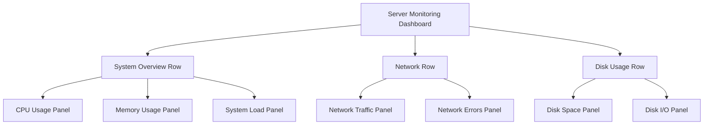

# Dashboard Basics

## Introduction

Dashboards are the heart of Grafana's visualization capabilities. They provide a flexible canvas where you can arrange various panels to display your data in meaningful ways. Whether you're monitoring infrastructure performance, analyzing business metrics, or visualizing IoT sensor data, dashboards help you gain insights at a glance.

In this guide, we'll explore the fundamentals of Grafana dashboards - how to create them, customize them, and use them effectively to visualize your data.

## What is a Grafana Dashboard?

A Grafana dashboard is a collection of panels organized on a grid. Each panel represents a visualization of your data, which can be:

- Time series graphs
- Single statistics
- Tables
- Heatmaps
- Gauges
- And many more visualization types

Dashboards allow you to:

1. View multiple related metrics in a single place
2. Organize visualizations logically
3. Share insights with your team
4. Set up alerts based on your data
5. Create interactive and dynamic views of your information

## Creating Your First Dashboard

Let's walk through the process of creating a basic dashboard in Grafana:

### Step 1: Access the Dashboard Creation Interface

1. Log in to your Grafana instance
2. Click on the "+" icon in the left sidebar
3. Select "Dashboard" from the dropdown menu

You'll be presented with a new, empty dashboard with a prompt to add your first panel.

### Step 2: Add a Panel

1. Click on the "Add panel" button
2. Select "Add a new panel" option

This opens the panel editor, where you'll configure your visualization.

### Step 3: Configure Your Data Source

1. In the panel editor, select your data source from the dropdown menu
2. Write your query to fetch the data you want to visualize

For example, if you're using Prometheus as your data source, your query might look like:

```sql
sum(rate(http_requests_total{job="api-server"}[5m])) by (method)
```

### Step 4: Choose a Visualization

1. On the right side of the panel editor, select the visualization type that best represents your data
2. Common choices include:
   - Time series (for data over time)
   - Stat (for single values)
   - Table (for multiple columns of data)
   - Gauge (for values within a range)

### Step 5: Customize Your Panel

You can customize various aspects of your panel:

1. Under the "Panel options" tab:
   - Set the panel title
   - Add a description
   - Configure links

2. Under the "Field" tab:
   - Set units
   - Configure thresholds
   - Adjust color schemes

3. Under the "Visualization" tab:
   - Adjust visualization-specific settings
   - Modify legends
   - Set axes options

### Step 6: Save Your Panel

1. Click "Apply" in the top-right corner to add the panel to your dashboard
2. Resize and position the panel by dragging its corners or edges

### Step 7: Save Your Dashboard

1. Click the save icon (disk symbol) in the top navigation bar
2. Give your dashboard a meaningful name
3. Add an optional description
4. Click "Save"

## Dashboard Organization

### Rows

Rows help organize panels into logical groups:

1. Click "Add panel" and select "Add a new row"
2. Give your row a title
3. Add panels to this row
4. Rows can be collapsed to save space

### Variables

Variables make your dashboards dynamic and interactive:

```jsx
// Example of creating a dashboard variable in Grafana's UI
// 1. Go to Dashboard Settings > Variables
// 2. Click "New"
// 3. Configure as follows:
// Name: server
// Type: Query
// Data source: Your Prometheus data source
// Query: label_values(node_cpu_seconds_total, instance)
```

You can then use these variables in your queries with syntax like `$server`.

### Time Range Controls

Grafana dashboards include time range controls that allow you to:

1. View data across different time periods
2. Zoom in on specific timeframes
3. Refresh data automatically

## Real-World Example: Server Monitoring Dashboard

Let's create a practical server monitoring dashboard:



### Step 1: Create the Dashboard Structure

1. Create a new dashboard
2. Add three rows: "System Overview", "Network", and "Disk Usage"

### Step 2: Add CPU Usage Panel

1. Add a new panel to the "System Overview" row
2. Select your data source (e.g., Prometheus)
3. Use a query like:

```sql
100 - (avg by(instance) (rate(node_cpu_seconds_total{mode="idle"}[1m])) * 100)
```

4. Choose "Time series" visualization
5. Set the title to "CPU Usage"
6. Set the unit to "Percent (0-100)"
7. Add thresholds:
   - 0-70: green
   - 70-85: orange
   - 85-100: red

### Step 3: Add Memory Usage Panel

1. Add another panel to the "System Overview" row
2. Query:

```sql
100 * (1 - ((node_memory_MemFree_bytes + node_memory_Cached_bytes + node_memory_Buffers_bytes) / node_memory_MemTotal_bytes))
```

3. Choose "Gauge" visualization
4. Set the title to "Memory Usage"
5. Configure similar thresholds as the CPU panel

### Step 4: Add Network Traffic Panel

1. Add a panel to the "Network" row
2. Query for incoming traffic:

```sql
rate(node_network_receive_bytes_total[1m])
```

3. Query for outgoing traffic:

```sql
rate(node_network_transmit_bytes_total[1m])
```

4. Choose "Time series" visualization
5. Set the title to "Network Traffic"
6. Set the unit to "bytes/sec" or "data rate"

### Step 5: Add Disk Space Panel

1. Add a panel to the "Disk Usage" row
2. Query:

```sql
100 - ((node_filesystem_avail_bytes{mountpoint="/"} * 100) / node_filesystem_size_bytes{mountpoint="/"})
```

3. Choose "Stat" visualization
4. Set title to "Disk Usage (/)"
5. Set thresholds:
   - 0-80: green
   - 80-90: orange
   - 90-100: red

### Step 6: Save and Configure Refresh

1. Save your dashboard
2. Set an appropriate auto-refresh interval (e.g., every 1m)
3. Add variables if needed (e.g., for selecting specific servers)

## Dashboard Best Practices

### 1. Use Meaningful Names and Descriptions

- Give your dashboards and panels clear, descriptive names
- Add descriptions to explain what data is being shown

### 2. Organize Related Panels

- Group related metrics in the same row
- Arrange panels in a logical order (e.g., from high-level overview to detailed metrics)

### 3. Consistent Formatting

- Use consistent units across similar metrics
- Apply the same color scheme for related visualizations

### 4. Use Templates and Variables

- Make dashboards dynamic with template variables
- Allow users to filter and explore data based on different dimensions

### 5. Optimize for Viewing Context

- Consider where your dashboard will be viewed (desktop vs. wall display)
- Adjust panel sizes accordingly

### 6. Don't Overcrowd

- Focus on essential metrics
- Create multiple dashboards instead of cramming everything into one

## Sharing and Exporting Dashboards

Grafana offers several ways to share dashboards:

### Dashboard URL

Simply copy the URL of your dashboard to share it with team members who have access to your Grafana instance.

### Snapshot

For sharing with people without Grafana access:

1. Click the share icon in the top navigation
2. Select the "Snapshot" tab
3. Click "Local Snapshot"
4. Copy the generated URL

### Export/Import

To reuse dashboards across different Grafana instances:

1. Click the settings (gear) icon
2. Select "JSON Model"
3. Click "Save to file"

To import:

1. Click the "+" icon in the sidebar
2. Select "Import"
3. Upload your JSON file or paste the dashboard JSON

## Summary

Grafana dashboards provide a powerful way to visualize and monitor your data. In this guide, we've covered:

- Creating your first dashboard
- Adding and configuring panels
- Organizing dashboards with rows and variables
- Building a practical server monitoring dashboard
- Best practices for effective dashboard design
- Methods for sharing and exporting dashboards

With these fundamentals, you're now ready to create informative, insightful dashboards that help you and your team make data-driven decisions.

## Additional Resources

- Try creating a dashboard that tracks application metrics like response times and error rates
- Experiment with different visualization types for the same data
- Explore Grafana's alerting capabilities based on your dashboard metrics
- Learn about Grafana's annotation feature to mark important events on your time series graphs

For more advanced techniques, check out the next section in our Grafana Learning Path: "Advanced Dashboard Techniques."