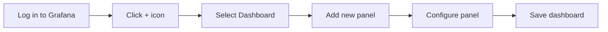

# Creating Dashboards

## Introduction

Dashboards are at the heart of Grafana's functionality. They provide a visual representation of your metrics and monitoring data, allowing you to spot trends, anomalies, and important information at a glance. In this guide, we'll walk through the process of creating effective dashboards in Grafana, from basic setup to advanced customization techniques.

A well-designed dashboard serves as a single pane of glass for observing the health and performance of your systems. Whether you're monitoring infrastructure, applications, or business metrics, understanding how to create informative dashboards is an essential skill for any monitoring professional.

## Dashboard Basics

### Creating Your First Dashboard

To create a new dashboard in Grafana:

1. Log in to your Grafana instance
2. Click on the "+" icon in the side menu
3. Select "Dashboard"
4. Click "Add new panel" to start adding visualizations



### Dashboard Structure

A Grafana dashboard consists of several key components:

- **Panels**: Individual visualization units (graphs, stats, tables, etc.)
- **Rows**: Organizational elements that group panels together
- **Variables**: Dynamic elements that allow dashboard interactivity
- **Annotations**: Event markers that provide context to your metrics
- **Links**: Quick access to related dashboards or external resources

## Adding and Configuring Panels

Panels are the building blocks of your dashboard. Each panel represents a specific visualization of your data.

### Panel Types

Grafana offers various panel types for different visualization needs:

- **Time Series**: For displaying time-based metrics
- **Gauge**: For showing single value metrics with thresholds
- **Stat**: For displaying big numbers and sparklines
- **Bar Chart**: For comparing categories of data
- **Table**: For showing detailed data in rows and columns
- **Pie Chart**: For showing proportional data
- **Heatmap**: For visualizing data density across two dimensions

### Adding a Panel

Here's how to add a basic time series panel:

1. Click "Add panel" on your dashboard
2. Select "Add new panel"
3. Choose a data source (e.g., Prometheus, InfluxDB)
4. Write your query in the query editor

For example, with Prometheus as your data source, your query might look like:

```
rate(http_requests_total{job="api-server"}[5m])
```

### Panel Configuration

Each panel has several configuration options:

#### Query Options

Configure your data source queries to retrieve the metrics you want to visualize.

```javascript
// Example of a query configuration in JSON format
{
  "datasource": "Prometheus",
  "targets": [
    {
      "expr": "sum(rate(http_requests_total[5m])) by (status_code)",
      "legendFormat": "{{status_code}}",
      "refId": "A"
    }
  ]
}
```

#### Visualization Settings

Customize how your data is displayed:

- **Display**: Set the visualization type (line, bar, points)
- **Field**: Configure field options, units, decimals
- **Thresholds**: Define warning and critical levels
- **Legend**: Customize legend appearance and placement

#### Panel Options

Set general panel properties:

- **Title**: Give your panel a descriptive name
- **Description**: Add helpful context for users
- **Transparent background**: Toggle for cleaner integration
- **Repeat options**: Duplicate panels based on variables

## Organizing Your Dashboard

A well-organized dashboard improves readability and user experience.

### Using Rows

Rows help group related panels together:

1. Click "Add panel" 
2. Select "Add row"
3. Drag panels into the row
4. Collapse/expand rows to focus on specific sections

### Dashboard Variables

Variables make your dashboards dynamic and interactive:

```
// Example variable definition
Name: environment
Label: Environment
Type: Query
Query: label_values(node_exporter_up, env)
```

You can reference variables in your queries using the syntax:

```
http_requests_total{environment="$environment"}
```

Common variable types include:

- **Query**: Values from your data source
- **Custom**: User-defined values
- **Interval**: Time ranges
- **Text box**: Free-form input
- **Constant**: Hidden values for reuse

## Advanced Dashboard Techniques

### Dashboard Time Range Controls

Grafana allows users to select different time ranges for the entire dashboard:

- Use the time picker in the upper right corner
- Create custom time ranges
- Set auto-refresh intervals

To reference the dashboard time range in queries:

```
rate(http_requests_total[$__interval])
```

### Annotations

Annotations mark important events on your time series visualizations:

1. Navigate to Dashboard settings > Annotations
2. Click "New annotation query"
3. Configure a query that returns event data

For example, with Prometheus:

```
changes(kube_deployment_status_replicas_updated{deployment="api-server"}[5m])
```

### Dashboard Links

Add links to related resources:

1. Go to Dashboard settings > Links
2. Click "Add dashboard link" or "Add link"
3. Configure the destination and tooltip

### Sharing and Exporting

Share your dashboards with others:

- Use the "Share dashboard" button to generate links
- Export to JSON for version control
- Create dashboard snapshots for point-in-time sharing

```javascript
// Example dashboard JSON structure (simplified)
{
  "annotations": { ... },
  "editable": true,
  "panels": [ ... ],
  "refresh": "5s",
  "schemaVersion": 30,
  "style": "dark",
  "tags": ["production", "services"],
  "templating": { ... },
  "time": {
    "from": "now-6h",
    "to": "now"
  },
  "timepicker": { ... },
  "timezone": "browser",
  "title": "Service Overview",
  "uid": "abc123",
  "version": 1
}
```

## Best Practices for Dashboard Design

### Information Hierarchy

- Place most critical metrics at the top
- Group related metrics together
- Use consistent visualization types for similar data

### Visual Clarity

- Don't overcrowd your dashboard
- Use appropriate panel sizes
- Choose colors strategically (avoid using too many)
- Set meaningful thresholds

### Performance Considerations

- Limit the number of panels per dashboard
- Use efficient queries
- Consider template variable impact on query load
- Use appropriate time intervals

## Real-World Dashboard Examples

### System Monitoring Dashboard

A typical system monitoring dashboard might include:

- CPU usage time series
- Memory consumption gauge
- Disk I/O operations
- Network traffic graphs
- System load averages

```javascript
// Example query for system CPU usage
{
  "targets": [
    {
      "expr": "100 - (avg by (instance) (irate(node_cpu_seconds_total{mode=\"idle\"}[5m])) * 100)",
      "legendFormat": "CPU usage - {{instance}}",
      "refId": "A"
    }
  ]
}
```

### Application Performance Dashboard

An application dashboard could include:

- Request rate by endpoint
- Error percentage
- Response time percentiles
- Active users
- Business metrics correlation

### Infrastructure Overview Dashboard

A high-level infrastructure dashboard might show:

- Service health status
- Cluster resource utilization
- Node status
- Alert overview
- Key performance indicators

## Practical Exercise: Creating a Web Service Dashboard

Let's build a practical dashboard for monitoring a web service:

1. Create a new dashboard
2. Add a "Status Overview" stat panel showing service uptime
3. Add a "Request Rate" time series panel
4. Add a "Response Time" graph panel with 95th percentile
5. Add an "Error Rate" panel with appropriate thresholds
6. Create a variable for service instance selection
7. Organize panels into logical rows
8. Add annotations for deployments

## Summary

In this guide, we've covered the essentials of creating effective dashboards in Grafana. We've learned how to:

- Create and structure dashboards
- Add and configure different panel types
- Use organizational tools like rows and variables
- Implement advanced features like annotations and links
- Apply best practices for dashboard design

Mastering dashboard creation allows you to build informative, interactive visualizations that help you understand your systems better and respond more quickly to issues.

## Additional Resources

- Explore the [Grafana Panel Library](https://grafana.com/grafana/dashboards) for inspiration
- Practice by importing and customizing existing dashboards
- Join the Grafana community to share and discover dashboard templates

## Next Steps

Try creating different types of dashboards for various use cases:

- System monitoring
- Application performance
- Business metrics
- User experience tracking

Remember that effective dashboards evolve over time. Regularly review and refine your dashboards based on team feedback and changing monitoring requirements.