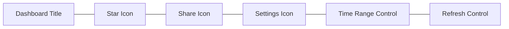

# Dashboard Navigation

## Introduction

Dashboard navigation is a fundamental aspect of working with Grafana that allows users to interact with and customize their dashboard views. After creating dashboards with various panels and visualizations, effective navigation becomes essential for extracting insights from your data. This guide covers the core navigation features of Grafana dashboards, helping you to filter, refine, and explore your data efficiently.

## Understanding the Dashboard Header

The dashboard header contains essential navigation controls that help you interact with your dashboard.

### Dashboard Title and Controls

At the top of every dashboard, you'll find:

- **Dashboard Title**: Displays the name of the current dashboard
- **Star Icon**: Allows you to mark dashboards as favorites
- **Share Icon**: Provides options to share the dashboard via link, snapshot, or export
- **Settings Icon**: Gives access to dashboard settings and metadata
- **Time Range Control**: Lets you modify the time period for which data is displayed

Here's how a typical dashboard header is structured:



## Time Range Navigation

One of the most important navigation elements in Grafana is the time range control.

### Using Time Range Controls

The time range selector allows you to specify the period for which data is displayed across all panels in your dashboard.

#### Basic Time Range Selection

1. Click on the time range selector in the upper right corner of the dashboard
2. Choose from preset time ranges (Last 5 minutes, Last 1 hour, Last 24 hours, etc.)
3. Or select "Custom time range" to specify exact start and end times

```jsx
// Example of how time range settings affect your dashboard panels
// The following shows how to programmatically set a time range in a Grafana URL
const grafanaUrl = "http://your-grafana-server/d/dashboard-id/dashboard-name";
const from = "now-6h";  // 6 hours ago
const to = "now";       // current time

const urlWithTimeRange = `${grafanaUrl}?from=${from}&to=${to}`;
```

### Time Zone Selection

You can change the time zone used to display your time series data:

1. Click the time range selector
2. Look for the time zone dropdown
3. Choose between browser time, UTC, or other time zones

### Auto-Refresh Controls

To keep your dashboard data current:

1. Click the refresh icon next to the time range
2. Select a refresh interval (5s, 10s, 30s, 1m, etc.)
3. Or choose "Off" to disable auto-refresh

## Dashboard Variables and Templating

Variables allow you to create dynamic dashboards that can be adjusted without editing the dashboard itself.

### Using Dashboard Variables

Variables appear as dropdown selectors at the top of your dashboard, allowing you to:

- Filter data by specific dimensions (servers, applications, environments)
- Compare different data sets
- Focus on specific time periods or metrics

### Interacting with Variables

To use existing variables:

1. Locate the variable dropdowns at the top of the dashboard
2. Click a variable to see available options
3. Select one or multiple values (if multi-select is enabled)
4. Watch as all panels update to reflect your selection

```jsx
// Example of how variables work in Grafana dashboard URLs
// The following shows a URL with a 'server' variable set to 'prod-01'
const dashboardUrl = "http://your-grafana-server/d/dashboard-id/dashboard-name";
const variableValue = "prod-01";

const urlWithVariable = `${dashboardUrl}?var-server=${variableValue}`;
```

### Common Variable Types

- **Query variables**: Populate options from a data source query
- **Custom variables**: Use predefined values set by the dashboard creator
- **Text box variables**: Allow free-form text input
- **Constant variables**: Fixed values that can be referenced in queries

## Panel Navigation

Individual panels have their own navigation options that let you explore the specific visualization in more detail.

### Panel Headers and Controls

Each panel has a header with several controls:

- **Panel Title**: Shows the name of the visualization
- **Time Shift**: Some panels allow shifting the time frame relative to the dashboard time
- **Panel Menu**: Contains options like edit, inspect, and more

### Panel Context Menu

Right-clicking (or clicking the three dots menu) on a panel reveals additional options:

1. **View**: Enter full-screen mode
2. **Edit**: Open the panel editor
3. **Share**: Get a direct link to this specific panel
4. **Explore**: Switch to Explore mode for ad-hoc querying
5. **Inspect**: Examine the data, query, and panel JSON

```jsx
// Example of how to link directly to a panel
const dashboardUrl = "http://your-grafana-server/d/dashboard-id/dashboard-name";
const panelId = "12";  // The panel's ID in the dashboard

const urlToPanel = `${dashboardUrl}?viewPanel=${panelId}`;
```

## Dashboard Annotations

Annotations allow you to mark points in time with rich contextual information.

### Viewing Annotations

Annotations appear as vertical lines or markers on graph panels:

1. Hover over an annotation marker to see a tooltip with details
2. Click on an annotation marker to see full information and any associated tags

### Creating Manual Annotations

To add a manual annotation:

1. Ctrl+Click (or Cmd+Click on Mac) on a graph panel at the desired time point
2. Enter a description in the annotation creation form
3. Add tags if desired
4. Click Save to add the annotation

```jsx
// Example annotation query in Grafana
{
  "annotations": {
    "list": [
      {
        "builtIn": 1,
        "datasource": "-- Grafana --",
        "enable": true,
        "hide": true,
        "iconColor": "rgba(0, 211, 255, 1)",
        "name": "Deployments",
        "target": {
          "limit": 100,
          "matchAny": false,
          "tags": ["deployment"],
          "type": "dashboard"
        },
        "type": "dashboard"
      }
    ]
  }
}
```

## Dashboard Links

Dashboard links allow you to connect related dashboards for easier navigation.

### Using Dashboard Links

Dashboard links appear either:
- At the top of the dashboard as buttons
- In a dropdown menu accessible from the dashboard header

Click on these links to quickly navigate to related dashboards without having to go back to the dashboard list.

### Dynamic Dashboard Links

Dashboard links can include variables, allowing for context preservation between dashboards:

```jsx
// Example of a dashboard link with variable
const sourceDashboard = "system-overview";
const targetDashboard = "server-details";
const variableToPass = "${server:raw}";  // Pass the current server variable

const linkURL = `/d/${targetDashboard}?var-server=${variableToPass}`;
```

## Keyboard Shortcuts

Grafana supports various keyboard shortcuts to enhance navigation efficiency:

- **d + h** - Go to Home dashboard
- **d + r** - Refresh dashboard
- **d + s** - Open dashboard settings
- **d + v** - Toggle template variables
- **Escape** - Exit panel edit/view mode

## Practical Example: Navigating a Server Monitoring Dashboard

Let's walk through a practical example of using dashboard navigation features with a server monitoring dashboard.

1. **Initial View**: You open a server monitoring dashboard showing high-level metrics for all servers
2. **Variable Selection**: You select "prod-web-01" from the server variable dropdown
3. **Time Range Adjustment**: You change the time range to "Last 12 hours" to analyze overnight patterns
4. **Drill Down**: You notice a CPU spike and click on the CPU panel to expand it
5. **Annotation Review**: You see a deployment annotation that coincides with the spike
6. **Dashboard Link**: You use a dashboard link to navigate to a detailed dashboard for that specific server
7. **Time Sync**: The detailed dashboard opens with the same time range, showing you focused metrics

## Summary

Effective dashboard navigation in Grafana allows you to:

- Control the time range and refresh rate of your visualizations
- Use variables to create dynamic, flexible dashboards
- Interact with panels for detailed analysis
- Use annotations to mark significant events
- Navigate between related dashboards seamlessly

By mastering these navigation features, you can extract more value from your Grafana dashboards and more efficiently troubleshoot issues or explore data trends.

## Further Learning

To deepen your understanding of Grafana dashboard navigation:

- Practice creating and using dashboard variables
- Experiment with different time range selections
- Try creating and using annotations in your dashboards
- Explore keyboard shortcuts to speed up your workflow

## Exercises

1. Create a dashboard with a variable that filters data by environment (prod, dev, test)
2. Add annotations to mark deployment events in your time series data
3. Create links between two related dashboards that preserve selected variables
4. Practice using keyboard shortcuts for common navigation tasks
5. Set up a dashboard with different auto-refresh intervals and observe the effects