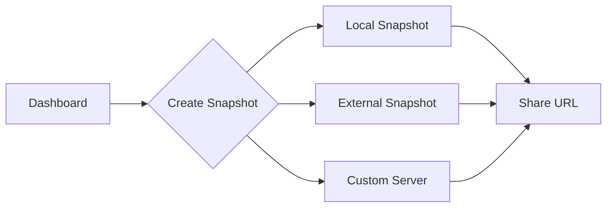
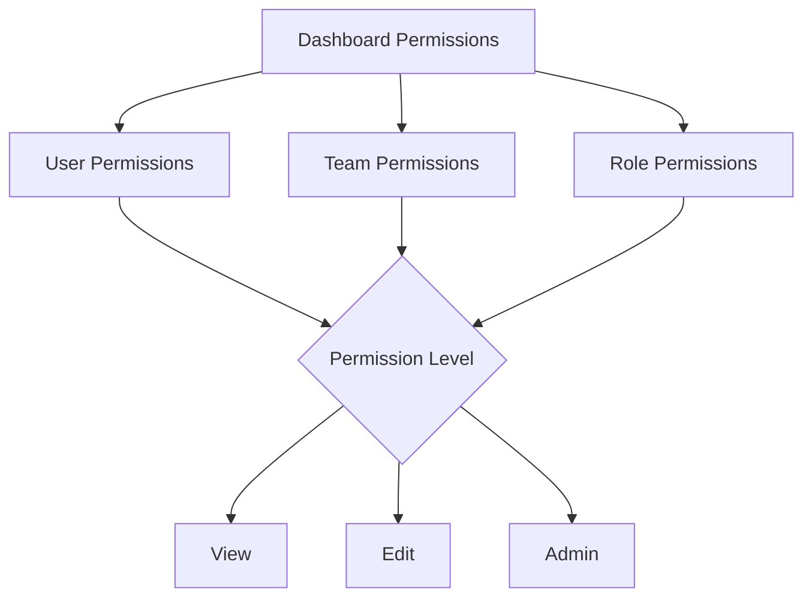

# Dashboard Sharing

## Introduction

Sharing dashboards is a fundamental aspect of Grafana that enables collaboration among team members and provides visibility to stakeholders. In this guide, you'll learn various methods of sharing Grafana dashboards, managing permissions, and implementing best practices for effective dashboard distribution.

Grafana offers several ways to share dashboards:
- Direct URL sharing
- Dashboard snapshots
- Exporting and importing dashboards
- Dashboard embedding
- Grafana dashboard permissions

By the end of this tutorial, you'll be equipped with the knowledge to implement these sharing methods and understand when to use each approach.

## Dashboard URL Sharing

The simplest way to share a dashboard is by copying and sharing its URL.

### How to Share Dashboard URLs

1. Navigate to the dashboard you want to share
2. Click on the share icon in the top navigation bar
3. Under the "Link" tab, you'll see the dashboard URL

```
https://your-grafana-instance.com/d/AbCdEf123/your-dashboard-name
```

### URL Parameters

You can customize the shared dashboard view by adding URL parameters:

| Parameter | Description | Example |
|-----------|-------------|---------|
| `from` & `to` | Time range | `?from=now-6h&to=now` |
| `var-name` | Template variable | `?var-datacenter=east-us-1` |
| `refresh` | Auto-refresh interval | `?refresh=30s` |

Example URL with parameters:

```
https://your-grafana-instance.com/d/AbCdEf123/your-dashboard-name?from=now-24h&to=now&var-server=production&refresh=1m
```

**Note:** Users will need appropriate permissions to access the dashboard via the URL.

## Dashboard Snapshots

Snapshots allow you to create a point-in-time, publicly accessible version of your dashboard that doesn't require authentication.

### Creating a Snapshot

1. Navigate to the dashboard you want to share
2. Click on the share icon in the top navigation bar
3. Select the "Snapshot" tab
4. Choose snapshot expiration time (if applicable)
5. Click "Create Snapshot"

### Snapshot Options

- **Local Snapshots:** Stored in your Grafana instance
- **External Snapshots:** Stored on snapshot.raintank.io (public Grafana snapshot server)
- **Custom Snapshot Server:** Configure your own snapshot server in Grafana settings



### Security Considerations

- Snapshots contain only the **rendered metrics**, not the queries
- No authentication is needed to view snapshots
- Sensitive information in dashboard titles and legends will be visible
- Consider setting appropriate expiration times

## Exporting and Importing Dashboards

Sharing dashboards through JSON export/import is ideal for version control and dashboard migration.

### Exporting a Dashboard

1. Navigate to the dashboard
2. Click on the share icon
3. Select "Export" from the dashboard settings
4. Choose whether to export for sharing externally or with the current variables

```json
{
  "annotations": { ... },
  "editable": true,
  "gnetId": null,
  "graphTooltip": 0,
  "id": 123,
  "iteration": 1622624446150,
  "panels": [ ... ],
  "schemaVersion": 30,
  "style": "dark",
  "tags": ["production", "metrics"],
  "templating": { ... },
  "time": { ... },
  "timepicker": { ... },
  "timezone": "browser",
  "title": "My Dashboard",
  "uid": "AbCdEf123",
  "version": 1
}
```

### Importing a Dashboard

1. Click the "+" icon in the side menu
2. Select "Import"
3. Either upload a dashboard JSON file, paste JSON text, or import via Grafana.com ID
4. Map data sources if prompted
5. Click "Import"

### Dashboard JSON Customization

When sharing a dashboard JSON for import, you may want to:

- Remove the `id` field (Grafana will assign a new one)
- Keep the `uid` if you want to preserve the dashboard URL
- Consider generalizing data source names
- Include instructions for required template variables

## Dashboard Embedding

Embed Grafana dashboards in external applications or web pages.

### Using iframe Embedding

1. Navigate to the dashboard you want to embed
2. Click on the share icon
3. Select the "Embed" tab
4. Copy the provided HTML snippet

```html
<iframe src="https://your-grafana-instance.com/d-solo/AbCdEf123/your-dashboard?panelId=1&orgId=1&theme=light" 
  width="450" height="200" frameborder="0"></iframe>
```

### Embedding Options

- **d-solo**: Embeds a single panel
- **d**: Embeds the entire dashboard
- **theme**: Choose between `light` or `dark` themes
- **kiosk**: Add `&kiosk` to hide the Grafana header

### Authentication for Embedded Dashboards

For embedding dashboards that require authentication, consider:

1. **Anonymous access**: Enable anonymous access with viewer permissions
2. **API Tokens**: Use API tokens for authentication
3. **Render API**: Use Grafana's render API with authentication

## Dashboard Permissions

Control who can view and edit your shared dashboards.

### Understanding Permission Levels

Grafana offers these permission levels for dashboards:

- **View**: Can only view the dashboard
- **Edit**: Can edit and save the dashboard
- **Admin**: Can edit and manage dashboard permissions

### Setting Dashboard Permissions

1. Navigate to the dashboard
2. Click the settings icon (gear)
3. Select "Permissions"
4. Click "Add Permission"
5. Select a user, team, or role and assign appropriate permissions



### Folder Permissions

Dashboards inherit permissions from their folders. To set folder permissions:

1. Navigate to Dashboards → Manage
2. Find your folder and click on it
3. Select "Permissions" from the settings
4. Add permissions as needed

## Dashboard Sharing Best Practices

Follow these best practices for effective dashboard sharing:

### 1. Use Meaningful Names and Descriptions

```json
{
  "title": "API Service Performance - Production",
  "description": "Monitors response times, error rates, and throughput for the API service in production environment",
  "tags": ["api", "production", "performance"]
}
```

### 2. Document Template Variables

Include notes about required template variables:

```markdown
**Required Variables:**
- `datasource`: Select your Prometheus data source
- `environment`: Deployment environment (production, staging, etc.)
- `service`: Service name to monitor
```

### 3. Create Shareable Defaults

Set sensible default values for time ranges and template variables.

### 4. Version Your Dashboards

When sharing JSON exports, consider including version information:

```json
{
  "title": "Service Overview v1.2",
  "tags": ["version-1.2", "production-ready"],
  "description": "Version 1.2 - Added error budget panels and SLO indicators"
}
```

### 5. Consider Dashboard Playlists

For displaying multiple dashboards in rotation:

1. Navigate to Dashboards → Playlists
2. Create a new playlist
3. Add your dashboards
4. Share the playlist URL

## Advanced Sharing Features

### Grafana Public Dashboards (Enterprise)

Grafana Enterprise offers a Public Dashboards feature that allows creating unauthenticated versions of dashboards:

1. Navigate to the dashboard
2. Click on "Dashboard settings"
3. Select "Public dashboards"
4. Configure the public access options
5. Enable and share the public URL

### Dashboard Provisioning

For automated dashboard sharing and management:

1. Create dashboard JSON files
2. Define a provisioning configuration file:

```yaml
apiVersion: 1

providers:
  - name: 'default'
    orgId: 1
    folder: 'Production Dashboards'
    type: file
    disableDeletion: false
    updateIntervalSeconds: 30
    options:
      path: /var/lib/grafana/dashboards
```

3. Place in Grafana's provisioning directory
4. Restart Grafana service

## Summary

Dashboard sharing in Grafana offers multiple approaches to fit different use cases:

- **URL sharing**: Quick sharing with authenticated users
- **Snapshots**: Point-in-time, public dashboard views
- **Export/Import**: Version control and dashboard migration
- **Embedding**: Integration with external applications
- **Permissions**: Granular access control

By leveraging these methods appropriately, you can ensure that the right people have access to your Grafana dashboards while maintaining security and data integrity.

## Exercises

1. Create a dashboard and share it with team members using three different methods.
2. Create a snapshot of a dashboard and set it to expire after one day.
3. Export a dashboard to JSON, modify the title and description, and import it as a new dashboard.
4. Set up different permission levels for a dashboard and test access with different users.
5. Create an embedded view of a single panel from your dashboard.

## Additional Resources

- [Grafana Official Documentation on Sharing](https://grafana.com/docs/grafana/latest/dashboards/share-dashboard/)
- [Dashboard Permissions Documentation](https://grafana.com/docs/grafana/latest/permissions/dashboard-permissions/)
- [Dashboard JSON Model Reference](https://grafana.com/docs/grafana/latest/dashboards/build-dashboards/dashboard-json/)
- [Grafana Provisioning Documentation](https://grafana.com/docs/grafana/latest/administration/provisioning/)