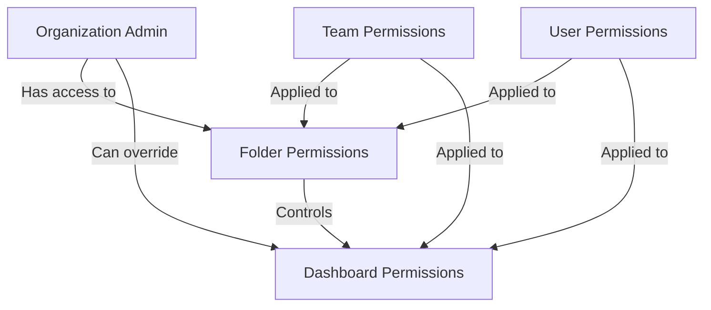

# Dashboard Permissions

## Introduction

Dashboard permissions in Grafana allow you to control who can view, edit, and administer your dashboards. Understanding how permissions work is crucial for maintaining a secure monitoring environment, especially in organizations with multiple teams and users. This guide will walk you through the permission system in Grafana dashboards, how to configure it, and best practices for implementation.

## Permission Levels in Grafana

Grafana offers a hierarchical permission system that applies at multiple levels:



### Basic Permission Roles

Grafana provides several permission levels for dashboards:

1. **Admin**: Can edit and create dashboards, modify dashboard permissions
2. **Edit**: Can edit dashboards but cannot modify permissions
3. **View**: Can only view dashboards
4. **No Access**: Cannot access the dashboard at all

## Configuring Dashboard Permissions

To configure permissions for a dashboard:

1. Navigate to the dashboard you want to modify
2. Click the gear icon (⚙️) in the top right to access dashboard settings
3. Select the "Permissions" tab
4. You'll see the current permissions applied to the dashboard

### Adding Permissions

To add a new permission rule:

```
Dashboard Settings → Permissions → Add Permission
```

From here, you can:

- Select a user, team, or role
- Assign a permission level (View, Edit, Admin)
- Save the new permission

Here's an example of how the permission settings UI looks:

```
User/Team/Role | Permission
---------------|------------
Viewer (default role) | View
Editor (default role) | Edit
user@example.com | Admin
DevOps Team | Edit
```

## Permission Inheritance

Dashboards can inherit permissions from their parent folders. This creates a convenient way to manage permissions for groups of related dashboards.

### How Inheritance Works

1. When you create a dashboard in a folder, it inherits all permissions from that folder
2. Specific dashboard permissions override folder permissions
3. Organization admin permissions override both dashboard and folder permissions

## Code Example: API Access to Permissions

You can also manage permissions programmatically using Grafana's API:

```javascript
// Example: Setting dashboard permissions via API
const dashboardId = 42;
const newPermissions = {
  items: [
    {
      role: 'Viewer',
      permission: 1 // 1=View, 2=Edit, 4=Admin
    },
    {
      teamId: 3,
      permission: 2
    },
    {
      userId: 15,
      permission: 4
    }
  ]
};

// API request
fetch(`/api/dashboards/id/${dashboardId}/permissions`, {
  method: 'POST',
  headers: {
    'Content-Type': 'application/json',
  },
  body: JSON.stringify(newPermissions)
})
.then(response => response.json())
.then(data => console.log('Permissions updated:', data))
.catch(error => console.error('Error updating permissions:', error));
```

## Real-World Application Example

Let's walk through a practical example of setting up dashboard permissions for a typical organization:

### Scenario: Multi-Team Monitoring Environment

Imagine you're setting up Grafana for an organization with the following teams:
- DevOps team (needs full access to system dashboards)
- Development team (needs edit access to application dashboards)
- Business analysts (need view access to business metrics dashboards)
- Executives (need view access to high-level KPI dashboards)

### Implementation Approach

1. **Create folder structure**:
   - `/System Dashboards` - for infrastructure monitoring
   - `/Application Dashboards` - for application performance
   - `/Business Dashboards` - for business metrics
   - `/Executive Dashboards` - for high-level KPIs

2. **Set folder permissions**:
   - `/System Dashboards`: DevOps team (Admin), Dev team (View)
   - `/Application Dashboards`: DevOps team (Admin), Dev team (Edit)
   - `/Business Dashboards`: DevOps team (Admin), Analysts (Edit), Executives (View)
   - `/Executive Dashboards`: DevOps team (Admin), Executives (View)

3. **Dashboard inheritance**: Most dashboards will inherit permissions from their folders

4. **Special cases**: For sensitive dashboards, override folder permissions with dashboard-specific rules

## Best Practices for Dashboard Permissions

1. **Use folders to organize dashboards** by team, application, or purpose
2. **Manage permissions at the folder level** when possible to reduce administrative overhead
3. **Follow the principle of least privilege** - grant only the permissions users need
4. **Regularly audit permissions** to ensure they remain appropriate
5. **Use teams rather than individual user permissions** when possible for easier management
6. **Document your permission structure** so others understand the organization

## Troubleshooting Permission Issues

If users report they cannot access or edit dashboards as expected:

1. **Check user role**: Ensure the user has the correct organization role
2. **Check team membership**: Verify the user belongs to teams with appropriate permissions
3. **Review folder permissions**: Examine folder-level permissions
4. **Review dashboard permissions**: Look for dashboard-specific permission overrides
5. **Check for conflicts**: Dashboard-specific permissions override folder permissions

## Summary

Dashboard permissions in Grafana provide a flexible way to control access to your monitoring data. By understanding permission levels, inheritance, and best practices, you can create a secure environment where users have access to exactly what they need.

The key points to remember are:
- Permissions can be set at organization, folder, and dashboard levels
- Inheritance flows from folders to dashboards
- Specific permissions override inherited permissions
- Using a logical folder structure simplifies permission management

## Additional Resources

- Practice setting up a folder structure with appropriate permissions for different teams
- Try using the API to programmatically manage permissions for a large set of dashboards
- Experiment with different permission models to find what works best for your organization

## Exercise: Permission Planning

Design a permission structure for a Grafana instance that meets these requirements:
1. System administrators need full access to all dashboards
2. Database team needs edit access to database-related dashboards only
3. Frontend team needs edit access to frontend monitoring dashboards only
4. All developers need view access to all dashboards
5. Management needs view access to summary dashboards only

Think about how you would organize folders and permissions to meet these requirements while minimizing administrative overhead.