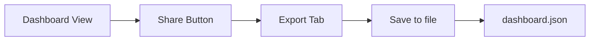
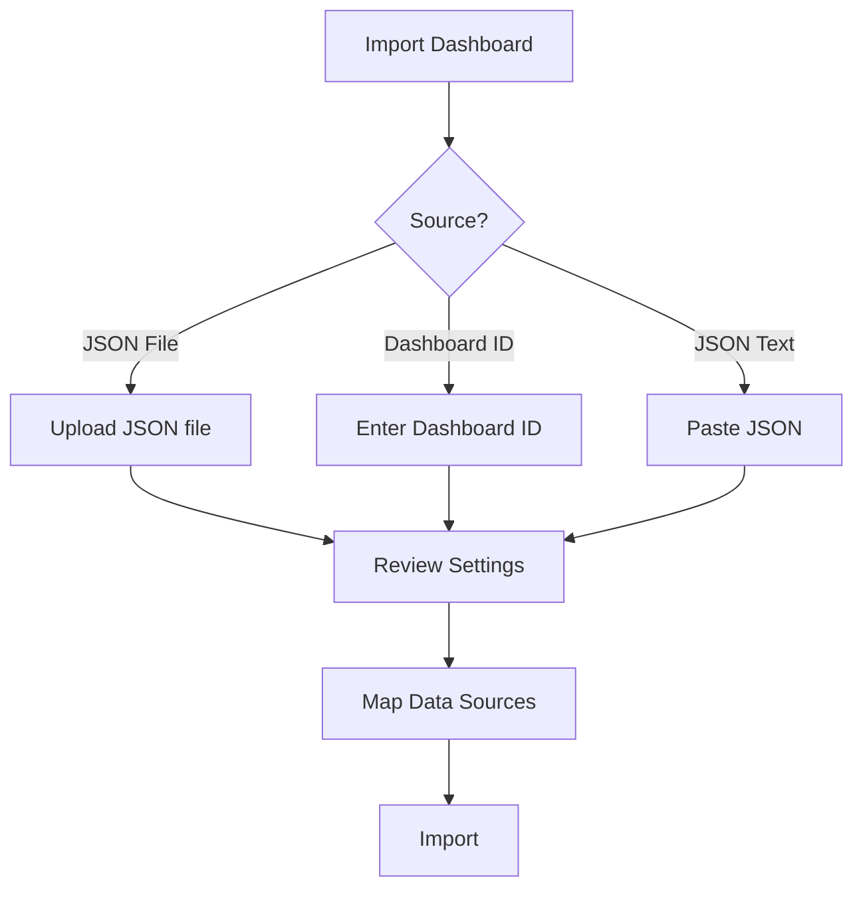

# Dashboard Import/Export

## Introduction

One of the most powerful features of Grafana is the ability to share and reuse dashboards across different Grafana instances. The Dashboard Import/Export functionality allows you to save your carefully crafted dashboards as JSON files, share them with the community, or move them between different Grafana environments. This is particularly useful for:

- Backing up your dashboards
- Sharing dashboards with teammates
- Moving dashboards between development, staging, and production environments
- Contributing to or benefiting from the Grafana community dashboard library

In this guide, we'll explore how to export your existing dashboards and import dashboards from various sources.

## Exporting Dashboards

### Basic Dashboard Export

Exporting a dashboard in Grafana is straightforward:

1. Navigate to the dashboard you want to export
2. Click on the "Share" icon in the top navigation bar
3. Select the "Export" tab
4. Click "Save to file"

This will download a JSON file containing all the dashboard configurations, panels, and queries.

Here's what the export button looks like in the Grafana interface:



### Examining the Exported JSON

Let's take a look at a simplified example of what an exported dashboard JSON file might contain:

```json
{
  "annotations": {
    "list": [
      {
        "builtIn": 1,
        "datasource": "-- Grafana --",
        "enable": true,
        "hide": true,
        "iconColor": "rgba(0, 211, 255, 1)",
        "name": "Annotations & Alerts",
        "type": "dashboard"
      }
    ]
  },
  "editable": true,
  "gnetId": null,
  "graphTooltip": 0,
  "id": 1,
  "links": [],
  "panels": [
    {
      "datasource": "Prometheus",
      "gridPos": {
        "h": 8,
        "w": 12,
        "x": 0,
        "y": 0
      },
      "id": 2,
      "options": {},
      "targets": [
        {
          "expr": "up",
          "refId": "A"
        }
      ],
      "title": "System Uptime",
      "type": "stat"
    }
  ],
  "refresh": "5s",
  "schemaVersion": 22,
  "style": "dark",
  "tags": ["monitoring", "example"],
  "templating": {
    "list": []
  },
  "time": {
    "from": "now-6h",
    "to": "now"
  },
  "timepicker": {},
  "timezone": "",
  "title": "Example Dashboard",
  "uid": "abcdefghi",
  "version": 1
}
```

Key components in the exported JSON:

- **annotations**: Marks specific points on your graphs
- **panels**: The individual visualizations in your dashboard
- **templating**: Variables used to make the dashboard dynamic
- **time**: Default time range for the dashboard
- **title**: Dashboard name
- **uid**: Unique identifier for the dashboard

### Export for Sharing

When exporting for sharing with others, you can choose to:

1. Click "Export for sharing externally" instead of "Save to file"
2. This option will remove sensitive data like datasource specific configurations

## Importing Dashboards

Grafana offers multiple ways to import dashboards.

### Import from File

To import a dashboard from a JSON file:

1. Navigate to Dashboards > Import in the side menu
2. Click "Upload JSON file"
3. Select your dashboard JSON file
4. Review the dashboard settings
5. Click "Import"

### Import from grafana.com

Grafana has a community dashboard repository at [grafana.com/dashboards](https://grafana.com/dashboards) with thousands of pre-built dashboards:

1. Browse to a dashboard you want on grafana.com
2. Copy the dashboard ID (a numeric value)
3. In your Grafana instance, go to Dashboards > Import
4. Paste the ID in the "Import via grafana.com" field
5. Click "Load"
6. Configure any required datasources
7. Click "Import"

Here's a visualization of the import process:



### Import via JSON Text

You can also paste a dashboard JSON directly:

1. Go to Dashboards > Import
2. Select the "Import via panel json" tab
3. Paste your JSON content
4. Click "Load"
5. Configure settings and datasources
6. Click "Import"

### CLI Import/Export

For automated workflows, you can use the Grafana API with tools like `curl`:

**Export a dashboard:**

```bash
curl -H "Authorization: Bearer YOUR_API_KEY" \
     http://your-grafana-instance/api/dashboards/uid/YOUR_DASHBOARD_UID \
     > dashboard.json
```

**Import a dashboard:**

```bash
curl -X POST \
     -H "Content-Type: application/json" \
     -H "Authorization: Bearer YOUR_API_KEY" \
     -d @dashboard.json \
     http://your-grafana-instance/api/dashboards/db
```

## Handling Dashboard Variables and Data Sources

When importing dashboards, you'll often need to map data sources from the original dashboard to your own Grafana instance:

1. During import, Grafana will detect data source references
2. You'll be prompted to select which of your data sources to use
3. Select the appropriate data source for each required field

For example, if the original dashboard used a Prometheus data source named "Production Metrics", you'll need to select your equivalent Prometheus data source.

## Versioning and Dashboard History

Grafana keeps a history of dashboard changes:

1. Go to the dashboard settings (gear icon)
2. Select "Versions" tab
3. Here you can see previous versions, compare them, and restore if needed

This is a valuable feature when working with imported dashboards that you might need to customize.

## Real-World Example: Monitoring System Performance

Let's walk through a common workflow:

1. You need to monitor your system's performance
2. Search for "Node Exporter" on grafana.com
3. Find the popular "Node Exporter Full" dashboard (ID: 1860)
4. Import it using the dashboard ID
5. Map your Prometheus data source
6. Customize as needed for your environment

This saves you hours of creating complex dashboards from scratch.

## Practical Tips

### Sharing with Variables

When sharing dashboards that use template variables:

1. Consider setting default values for variables
2. Document any required data source queries
3. Include a README panel explaining how to use the dashboard

### Dashboard Provisioning

For DevOps workflows, you can automate dashboard deployment using Grafana's provisioning feature:

1. Place your dashboard JSON files in the provisioning directory
2. Configure the `provisioning/dashboards/` path in Grafana
3. Restart Grafana or trigger a provisioning reload

Example provisioning config (`dashboard.yaml`):

```yaml
apiVersion: 1

providers:
  - name: 'default'
    orgId: 1
    folder: 'Production'
    type: file
    disableDeletion: false
    updateIntervalSeconds: 10
    options:
      path: /var/lib/grafana/dashboards
```

### Exporting for Different Grafana Versions

When exporting dashboards to be used in different Grafana versions:

1. Be aware that newer features might not work in older versions
2. Test the dashboard in the target Grafana version
3. Consider maintaining separate versions for major Grafana releases

## Summary

Dashboard import/export is a fundamental skill for any Grafana user. It allows you to:

- Save time by reusing existing dashboards
- Share your work with the community
- Implement consistent monitoring across different environments
- Back up your visualization configurations

By mastering these techniques, you'll be able to leverage the collective knowledge of the Grafana community and efficiently manage your dashboards across different instances.

## Further Learning

To deepen your understanding of Grafana dashboard management:

- Experiment with importing dashboards from the Grafana community
- Try exporting and modifying existing dashboards
- Learn about dashboard provisioning for automated deployment
- Explore the Dashboard JSON model to understand how dashboards are structured

## Exercises

1. Export one of your existing dashboards and examine the JSON structure
2. Import a dashboard from grafana.com related to a technology you use
3. Modify an imported dashboard to match your specific monitoring needs
4. Create a simple script to automate dashboard backup using the Grafana API
5. Set up dashboard provisioning in a test environment