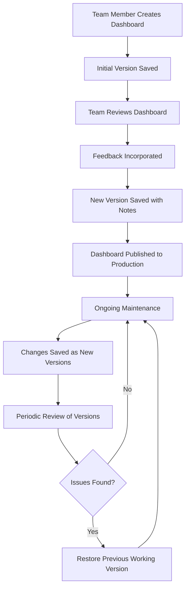

# Dashboard Versioning

## Introduction

Dashboard versioning is a powerful feature in Grafana that allows you to track changes made to dashboards over time. Similar to how version control systems like Git help developers track code changes, Grafana's dashboard versioning helps monitor teams maintain a history of dashboard modifications, compare versions, and restore previous states when needed. This capability is essential for collaborative environments where multiple users modify dashboards and when maintaining critical monitoring setups.

## Why Version Control for Dashboards?

Version control for dashboards provides several benefits:

- **Change Tracking**: Keep a record of who changed what and when
- **Rollback Capability**: Easily revert to previous versions if new changes cause issues 
- **Audit Trail**: Maintain compliance and accountability by documenting all modifications
- **Collaboration**: Enable multiple team members to work on dashboards safely
- **Experimentation**: Test new visualizations or panel arrangements without fear of losing working setups

## How Dashboard Versioning Works in Grafana

Grafana automatically creates a new version each time a dashboard is saved. These versions are stored in Grafana's database with metadata including:

- Version number
- Timestamp of the change
- User who made the change
- Optional change message (similar to a commit message in Git)

Let's explore how to leverage these features in your monitoring workflows.

## Viewing Dashboard Version History

To access a dashboard's version history:

1. Open the dashboard you want to inspect
2. Click the dashboard settings icon (gear) in the top right
3. Select "Versions" from the sidebar menu

You'll see a list of all saved versions of the dashboard, like this:

```
Version | Updated At           | Updated By | Message
--------|----------------------|------------|------------------
3       | 2023-05-10 14:22:45  | admin      | Added CPU usage panel
2       | 2023-05-09 11:15:30  | dev-user   | Fixed threshold values
1       | 2023-05-08 09:42:10  | admin      | Initial dashboard creation
```

## Adding Descriptive Change Messages

When saving a dashboard, it's good practice to include a meaningful message explaining what changed. This helps team members understand the purpose of each version.

When you click "Save" on a dashboard, Grafana displays a modal dialog:

```
Save dashboard

Dashboard name: [ System Overview ]

[x] Add a note to describe your changes
[ Message: Added memory utilization panel and updated alert thresholds ]

[ Save ]  [ Cancel ]
```

Including descriptive messages like "Fixed CPU panel query" or "Added database metrics" makes the version history much more useful.

## Comparing Dashboard Versions

One of the most powerful features of dashboard versioning is the ability to compare different versions to see exactly what changed.

To compare versions:

1. Go to the Versions page in dashboard settings
2. Select two versions to compare using the checkboxes
3. Click "Compare versions"

Grafana will show a diff view highlighting additions, deletions, and modifications between the two versions:

```
Comparing Version 3 to Version 2:

+ Added panel "CPU Usage" to row "System Metrics"
- Removed panel "Network Traffic" from row "Network"
~ Modified query in panel "Memory Usage"
~ Changed alert threshold in panel "Disk Space" from 85% to 90%
```

This makes it easy to understand what changed between versions without having to manually inspect each panel.

## Restoring Previous Versions

If you encounter issues with a dashboard after changes, you can easily restore a previous version:

1. Navigate to the Versions page
2. Find the version you want to restore
3. Click "Restore" next to that version

Grafana will create a new version that's identical to the restored version, rather than overwriting the current version. This maintains the full history of changes.

## Working with Dashboard Version JSON

Advanced users can work directly with the JSON representation of dashboard versions. Each dashboard in Grafana is ultimately stored as a JSON document.

To view or export the JSON of a specific version:

1. Go to the Versions page
2. Click on a specific version
3. Click "View JSON" or "Copy JSON to clipboard"

This can be useful for:
- Manual comparison of complex changes
- Backing up versions outside of Grafana
- Transferring dashboard configurations between Grafana instances

Here's a simplified example of what dashboard JSON looks like:

```json
{
  "id": null,
  "uid": "cLV5GDCkz",
  "title": "System Overview",
  "tags": ["system", "monitoring"],
  "timezone": "browser",
  "schemaVersion": 16,
  "version": 3,
  "refresh": "5s",
  "panels": [
    {
      "id": 1,
      "title": "CPU Usage",
      "type": "graph",
      "datasource": "Prometheus",
      "targets": [
        {
          "expr": "system_cpu_usage",
          "refId": "A"
        }
      ]
    },
    // More panels here...
  ],
  // More dashboard properties...
}
```

## Best Practices for Dashboard Versioning

To make the most of Grafana's versioning capabilities:

1. **Use meaningful save messages**: Always include a descriptive note about what changed
2. **Save iterations separately**: Don't make too many changes in a single save; create logical versions
3. **Tag significant versions**: Use Grafana's tagging feature to mark important milestones
4. **Review version history periodically**: Clean up unnecessary versions in non-critical dashboards
5. **Document major changes outside Grafana**: For significant dashboard redesigns, consider documenting the rationale in a separate system

## Automated Versioning with Grafana API

For advanced use cases, you can interact with dashboard versions programmatically using the Grafana API.

Here's an example of how to retrieve a list of versions for a specific dashboard using `curl`:

```bash
curl -H "Authorization: Bearer YOUR_API_KEY" \
     -X GET \
     http://your-grafana-instance/api/dashboards/uid/YOUR_DASHBOARD_UID/versions
```

The response will contain version information:

```json
[
  {
    "id": 3,
    "dashboardId": 42,
    "parentVersion": 2,
    "restoredFrom": 0,
    "version": 3,
    "created": "2023-05-10T14:22:45Z",
    "createdBy": "admin",
    "message": "Added CPU usage panel"
  },
  // More versions...
]
```

You can also restore versions via API, which is useful for automated workflows:

```bash
curl -H "Authorization: Bearer YOUR_API_KEY" \
     -X POST \
     -H "Content-Type: application/json" \
     -d '{"version": 2}' \
     http://your-grafana-instance/api/dashboards/uid/YOUR_DASHBOARD_UID/restore
```

## Dashboard Versioning in Team Workflows

In a team environment, dashboard versioning becomes even more important. Here's a typical workflow:



This workflow ensures that team members can safely collaborate on dashboards while maintaining the ability to recover from problems.

## Dashboard Snapshots vs. Versions

It's important to understand the difference between dashboard versions and snapshots:

- **Versions**: Track changes to the dashboard structure, panels, and queries
- **Snapshots**: Capture the dashboard along with its data at a specific point in time

While versions help with structure changes, snapshots can be useful for capturing the actual monitoring data shown at a specific time, such as during an incident.

## Limitations of Dashboard Versioning

While powerful, Grafana's versioning system has some limitations to be aware of:

1. **Storage Consumption**: Many versions can consume significant database space
2. **No Branching**: Unlike Git, you can't create branches for experimental changes
3. **No Conflict Resolution**: Limited tools for resolving conflicting changes by different users
4. **Version Pruning**: Limited built-in tools for cleaning up old versions

For very complex scenarios, some teams supplement Grafana's versioning with external version control by exporting dashboard JSON files to Git repositories.

## Dashboard Version Management for Different Grafana Environments

Many organizations maintain multiple Grafana environments (development, testing, production). Version control becomes essential for promoting dashboards between these environments.

A typical promotion workflow might look like:

1. Develop and test dashboard changes in development environment
2. Export the dashboard JSON when ready
3. Import to testing environment and validate
4. Export from testing and import to production
5. Each environment maintains its own version history

This approach ensures that only tested and approved dashboards reach production environments.

## Summary

Dashboard versioning in Grafana provides a robust way to track changes, collaborate on dashboards, and maintain quality in your monitoring system. By understanding how to use version history, compare changes, and restore previous versions, you can develop dashboards with confidence and maintain an audit trail of all modifications.

The versioning system is particularly valuable in team settings where multiple people contribute to dashboard development and when managing mission-critical monitoring dashboards where any change needs to be carefully tracked.

## Additional Resources

- Experiment with creating multiple versions of a dashboard and practice restoring previous versions
- Try comparing versions to see exactly what changed between saves
- Set up a workflow that uses version messages consistently across your team
- Explore the Grafana API for programmatic access to versions