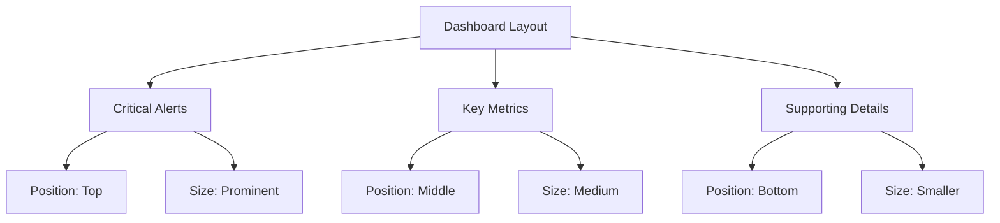

# Dashboard Best Practices

## Introduction

Creating effective dashboards is both an art and a science. While Grafana provides powerful tools to build visualizations, following established best practices ensures your dashboards remain useful, maintainable, and accessible to all users. This guide covers essential principles for designing dashboards that communicate data clearly, load efficiently, and provide actionable insights.

## Core Dashboard Design Principles

### 1. Purpose-Driven Design

Every dashboard should have a clear purpose that answers the question: "What problem does this dashboard solve?"

**Good practices:**
- Define a specific audience and their needs
- Focus on answering specific questions
- Include only relevant metrics for the dashboard's purpose

**Example purpose statements:**
- "To monitor application performance and quickly identify bottlenecks"
- "To track user engagement metrics across different product features"
- "To provide executive-level overview of business KPIs"

### 2. Visual Hierarchy

Structure information in order of importance to guide viewers' attention.

**Good practices:**
- Place critical metrics and alerts at the top left (where eyes naturally start)
- Group related panels together
- Use consistent sizing for panels of similar importance
- Use larger panels for more important information



### 3. Consistent Naming Conventions

Establish and follow naming conventions for dashboards, panels, and variables.

**Good practices:**
- Use descriptive, specific names
- Follow a consistent pattern (e.g., "[Service]-[Metrics Type]")
- Include ownership information

**Example:**
```
[Environment]-[Application]-[Component]-[Metrics Type]
```

Such as:
- "Prod-UserAPI-Performance"
- "Dev-PaymentService-Errors"

## Technical Best Practices

### 1. Query Optimization

Efficient queries improve dashboard performance and reduce load on your data sources.

**Good practices:**
- Limit time ranges when possible
- Use template variables to filter data
- Avoid overly complex queries that process unnecessary data

**Before optimization:**
```sql
SELECT * FROM "http_requests" WHERE time > now() - 24h
```

**After optimization:**
```sql
SELECT mean("response_time") FROM "http_requests" 
WHERE "status_code" != 200 AND time > now() - 24h 
GROUP BY time(5m), "endpoint"
```

### 2. Template Variables

Use template variables to make dashboards flexible and reusable.

**Good practices:**
- Create variables for common filters (environment, service, time range)
- Set appropriate default values
- Use dependent variables when applicable

**Example variable setup:**
```
Variable name: environment
Label: Environment
Type: Query
Data source: Prometheus
Query: label_values(node_exporter_up, env)
Sort: Alphabetical (asc)
```

Then use in queries:
```
sum(rate(http_requests_total{env="$environment"}[5m])) by (service)
```

### 3. Careful Use of Auto-Refresh

Balance between real-time data and performance.

**Good practices:**
- Set reasonable refresh rates based on data volatility
- Use longer refresh intervals for historical dashboards
- Consider disabling auto-refresh for complex dashboards

**Recommended settings:**
- Operational dashboards: 30s - 1m
- Business dashboards: 5m - 15m
- Historical analysis: Manual refresh or very infrequent

## Visual Design Best Practices

### 1. Consistent Color Usage

Colors should convey meaning and support interpretation, not distract.

**Good practices:**
- Use consistent colors for the same metrics across panels
- Follow color-blindness accessibility guidelines
- Use red for critical issues, yellow for warnings, green for "good" status

**Example color scheme:**
- Success/Normal: #7EB26D (green)
- Warning/Degraded: #EAB839 (yellow)
- Error/Critical: #E24D42 (red)
- Informational: #6ED0E0 (blue)

### 2. Appropriate Visualizations

Choose visualization types that best represent your data.

**Good practices:**
- Time series for trends over time
- Gauges for values against thresholds
- Tables for detailed comparisons or exact values
- Stat panels for current values of important metrics

**Visualization selection guide:**

| Data Type | Recommended Visualization |
|-----------|---------------------------|
| Trends over time | Time series graph |
| Single value vs threshold | Gauge or Stat panel |
| Categorical comparison | Bar chart |
| Part-to-whole relationship | Pie chart |
| Geospatial data | Geomap |
| Detailed metrics | Table |

### 3. Annotations and Documentation

Provide context to help users understand the dashboard.

**Good practices:**
- Add a dashboard description explaining purpose and audience
- Include panel descriptions for complex metrics
- Use annotations to mark important events
- Add documentation links for further reference

**Example dashboard description:**
```
This dashboard monitors the performance of our payment processing service.
- **Purpose**: Identify performance bottlenecks and errors
- **Primary audience**: Payment team on-call engineers
- **Data source**: Prometheus + Payment service logs
- **Refresh rate**: 30s
```

## Organization and Maintenance

### 1. Folder Structure

Organize dashboards in a logical folder structure.

**Good practices:**
- Group by team, service, or function
- Use consistent naming across folders
- Implement access controls based on folder structure

**Example structure:**
```
Grafana
├── Executive Dashboards
├── Service Dashboards
│   ├── Authentication
│   ├── Payment
│   └── User API
├── Team Dashboards
│   ├── Frontend
│   ├── Backend
│   └── DevOps
└── Infrastructure
    ├── Kubernetes
    ├── Databases
    └── Networking
```

### 2. Tagging Strategy

Use tags to enable better search and filtering.

**Good practices:**
- Create a standardized tag taxonomy
- Include tags for environment, service, team, purpose
- Don't over-tag—keep it manageable

**Example tags:**
- `production`, `staging`, `development`
- `service:payments`, `service:authentication`
- `team:backend`, `team:frontend`
- `type:operations`, `type:business`

### 3. Version Control

Treat dashboards as code to maintain history and facilitate collaboration.

**Good practices:**
- Export JSON definitions to version control
- Use Grafana provisioning to load dashboards from files
- Document changes in commit messages

**Example workflow:**
1. Export dashboard JSON
2. Commit to Git repository
3. Review changes through pull requests
4. After approval, provision to Grafana

**Simple provisioning example (dashboard.yaml):**
```yaml
apiVersion: 1

providers:
- name: 'default'
  orgId: 1
  folder: 'Production'
  type: file
  disableDeletion: false
  updateIntervalSeconds: 30
  options:
    path: /var/lib/grafana/dashboards
```

## Performance Optimization

### 1. Panel and Row Limits

Keep dashboards focused and performant.

**Good practices:**
- Limit to 20-25 panels per dashboard
- Use collapsible rows for less critical information
- Create linked dashboards for drill-down rather than including everything

### 2. Caching

Leverage Grafana's caching capabilities.

**Good practices:**
- Enable caching for stable data sources
- Set appropriate TTL (Time To Live) values
- Use query caching for expensive queries

**Example configuration (in grafana.ini):**
```ini
[unified_alerting.screenshots]
capture_timeout = 10s

[remote_cache]
type = redis
connstr = addr=127.0.0.1:6379,pool_size=100,db=0,ssl=false
```

### 3. Resource-Intensive Features

Be cautious with features that can impact performance.

**Good practices:**
- Minimize panels with high data point counts
- Use data resampling when appropriate
- Be careful with resource-intensive panel types (like heatmaps with many cells)

## Accessibility and Usability

### 1. Dashboard Layout

Design for various screen sizes and user needs.

**Good practices:**
- Test on different screen sizes and devices
- Use responsive layouts
- Ensure sufficient contrast for text elements

### 2. Text and Labels

Make text content clear and readable.

**Good practices:**
- Use clear, concise titles
- Include units in labels
- Size text appropriately for readability
- Avoid abbreviations unless standard for your audience

### 3. Dashboard Variables

Make dashboards intuitive to navigate and filter.

**Good practices:**
- Group related variables
- Provide sensible defaults
- Add descriptions to complex variables
- Order variables logically (broader filters first)

## Practical Examples

### Example 1: Application Performance Dashboard

An effective application performance dashboard might include:

1. **Top Section (Critical):**
   - Service availability status (up/down)
   - Error rate graph
   - Response time graph

2. **Middle Section (Important):**
   - Request volume by endpoint
   - Resource utilization (CPU, memory)
   - Database query performance

3. **Bottom Section (Details):**
   - Individual endpoint performance
   - Slow queries table
   - Dependency health metrics

**Variables:**
- Environment (production, staging, development)
- Service instance
- Time range

### Example 2: Business KPI Dashboard

A business metrics dashboard typically includes:

1. **Top Section (Critical):**
   - Revenue/conversions today vs. target
   - User activity trend
   - Funnel completion rate

2. **Middle Section (Important):**
   - User segmentation
   - Geographic distribution
   - Feature usage metrics

3. **Bottom Section (Details):**
   - Retention metrics
   - Detailed conversion data
   - Historical comparisons

**Variables:**
- Date range
- User segment
- Product category

## Summary

Creating effective Grafana dashboards requires thoughtful planning and adherence to best practices. By focusing on clear purpose, optimized queries, consistent design, and proper organization, you can build dashboards that provide actionable insights while remaining maintainable and performant.

Remember these key principles:
- Design with a specific purpose and audience in mind
- Optimize for performance and readability
- Maintain consistency in naming, colors, and organization
- Document your dashboards and provide context
- Treat dashboards as code with version control
- Test on different devices and with different users

## Additional Resources

- Grafana documentation: [Best Practices](https://grafana.com/docs/)
- Prometheus documentation: [Query Optimization](https://prometheus.io/docs/)
- Book: "Information Dashboard Design" by Stephen Few
- Grafana Labs Blog: [Dashboard Design Articles](https://grafana.com/blog/)

## Exercises

1. **Audit an Existing Dashboard**: Select an existing dashboard and evaluate it against the best practices in this guide. Identify three improvements you could make.

2. **Query Optimization**: Take a slow dashboard query and optimize it. Measure the performance improvement.

3. **Design Challenge**: Create a dashboard for a specific use case (e.g., website monitoring) that follows all the best practices outlined above.

4. **Documentation Practice**: Write comprehensive descriptions for a dashboard and all its panels, following the guidelines in this document.

5. **Version Control Setup**: Create a workflow to export, version control, and provision dashboards as code.