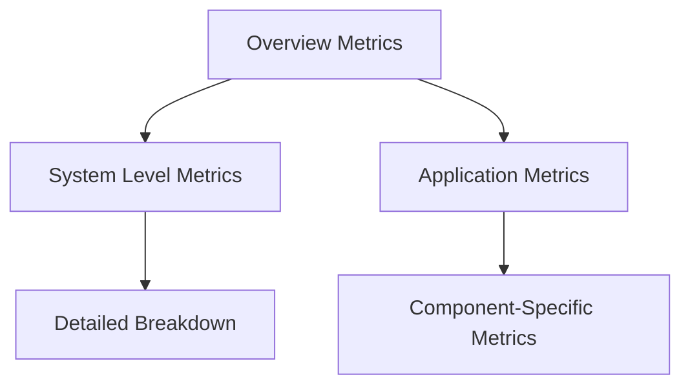
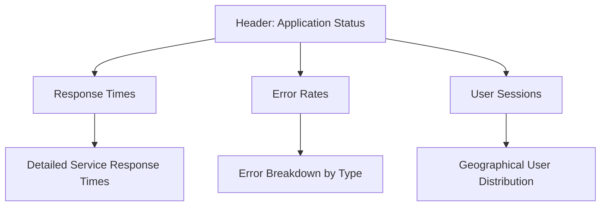

# Dashboard Layouts

## Introduction

Dashboard layouts are a fundamental aspect of creating effective Grafana dashboards. A well-designed layout makes your data more accessible, understandable, and actionable. This guide will walk you through the principles of organizing panels within Grafana dashboards, helping you create logical, visually appealing arrangements that communicate your data story effectively.

In Grafana, dashboard layouts are built on a grid system that allows you to position and size panels with precision. Understanding how to leverage this grid system, along with knowing best practices for arranging related metrics, can transform a cluttered collection of graphs into a powerful monitoring and analysis tool.

## Dashboard Grid System

Grafana organizes panels using a 24-column grid system. This grid forms the foundation of your dashboard layout, allowing for flexible panel arrangements.

### Grid Basics

- **Columns**: The dashboard width is divided into 24 equal columns
- **Rows**: Panels can span any number of rows in height
- **Responsive design**: Layouts automatically adjust based on screen size

### Configuring Panel Position and Size

To modify a panel's position and size:

1. Click on the panel title
2. Select "Edit"
3. Navigate to the "Panel options" section
4. Configure the panel dimensions:

```json
{
  "gridPos": {
    "h": 8,  // Height in grid units
    "w": 12, // Width in grid units (out of 24)
    "x": 0,  // Horizontal position (column)
    "y": 0   // Vertical position (row)
  }
}
```

## Layout Patterns and Best Practices

### 1. Hierarchical Layout

Organize information from general to specific, with overview metrics at the top and detailed breakdowns below.



### 2. Dashboard Sections

Group related panels into logical sections to improve scanability:

- **Header Row**: Place important summary stats at the top
- **Main Sections**: Group related metrics together
- **Footer**: Include additional context or resources

### Example: Server Monitoring Layout

```
┌─────────────────────────────────────────────────────────────┐
│                       System Overview                        │
├───────────────┬───────────────┬───────────────┬─────────────┤
│   CPU Usage   │  Memory Usage │   Disk I/O    │  Network    │
├───────────────┴───────────────┴───────────────┴─────────────┤
│                                                             │
│                     CPU Metrics Detailed                    │
│                                                             │
├─────────────────────────────────┬───────────────────────────┤
│                                 │                           │
│        Memory Breakdown         │     Network Traffic       │
│                                 │                           │
└─────────────────────────────────┴───────────────────────────┘
```

## Creating Effective Layouts

### Use Consistent Panel Sizes

Maintaining consistency in panel sizes creates visual harmony and makes dashboards easier to scan:

- Full width: `width: 24`
- Half width: `width: 12`
- Third width: `width: 8`
- Quarter width: `width: 6`

### Color and Visual Hierarchy

Use color consistently to establish visual patterns:

- Keep panel backgrounds consistent
- Use color to indicate status or severity
- Create visual grouping with similar color schemes for related metrics

### Creating a New Dashboard with Custom Layout

Let's create a basic application monitoring dashboard with an effective layout:

1. Click on "Create" and select "Dashboard"
2. Add a new panel for the header: 
   - Make it full width (`width: 24`)
   - Use a "Stat" panel type to show overview metrics

```javascript
// Example Stat Panel Query
{
  "targets": [
    {
      "datasource": {
        "type": "prometheus",
        "uid": "prometheus"
      },
      "expr": "sum(rate(http_requests_total[5m]))",
      "refId": "A"
    }
  ],
  "options": {
    "colorMode": "value",
    "graphMode": "area",
    "justifyMode": "auto",
    "orientation": "auto",
    "reduceOptions": {
      "calcs": ["lastNotNull"],
      "fields": "",
      "values": false
    }
  },
  "gridPos": {
    "h": 4,
    "w": 24,
    "x": 0,
    "y": 0
  }
}
```

3. Add a row of quarter-width stat panels for key metrics:

```javascript
// Example configuration for a row of 4 equal panels
[
  {
    "title": "CPU Usage",
    "gridPos": { "h": 4, "w": 6, "x": 0, "y": 4 }
  },
  {
    "title": "Memory Usage",
    "gridPos": { "h": 4, "w": 6, "x": 6, "y": 4 }
  },
  {
    "title": "Disk Space",
    "gridPos": { "h": 4, "w": 6, "x": 12, "y": 4 }
  },
  {
    "title": "Network I/O",
    "gridPos": { "h": 4, "w": 6, "x": 18, "y": 4 }
  }
]
```

4. Add detailed time series graphs below:

```javascript
// Example for a full-width time series graph
{
  "title": "HTTP Request Rate",
  "gridPos": { "h": 8, "w": 24, "x": 0, "y": 8 },
  "options": {
    "legend": { "calcs": [], "displayMode": "list", "placement": "bottom" }
  }
}
```

## Advanced Layout Techniques

### Using Rows for Organization

Grafana's rows feature helps organize panels into collapsible sections:

1. Add a new row by clicking "+ Add panel" and selecting "Row"
2. Give the row a meaningful title like "System Metrics"
3. Add panels within this row
4. Rows can be collapsed to focus on specific sections

### Dynamic Layouts with Variables

Create flexible layouts with template variables:

```javascript
// Example variable configuration
{
  "name": "server",
  "type": "query",
  "datasource": "Prometheus",
  "query": "label_values(node_exporter_up, instance)",
  "refresh": 1
}
```

Then use this variable in your panel queries to create a dashboard that adapts to different servers:

```
sum(rate(node_cpu_seconds_total{instance="$server",mode!="idle"}[5m])) / 
sum(rate(node_cpu_seconds_total{instance="$server"}[5m])) * 100
```

### Mobile-Friendly Layouts

For dashboards that need to be viewed on mobile devices:

- Focus on stacked layouts (full-width panels)
- Prioritize the most important metrics at the top
- Consider creating separate mobile-specific dashboards with simpler layouts

## Real-World Examples

### Application Performance Dashboard

Here's how you might structure an application performance monitoring dashboard:



Implementation:

```javascript
// Header row with key status indicators
{
  "panels": [
    {
      "title": "Application Status",
      "type": "stat",
      "gridPos": { "h": 3, "w": 8, "x": 0, "y": 0 }
    },
    {
      "title": "Avg Response Time",
      "type": "gauge",
      "gridPos": { "h": 3, "w": 8, "x": 8, "y": 0 }
    },
    {
      "title": "Error Rate",
      "type": "stat",
      "gridPos": { "h": 3, "w": 8, "x": 16, "y": 0 }
    }
  ]
}
```

### Infrastructure Monitoring Dashboard

For server infrastructure:

1. Top section: Health overview of all servers
2. Middle section: Resource utilization (CPU, memory, disk)
3. Bottom section: Detailed metrics for the selected server

## Summary

Effective dashboard layouts in Grafana combine technical grid arrangement with design principles to create intuitive, informative visualizations. Key takeaways include:

- Use the 24-column grid system to create balanced layouts
- Organize information hierarchically from overview to detail
- Group related metrics together to create logical sections
- Maintain consistent panel sizes for visual harmony
- Use color purposefully to establish patterns and hierarchy
- Create mobile-friendly layouts when needed
- Leverage rows and template variables for flexible organization

By applying these principles, you can transform raw data into coherent, actionable dashboards that enhance monitoring and decision-making capabilities.

## Exercises

1. Create a basic dashboard with four panels arranged in a 2x2 grid
2. Design a dashboard that displays system metrics in a hierarchical layout
3. Create a dashboard with collapsible rows for different service metrics
4. Implement a dashboard that uses template variables to filter by environment (dev, staging, production)

## Additional Resources

- [Grafana Documentation: Dashboard Layout](https://grafana.com/docs/grafana/latest/dashboards/build-dashboards/dashboard-ui/)
- [Grafana Best Practices Guide](https://grafana.com/docs/grafana/latest/best-practices/)
- [Dashboard Examples in Grafana Play](https://play.grafana.org/)
- [Grafana Community Forums](https://community.grafana.com/)