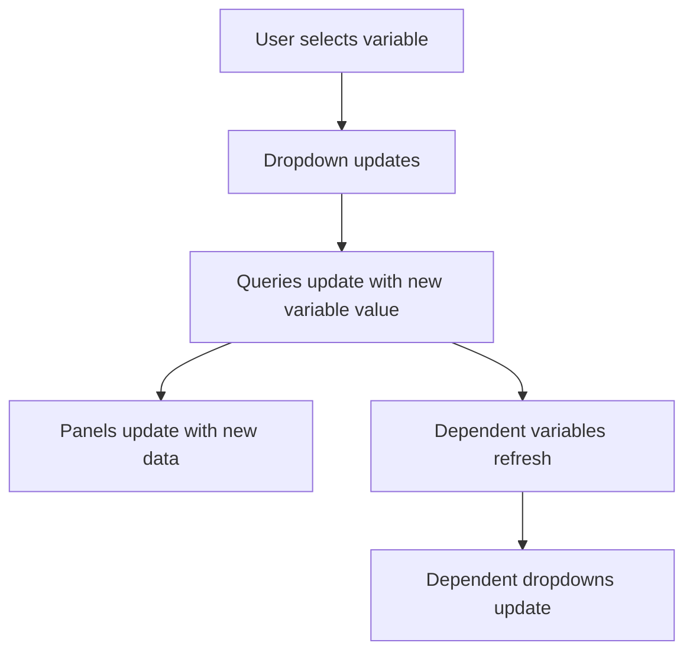

# Dashboard Templating

## Introduction

Dashboard templating is one of Grafana's most powerful features that allows you to create dynamic and interactive dashboards. Instead of creating multiple dashboards for different servers, applications, or environments, templating lets you use variables to create a single, flexible dashboard that can display data from multiple sources or show different perspectives of your data.

In this guide, you'll learn how to use Grafana's templating system to create dynamic dashboards that your users can customize through simple dropdown menus, making your dashboards more versatile and reducing dashboard sprawl.

## What is Dashboard Templating?

Templating allows you to replace values in your panels with variables. Variables appear as dropdown select boxes at the top of the dashboard, enabling users to change the data being displayed in your dashboard dynamically.

For example, instead of creating separate dashboards for each server, you can create one dashboard with a server variable that allows users to switch between different servers.

## Variable Types in Grafana

Grafana offers several types of variables:

- **Query**: Variables based on query results from a data source
- **Custom**: User-defined variables with custom values
- **Constant**: Fixed values that can be used in queries
- **Data source**: Variables that represent your connected data sources
- **Interval**: Time spans that can be used in time-based queries
- **Text box**: Variables that users can enter at runtime
- **Ad hoc filters**: Key/value filters that are automatically added to all queries
- **Global variables**: Built-in variables like `$__interval` and `$timeFilter`

## Creating Your First Template Variable

Let's create a basic query variable to select different servers in your dashboard:

1. Navigate to your dashboard settings by clicking the gear icon in the top right
2. Select "Variables" from the left menu
3. Click "Add variable"
4. Configure the variable with these settings:

```
Name: server
Label: Server
Type: Query
Data source: Your data source (e.g., Prometheus)
Query: label_values(node_cpu_seconds_total, instance)
Sort: Alphabetical (asc)
```

5. Click "Add" to save your variable

Now you'll have a dropdown at the top of your dashboard labeled "Server" that lists all your server instances.

## Using Variables in Queries

Once you've created variables, you can use them in your panel queries using the syntax: `$variableName` or `${variableName}`.

For example, in a Prometheus query:

```
node_memory_MemFree_bytes{instance="$server"}
```

This query will automatically use the server selected in the dropdown.

## Multi-Value Selection and Formatting

Variables can be configured to allow selecting multiple values. When multiple values are selected, you can control how they are formatted using variable format options.

For example, with a multi-value server variable:

```
node_memory_MemFree_bytes{instance=~"$server"}
```

The `=~` operator means "regex match" in Prometheus, which works with multi-value selections.

### Format Options

You can specify how variable values are formatted using the following syntax: `${variable:format}`.

Common format options include:

- `glob`: Format multi-values as glob (server1|server2|server3)
- `regex`: Format multi-values as regex (server1|server2|server3)
- `pipe`: Format multi-values as pipe-separated values (server1|server2|server3)
- `csv`: Format multi-values as comma-separated values (server1,server2,server3)
- `json`: Format multi-values as JSON array ["server1","server2","server3"]

Example:
```
node_memory_MemFree_bytes{instance=~"${server:regex}"}
```

## Chained Variables

Grafana allows you to create variables that depend on other variables, creating a cascade of filters. These are called chained variables.

Let's create a chained variable that shows applications running on a selected server:

```
Name: application
Label: Application
Type: Query
Data source: Your data source (e.g., Prometheus)
Query: label_values(app_metrics{instance="$server"}, application)
Sort: Alphabetical (asc)
```

Now the application dropdown will only show applications running on the selected server.

## Variable Refresh Options

You can control when variables refresh their values:

- **On dashboard load**: Variables refresh when the dashboard loads
- **On time range change**: Variables refresh when the time range changes

For frequently changing data, setting the appropriate refresh option ensures your variables stay up-to-date.

## Practical Example: Building a Dynamic Server Dashboard

Let's build a practical dashboard that monitors multiple servers:

1. Create a server variable as shown above
2. Create a dashboard with panels that use this variable:

### CPU Usage Panel
```
avg by (instance) (rate(node_cpu_seconds_total{instance="$server", mode!="idle"}[5m])) * 100
```

### Memory Usage Panel
```
100 - ((node_memory_MemAvailable_bytes{instance="$server"} * 100) / node_memory_MemTotal_bytes{instance="$server"})
```

### Disk Usage Panel
```
100 - ((node_filesystem_avail_bytes{instance="$server", mountpoint="/"} * 100) / node_filesystem_size_bytes{instance="$server", mountpoint="/"})
```

Now, users can select different servers from the dropdown and instantly see metrics for the selected server.

## Advanced Templating Techniques

### Using Regular Expressions in Variables

You can filter variable options using regex by enabling the "Regex" option when creating a variable:

```
Name: production_servers
Label: Production Servers
Type: Query
Data source: Prometheus
Query: label_values(node_cpu_seconds_total, instance)
Regex: /^prod-.*$/
```

This creates a variable that only includes servers with names that start with "prod-".

### Using Variables in Panel Titles

You can include variables in panel titles to make them dynamic:

```
CPU Usage - $server
```

This will update the panel title to show which server's data is being displayed.

### Using Text Box Variables for User Input

Text box variables allow users to input custom values:

```
Name: threshold
Label: Alert Threshold
Type: Text box
Default value: 90
```

You can then use this in an alert expression:
```
avg by (instance) (rate(node_cpu_seconds_total{instance="$server", mode!="idle"}[5m])) * 100 > $threshold
```

## Visualizing Variable Flow with Mermaid

Here's a diagram showing how variables interact in a dashboard:



## Global Variables

Grafana provides several built-in variables you can use without defining them:

- `$__interval`: Represents the time grain appropriate for the current time range
- `$__timeFilter`: Applies the current dashboard time range to queries
- `$__name`: The name of the current dashboard
- `$__dashboard`: The name of the current dashboard
- `$__org`: The ID of the current organization
- `$__user`: The current user's login handle

Example usage:
```
rate(http_requests_total[$__interval])
```

This automatically adjusts the rate calculation based on the dashboard's time range.

## Best Practices for Dashboard Templating

1. **Choose descriptive variable names**: Use names that clearly indicate what the variable represents
2. **Set appropriate default values**: Select sensible defaults that work for most users
3. **Use variable descriptions**: Add descriptive text to explain what each variable controls
4. **Limit the number of variables**: Too many variables can overwhelm users
5. **Group related variables**: Use logical ordering and grouping for variables
6. **Test multi-value selections**: Ensure your queries work properly with multiple selected values
7. **Consider performance**: Some variable types might slow down dashboard loading, especially with large datasets

## Summary

Dashboard templating transforms static dashboards into dynamic, interactive tools that can adapt to different scenarios. By using variables, you can:

- Create flexible dashboards that work across different environments
- Allow users to customize their view of the data
- Reduce dashboard sprawl by consolidating multiple dashboards into one
- Enable deeper data exploration without creating new dashboards

Templating is one of the features that sets Grafana apart from other visualization tools and mastering it will significantly enhance your monitoring capabilities.

## Exercises

1. Create a dashboard with variables for selecting different environments (production, staging, development)
2. Build a dashboard that uses chained variables to filter metrics by region, then by server
3. Create a dashboard that uses a time interval variable to adjust the granularity of time series data
4. Build a dashboard that uses ad hoc filters to allow fine-grained filtering of metrics

## Additional Resources

- [Grafana Official Documentation on Variables](https://grafana.com/docs/grafana/latest/variables/)
- [Grafana Blog: Advanced Dashboard Templating](https://grafana.com/blog/2020/02/26/advanced-dashboard-templating-with-grafana/)
- [Community Dashboards](https://grafana.com/grafana/dashboards/) for examples of templating in action