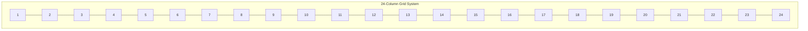

# Dashboard Grid System

## Introduction

The dashboard grid system is a fundamental component of Grafana that allows you to organize and arrange visualization panels in a structured, responsive layout. Understanding how the grid system works is essential for creating dashboards that are both visually appealing and functionally effective. This guide will walk you through the core concepts of Grafana's grid system and provide practical examples to help you create well-organized dashboards.

## Understanding the Grid System

Grafana's dashboard layout is based on a grid system that divides the dashboard into rows and columns. This approach provides a flexible framework for positioning panels while maintaining a consistent structure across different screen sizes.

### Core Concepts

- **Grid Units**: The dashboard is divided into 24 equal-width columns.
- **Panel Width**: Each panel's width is specified in terms of these grid units (from 1 to 24).
- **Panel Height**: Height is measured in grid units, where each unit represents a fixed pixel height (typically 30px).
- **Responsive Behavior**: The grid automatically adjusts based on screen size, maintaining the relative proportions.

Let's visualize how the 24-column grid looks:



## Working with the Grid

### Basic Panel Placement

When you add a panel to a dashboard, you can adjust its size by:

1. Dragging the panel edges to resize
2. Using the panel settings to specify exact dimensions

Here's how you can modify panel dimensions through panel settings:

1. Click on a panel's title to open its menu
2. Select "Edit"
3. Click on the "Panel options" tab
4. Find the "Width" and "Height" settings

A panel with a width of 12 grid units will occupy exactly half of the dashboard width.

### Common Panel Width Configurations

- **Full width**: 24 columns
- **Half width**: 12 columns
- **Third width**: 8 columns
- **Quarter width**: 6 columns

### Panel Height

Panel height is specified in grid units, where each unit is typically 30 pixels. This means:

- A panel with height 8 will be approximately 240 pixels tall
- A panel with height 16 will be approximately 480 pixels tall

## Layout Techniques

### Creating Balanced Layouts

A well-designed dashboard uses a consistent grid layout. Here are some approaches:

#### 1. Symmetrical Layout

This layout uses panels of equal width for a clean, balanced appearance:

```
+---------------+---------------+
|               |               |
|   Panel (12)  |   Panel (12)  |
|               |               |
+---------------+---------------+
|                               |
|          Panel (24)           |
|                               |
+-------------------------------+
```

#### 2. Hierarchical Layout

This layout uses different panel widths to create visual hierarchy:

```
+---------------+---------------+
|               |      |       |
|   Panel (12)  |  P6  |  P6   |
|               |      |       |
+---------------+-------+------+
|        |              |      |
|   P8   |     P10      |  P6  |
|        |              |      |
+--------+--------------+------+
```

### Code Example: Dashboard JSON Configuration

Here's a simplified example of how panel grid positions are defined in Grafana's dashboard JSON:

```json
{
  "panels": [
    {
      "id": 1,
      "gridPos": {
        "h": 8,
        "w": 12,
        "x": 0,
        "y": 0
      },
      "title": "Panel 1"
    },
    {
      "id": 2,
      "gridPos": {
        "h": 8,
        "w": 12,
        "x": 12,
        "y": 0
      },
      "title": "Panel 2"
    },
    {
      "id": 3,
      "gridPos": {
        "h": 8,
        "w": 24,
        "x": 0,
        "y": 8
      },
      "title": "Panel 3"
    }
  ]
}
```

In this example:
- `w` represents the width in grid units (out of 24)
- `h` represents the height in grid units
- `x` represents the horizontal position from the left edge
- `y` represents the vertical position from the top edge

## Advanced Grid Techniques

### Auto-Arranging Panels

Grafana offers an "Arrange" feature that can automatically organize your panels in a grid:

1. Click the dashboard settings icon (gear)
2. Select "View"
3. Click "Arrange"

This will rearrange your panels to eliminate gaps while maintaining their relative sizes.

### Working with Repeating Panels

Repeating panels allow you to create dynamic dashboards that adapt based on variables:

```json
{
  "panels": [
    {
      "id": 1,
      "gridPos": {
        "h": 8,
        "w": 12,
        "x": 0,
        "y": 0
      },
      "title": "CPU Usage for $server",
      "repeat": "server",
      "repeatDirection": "h"
    }
  ]
}
```

In this example, the panel will repeat horizontally for each value in the `server` variable.

### Responsive Considerations

When designing dashboards, keep in mind how they'll appear on different devices:

- **Desktop**: Full layout with multiple columns
- **Tablet**: May reduce to 2-3 columns
- **Mobile**: Often collapses to a single column

Test your dashboard on different screen sizes or use Grafana's responsive design mode.

## Real-World Examples

### Example 1: System Monitoring Dashboard

Here's how you might organize a system monitoring dashboard:

```
+---------------+---------------+
|    CPU        |    Memory     |
|   Usage       |    Usage      |
|   (12x8)      |    (12x8)     |
+---------------+---------------+
|    Disk       |    Network    |
|   Usage       |    Traffic    |
|   (12x8)      |    (12x8)     |
+---------------+---------------+
|                               |
|      System Uptime Graph      |
|           (24x8)              |
+-------------------------------+
|                               |
|      Error Rate Timeline      |
|           (24x8)              |
+-------------------------------+
```

### Example 2: E-commerce Dashboard

For an e-commerce application, you might arrange panels like this:

```
+---------------+---------------+
|    Today's    |   Conversion  |
|    Sales      |     Rate      |
|    (12x6)     |    (12x6)     |
+---------------+---------------+
|                               |
|     Sales Timeline (24h)      |
|           (24x10)             |
+-------------------------------+
+--------+--------+-------------+
| Top    | Top    |  Geographic |
| Products| Referrers| Distribution|
| (8x10)  | (8x10) |   (8x10)   |
+--------+--------+-------------+
```

## Tips for Effective Grid Usage

1. **Plan Before You Build**: Sketch your dashboard layout before implementing it
2. **Maintain Consistency**: Use similar panel sizes for related information
3. **Prioritize Important Metrics**: Place critical information at the top and with larger panels
4. **Use White Space**: Don't overcrowd the dashboard; leave some breathing room between panels
5. **Group Related Panels**: Keep logically related visualizations adjacent to each other
6. **Consider the Data-Ink Ratio**: Focus on displaying data, not decorative elements

## Common Mistakes to Avoid

- **Overcrowding**: Too many panels make dashboards hard to read and understand
- **Inconsistent Sizing**: Varying panel sizes without purpose creates visual confusion
- **Poor Organization**: Unrelated metrics scattered throughout the dashboard
- **Ignoring Responsive Design**: Not testing how dashboards appear on different devices

## Summary

Grafana's dashboard grid system provides a powerful framework for creating well-organized, responsive visualizations. By understanding the 24-column grid structure and how to position and size panels effectively, you can create dashboards that are both visually appealing and functionally effective.

The key concepts to remember are:
- The dashboard is divided into 24 columns
- Panel dimensions are specified in grid units
- Panel positions are defined by x/y coordinates on the grid
- Effective layouts group related information and prioritize important metrics
- Well-designed dashboards consider responsive behavior across different devices

## Additional Resources

- Experiment with creating different dashboard layouts using the grid system
- Try to recreate the example layouts provided in this guide
- Create a dashboard that adapts effectively across desktop, tablet, and mobile views
- Practice modifying existing dashboards to improve their organization using grid principles