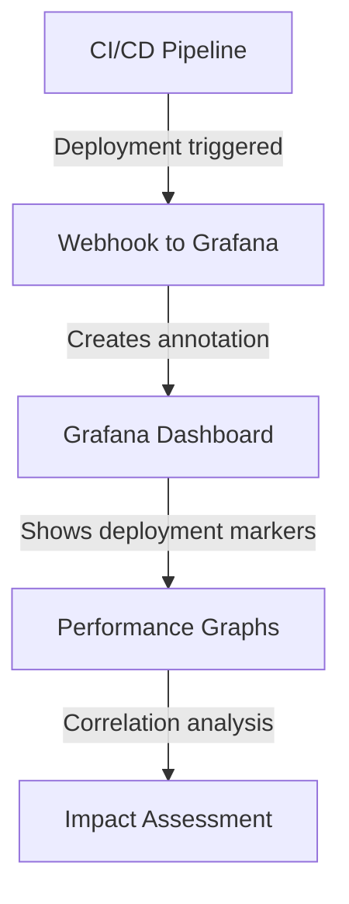

# Dashboard Annotations

## Introduction

Annotations in Grafana are a powerful way to mark points in time on your dashboard graphs. They allow you to correlate metrics with significant events, providing valuable context to your time series data. Whether you're tracking deployments, incidents, maintenance windows, or any other noteworthy occurrences, annotations help tell the complete story behind your metrics.

Think of annotations as sticky notes attached to specific points in time across your dashboard panels. They can be manual notes you add while investigating an issue, or they can be automatically generated from various data sources.

## Understanding Annotations

### What Are Annotations?

Annotations are event markers displayed as vertical lines on graphs with optional text labels. They help answer questions like:

- Did that deployment cause the CPU spike?
- When did we implement that configuration change?
- What was happening during that traffic anomaly?

### Types of Annotations

Grafana supports several types of annotations:

1. **Manual annotations**: Added by users directly through the Grafana UI
2. **Query-based annotations**: Automatically generated from a data source query
3. **Dashboard annotations**: Applied to all panels in a dashboard
4. **Panel annotations**: Only visible on specific panels

## Creating Annotations

### Manual Annotations

To add a manual annotation:

1. Hover over a graph panel and press the `Ctrl` key (or `Cmd` on Mac)
2. Click on the graph at the desired time point
3. Enter a description in the annotation editor
4. Click the Save button

```
// Example of what this looks like in code
{
  "annotations": {
    "list": [
      {
        "name": "Deployments",
        "enable": true,
        "datasource": "-- Grafana --",
        "iconColor": "rgba(0, 211, 255, 1)",
        "tags": ["deploy"]
      }
    ]
  }
}
```

### Query-Based Annotations

Query-based annotations automatically fetch events from your data sources. Here's how to set them up:

1. Navigate to Dashboard settings → Annotations
2. Click "New Annotation Query"
3. Configure the following:
   - Name: A descriptive name for the annotation
   - Data source: Where the events come from
   - Query: How to fetch the events
   - Enable/disable toggle: Turn the annotation on or off

For example, using Prometheus as a data source:

```
# Query that fetches deployment events
changes(kube_deployment_status_replicas_updated[1m]) > 0
```

## Working with Annotation Queries

Let's explore how to create annotation queries for common data sources:

### Prometheus Annotations

Prometheus annotations typically look for changes or events:

```
# Annotation query for monitoring service restarts
changes(process_start_time_seconds{job="my-service"}[1m]) > 0
```

When this condition is true, Grafana creates an annotation.

### Elasticsearch Annotations

For Elasticsearch, you can query log events:

```
{
  "query": {
    "bool": {
      "must": [
        {
          "match_phrase": {
            "message": "deployment completed"
          }
        }
      ]
    }
  }
}
```

### Graphite Annotations

Graphite queries can also generate annotations:

```
events.deployment.production
```

## Customizing Annotations

### Annotation Settings

You can customize how annotations appear:

1. Navigate to Dashboard settings → Annotations
2. Edit an existing annotation
3. Configure:
   - Color: Choose a distinctive color for the annotation line
   - Show in: All panels or specific panels
   - Tags: Filter annotations by tags
   - Pre-query filter: Filter events before they're displayed

```
// Example annotation configuration
{
  "annotations": {
    "list": [
      {
        "builtIn": 1,
        "datasource": "-- Grafana --",
        "enable": true,
        "hide": true,
        "iconColor": "rgba(0, 211, 255, 1)",
        "name": "Annotations & Alerts",
        "type": "dashboard"
      },
      {
        "datasource": "Prometheus",
        "enable": true,
        "iconColor": "#FA6400",
        "name": "Deployments",
        "query": "changes(kube_deployment_status_replicas_updated[1m]) > 0",
        "showIn": 0,
        "tags": ["deployment"],
        "type": "prometheus"
      }
    ]
  }
}
```

### Filtering Annotations

To manage annotation visibility:

- Use the annotation toggle in the dashboard header
- Click on annotation tags to filter specific types
- Use time range controls to zoom into specific periods

## Real-World Examples

Let's explore some practical applications of annotations:

### Example 1: Tracking Deployments

Track application deployments alongside performance metrics:



Implementation steps:

1. Create a webhook in your CI/CD pipeline
2. Send a POST request to Grafana's API when deployments occur
3. Configure annotation query to display these events
4. Analyze metrics before and after deployments

### Example 2: Monitoring System Maintenance

Mark scheduled maintenance windows on your infrastructure dashboards:

```
// API call to create a maintenance annotation
POST /api/annotations HTTP/1.1
Content-Type: application/json
Authorization: Bearer your-api-key

{
  "dashboardId": 1,
  "time": 1630000000000,
  "timeEnd": 1630010000000,
  "tags": ["maintenance", "planned"],
  "text": "Network maintenance - Updating router firmware"
}
```

This helps teams distinguish between actual incidents and planned activities.

### Example 3: Incident Timeline

Create a comprehensive incident timeline:

1. Add manual annotations during incident investigation
2. Use query-based annotations to automatically detect:
   - Error rate spikes
   - CPU/memory threshold breaches
   - Service restarts

```
# Query for detecting error rate spikes
sum(rate(http_requests_total{status=~"5.."}[1m])) / sum(rate(http_requests_total[1m])) > 0.05
```

This creates a visual timeline that can be used in post-incident reviews.

## Advanced Annotation Techniques

### Multi-Panel Annotations

To create annotations that span multiple panels:

1. Navigate to Dashboard settings → Annotations
2. Create a new annotation query
3. Set "Show in" to "All panels"
4. Configure your query and save

This helps correlate events across different metrics.

### Annotation Templates

You can use templates in annotation queries to make them dynamic:

```
# Template variable in an annotation query
changes(process_start_time_seconds{job="${service}"}[1m]) > 0
```

When users select different services, the annotations update accordingly.

### Programmatic Annotations

You can create annotations programmatically using Grafana's API:

```
curl -X POST \
  -H "Authorization: Bearer YOUR_API_KEY" \
  -H "Content-Type: application/json" \
  -d '{
    "dashboardId": 1,
    "panelId": 2,
    "time": 1630000000000,
    "tags": ["deployment", "api"],
    "text": "API v2.3 deployed"
  }' \
  https://your-grafana-instance/api/annotations
```

This allows you to integrate annotations with your existing tools and workflows.

## Best Practices

### Do's

- Use consistent naming and color coding for different annotation types
- Add detailed descriptions to provide proper context
- Filter annotations to avoid cluttering your graphs
- Use tags to categorize annotations for easier filtering
- Combine manual and query-based annotations for comprehensive context

### Don'ts

- Don't create too many annotations that would clutter the view
- Don't use vague descriptions that don't provide clear context
- Don't forget to clean up outdated or irrelevant annotations
- Don't use the same color for different types of annotations

## Summary

Annotations are a powerful feature in Grafana that help you add context to your time series data. By marking significant events directly on your dashboards, you can:

- Correlate metrics with system changes
- Create visual timelines of incidents
- Document important events for future reference
- Enhance your monitoring with valuable context

Through both manual and query-based annotations, you can tell the complete story behind your metrics, making your dashboards more informative and actionable.

## Additional Resources

- Practice creating different types of annotations on a test dashboard
- Experiment with annotation queries using your existing data sources
- Try integrating annotations with your CI/CD pipelines or alerting systems
- Review the official Grafana documentation for the latest annotation features

## Exercise: Building a Deployment Tracking Dashboard

Try building a dashboard that:

1. Displays application performance metrics
2. Shows annotations for each deployment
3. Includes annotations for configuration changes
4. Allows filtering of different annotation types

This exercise will help you master the use of annotations in real-world scenarios.