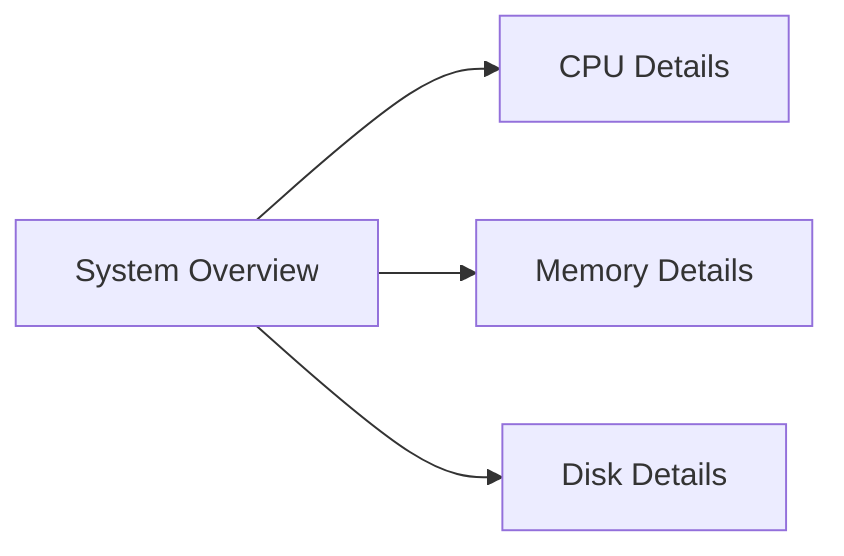
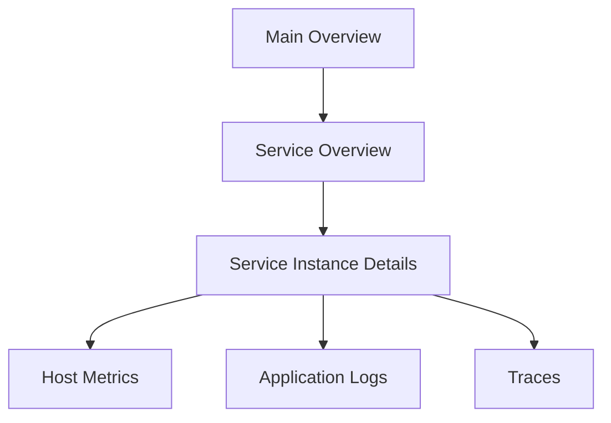

# Dashboard Links

## Introduction

Dashboard links are a powerful feature in Grafana that allow you to connect related dashboards together, creating a seamless navigation experience for users. Instead of searching for related dashboards, you can create direct links between them, making it easier to move between different views of your data. 

In this guide, you'll learn how to create various types of dashboard links, understand their use cases, and implement them effectively in your Grafana environment.

## Why Use Dashboard Links?

Dashboard links serve several important purposes:

- **Improved Navigation**: Allow users to easily navigate between related dashboards
- **Context Preservation**: Maintain query parameters when moving between dashboards
- **Organizational Structure**: Create logical groupings of related dashboards
- **Workflow Optimization**: Support natural progression through monitoring workflows

## Types of Dashboard Links

Grafana supports three main types of dashboard links:

1. **Dashboard Links**: Links to other dashboards
2. **Panel Links**: Links that appear on specific panels
3. **Data Links**: Links that are attached to specific data points

Let's explore each of these in detail.

## Creating Dashboard Links

Dashboard links appear at the top of your dashboard, allowing users to navigate to other related dashboards or external resources.

### Step-by-Step Guide

1. Navigate to the dashboard where you want to add links
2. Click the gear icon in the top right to open the dashboard settings
3. Select the "Links" tab on the left
4. Click "Add Dashboard Link" or "New"
5. Configure your link with the following options:

```
Type: dashboards (for internal dashboards) or link (for external resources)
Title: A descriptive name for your link
Tooltip: Additional information shown on hover
URL: For external links, the full URL
Dashboard: For internal links, select the target dashboard
Time range: Choose whether to preserve the current time range when following the link
Variable values: Choose whether to preserve dashboard variables
Open in new tab: Choose whether to open the link in a new browser tab
```

6. Click "Save" to add the link
7. Return to your dashboard to see the new link at the top

### Example: Creating a Dashboard Link to a Related Dashboard

Let's say you have a main "System Overview" dashboard and want to link to more detailed dashboards for CPU, Memory, and Disk usage.

1. Go to your "System Overview" dashboard
2. Open dashboard settings and select "Links"
3. Click "Add Dashboard Link"
4. Set Type to "dashboards"
5. Set Title to "CPU Details"
6. Select your CPU dashboard from the dropdown
7. Enable "Include time range" to preserve the time range when navigating
8. Enable "Include template variables" to preserve any variables
9. Save the link
10. Repeat for Memory and Disk dashboards

The result will be navigation links at the top of your dashboard:



## Creating Panel Links

Panel links appear on individual panels, allowing users to navigate to related dashboards or external resources from a specific visualization.

### Step-by-Step Guide

1. Go to your dashboard and edit the panel where you want to add a link
2. In the panel edit view, scroll down to the "Panel links" section
3. Click "Add link"
4. Configure your link:

```
Title: A descriptive name
URL: The destination URL or dashboard
Open in new tab: Choose whether to open in a new tab
```

5. Click "Save" to add the link
6. Save the dashboard

### Example: Adding a Panel Link to Documentation

Imagine you have a complex metrics panel that might need explanation:

1. Edit your panel
2. Scroll to "Panel links"
3. Click "Add link"
4. Set Title to "Metrics Documentation"
5. Set URL to the documentation page
6. Enable "Open in new tab"
7. Save the link and the dashboard

Now users can click the link icon on the panel to access related documentation directly.

## Creating Data Links

Data links are particularly powerful as they allow you to create links from specific data points within a visualization to other dashboards or external systems.

### Step-by-Step Guide

1. Edit the panel where you want to add data links
2. Go to the "Field" tab
3. Expand "Data links" 
4. Click "Add link"
5. Configure the link:

```
Title: A descriptive name
URL: The destination URL, can include variables like ${__value.raw} or ${__field.name}
Open in new tab: Choose whether to open in a new tab
```

6. Save the link and the dashboard

### Example: Creating a Data Link to Trace Details

For a service monitoring dashboard, you might want to link directly to trace details:

1. Edit your service latency panel
2. Go to the "Field" tab
3. Expand "Data links" 
4. Click "Add link"
5. Set Title to "View Traces"
6. Set URL to `http://your-tracing-system/traces?service=${__series.name}&time=${__value.time}`
7. Enable "Open in new tab"
8. Save the link and the dashboard

Now when users click on a specific data point, they'll be taken directly to the relevant traces for that service at that time.

## Variables in Dashboard Links

One of the most powerful features of dashboard links is the ability to pass variables between dashboards. This allows you to maintain context when navigating between related dashboards.

### Available Variables

You can use the following variables in your dashboard links:

- `$__dashboard`: The name of the current dashboard
- `$__from` and `$__to`: The current time range
- `$<variable-name>`: Any dashboard variable
- `${__value.raw}`: The raw value of a data point (for data links)
- `${__value.time}`: The time of a data point (for data links)
- `${__field.name}`: The field name (for data links)
- `${__series.name}`: The series name (for data links)

### Example: Passing Variables Between Dashboards

Let's say you have a dashboard with a variable called `server` that filters metrics by server name:

1. Create a link to another dashboard
2. Set the URL to include the variable: `d/abcd1234/server-details?var-server=${server}`
3. Enable "Include template variables"

Now when users navigate to the linked dashboard, it will automatically filter for the same server they were viewing.

## Real-World Use Cases

### Monitoring Workflow

Create a hierarchical structure for your monitoring:



Each dashboard links to more detailed views, creating a natural exploration path.

### Multi-Team Dashboards

Different teams can have their own dashboards but still link to related team dashboards:

1. The DevOps team creates infrastructure dashboards
2. The Application team creates application performance dashboards
3. Each dashboard links to related dashboards from other teams
4. All link back to a common organization overview dashboard

### Incident Response

Create an incident response workflow:

1. Alert fires and links to an overview dashboard
2. The overview dashboard has links to specific systems
3. System dashboards link to deep-dive analysis dashboards
4. All dashboards link to a runbook or documentation

## Best Practices

1. **Be Consistent**: Use a consistent naming convention for your links
2. **Don't Overdo It**: Too many links can be confusing – focus on the most important relationships
3. **Use Tooltips**: Add helpful tooltips to explain where each link leads
4. **Preserve Context**: Enable time range and variable preservation when it makes sense
5. **Organize Logically**: Group links in a way that follows natural troubleshooting or exploration flows
6. **Document Links**: Include a description of your link structure in documentation
7. **Review Regularly**: Periodically review links to ensure they're still relevant and functional

## Common Issues and Solutions

### Links Pointing to Non-existent Dashboards

**Problem**: Links point to dashboards that no longer exist.
**Solution**: Use dashboard UIDs instead of IDs in your links, and implement a regular validation process.

### Variables Not Being Passed Correctly

**Problem**: Variables aren't being passed between dashboards.
**Solution**: Ensure variable names match exactly between dashboards and verify "Include template variables" is enabled.

### Too Many Links Cluttering the Interface

**Problem**: Too many links make the dashboard hard to navigate.
**Solution**: Use dropdown links to group related links together.

## Summary

Dashboard links are a powerful feature in Grafana that enhances navigation and creates a cohesive monitoring experience. By connecting related dashboards, you can build intuitive workflows that guide users through your monitoring system.

Key takeaways:

- Dashboard links appear at the top of dashboards and connect to other dashboards or external resources
- Panel links allow navigation from specific panels
- Data links enable deep linking from specific data points
- Variables can be passed between dashboards to maintain context
- Well-designed links create natural workflows for monitoring and troubleshooting

## Exercises

1. Create a main dashboard with links to at least three other dashboards
2. Add a panel link to a specific visualization that points to documentation
3. Create a data link that takes users from a specific metric to a detailed view
4. Implement a hierarchical dashboard structure for a specific application or service
5. Use variables in your dashboard links to maintain context between dashboards

## Additional Resources

- [Grafana Documentation on Dashboard Links](https://grafana.com/docs/grafana/latest/dashboards/build-dashboards/manage-dashboard-links/)
- [Grafana Documentation on Panel Links](https://grafana.com/docs/grafana/latest/panels-visualizations/configure-panel-links/)
- [Grafana Documentation on Data Links](https://grafana.com/docs/grafana/latest/panels-visualizations/configure-data-links/)