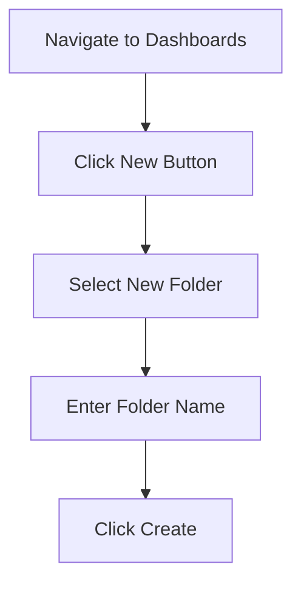
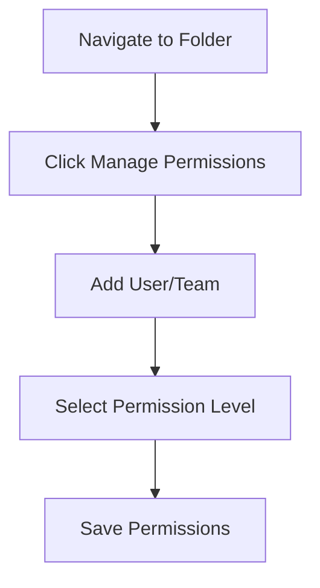

# Dashboard Folders

## Introduction

When working with Grafana, you'll likely create multiple dashboards for different purposes - monitoring various applications, system metrics, business analytics, and more. As your Grafana instance grows, organizing these dashboards becomes crucial for efficient navigation and management.

Dashboard Folders in Grafana provide a hierarchical organization system that helps you group related dashboards together. This feature not only improves navigation but also enables you to apply permissions at the folder level, making access control more manageable.

## Understanding Dashboard Folders

Dashboard folders act as containers for your dashboards, allowing you to:

- Group related dashboards together
- Apply permissions at the folder level
- Easily search and filter dashboards
- Create a logical organization structure

Think of dashboard folders like directories in a file system - they help you organize your content in a way that makes sense for your team and use cases.

## Creating Dashboard Folders

### Method 1: From the Dashboards Page

1. Navigate to the Dashboards page by clicking on the **Dashboards** icon in the left sidebar
2. Click the **New** button at the top right
3. Select **New Folder** from the dropdown menu
4. Enter a name for your folder and click **Create**



### Method 2: Using the API

You can also create folders programmatically using the Grafana API:

```bash
curl -X POST -H "Content-Type: application/json" \
  -H "Authorization: Bearer YOUR_API_KEY" \
  http://your-grafana-instance/api/folders \
  -d '{"title": "Production Dashboards"}'
```

The response will include the folder ID and other details:

```json
{
  "id": 1,
  "uid": "nErXDvCkzz",
  "title": "Production Dashboards",
  "url": "/dashboards/f/nErXDvCkzz/production-dashboards",
  "hasAcl": false,
  "canSave": true,
  "canEdit": true,
  "canAdmin": true,
  "createdBy": "admin",
  "created": "2023-01-15T15:33:33+02:00",
  "updatedBy": "admin",
  "updated": "2023-01-15T15:33:33+02:00",
  "version": 1
}
```

## Moving Dashboards to Folders

### Method 1: From the Dashboard View

1. Open the dashboard you want to move
2. Click the gear icon ⚙️ in the top navigation to access dashboard settings
3. Under the **General** tab, you'll find a **Folder** dropdown
4. Select the destination folder from the dropdown
5. Click **Save**

### Method 2: From the Dashboards List

1. Navigate to the Dashboards page
2. Hover over the dashboard you want to move
3. Click the three dots (⋮) to open the context menu
4. Select **Move**
5. Choose the destination folder from the modal dialog
6. Click **Move**

## Managing Folder Permissions

One of the key benefits of folders is the ability to set permissions at the folder level, which are then inherited by all dashboards within that folder.

### Setting Folder Permissions

1. Navigate to the Dashboards page
2. Click on the folder you want to manage
3. Click the **Manage permissions** button at the top
4. Add users or teams and assign them appropriate permission levels:
   - **View**: Can only view dashboards
   - **Edit**: Can view and edit dashboards
   - **Admin**: Full control, including permission management



### Permission Inheritance

Dashboards inherit permissions from their parent folder. When you set permissions on a folder, all dashboards within that folder will adopt those permissions unless they have specific overrides.

## Practical Examples

### Example 1: Team-Based Organization

```
Root
├── Development Team
│   ├── API Performance Dashboard
│   └── Backend Services Dashboard
├── Operations Team
│   ├── Server Health Dashboard
│   └── Network Monitoring Dashboard
└── Business Analytics
    ├── Sales Overview Dashboard
    └── Customer Metrics Dashboard
```

This structure allows each team to find their relevant dashboards quickly and enables setting team-specific access permissions.

### Example 2: Environment-Based Organization

```
Root
├── Production
│   ├── System Metrics
│   └── Application Metrics
├── Staging
│   ├── System Metrics
│   └── Application Metrics
└── Development
    ├── System Metrics
    └── Application Metrics
```

This approach helps you keep metrics from different environments separate, making it easier to compare metrics across environments.

### Example 3: Application-Based Organization

```
Root
├── User Authentication Service
│   ├── Performance Metrics
│   └── Error Rates
├── Payment Processing
│   ├── Transaction Volume
│   └── Processing Times
└── Content Delivery
    ├── Bandwidth Usage
    └── Cache Hit Rates
```

This organization method helps you monitor all aspects of individual applications in one place.

## Folder Search and Navigation

Grafana provides several ways to navigate between folders:

1. **Breadcrumb Navigation**: When inside a folder, breadcrumbs appear at the top of the page, allowing you to navigate back to parent folders
2. **Search Function**: Use the search bar to find folders or dashboards by name
3. **Recent Dashboards**: Access recently visited dashboards directly from the home dashboard
4. **Starred Dashboards**: Star important dashboards for quick access regardless of their folder location

## Best Practices for Dashboard Folders

1. **Create a logical hierarchy**: Design your folder structure to match your organizational structure or workflow
2. **Use consistent naming conventions**: Adopt a standard naming pattern for both folders and dashboards
3. **Don't create too many levels**: Keep your folder hierarchy relatively flat to avoid navigation complexity
4. **Implement proper access control**: Take advantage of folder-level permissions to control dashboard access
5. **Regularly review and clean up**: Periodically review your folder structure and remove or archive unused dashboards

## Potential Challenges and Solutions

| Challenge | Solution |
|-----------|----------|
| Too many folders | Create a standardized folder naming and organization scheme |
| Inconsistent permissions | Audit folder permissions regularly and use teams instead of individual user permissions |
| Duplicate dashboards across folders | Use dashboard links to reference dashboards instead of duplicating them |
| Difficulty finding dashboards | Use tags in addition to folders and utilize the search functionality |

## Summary

Dashboard Folders in Grafana provide a powerful way to organize and manage your growing collection of dashboards. By implementing a thoughtful folder structure, you can:

- Improve navigation and findability of dashboards
- Simplify permissions management
- Create logical groupings based on teams, applications, or environments
- Scale your Grafana implementation more effectively

Using folders effectively is a key part of maintaining a well-organized Grafana instance, especially as your monitoring needs grow and more teams begin using the platform.

## Additional Resources

- Experiment with different folder structures to find what works best for your organization
- Consider implementing a naming convention guideline for your team
- Try using both folders and tags for maximum findability
- Explore dashboard links to create connections between related dashboards across different folders

## Exercise: Design Your Folder Structure

As a practical exercise, consider your organization's monitoring needs and design a folder structure that would work well for your specific use case. Think about:

- How many teams need access to dashboards?
- What applications or services are you monitoring?
- Do you have multiple environments?
- Are there different categories of metrics you track?

Sketch out a folder hierarchy and consider what permissions would be appropriate for each folder.