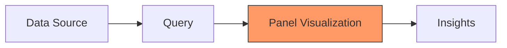
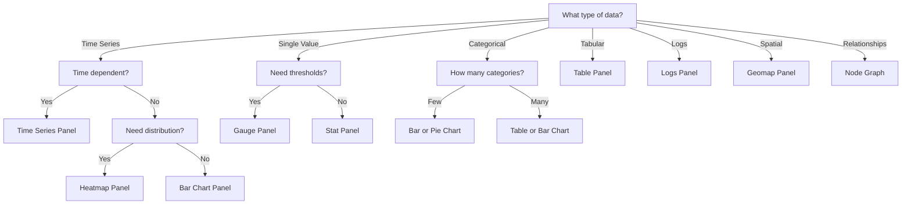

# Panel Types Overview

## Introduction

Panels are the fundamental building blocks of any Grafana dashboard. Each panel represents a specific visualization of your data, helping you to interpret metrics and logs effectively. Whether you're monitoring system performance, analyzing business metrics, or visualizing IoT data, choosing the right panel type is crucial for creating informative and actionable dashboards.

In this guide, we'll explore the various panel types available in Grafana, their specific use cases, and how to select the most appropriate visualization for your data storytelling needs.

## What Are Grafana Panels?

A panel in Grafana is a visual representation of your data. Each panel connects to a data source, applies queries to extract specific metrics, and then visualizes that data in a format that helps you derive insights.

Every panel in Grafana follows this basic workflow:



## Core Panel Types

### Time Series Panel

The Time Series panel is perhaps the most commonly used visualization in Grafana. It displays time series data as a line, bar, or points.

**Use cases:**
- Server CPU and memory usage over time
- Application response times
- User activity metrics

**Example configuration:**

```javascript
{
  "datasource": "Prometheus",
  "targets": [
    {
      "expr": "rate(http_requests_total[5m])",
      "legendFormat": "HTTP Requests"
    }
  ],
  "type": "timeseries",
  "options": {
    "legend": {
      "calcs": ["mean", "max"],
      "displayMode": "table",
      "placement": "bottom"
    }
  }
}
```

### Gauge Panel

Gauge panels show a single value in a radial gauge, helping you to quickly identify if a metric is within expected thresholds.

**Use cases:**
- Disk space utilization
- SLA compliance
- Performance against targets

**Example configuration:**

```javascript
{
  "datasource": "Prometheus",
  "targets": [
    {
      "expr": "(node_filesystem_avail_bytes / node_filesystem_size_bytes) * 100",
      "legendFormat": "Disk Space Available"
    }
  ],
  "type": "gauge",
  "options": {
    "thresholds": {
      "steps": [
        { "value": null, "color": "red" },
        { "value": 20, "color": "orange" },
        { "value": 50, "color": "green" }
      ]
    }
  }
}
```

### Stat Panel

The Stat panel displays a large statistic value with an optional graph sparkline. It's excellent for highlighting key metrics.

**Use cases:**
- Total number of users
- Error rates
- System uptime

**Example configuration:**

```javascript
{
  "datasource": "Prometheus",
  "targets": [
    {
      "expr": "sum(up)",
      "legendFormat": "Services Up"
    }
  ],
  "type": "stat",
  "options": {
    "colorMode": "value",
    "graphMode": "area",
    "justifyMode": "auto"
  }
}
```

### Bar Chart Panel

Bar charts display categorical data with rectangular bars proportional to the values they represent.

**Use cases:**
- Comparing values across different categories
- Showing distribution of resources
- Visualizing survey results

**Example configuration:**

```javascript
{
  "datasource": "MySQL",
  "targets": [
    {
      "rawSql": "SELECT department, COUNT(*) as count FROM employees GROUP BY department ORDER BY count DESC LIMIT 10",
      "refId": "A"
    }
  ],
  "type": "barchart"
}
```

### Pie Chart Panel

Pie charts show the proportional distribution of categories as slices of a circle.

**Use cases:**
- Resource allocation
- Market share analysis
- Traffic source breakdown

**Example configuration:**

```javascript
{
  "datasource": "Prometheus",
  "targets": [
    {
      "expr": "sum by (instance) (node_memory_MemTotal_bytes - node_memory_MemFree_bytes)",
      "legendFormat": "{{instance}}"
    }
  ],
  "type": "piechart"
}
```

### Table Panel

Table panels display data in a tabular format with sortable columns.

**Use cases:**
- Detailed log analysis
- Inventory management
- User lists with multiple attributes

**Example configuration:**

```javascript
{
  "datasource": "PostgreSQL",
  "targets": [
    {
      "rawSql": "SELECT id, username, last_login, status FROM users ORDER BY last_login DESC LIMIT 20",
      "refId": "A"
    }
  ],
  "type": "table",
  "options": {
    "showHeader": true,
    "sortBy": [
      {
        "displayName": "last_login",
        "desc": true
      }
    ]
  }
}
```

### Heatmap Panel

Heatmaps visualize data in a matrix format where individual values are represented as colors.

**Use cases:**
- Request latency distribution
- System load patterns over time
- Temperature variations

**Example configuration:**

```javascript
{
  "datasource": "Prometheus",
  "targets": [
    {
      "expr": "sum(rate(http_request_duration_seconds_bucket[5m])) by (le)",
      "format": "heatmap",
      "legendFormat": "{{le}}"
    }
  ],
  "type": "heatmap"
}
```

## Specialized Panel Types

### Logs Panel

The Logs panel is specifically designed for viewing and analyzing log data.

**Use cases:**
- Application error logs
- Access logs
- Audit trail analysis

**Example configuration:**

```javascript
{
  "datasource": "Loki",
  "targets": [
    {
      "expr": "{job=\"varlogs\"} |= \"error\"",
      "refId": "A"
    }
  ],
  "type": "logs"
}
```

### Node Graph Panel

Node graph panels visualize directed graphs or networks, showing relationships between entities.

**Use cases:**
- Service dependency mapping
- Network topology
- Customer journey flows

**Example configuration:**

```javascript
{
  "datasource": "Prometheus",
  "targets": [
    {
      "expr": "service_calls_total",
      "format": "node_graph"
    }
  ],
  "type": "nodeGraph"
}
```

### Geomap Panel

Geomaps display geospatial data on an interactive map.

**Use cases:**
- Server locations
- User distribution
- IoT device tracking

**Example configuration:**

```javascript
{
  "datasource": "PostgreSQL",
  "targets": [
    {
      "rawSql": "SELECT city, lat, lon, users FROM user_stats",
      "refId": "A"
    }
  ],
  "type": "geomap",
  "options": {
    "view": {
      "id": "zero",
      "lat": 0,
      "lon": 0,
      "zoom": 1
    }
  }
}
```

### Dashboard List Panel

This panel displays a list of your dashboards for easy navigation.

**Use cases:**
- Creating a dashboard of dashboards
- Quick access to related dashboards
- Organizing dashboards by team or service

**Example configuration:**

```javascript
{
  "type": "dashlist",
  "options": {
    "query": "",
    "tags": ["production", "servers"],
    "limit": 10,
    "folderId": 0,
    "includeVars": true,
    "showHeadings": true
  }
}
```

## Choosing the Right Panel Type

Selecting the appropriate panel type depends on several factors:

1. **Data type**: Time-series data works best with line graphs, while categorical data might be better visualized using bar or pie charts.

2. **Question you're answering**: 
   - "How has this changed over time?" → Time series
   - "What's the current status?" → Gauge or Stat
   - "How does X compare to Y?" → Bar chart
   - "What's the composition of this total?" → Pie chart

3. **Dashboard context**: Consider how this panel fits with other panels on your dashboard. Are you telling a coherent story?

4. **Audience**: Technical users might prefer detailed graphs, while executives might prefer summarized stats and gauges.

Here's a decision flow to help choose the right panel:



## Practical Examples

### Monitoring a Web Application

Let's consider a dashboard for monitoring a web application:

1. **Service Health Overview**:
   - Stat panel showing the number of healthy services
   - Gauge panel for overall system health score

2. **Performance Metrics**:
   - Time series panel for response times
   - Bar chart comparing performance across different API endpoints
   - Heatmap showing request latency distribution

3. **User Activity**:
   - Time series panel for user logins over time
   - Pie chart for user distribution by country
   - Table panel listing recent user registrations

4. **Error Tracking**:
   - Stat panel for total errors
   - Time series panel for error rate over time
   - Logs panel showing recent error messages

### Creating a Business KPI Dashboard

For a business metrics dashboard:

1. **Revenue Overview**:
   - Stat panel showing monthly revenue
   - Time series panel showing revenue trends
   - Gauge panel for progress toward quarterly targets

2. **Customer Analysis**:
   - Pie chart showing customer segments
   - Bar chart comparing customer acquisition channels
   - Geomap displaying customer locations

3. **Product Performance**:
   - Table panel listing top-selling products
   - Bar chart comparing product categories
   - Time series panel showing sales trends by product

## Customizing Panel Appearance

Most panel types in Grafana can be extensively customized to match your specific needs and visual preferences:

### Thresholds and Colors

You can set thresholds to change colors based on value ranges:

```javascript
"thresholds": {
  "mode": "absolute",
  "steps": [
    { "color": "green", "value": null },
    { "color": "yellow", "value": 70 },
    { "color": "red", "value": 90 }
  ]
}
```

### Unit Formatting

Properly formatted units make your panels more readable:

```javascript
"fieldConfig": {
  "defaults": {
    "unit": "bytes"
  }
}
```

Common units include:
- `short` (general numbers)
- `percent` (0-100%)
- `bytes` (data sizes)
- `ms` (milliseconds)
- `s` (seconds)
- `dateTimeFromNow` (relative time)

### Value Mapping

Map specific values to readable text:

```javascript
"mappings": [
  {
    "type": "value",
    "options": {
      "0": { "text": "Offline", "color": "red" },
      "1": { "text": "Online", "color": "green" }
    }
  }
]
```

## Advanced Panel Features

### Panel Linking

Link panels to other dashboards or external resources:

```javascript
"links": [
  {
    "title": "View Details",
    "url": "/d/abc123/detailed-metrics?var-server=${__series.name}"
  }
]
```

### Data Transformations

Transform your data before visualization:

```javascript
"transformations": [
  {
    "id": "organize",
    "options": {
      "excludeByName": {
        "time": true
      },
      "renameByName": {
        "value": "CPU Usage"
      }
    }
  }
]
```

### Repeat Panels

Create dynamic dashboards by repeating panels:

```javascript
"repeat": "server",
"repeatDirection": "h"
```

## Summary

Grafana offers a rich variety of panel types to visualize your data effectively. The key to creating insightful dashboards is selecting the right visualization for your specific data and use case:

- **Time Series panels** excel at showing changes over time
- **Gauge and Stat panels** highlight important single values
- **Bar and Pie charts** compare categories and show distributions
- **Tables** provide detailed data in a structured format
- **Specialized panels** like Logs, Node Graphs, and Geomaps address specific visualization needs

Remember that the best dashboards tell a story with your data. Carefully consider what questions you're trying to answer and choose panel types that help reveal those insights clearly.

## Exercises

1. Create a dashboard with at least three different panel types to monitor a fictional web application's performance.

2. Take an existing Time Series panel and recreate it as both a Bar Chart and a Stat panel. Compare the effectiveness of each visualization.

3. Design a dashboard that uses panel linking to create a drill-down experience from a high-level overview to detailed metrics.

4. Practice using thresholds and color mappings to make a dashboard that clearly indicates the health status of various systems at a glance.

## Additional Resources

- [Grafana Documentation on Visualizations](https://grafana.com/docs/grafana/latest/visualizations/)
- [Grafana Panel Library](https://grafana.com/grafana/dashboards/)
- [Data Visualization Best Practices](https://grafana.com/blog/2020/06/23/take-your-grafana-visualization-skills-to-the-next-level-with-these-tips-and-tricks/)