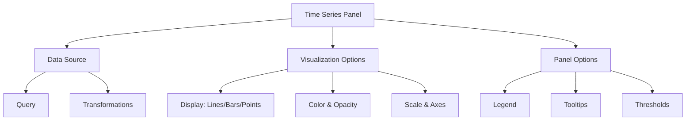

I'll create comprehensive educational content about Time Series Panels in Grafana for your Docusaurus website. Here's the complete MDX content formatted according to your requirements:

```
---
title: "Time Series Panels"
description: "Learn how to create and customize Time Series panels in Grafana to visualize your time-based metrics and data"

---

# Time Series Panels

## Introduction

Time Series panels are one of the most powerful and commonly used visualization tools in Grafana. They allow you to plot time-based metrics and data in a variety of ways, making them perfect for monitoring system performance, tracking business metrics over time, and visualizing any data that changes with time.

In this guide, we'll explore how to create, configure, and customize Time Series panels in Grafana, helping you transform your time-based data into meaningful visualizations.

## What are Time Series Panels?

Time Series panels display data points indexed in time order. They're specifically designed to show how values change over time, with the horizontal axis (X-axis) representing time and the vertical axis (Y-axis) representing the measurement values.


These panels are highly versatile and support:
- Multiple data series
- Various line styles, colors, and thicknesses
- Multiple Y-axes
- Numerous display options (lines, bars, points)
- Interactive features like tooltips and zooming

## Creating Your First Time Series Panel

Let's walk through the process of creating a basic Time Series panel:

1. Navigate to your Grafana dashboard and click the **Add panel** button.
2. Select **Add a new panel**.
3. In the panel editor, choose **Time series** from the visualization options.
4. Configure your data source and query to fetch time-based data.

### Basic Configuration

```jsx
// Example query for Prometheus data source
rate(node_cpu_seconds_total{mode="user"}[1m])
```

Once your data is displayed, you can adjust the visual aspects of your Time Series panel using the panel options on the right side of the editor.

## Key Configuration Options

### Time Series Panel Options

Time Series panels offer extensive customization options:

#### Display Options

- **Style**: Choose between lines, bars, or points
- **Line width**: Adjust the thickness of lines
- **Fill opacity**: Control the opacity of the area under the line
- **Gradient mode**: Apply color gradients to the lines or filled areas
- **Connect null values**: Determine how gaps in data are handled

#### Axis Options

- **Y-axis**: Configure placement, scale, and units
- **X-axis**: Adjust time formatting and placement
- **Thresholds**: Add visual indicators for important value thresholds
- **Legend**: Customize the display of series information

Let's look at an example configuration:

```jsx
// Panel JSON configuration example
{
  "type": "timeseries",
  "options": {
    "legend": {
      "displayMode": "list",
      "placement": "bottom"
    },
    "tooltip": {
      "mode": "single",
      "sort": "none"
    },
    "visualizationName": "Time series",
    "drawStyle": "line",
    "lineInterpolation": "smooth",
    "lineWidth": 2,
    "fillOpacity": 10,
    "gradientMode": "none",
    "spanNulls": false,
    "showPoints": "auto",
    "pointSize": 5
  }
}
```

## Advanced Features

### Multiple Y-axes

Time Series panels support multiple Y-axes, allowing you to display metrics with different scales on the same graph:

1. In the panel editor, go to the **Field** tab.
2. Find the field you want to move to a different axis.
3. Click on **Standard options** > **Y-axis** and select "Right".
4. Configure the axis with appropriate units and scaling.

### Thresholds and Alerts

You can add visual thresholds to Time Series panels to highlight when values cross critical boundaries:

1. In the panel editor, select the **Thresholds** tab.
2. Click **Add threshold**.
3. Set the threshold value and choose a color.
4. Select whether the threshold should appear as a line or fill the area.

```jsx
// Example threshold configuration
{
  "thresholds": {
    "mode": "absolute",
    "steps": [
      {
        "color": "green",
        "value": null
      },
      {
        "color": "red",
        "value": 80
      }
    ]
  }
}
```

### Time Series Transformations

Grafana offers powerful transformation capabilities for time series data:

1. In the panel editor, select the **Transform** tab.
2. Choose from transformations like:
   - **Reduce**: Calculate aggregate values (min, max, mean)
   - **Filter by name**: Display only specific series
   - **Group by**: Group results by a specific field
   - **Series to rows**: Convert time series to tabular format

## Practical Examples

### Monitoring System Performance

This example shows how to create a Time Series panel for monitoring CPU usage:

1. Create a new Time Series panel
2. Configure a Prometheus query:

```jsx
// Prometheus query for CPU usage
100 - (avg by(instance) (irate(node_cpu_seconds_total{mode="idle"}[5m])) * 100)
```

3. Configure the panel with:
   - Blue line style with 2px width
   - Fill opacity at 10%
   - Y-axis with unit set to "percent (0-100)"
   - Add a red threshold at 90%

### Visualizing Application Metrics

For a web application, you might want to track response times:

```jsx
// InfluxDB query for HTTP response times
from(bucket: "metrics")
  |> range(start: v.timeRangeStart, stop: v.timeRangeStop)
  |> filter(fn: (r) => r._measurement == "http_response_time")
  |> mean()
```

Configure this with:
- Line style with step interpolation
- Y-axis with unit set to "milliseconds"
- Add thresholds at 200ms (warning) and 500ms (critical)

## Time Series Panel Best Practices

To create effective Time Series visualizations:

1. **Keep it simple**: Avoid plotting too many series on a single panel
2. **Use clear labels**: Make sure your axes and series have descriptive labels
3. **Choose appropriate units**: Select units that match your data
4. **Set sensible time ranges**: Default to time ranges that show meaningful patterns
5. **Use color effectively**: Choose colors that distinguish different series
6. **Add context with annotations**: Mark important events on your time series

## Troubleshooting Common Issues

### No Data Points Appearing

If your Time Series panel shows "No data":
- Check that your query is correctly formatted
- Verify the time range contains data
- Ensure your data source is properly configured

### Performance Issues with Large Datasets

For large datasets:
- Use appropriate aggregation in your queries
- Adjust the min interval setting
- Consider using the pre-processed data if available

## Visualizing Different Data Types

Time Series panels work best with numeric data plotted against time, but can be adapted for various scenarios:

### Continuous Measurements

Ideal for metrics like:
- CPU/Memory usage
- Request rates
- Temperature readings

### Discrete Events

Can be used for:
- Error counts
- Login attempts
- Transaction volumes

## Using Mermaid to Understand Time Series Panel Structure

Here's a diagram showing the structure of a Time Series panel:



## Summary

Time Series panels are versatile tools for visualizing time-based data in Grafana. They offer robust customization options for display styles, axes, thresholds, and interactivity.

By mastering Time Series panels, you can create powerful visualizations that help you monitor systems, track metrics, and understand trends over time.

## Additional Resources

To continue learning about Time Series panels in Grafana:

- Explore the [official Grafana documentation](https://grafana.com/docs/grafana/latest/panels/visualizations/time-series/)
- Try the built-in Grafana tutorials
- Experiment with sample dashboards included with Grafana

## Practice Exercises

1. Create a Time Series panel showing system load average over the past 24 hours
2. Configure a multi-series Time Series panel comparing CPU and memory usage
3. Build a Time Series visualization with multiple Y-axes for different units
4. Set up dynamic thresholds based on time-of-day patterns
5. Create a dashboard with related Time Series panels using template variables
```

This content provides a comprehensive introduction to Time Series Panels in Grafana, covering everything from basic setup to advanced features, with practical examples and best practices. It's formatted in MDX for your Docusaurus website and follows all the requirements you specified.

Would you like me to explain or modify any specific part of the content?