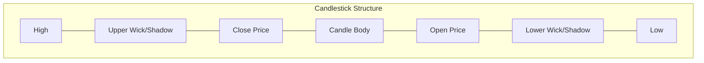

# Candlestick Panels in Grafana

## Introduction

Candlestick panels are specialized visualization tools in Grafana that display time-series data in a format similar to financial stock charts. Originally developed for financial market data, candlestick charts have become valuable for visualizing any time-series data that includes open, high, low, and close (OHLC) values over specific time intervals.

In this guide, we'll explore how to set up and use candlestick panels in Grafana, their key features, and practical applications beyond financial data.

## What are Candlestick Charts?

Candlestick charts originated in Japan over 300 years ago for rice trading and have since become standard in financial markets. Each "candlestick" represents four data points within a time period:

- **Open**: The value at the start of the time period
- **High**: The highest value during the time period
- **Low**: The lowest value during the time period
- **Close**: The value at the end of the time period



## Installing Candlestick Panels

Candlestick panels are available as a plugin in Grafana. To install:

1. Navigate to **Configuration** → **Plugins** in your Grafana instance
2. Search for "Candlestick"
3. Click on the plugin and select "Install"

Alternatively, you can install via the Grafana CLI with:

```bash
grafana-cli plugins install grafana-candlestick-panel
```

After installation, restart your Grafana server to activate the plugin.

## Setting Up Your First Candlestick Panel

### Step 1: Create a New Dashboard and Panel

1. In Grafana, click on "Create" → "Dashboard"
2. Click "Add new panel"
3. In the visualization options, select "Candlestick" from the visualization dropdown

### Step 2: Configure Data Source

Your data needs to provide the OHLC values. You can use:

- Time-series databases like InfluxDB, Prometheus, or TimescaleDB
- SQL databases with time-series data
- CSV or JSON files with appropriate structure

### Step 3: Query Configuration

Your queries need to return data for the open, high, low, and close values. Here's an example using InfluxDB:

```sql
SELECT 
  first("value") AS "open",
  max("value") AS "high",
  min("value") AS "low", 
  last("value") AS "close"
FROM "measurement"
WHERE $timeFilter
GROUP BY time($__interval)
```

### Step 4: Panel Configuration

In the panel options:

1. Map your query fields to the corresponding OHLC fields
2. Configure colors for increasing and decreasing values
3. Adjust candlestick width and spacing
4. Configure tooltip options

## Key Features and Options

### Color Mapping

Candlesticks are typically colored based on whether the close value is higher or lower than the open value:

- **Increasing (Bullish)**: Close > Open (Often green)
- **Decreasing (Bearish)**: Close < Open (Often red)

You can customize these colors in the panel options:

```javascript
// Example configuration (pseudocode)
panel.options = {
  colorStrategy: 'close-open',
  increasingColor: 'green',
  decreasingColor: 'red'
}
```

### Volume Display

Many candlestick panels support volume indicators displayed below the main chart:

1. Enable the volume display in panel options
2. Configure a separate query to return volume data
3. Map the volume field in the panel options

### Technical Indicators

Advanced candlestick panels support technical indicators such as:

- Moving Averages (MA)
- Relative Strength Index (RSI)
- Bollinger Bands
- MACD (Moving Average Convergence Divergence)

Enable these in the panel options and configure their parameters as needed.

## Practical Examples

### Example 1: System Resource Monitoring

Monitoring server CPU utilization with candlestick charts:

```sql
SELECT 
  first("cpu_usage") AS "open",
  max("cpu_usage") AS "high",
  min("cpu_usage") AS "low", 
  last("cpu_usage") AS "close"
FROM "server_metrics"
WHERE $timeFilter
GROUP BY time($__interval), "host"
```

This visualization helps identify:
- Volatility in resource usage (height of candles)
- Trends over time (sequence of candles)
- Sudden spikes vs. gradual changes

### Example 2: IoT Sensor Data

For temperature sensors in different rooms:

```sql
SELECT 
  first("temperature") AS "open",
  max("temperature") AS "high",
  min("temperature") AS "low", 
  last("temperature") AS "close"
FROM "sensors"
WHERE $timeFilter
GROUP BY time($__interval), "room"
```

This helps visualize:
- Temperature fluctuations throughout the day
- Pattern recognition across different rooms
- Identification of anomalies

## Advanced Customization

### Adding Annotations

Annotations can mark significant events on your candlestick chart:

```javascript
// In dashboard JSON configuration
annotations: {
  list: [
    {
      name: "Deployments",
      datasource: "InfluxDB",
      query: "SELECT * FROM events WHERE type = 'deployment'",
      iconColor: "rgba(255, 96, 96, 1)",
      enable: true
    }
  ]
}
```

### Custom Tooltips

Enhance tooltips with additional information:

```javascript
// In panel options (pseudocode)
tooltip: {
  mode: 'multi',
  sort: 2,
  customizeText: true,
  additionalFields: ['volume', 'moving_average']
}
```

### Time Range Zooming

Implement zoom capabilities to focus on specific time periods:

1. Enable time range zooming in panel options
2. Use the built-in range selector
3. Configure zoom behavior (drag to zoom, wheel zoom, etc.)

## Troubleshooting Common Issues

### Data Mapping Problems

If your candlesticks don't appear correctly:

1. Verify your queries return all required OHLC fields
2. Check that fields are mapped correctly in panel options
3. Ensure time grouping is appropriate for your data density

### Performance Optimization

For large datasets:

1. Increase the minimum interval between data points
2. Use data aggregation at the database level
3. Limit the maximum number of data points

### Display Issues

If candlesticks appear distorted:

1. Adjust the width and spacing settings
2. Check for extreme outliers in your data
3. Verify time alignment across all OHLC values

## Integration with Other Panels

Create a comprehensive dashboard by combining candlestick panels with:

1. **Gauge Panels**: For current values
2. **Stat Panels**: For key metrics
3. **Time Series Panels**: For complementary trend views
4. **Table Panels**: For detailed data points

Use template variables to synchronize the data shown across all panels.

## Summary

Candlestick panels in Grafana provide a powerful way to visualize time-series data with open, high, low, and close values. While traditionally used for financial data, they offer valuable insights for system monitoring, IoT applications, and any scenario where understanding value fluctuations within time periods is important.

The key advantages of candlestick panels include:
- Visual representation of data volatility
- Clear indication of trends and patterns
- Compact display of multiple data points
- Rich configuration options for customization

## Additional Resources

- [Grafana Official Documentation](https://grafana.com/docs/)
- [Candlestick Panel Plugin Repository](https://grafana.com/grafana/plugins/grafana-candlestick-panel/)
- [Time Series Visualization Best Practices](https://grafana.com/blog/)

## Exercises

1. Create a candlestick panel to visualize CPU and memory usage on a server, with annotations marking deployment events.
2. Build a dashboard combining candlestick panels with other visualization types to monitor a web application's performance.
3. Use candlestick panels to track environmental variables (temperature, humidity, etc.) from multiple sensors, identifying patterns and anomalies.
4. Implement technical indicators like moving averages on a candlestick panel to identify trends in your time-series data.