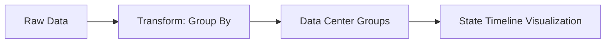

# State Timeline Panels

## Introduction

State Timeline panels are powerful visualization tools in Grafana that allow you to track and display state changes over time. They are particularly useful for monitoring systems where entities transition between different states, such as server status (up/down/maintenance), incident severities, or workflow stages.

Unlike traditional time series graphs that focus on numeric values, State Timeline panels excel at displaying categorical or discrete state data across time, making complex state transition patterns immediately visible and interpretable.


## When to Use State Timeline Panels

State Timeline panels are ideal when you need to:

- Track state changes of multiple entities over time
- Visualize the duration of different states
- Identify patterns or anomalies in state transitions
- Compare state behavior across multiple systems
- Monitor service level objectives (SLOs) based on system states

## Basic Concepts

Before diving into the configuration, let's understand some key concepts:

1. **States**: Discrete values or categories that your entity can have (e.g., "Critical", "Warning", "OK")
2. **Timeline**: The horizontal axis representing time
3. **Entities**: The different systems or components being monitored (displayed as rows)
4. **State transitions**: The changes from one state to another
5. **Color mapping**: Visual representation of different states using colors

## Setting Up a State Timeline Panel

### Step 1: Add the Panel

First, add a new panel to your dashboard:

1. Click the "Add panel" button in your Grafana dashboard
2. Select "Add a new panel"
3. From the visualization options, select "State Timeline"

### Step 2: Configure Data Source

State Timeline panels work with time series data where the values represent states. You can use various data sources:

```sql
-- Example SQL query that could power a state timeline
SELECT
  time,
  server_name as metric,
  state_value
FROM server_states
WHERE $__timeFilter(time)
ORDER BY time
```

For Prometheus, you might use:

```prometheus
max by (instance) (node_state)
```

### Step 3: Configure the Visualization

The panel has several important configuration options:

#### Display Options

- **Show values**: Determines whether to show the state values on the timeline
- **Row height**: Controls the height of each row in the timeline
- **Line width**: Sets the width of the lines separating different states

#### Value Mapping

The most important configuration is mapping your state values to meaningful display values and colors:

1. Go to the "Value mappings" tab in the panel options
2. Add mappings for each possible state value:

For example:
- Value `0` → Display text "Down" with red color
- Value `1` → Display text "Degraded" with yellow color
- Value `2` → Display text "Healthy" with green color

```javascript
// Example mapping configuration (conceptual)
const valueMappings = [
  { value: 0, text: "Down", color: "red" },
  { value: 1, text: "Degraded", color: "yellow" },
  { value: 2, text: "Healthy", color: "green" }
];
```

#### Legend Options

Configure how the legend displays:
- Show/hide legend
- Position (bottom, right)
- Display values (min, max, avg, current)

## Advanced Configuration

### Using Thresholds

Instead of discrete value mappings, you can use thresholds to map ranges of values to states:

1. Go to the "Thresholds" tab
2. Add threshold steps that define your state boundaries
3. Assign colors to each threshold range

This is useful when your raw data represents a continuous metric that you want to categorize into states.

### Time Region Annotations

You can add time region annotations to highlight specific time periods:

1. Go to Dashboard settings → Annotations
2. Add a new annotation query
3. Configure it to target maintenance windows or important events

This helps provide context to state changes by highlighting scheduled events or incidents.

### Using Transformations

Transformations can help prepare your data for state timeline visualization:

1. In the panel edit view, go to the "Transform" tab
2. Consider using:
   - **Reduce** transformation to consolidate values
   - **Group By** to organize entities
   - **Filter by value** to focus on specific states

Example transformation to group by server type:

```javascript
// Conceptual example of transformation logic
function groupByServerType(data) {
  return data.reduce((result, item) => {
    const serverType = item.labels.server_type;
    if (!result[serverType]) {
      result[serverType] = [];
    }
    result[serverType].push(item);
    return result;
  }, {});
}
```

## Practical Examples

### Example 1: Monitoring Server States

In this example, we'll create a State Timeline panel to monitor the status of multiple servers:

1. Set up a query that returns server state data:

```sql
SELECT
  time,
  hostname as metric,
  state
FROM server_monitoring
WHERE $__timeFilter(time)
ORDER BY time
```

2. Configure value mappings:
   - `0` → "Offline" (Red)
   - `1` → "Starting" (Blue)
   - `2` → "Online" (Green)
   - `3` → "Maintenance" (Orange)

3. Group servers by data center:



This visualization lets you quickly spot patterns like cascading failures or maintenance windows across your infrastructure.

### Example 2: Incident Management Workflow

Create a State Timeline panel to track incidents through their lifecycle:

1. Configure a query to retrieve incident states:

```sql
SELECT
  time,
  incident_id as metric,
  state_id
FROM incident_tracking
WHERE $__timeFilter(time)
ORDER BY time
```

2. Set up value mappings:
   - `1` → "Detected" (Red)
   - `2` → "Triaged" (Orange)
   - `3` → "Investigating" (Yellow)
   - `4` → "Fixing" (Blue)
   - `5` → "Resolved" (Green)
   - `6` → "Closed" (Gray)

3. Sort incidents by priority or detection time

This visualization helps identify incidents that take too long to resolve or get stuck in particular states.

## Common Challenges and Solutions

### Challenge: Too Many Entities

If you have too many entities (rows) in your timeline:

**Solution**: Use transformations to:
- Group similar entities
- Filter to show only critical entities
- Create multiple panels with different entity subsets

### Challenge: Irregular Data Points

If your state data has irregular intervals:

**Solution**: 
- Ensure your query returns a value for every state change
- Consider using a "fill missing" transform or similar logic in your data source

### Challenge: Unclear State Transitions

If state transitions aren't clear:

**Solution**:
- Adjust color contrast between states
- Use annotations to mark important transitions
- Consider adding hover tooltips with additional context

## Integration with Alerts

State Timeline panels work well with Grafana alerts:

1. Create an alert rule based on the state data
2. Configure the alert to trigger when certain states persist too long
3. Have the State Timeline panel display in alert notification screenshots

```javascript
// Conceptual example of alerting logic
const alertCondition = {
  target: "server_state",
  condition: "value == 0", // Down state
  duration: "5m",          // For at least 5 minutes
  severity: "critical"
};
```

## Summary

State Timeline panels in Grafana provide a powerful way to visualize state changes over time. They excel at:

- Displaying discrete states for multiple entities
- Showing the duration of each state
- Making patterns and anomalies visually apparent
- Providing context to system behavior

By properly configuring value mappings, thresholds, and transformations, you can create insightful visualizations that help monitor complex systems with multiple state transitions.

## Additional Resources

- [Grafana State Timeline Documentation](https://grafana.com/docs/grafana/latest/panels/visualizations/state-timeline/)
- [Value Mapping in Grafana](https://grafana.com/docs/grafana/latest/panels/value-mappings/)
- [Grafana Transformations](https://grafana.com/docs/grafana/latest/panels/transformations/)

## Exercises

1. Create a State Timeline panel showing the status of 5 different servers over the past 24 hours.
2. Configure value mappings for at least 4 different states with appropriate colors.
3. Add annotations to mark maintenance windows.
4. Create a State Timeline that groups entities by their type or location.
5. Set up an alert that triggers when an entity stays in a critical state for more than 10 minutes.