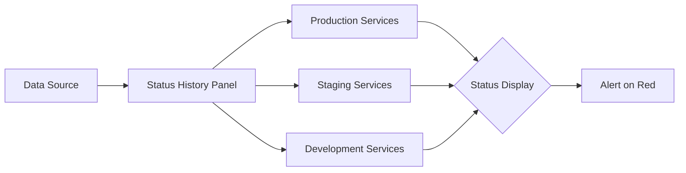

# Status History Panels

## Introduction

Status History panels in Grafana provide a powerful way to visualize state changes, threshold violations, or status information over time. Unlike other visualization types that focus on continuous numeric values, Status History panels excel at showing discrete states - such as "critical," "warning," "ok" - as color-coded blocks across a timeline.

This type of visualization is particularly useful for:
- Monitoring system states or status changes
- Tracking SLA (Service Level Agreement) compliance over time
- Visualizing uptime/downtime periods
- Displaying threshold violations across multiple services or components

## Understanding Status History Panels

A Status History panel represents data as a series of colored cells arranged horizontally across time. Each row typically represents a different series or entity, and the color of each cell indicates the state or status at that particular time.

### Key Concepts

- **States**: Discrete values that represent different conditions (like "ok", "warning", "critical")
- **Thresholds**: Value ranges that determine which state/color to display
- **Time Buckets**: How the time range is divided into discrete cells
- **Color Mapping**: How values or states are mapped to specific colors

## Creating Your First Status History Panel

Let's walk through creating a basic Status History panel in Grafana:

### Step 1: Add a new panel

From your Grafana dashboard, click the "Add panel" button and select "Status History" from the visualization options.

### Step 2: Configure your data source

Select your data source and write a query that returns time-series data with discrete states or values that can be mapped to states.

For example, with Prometheus, you might use a query like:

```sql
status_code{service="api"}
```

Or with InfluxDB:

```sql
SELECT "status" FROM "monitoring"."autogen"."system_health" WHERE $timeFilter GROUP BY "host"
```

### Step 3: Configure the visualization

In the panel editor, navigate to the "Panel options" tab to set up how your Status History panel should display data:

1. **Value Mapping**: Define how numeric or string values map to display text and colors
2. **Thresholds**: Set value ranges and associate them with colors
3. **Legend**: Configure how the legend should appear
4. **Tooltip**: Customize what information appears in tooltips

## Configuring Value Mappings

Value mappings allow you to transform the raw values from your data source into meaningful states with associated colors.

Navigate to the "Value mappings" section under "Panel options" and configure mappings:

```javascript
// Example value mapping configuration
[
  { value: 0, text: "Down", color: "red" },
  { value: 1, text: "Degraded", color: "yellow" },
  { value: 2, text: "Operational", color: "green" }
]
```

## Working with Thresholds

Alternatively, you can use thresholds to map numeric values to states based on ranges:

1. Go to the "Thresholds" section
2. Add threshold steps with values and colors
3. For example:
   - Base: Green (for values below first threshold)
   - > 0.7: Yellow (warning)
   - > 0.9: Red (critical)

## Real-World Example: Service Uptime Monitoring

Let's create a Status History panel that visualizes uptime for multiple services:

### Step 1: Create a query that returns service status data

```sql
// Example Prometheus query
max by(service) (probe_success{job="blackbox"})
```

This query returns 1 when a service is up and 0 when it's down.

### Step 2: Configure value mappings

- Map 0 to "Down" with red color
- Map 1 to "Up" with green color

### Step 3: Configure display options

- Set "Show values" to "Never" for a cleaner view
- Enable "Fill opacity" to 100%
- Group by "service" to have each service as a separate row

The resulting panel will show a row for each service with green blocks for uptime periods and red blocks for downtime periods, making it easy to spot patterns and issues at a glance.

## Using Status History for Alert Visualization

Status History panels can effectively visualize alert states over time:

### Example query (Prometheus Alertmanager):

```sql
ALERTS{alertstate="firing"}
```

### Configure value mappings:

- Map 1 to "Firing" with red color
- Map 0 to "Resolved" with green color

This gives you a clear picture of when alerts were active across your monitored systems.

## Advanced Configuration

### Time Bucket Size

The "Bucket size" setting controls how time is divided into discrete cells. Smaller bucket sizes provide more granular information but may reduce readability for large time ranges.

Adjust this setting based on:
- The time range you're displaying
- The frequency of state changes in your data
- The level of detail needed

### Cell Gap Settings

You can control the spacing between cells using the "Cell gap" setting. This can improve readability when you have many rows or dense state changes.

### Combining with Other Visualizations

Status History panels work well alongside other visualization types like Graphs or Stat panels:

- Use a Graph panel to show continuous metrics
- Add a Status History panel below to show state changes
- Link them with the same time range

This combination provides both detailed metrics and a high-level status overview.

## Troubleshooting

### Common Issue: No Data Appears

If your Status History panel isn't displaying data:

1. Check your query is returning data in the proper format
2. Verify your thresholds or value mappings match the actual data values
3. Ensure your time range includes periods where the state data exists

### Common Issue: Wrong Colors

If colors don't match your expectations:

1. Check your value mappings or thresholds configuration
2. Verify the precedence order of your threshold steps
3. Make sure data values match exactly what you've configured in mappings

## Best Practices

1. **Keep it simple** - Limit the number of rows to prevent the panel from becoming too cluttered
2. **Use consistent colors** - Maintain consistent color schemes across dashboards (e.g., red for critical, yellow for warning, green for ok)
3. **Provide context** - Use descriptive legends and tooltips to explain what each state represents
4. **Combine with other panels** - Use Status History alongside other visualization types for more comprehensive monitoring
5. **Group effectively** - Group related services or components together for easier comparison

## Example: Multi-Environment Status Monitoring

Let's create a Status History panel that shows the status of services across different environments:



### Implementation:

1. Create a query that returns status for all services, tagged by environment
2. Group data by environment and service name
3. Use color-coding to represent different status levels
4. Add threshold-based alerting on critical status

## Summary

Status History panels provide an effective way to visualize discrete states or status changes over time. They excel at showing patterns in state changes, making them ideal for monitoring system health, tracking service status, or visualizing alert history.

With proper configuration of thresholds, value mappings, and display options, Status History panels can provide powerful at-a-glance insights into the historical behavior of your systems.

## Additional Resources

- Explore Grafana's official documentation on Status History panels
- Practice creating different threshold configurations to understand their impact
- Try combining Status History panels with variables to create dynamic, interactive dashboards

## Exercises

1. Create a Status History panel showing the uptime status of three different services over the past 24 hours.
2. Configure a Status History panel with different threshold levels (0-50%, 51-90%, 91-100%) to visualize performance tiers.
3. Build a dashboard that combines a Status History panel with Graph panels to show both the raw metrics and status information for a critical system.