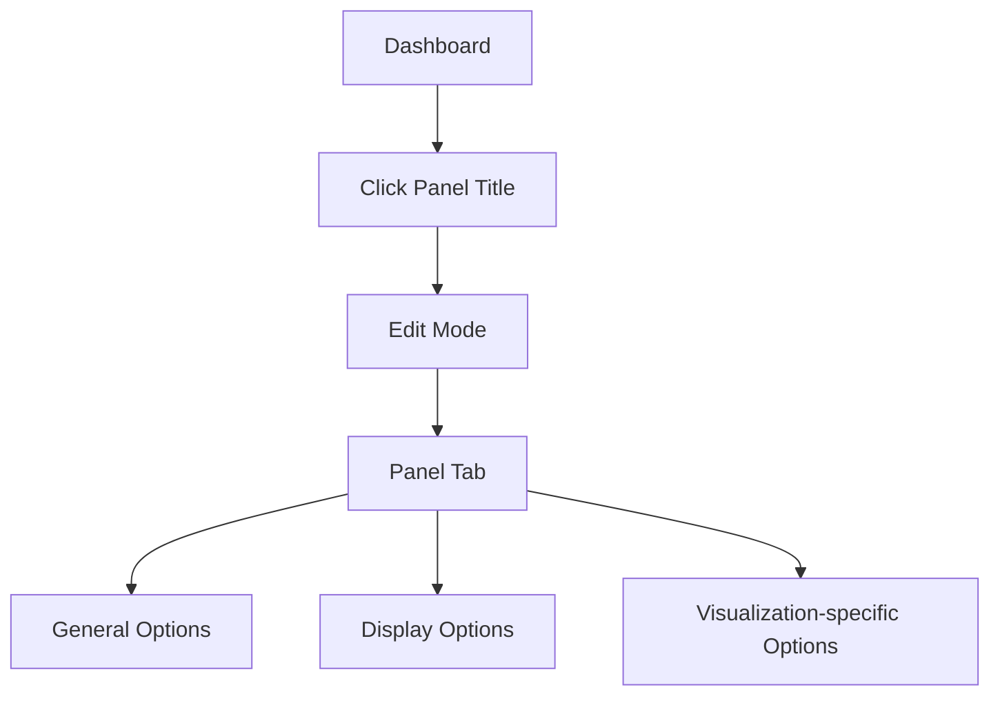

# Panel Options

## Introduction

Panel options are configuration settings that allow you to customize how your visualizations appear and behave in Grafana dashboards. These options give you control over titles, descriptions, transparency, and many other aspects of your panels without changing the underlying data or visualization type.

Understanding panel options is essential for creating effective and visually appealing dashboards in Grafana. In this guide, we'll explore the common panel options available across different visualization types and how to use them effectively.

## Core Panel Options

Every panel in Grafana, regardless of the visualization type, shares a common set of panel options. These options are accessible from the Panel tab in the panel editor.

### Panel Header

The panel header contains the title and description of your panel, along with controls for the time range and other panel actions.

```
Panel Header
│
├── Title — A descriptive name for your panel
├── Description — Additional context about the panel's purpose
└── Links — Custom navigation links to other dashboards or external resources
```

Let's look at how to configure these options:

#### Title and Description

```jsx
// Panel header configuration example
<Panel>
  <Title>Server CPU Usage</Title>
  <Description>Shows CPU utilization across all application servers in production</Description>
</Panel>
```

#### Panel Links

Panel links are useful for creating navigation between related dashboards or to external documentation:

```jsx
// Adding a panel link
<PanelLink>
  <LinkTitle>Server Details</LinkTitle>
  <LinkURL>https://grafana.example.com/d/server-details</LinkURL>
</PanelLink>
```

### Visualization Display Options

#### Size and Position

You can control how your panel is sized and positioned within your dashboard:

- **Width**: The number of grid columns the panel occupies
- **Height**: The height of the panel in grid units
- **Position**: The x and y coordinates of the panel on the dashboard grid

Panels can be resized by dragging the panel borders or by setting specific dimensions in the dashboard settings.

#### Transparency and Background

You can adjust the panel's background transparency to create layered visualizations or to emphasize certain panels:

```jsx
// Setting panel transparency
<PanelOptions>
  <Transparent>true</Transparent>
  <BackgroundColor>dark-blue</BackgroundColor>
</PanelOptions>
```

## Visualization-Specific Options

Each visualization type has its own set of specific options that control how data is displayed. Here are some common visualization-specific options:

### Graph Panel Options

For graph panels, you can configure:

- **Legend**: Position, visibility, and values shown in the legend
- **Tooltip**: Format, sharing, and values shown on hover
- **Axes**: Units, scale, label placement, and grid lines
- **Thresholds**: Visual indicators for important values

Example of configuring graph panel options:

```jsx
<GraphPanelOptions>
  <Legend>
    <Position>bottom</Position>
    <Values>
      <Show>true</Show>
      <Min>true</Min>
      <Max>true</Max>
      <Avg>true</Avg>
      <Current>true</Current>
    </Values>
  </Legend>
  <Tooltip>
    <Mode>single</Mode>
    <Sort>descending</Sort>
  </Tooltip>
</GraphPanelOptions>
```

### Table Panel Options

For table panels, options include:

- **Column Width**: Fixed or percentage-based column widths
- **Column Alignment**: Left, center, or right alignment of text
- **Cell Display Mode**: How to display the cell values (color background, gradient, etc.)
- **Pagination**: Enable/disable and control rows per page

Example of table panel options:

```jsx
<TablePanelOptions>
  <Columns>
    <Column>
      <Name>Time</Name>
      <Width>150</Width>
      <Align>left</Align>
    </Column>
    <Column>
      <Name>Value</Name>
      <Width>100</Width>
      <Align>right</Align>
      <ColorMode>value</ColorMode>
    </Column>
  </Columns>
  <Pagination>
    <Enabled>true</Enabled>
    <RowsPerPage>10</RowsPerPage>
  </Pagination>
</TablePanelOptions>
```

## Working with Panel Options

### Accessing Panel Options

To access panel options:

1. Click on the panel title to open the panel in edit mode
2. Select the "Panel" tab in the right sidebar
3. Expand the sections to view and modify different options



### Real-World Example: Creating a Production Monitoring Dashboard

Let's walk through configuring panel options for a production monitoring dashboard:

1. **Create a CPU Usage Graph Panel**:

```jsx
// CPU Usage Panel Configuration
<Panel>
  <Title>CPU Usage by Server</Title>
  <Description>Shows CPU usage trends across all production servers</Description>
  <PanelOptions>
    <Transparent>false</Transparent>
    <DisplayName>CPU Usage (%)</DisplayName>
  </PanelOptions>
  <GraphOptions>
    <Legend>
      <Show>true</Show>
      <Position>bottom</Position>
    </Legend>
    <Tooltip>
      <Mode>multi</Mode>
    </Tooltip>
    <Axes>
      <LeftY>
        <Unit>percent</Unit>
        <Min>0</Min>
        <Max>100</Max>
      </LeftY>
    </Axes>
    <Thresholds>
      <Threshold>
        <Value>80</Value>
        <ColorMode>critical</ColorMode>
        <FillColor>rgba(255, 0, 0, 0.2)</FillColor>
        <LineColor>#FF0000</LineColor>
      </Threshold>
    </Thresholds>
  </GraphOptions>
</Panel>
```

2. **Create a Memory Usage Gauge Panel**:

```jsx
// Memory Usage Gauge Panel Configuration
<Panel>
  <Title>Memory Usage</Title>
  <Description>Current memory utilization across server fleet</Description>
  <PanelOptions>
    <Transparent>false</Transparent>
  </PanelOptions>
  <GaugeOptions>
    <ShowThresholdLabels>true</ShowThresholdLabels>
    <ShowThresholdMarkers>true</ShowThresholdMarkers>
    <Thresholds>
      <Steps>
        <Step><Color>green</Color><Value>0</Value></Step>
        <Step><Color>orange</Color><Value>70</Value></Step>
        <Step><Color>red</Color><Value>85</Value></Step>
      </Steps>
    </Thresholds>
  </GaugeOptions>
</Panel>
```

### Advanced Panel Options Techniques

#### Using Variables in Panel Titles

You can make your panels dynamic by incorporating dashboard variables in the panel titles:

```jsx
<Panel>
  <Title>CPU Usage - $server</Title>
  <Description>CPU usage for the selected server: $server</Description>
</Panel>
```

#### Time Range Controls

You can override the default dashboard time range for specific panels:

```jsx
<Panel>
  <Title>Long-term Memory Trend</Title>
  <PanelOptions>
    <TimeFrom>now-30d</TimeFrom>
    <TimeTo>now</TimeTo>
    <TimeShift>1h</TimeShift>
  </PanelOptions>
</Panel>
```

#### Repeat Panels

Create multiple panels based on a variable:

```jsx
<Panel>
  <Title>Memory Usage - $server</Title>
  <RepeatOptions>
    <RepeatBy>$server</RepeatBy>
    <Direction>horizontal</Direction>
    <MaxPerRow>3</MaxPerRow>
  </RepeatOptions>
</Panel>
```

## Panel Options Reference

Here's a quick reference of common panel options categories:

| Category | Description | Examples |
|----------|-------------|----------|
| General | Basic panel settings | Title, description, transparent background |
| Display | Visual appearance | Custom width/height, panel padding |
| Data Links | Navigation from panel data | URLs with variable interpolation |
| Thresholds | Visual indicators for values | Warning/critical thresholds with colors |
| Value Mappings | Convert values to text | Map numeric values to status text |
| Overrides | Override settings for specific fields | Custom colors for specific metrics |
| Repeat Options | Duplicate panels for variables | Repeat by server, application, etc. |

## Best Practices for Panel Options

1. **Use Clear Titles and Descriptions**: Always provide descriptive titles and useful descriptions to make dashboards self-explanatory.

2. **Be Consistent**: Maintain consistent styling across related panels to create a cohesive dashboard experience.

3. **Use Thresholds Effectively**: Configure thresholds to highlight normal, warning, and critical values to make issues stand out.

4. **Leverage Variables**: Use dashboard variables in panel titles and descriptions to make panels context-aware.

5. **Optimize for Reading**: Configure legends, axes, and tooltips to make data easily interpretable at a glance.

6. **Group Related Panels**: Use rows and panel arrangement to group related metrics together.

7. **Consider Color Blindness**: Choose color schemes that are accessible to users with color vision deficiencies.

## Summary

Panel options provide powerful customization capabilities that allow you to transform raw data into informative and visually appealing dashboards in Grafana. By mastering these options, you can create dashboards that effectively communicate insights and help users quickly identify issues.

In this guide, we've covered:
- Core panel options available to all visualization types
- Visualization-specific options for graphs, tables, and other panel types
- How to access and configure panel options
- Real-world examples of panel configuration
- Best practices for effective dashboard design

## Additional Resources

- Practice by creating a multi-panel dashboard that monitors different aspects of a system
- Experiment with different visualization types and their specific options
- Try creating a dashboard that uses variables to make panels dynamic and interactive
- Explore the Grafana documentation for detailed information about specific visualization options