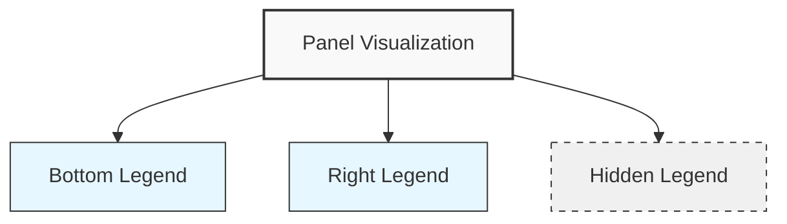

# Panel Legend

## Introduction

In data visualization, a legend serves as a crucial reference guide that helps users interpret the displayed information. In Grafana, the panel legend provides context to your visualizations by identifying which colors, lines, or points correspond to specific metrics or data series. A well-configured legend transforms raw visualizations into meaningful insights by making your dashboards more readable and interpretable.

This guide focuses on understanding, configuring, and customizing legends in Grafana panels to enhance your data visualizations and improve the overall user experience of your dashboards.

## Understanding Panel Legends in Grafana

### What is a Panel Legend?

A panel legend is a key component of Grafana visualizations that maps visual elements (like colors, lines, and points) to their corresponding data series or metrics. It typically appears as a labeled color-coded list that helps dashboard users understand what each element in the visualization represents.

### Why Legends Matter

Proper legend configuration is essential for:

- **Data interpretation**: Helps users understand what metrics are being displayed
- **Dashboard readability**: Reduces cognitive load by providing clear references
- **Information density**: Allows you to display additional contextual information
- **Visualization aesthetics**: Contributes to a clean, professional dashboard appearance

## Legend Configuration Options

Grafana offers extensive customization options for panel legends. Let's explore the key configuration areas:

### Legend Visibility and Placement

You can control where and if legends appear in your panels:

```jsx
// Example configuration in panel JSON
"legend": {
  "showLegend": true,
  "placement": "bottom",
  "calcs": ["mean", "max"]
}
```

The placement options include:

- **Bottom** (default): Places the legend below the visualization
- **Right**: Places the legend to the right of the visualization
- **Hidden**: Completely hides the legend

### Legend Display Modes

Grafana offers different legend display modes to suit various use cases:

- **List**: Displays legends as a vertical or horizontal list (default)
- **Table**: Arranges legends in a tabular format with calculated values
- **Hidden**: Completely hides the legend

Here's how to set the display mode:

```jsx
"legend": {
  "displayMode": "table"
}
```

### Legend Values and Calculations

One of the most powerful features of Grafana legends is the ability to display calculated values alongside series names. These calculations provide additional context about your data directly in the legend.

Common calculations include:

- **min**: Minimum value in the series
- **max**: Maximum value in the series
- **mean**: Average value of the series
- **last**: Most recent value in the series
- **sum**: Sum of all values in the series
- **count**: Number of data points in the series

Example configuration:

```jsx
"legend": {
  "displayMode": "table",
  "placement": "bottom",
  "calcs": ["min", "max", "mean", "lastNotNull"]
}
```

## Practical Legend Configuration Examples

Let's look at some practical examples of legend configurations for different visualization scenarios.

### Example 1: Basic Time Series with Simple Legend

For a simple time series visualization showing CPU usage across multiple servers:

```jsx
"legend": {
  "showLegend": true,
  "placement": "bottom",
  "displayMode": "list",
  "calcs": ["lastNotNull"]
}
```

This configuration:
- Shows a legend at the bottom of the panel
- Displays it in list format
- Shows only the most recent value for each series

### Example 2: Detailed Performance Dashboard

For a detailed performance dashboard that needs to display multiple statistics:

```jsx
"legend": {
  "showLegend": true,
  "placement": "right",
  "displayMode": "table",
  "calcs": ["min", "max", "mean", "lastNotNull"]
}
```

This configuration:
- Places the legend on the right side of the panel
- Uses table format for better readability of multiple values
- Shows minimum, maximum, average, and current values for each series

### Example 3: Space-Optimized Dashboard

For dashboards where space is at a premium:

```jsx
"legend": {
  "showLegend": true,
  "placement": "bottom",
  "displayMode": "list",
  "width": 150,
  "calcs": []
}
```

This configuration:
- Shows a compact legend at the bottom
- Limits the width to 150 pixels
- Displays only series names without calculations

## Advanced Legend Customization

### Legend Sorting

You can sort legend items based on various criteria:

```jsx
"legend": {
  "sortBy": "Max",
  "sortDesc": true
}
```

This sorts legend items by their maximum values in descending order.

### Custom Legend Values

In some Grafana versions and panel types, you can define custom legend formats using variables and patterns:

```jsx
"legendFormat": "{{instance}} - {{job}}"
```

This displays both the instance and job labels in your legend.

### Legend Interactions

Legends in Grafana are interactive. Users can:

- Click on a legend item to hide/show the corresponding series
- Ctrl+click (or Cmd+click) to isolate a single series
- Hover over legend items to highlight the corresponding series

## Working with Legends in Different Panel Types

Different panel types have slightly different legend behaviors and options:

### Time Series Panel

Time series panels offer the most comprehensive legend options, including table mode with multiple calculations.

### Stat and Gauge Panels

These panels typically have simplified or no legends since they usually display single values.

### Bar and Pie Charts

These panels benefit from legends to identify different categories or segments.

### Heatmaps

Heatmap legends are usually color scales rather than series identifiers.

## Legend Best Practices

For effective legend use in Grafana:

1. **Be selective with calculations**: Only show values that add context
2. **Consider dashboard real estate**: Use right placement for wide panels and bottom placement for narrow panels
3. **Use consistent legend configuration**: Maintain similar legend styles across related panels
4. **Choose appropriate legend modes**: Use table mode for detailed analysis and list mode for simple identification
5. **Leverage interactive features**: Teach users about clicking legends to toggle series visibility

## Legend Configuration via Dashboard JSON

For advanced users, you can directly edit the dashboard JSON to configure legends:

```jsx
"panels": [
  {
    "id": 1,
    "title": "My Panel",
    "type": "timeseries",
    "legend": {
      "showLegend": true,
      "displayMode": "table",
      "placement": "bottom",
      "calcs": ["min", "max", "mean", "lastNotNull"],
      "sortBy": "Max",
      "sortDesc": true
    }
  }
]
```

## Common Legend Issues and Solutions

### Issue: Legend Too Large

**Solution**: Use the following approaches:
- Switch to list mode instead of table mode
- Reduce the number of calculations displayed
- Consider hiding the legend and using tooltips instead

### Issue: Confusing Series Names

**Solution**: Use custom legend formats with template variables to create more readable legend entries.

### Issue: Legend Cluttering the Visualization

**Solution**: Move the legend to the right side or consider hiding it completely for very dense visualizations.

## Visualizing Legend Placement Options

Here's a diagram showing the different legend placement options in Grafana:



## Summary

Panel legends are essential components of effective data visualization in Grafana. They provide context and meaning to your metrics, making dashboards more interpretable and valuable.

In this guide, we've covered:
- The purpose and importance of legends in Grafana panels
- Basic and advanced legend configuration options
- Practical examples for different use cases
- Best practices for effective legend implementation
- Common issues and their solutions

By thoughtfully configuring your panel legends, you can significantly enhance the clarity and usefulness of your Grafana dashboards.

## Additional Resources

- Explore the [Grafana documentation](https://grafana.com/docs) for more details on panel configuration
- Practice creating different legend styles on a test dashboard
- Experiment with different calculations to see what provides the most value for your specific metrics

## Exercises

1. Create a time series panel with CPU usage data and configure the legend to show min, max, and current values in a table format.
2. Build a dashboard with multiple related panels and implement consistent legend styling across all panels.
3. Create a panel with many series (10+) and develop a legend strategy that maintains readability.
4. Configure a custom legend format that combines multiple labels or dimensions for better context.