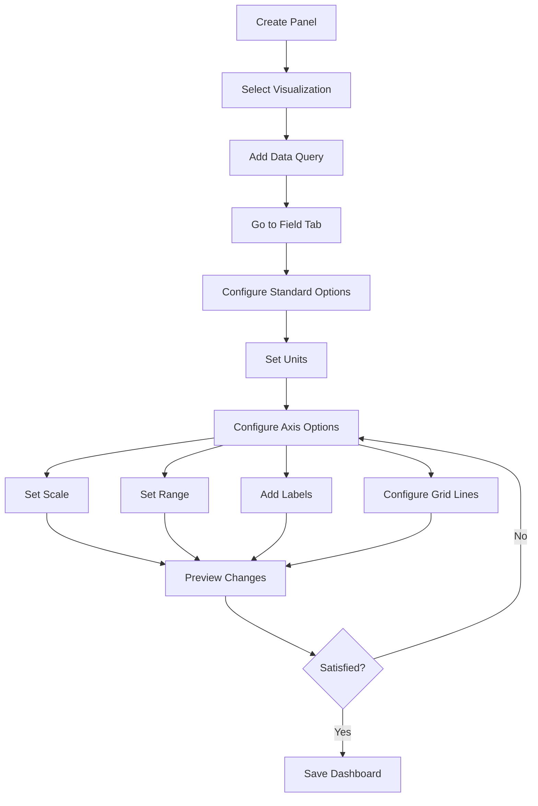

# Panel Axes

## Introduction

Axes are fundamental components of many data visualizations in Grafana. They provide the framework for interpreting the data displayed in graphs, time series, and other panel types. Properly configured axes help viewers understand the scale, range, and relationship between data points, making your visualizations more intuitive and informative.

In this guide, we'll explore how to configure and customize panel axes in Grafana to enhance your dashboards and make your data tell a clearer story.

## Understanding Axes in Grafana Panels

Most Grafana graph-based visualizations have two primary axes:

- **X-axis**: Typically represents time in time series visualizations (horizontal axis)
- **Y-axis**: Usually represents the measured values (vertical axis)

Some panel types support multiple Y-axes, allowing you to display different metrics with different scales on the same graph.

## Basic Axes Configuration

Let's start by exploring the basic configuration options available for axes in Grafana panels.

### Accessing Axes Options

To configure axes for any panel:

1. Edit your dashboard and select the panel you want to modify
2. Click on the "Field" tab in the panel editor
3. Scroll down to find the "Axes" section

### Common Axes Settings

Here are the most common settings you'll work with:

- **Placement**: Determine where axes appear (left, right, bottom, top)
- **Scale**: Linear, logarithmic, or other scaling options
- **Range**: Min/max values, or auto scaling
- **Label**: Custom text to describe what the axis represents
- **Unit**: The unit of measurement (seconds, bytes, percentage, etc.)
- **Decimals**: Number of decimal places to display

## Configuring the Y-axis

The Y-axis (vertical axis) is particularly important as it displays the magnitude of your data values.

### Basic Y-axis Example

Here's how to configure a basic Y-axis for a time series panel:

```javascript
// This code would be part of your panel JSON configuration
"yaxes": [
  {
    "format": "short",
    "label": "Memory Usage",
    "logBase": 1,
    "max": null,
    "min": 0,
    "show": true
  },
  {
    "format": "short",
    "label": null,
    "logBase": 1,
    "max": null,
    "min": null,
    "show": false
  }
]
```

### Setting Units

One of the most important Y-axis settings is the unit. Grafana supports numerous units including:

- Data units (bytes, bits)
- Time units (seconds, minutes, hours)
- Throughput units (ops/sec, requests/sec)
- Percentage
- Currency values
- And many more

To set a unit in the UI:

1. In the panel editor, go to the "Field" tab
2. Find the "Standard options" section
3. Click on "Unit" and select from the dropdown list

This helps viewers understand what the values represent without requiring additional explanation.

### Scale Transformations

Grafana offers several scale transformations to better visualize your data:

- **Linear**: Standard linear scale (default)
- **Logarithmic**: Helpful for data with large value ranges
- **Symlog**: Combination of linear and logarithmic that handles zero and negative values
- **Time**: Specialized for time measurements

Here's how to configure a logarithmic scale for a panel:

```javascript
"yaxes": [
  {
    "format": "bytes",
    "label": "Memory Consumption",
    "logBase": 10,  // 10 for logarithmic scale
    "max": null,
    "min": null,
    "show": true
  }
]
```

### Multiple Y-axes

Some visualizations benefit from multiple Y-axes when displaying metrics with different units or scales.

To add a second Y-axis:

1. In the panel editor, click on the "Field" tab
2. Select the field you want to display on the second axis
3. In "Field Config" > "Standard options", set "Display name"
4. Enable "Custom options" > "Axes placement" and select "Right"

This allows you to display related but differently scaled metrics on the same graph, such as temperature and humidity.

## X-axis Configuration

In time series panels, the X-axis typically represents time. Grafana provides several options to customize how time is displayed.

### Time Format

You can change how time labels are formatted on the X-axis:

1. Edit your panel
2. Go to the "Field" tab
3. Find the "Time series" section (for time series visualizations)
4. Configure "Time display" settings

### Example Time Format Configuration

```javascript
"xaxis": {
  "buckets": null,
  "mode": "time",
  "name": null,
  "show": true,
  "values": []
},
"x_tick_size_mode": "auto",
"timeFormat": "HH:mm:ss",
```

## Grid Lines and Axis Labels

Grid lines and axis labels help viewers interpret values more precisely.

### Configuring Grid Lines

To adjust grid lines:

1. Edit your panel
2. Go to the "Field" tab
3. Find the "Axis" section
4. Toggle "Show grid lines" on or off

### Custom Axis Labels

Adding descriptive labels to your axes helps viewers understand what they're looking at:

1. In the panel editor, go to the "Field" tab
2. Find the "Axis" section
3. Enter a custom label in the "Title" field

## Practical Examples

Let's explore some real-world examples of axes configuration in Grafana.

### Example 1: Server Monitoring Dashboard

For a server monitoring dashboard, you might want to display CPU usage and memory consumption on the same graph but with different scales:

```javascript
// Panel configuration excerpt
"targets": [
  { "refId": "A", "expr": "node_cpu_usage", "legendFormat": "CPU Usage %" },
  { "refId": "B", "expr": "node_memory_used_bytes", "legendFormat": "Memory Used" }
],
"fieldConfig": {
  "defaults": {
    "custom": {
      "axisPlacement": "auto",
      "drawStyle": "line",
      "lineInterpolation": "linear",
      "fillOpacity": 10
    }
  },
  "overrides": [
    {
      "matcher": { "id": "byName", "options": "CPU Usage %" },
      "properties": [
        { "id": "unit", "value": "percent" },
        { "id": "min", "value": 0 },
        { "id": "max", "value": 100 },
        { "id": "color", "value": { "mode": "fixed", "fixedColor": "green" } }
      ]
    },
    {
      "matcher": { "id": "byName", "options": "Memory Used" },
      "properties": [
        { "id": "unit", "value": "bytes" },
        { "id": "axisPlacement", "value": "right" },
        { "id": "color", "value": { "mode": "fixed", "fixedColor": "blue" } }
      ]
    }
  ]
}
```

### Example 2: Temperature and Humidity Dashboard

For an environmental monitoring dashboard, you might want to show temperature and humidity with appropriate units:

```javascript
// Panel configuration excerpt
"targets": [
  { "refId": "A", "expr": "room_temperature", "legendFormat": "Temperature" },
  { "refId": "B", "expr": "room_humidity", "legendFormat": "Humidity" }
],
"fieldConfig": {
  "defaults": {
    "custom": {
      "axisPlacement": "auto",
      "drawStyle": "line"
    }
  },
  "overrides": [
    {
      "matcher": { "id": "byName", "options": "Temperature" },
      "properties": [
        { "id": "unit", "value": "celsius" },
        { "id": "color", "value": { "mode": "fixed", "fixedColor": "red" } }
      ]
    },
    {
      "matcher": { "id": "byName", "options": "Humidity" },
      "properties": [
        { "id": "unit", "value": "percent" },
        { "id": "axisPlacement", "value": "right" },
        { "id": "color", "value": { "mode": "fixed", "fixedColor": "blue" } }
      ]
    }
  ]
}
```

## Axes Configuration Workflow

Let's visualize the typical workflow for configuring axes in Grafana:



## Best Practices for Axes Configuration

Follow these best practices to create effective visualizations:

1. **Use appropriate units**: Always set the correct unit for your data to make it immediately understandable.

2. **Start Y-axis at zero** for most metrics to avoid misrepresentation, unless you're specifically focusing on small variations.

3. **Use logarithmic scales** when dealing with values that span multiple orders of magnitude.

4. **Label your axes** clearly, especially when using multiple Y-axes or non-standard metrics.

5. **Consider your audience** when configuring decimals and precision.

6. **Use consistent colors** when displaying the same metric across different panels.

7. **Limit the number of Y-axes** to two per panel to avoid confusion.

8. **Add thresholds** to provide context for acceptable ranges.

## Troubleshooting Common Issues

### Data Points Not Visible

If your data points aren't visible on the graph:

- Check if your Y-axis range is set appropriately
- Verify your query is returning data within the expected range
- Ensure you haven't accidentally hidden the series

### Truncated Labels

If axis labels appear truncated:

- Increase panel size
- Use shorter labels
- Adjust panel padding in the "Visualization" options

### Misaligned Time Values

If time values seem misaligned:

- Check your time zone settings in Grafana
- Verify the timestamps in your data source
- Adjust the time range selector to an appropriate interval

## Summary

Panel axes are vital components of data visualization in Grafana. Properly configured axes help users interpret data correctly and extract meaningful insights from your dashboards.

Key points to remember:

- Y-axes display the magnitude of your metrics and can be placed on both sides of a panel
- X-axis typically represents time in time series visualizations
- Use appropriate units, scales, and ranges for your data
- Label axes clearly, especially when using multiple axes
- Consider your audience and the story you're trying to tell with your data

By mastering axes configuration, you can create more effective, informative, and professional Grafana dashboards.

## Additional Resources

- Practice configuring axes with different data types
- Experiment with logarithmic scales for exponential data
- Try creating a dashboard with multiple Y-axes to compare related but differently scaled metrics
- Explore how different units affect the readability of your visualizations