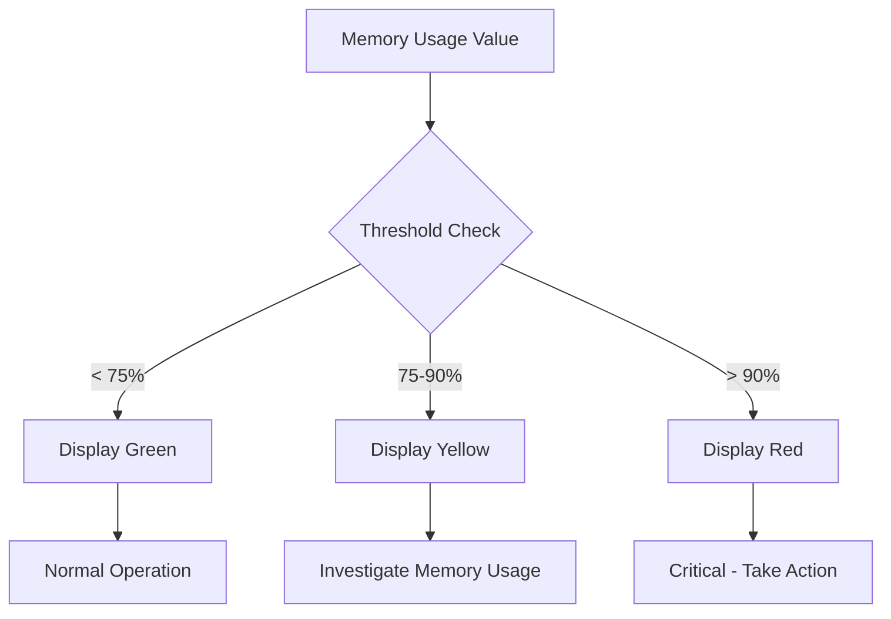

# Panel Thresholds

## Introduction

Thresholds are a powerful feature in Grafana that allow you to highlight specific ranges of data based on their values. They add visual cues to your panels when metrics cross predefined boundaries, making it easier to identify when values enter warning or critical states.

Think of thresholds as traffic lights for your data:
- Green: Everything is normal
- Yellow: Values require attention
- Red: Critical values requiring immediate action

In this tutorial, we'll explore how to configure thresholds in Grafana panels, understand different threshold modes, and implement practical examples for effective monitoring.

## Understanding Threshold Basics

Thresholds in Grafana consist of:

1. **Threshold values**: Numeric boundaries that define when the visual appearance should change
2. **Colors**: Visual indicators associated with each threshold range
3. **Modes**: How thresholds are applied to your data (absolute or percentage)

## Configuring Basic Thresholds

Let's start with setting up basic thresholds on a Grafana panel:

1. Create or edit a panel in your Grafana dashboard
2. Navigate to the "Panel" tab in the panel editor
3. Find and expand the "Thresholds" section

Here's how you can set up simple thresholds for a server CPU usage panel:

```javascript
// Example threshold configuration (conceptual, not actual code)
thresholds: [
  { value: 0, color: 'green' },   // 0-70%: Normal operation
  { value: 70, color: 'yellow' }, // 70-90%: Warning level
  { value: 90, color: 'red' }     // >90%: Critical level
]
```

## Threshold Modes

Grafana provides two primary threshold modes:

### 1. Absolute Thresholds

Absolute thresholds apply directly to the data values. For example, if monitoring temperature in Celsius:

```javascript
// Example absolute thresholds for temperature monitoring
thresholds: [
  { value: 0, color: 'blue' },    // <0°C: Below freezing
  { value: 25, color: 'green' },  // 0-25°C: Normal range
  { value: 35, color: 'orange' }, // 25-35°C: Warm
  { value: 40, color: 'red' }     // >40°C: Overheating
]
```

### 2. Percentage Thresholds

Percentage thresholds are based on the percentage of the maximum value in your data series:

```javascript
// Example percentage thresholds
thresholds: [
  { value: 0, color: 'green' },    // 0-80% of max: Normal
  { value: 80, color: 'yellow' },  // 80-95% of max: Warning
  { value: 95, color: 'red' }      // >95% of max: Critical
]
```

## Step-by-Step: Adding Thresholds to a Gauge Panel

Let's walk through creating a gauge panel with thresholds for monitoring system memory usage:

1. Create a new panel and select the "Gauge" visualization
2. Configure your data source query to return memory usage percentage
3. In the Panel tab, locate the "Thresholds" section
4. Click "Add threshold" to create a new threshold boundary
5. Set up thresholds as follows:
   - Base (0): Green - Normal memory usage
   - First threshold (75): Yellow - Memory usage needs attention
   - Second threshold (90): Red - Critical memory pressure

<br />



## Practical Example: Server Monitoring Dashboard

Let's create a practical example of using thresholds in a server monitoring dashboard:

### CPU Usage Gauge with Thresholds

```javascript
// Panel configuration example
{
  "type": "gauge",
  "title": "CPU Usage",
  "datasource": "Prometheus",
  "targets": [
    {
      "expr": "100 - (avg by (instance) (irate(node_cpu_seconds_total{mode=\"idle\"}[1m])) * 100)",
      "refId": "A"
    }
  ],
  "options": {
    "reduceOptions": {
      "values": false,
      "calcs": ["mean"],
      "fields": ""
    },
    "orientation": "auto",
    "showThresholdLabels": false,
    "showThresholdMarkers": true
  },
  "fieldConfig": {
    "defaults": {
      "min": 0,
      "max": 100,
      "thresholds": {
        "mode": "absolute",
        "steps": [
          { "value": null, "color": "green" },
          { "value": 70, "color": "yellow" },
          { "value": 85, "color": "red" }
        ]
      },
      "unit": "percent"
    }
  }
}
```

With this configuration, your gauge will:
- Display green when CPU usage is below 70%
- Turn yellow when it reaches 70-85%
- Turn red when it exceeds 85%

## Dynamic Thresholds Based on Time Ranges

You can also implement more advanced thresholds that adapt to different time periods:

```javascript
// Conceptual example for dynamic thresholds based on time
if (timeRange.includes("weekend")) {
  // Lower thresholds for weekend when traffic should be lower
  thresholds = [
    { value: 0, color: 'green' },
    { value: 40, color: 'yellow' },
    { value: 70, color: 'red' }
  ];
} else {
  // Normal workday thresholds
  thresholds = [
    { value: 0, color: 'green' },
    { value: 70, color: 'yellow' },
    { value: 90, color: 'red' }
  ];
}
```

## Using Thresholds with Different Panel Types

Thresholds work with multiple visualization types in Grafana:

### Time Series Panels

In time series panels, thresholds appear as horizontal lines, making it easy to see when your data crosses important boundaries:

```javascript
// Time series threshold example
{
  "type": "timeseries",
  "fieldConfig": {
    "defaults": {
      "thresholds": {
        "mode": "absolute",
        "steps": [
          { "value": null, "color": "green" },
          { "value": 1000, "color": "yellow" },
          { "value": 2000, "color": "red" }
        ]
      }
    }
  }
}
```

### Stat Panels

Stat panels can change their background color based on thresholds:

```javascript
// Stat panel threshold example
{
  "type": "stat",
  "options": {
    "colorMode": "background"
  },
  "fieldConfig": {
    "defaults": {
      "thresholds": {
        "mode": "absolute",
        "steps": [
          { "value": null, "color": "green" },
          { "value": 50, "color": "yellow" },
          { "value": 80, "color": "red" }
        ]
      }
    }
  }
}
```

## Custom Threshold Colors

While Grafana provides default colors, you can use custom colors to match your organization's standards:

```javascript
// Custom color thresholds
{
  "thresholds": {
    "mode": "absolute",
    "steps": [
      { "value": null, "color": "#7EB26D" },  // Custom green
      { "value": 50, "color": "#EAB839" },    // Custom yellow
      { "value": 80, "color": "#E24D42" }     // Custom red
    ]
  }
}
```

## Best Practices for Using Thresholds

1. **Choose meaningful threshold values**: Base thresholds on historical data and service level objectives (SLOs)

2. **Consistent color schemes**: Use the same colors for similar severity levels across all dashboards

3. **Avoid too many thresholds**: Keep it simple with 2-4 thresholds to prevent visual confusion

4. **Use descriptive tooltip text**: Add context by including descriptions for each threshold level

5. **Combine with alerts**: Thresholds are visual indicators, but consider setting up actual Grafana alerts for critical thresholds

## Advanced: Using Value Mappings with Thresholds

Combine value mappings with thresholds for even more powerful visualizations:

```javascript
// Combining thresholds with value mappings
{
  "fieldConfig": {
    "defaults": {
      "thresholds": {
        "mode": "absolute",
        "steps": [
          { "value": null, "color": "green" },
          { "value": 1, "color": "red" }
        ]
      },
      "mappings": [
        {
          "type": "value",
          "options": {
            "0": { "text": "Healthy", "index": 0 },
            "1": { "text": "Error", "index": 1 }
          }
        }
      ]
    }
  }
}
```

## Summary

Thresholds are a fundamental feature in Grafana that transform raw data into meaningful visual indicators. By setting up appropriate threshold values and colors, you can:

- Quickly identify abnormal values in your metrics
- Create intuitive dashboards that highlight potential issues
- Establish visual standards for normal, warning, and critical conditions
- Improve your team's ability to spot problems before they affect users

By mastering thresholds, you've taken a significant step toward creating more effective monitoring dashboards in Grafana.

## Additional Resources

- Practice implementing thresholds on different panel types
- Experiment with absolute vs. percentage threshold modes
- Try creating a dashboard that uses consistent threshold colors across multiple panels
- Challenge: Create a dashboard for monitoring a web application with appropriate thresholds for response time, error rates, and resource utilization

In the next section, we'll explore how to use Grafana annotations to mark important events on your time series panels.