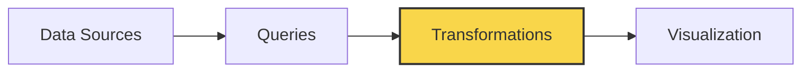
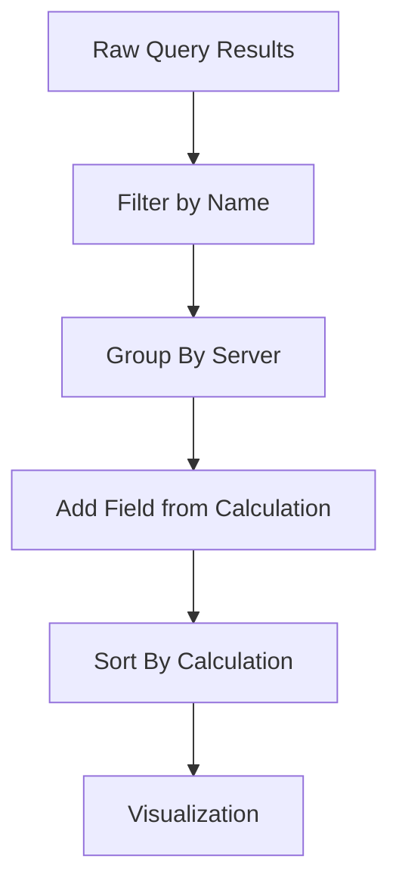

# Panel Transformations

## Introduction

When visualizing data in Grafana, you might need to restructure, combine, or filter your data before it's displayed. Panel transformations are powerful tools that let you manipulate your query results before they reach the visualization. Think of transformations as data preprocessing steps that occur between your data source query and the panel visualization.

Transformations allow you to:
- Rename fields
- Perform calculations across series
- Filter out data points
- Organize data in different ways
- Join multiple queries together
- Convert data between different formats

This guide will walk you through everything you need to know about panel transformations to take your Grafana dashboards to the next level.

## Understanding the Transformation Pipeline

Before diving into specific transformations, it's important to understand how the transformation pipeline works in Grafana.



1. **Data Source**: Your raw data comes from a configured data source (Prometheus, MySQL, InfluxDB, etc.)
2. **Queries**: You write queries to extract specific data
3. **Transformations**: Applied to the query results in sequence (this is our focus!)
4. **Visualization**: The transformed data is displayed in the panel

Transformations are processed in order, with each transformation taking the output of the previous one as its input.

## Basic Transformations

Let's explore some essential transformations that you'll commonly use:

### Rename Fields

The Rename fields transformation allows you to change the display names of your query results.

**How to apply it:**
1. Edit your panel
2. Navigate to the Transform tab
3. Add the "Rename fields" transformation
4. Map original field names to new display names

**Example:**

If your query returns fields like:
- `cpu_usage_system`
- `cpu_usage_user`
- `cpu_usage_idle`

You might rename them to:
- `System CPU`
- `User CPU`
- `Idle CPU`

This makes your visualizations more readable without changing your underlying queries.

### Filter by Name

This transformation lets you include or exclude fields based on their names.

**How to apply it:**
1. Edit your panel
2. Navigate to the Transform tab
3. Add the "Filter by name" transformation
4. Choose "Include" or "Exclude" mode
5. Specify the field names or patterns to match

**Example code:**

```javascript
// Example: Field names before transformation
const fields = [
  "temperature_celsius",
  "humidity_percent",
  "pressure_hpa",
  "wind_speed_kmh",
  "wind_direction_degrees"
];

// After applying "Filter by name" transformation with pattern "temperature|humidity"
const filteredFields = [
  "temperature_celsius",
  "humidity_percent"
];
```

This is particularly useful when you have queries that return many fields but you only want to visualize a subset of them.

## Advanced Transformations

Now, let's explore some more powerful transformations:

### Reduce

The Reduce transformation allows you to calculate aggregate values from your time series data.

**How to apply it:**
1. Edit your panel
2. Navigate to the Transform tab
3. Add the "Reduce" transformation
4. Select the calculation(s) you want to perform (min, max, mean, sum, etc.)

**Example scenario:**

Imagine you have CPU usage data over time, and you want to display the minimum, maximum, and average values:

```javascript
// Incoming time series data (simplified)
const cpuData = [
  { time: "2023-01-01T12:00:00Z", value: 45 },
  { time: "2023-01-01T12:01:00Z", value: 48 },
  { time: "2023-01-01T12:02:00Z", value: 52 },
  { time: "2023-01-01T12:03:00Z", value: 49 },
  { time: "2023-01-01T12:04:00Z", value: 47 }
];

// After Reduce transformation with min, max, mean calculations
const reducedData = [
  { field: "Min", value: 45 },
  { field: "Max", value: 52 },
  { field: "Mean", value: 48.2 }
];
```

This transformation is perfect for summary panels or when you need to extract key metrics from time series data.

### Group By

This transformation organizes your data by grouping it according to the values of a chosen field.

**How to apply it:**
1. Edit your panel
2. Navigate to the Transform tab
3. Add the "Group by" transformation
4. Select the field(s) to group by
5. Choose the calculation to perform within each group

**Example scenario:**

If you have server metrics from multiple data centers and want to group them:

```javascript
// Original data
const serverData = [
  { datacenter: "us-east", server: "srv-01", cpu: 65, memory: 72 },
  { datacenter: "us-east", server: "srv-02", cpu: 42, memory: 58 },
  { datacenter: "us-west", server: "srv-03", cpu: 78, memory: 82 },
  { datacenter: "us-west", server: "srv-04", cpu: 51, memory: 63 }
];

// After Group By transformation (grouping by datacenter, calculating mean)
const groupedData = [
  { datacenter: "us-east", cpu_mean: 53.5, memory_mean: 65 },
  { datacenter: "us-west", cpu_mean: 64.5, memory_mean: 72.5 }
];
```

### Join by Field

This powerful transformation lets you combine data from multiple queries based on matching field values.

**How to apply it:**
1. Edit your panel
2. Navigate to the Transform tab
3. Add the "Join by field" transformation
4. Select the field to join on

**Example scenario:**

Imagine you have two separate queries:
- One query returns server uptime
- Another query returns server error rates

You can join them by server name to create a combined dataset:

```javascript
// Query 1 results
const uptimeData = [
  { server: "app-01", uptime_days: 45 },
  { server: "app-02", uptime_days: 12 },
  { server: "db-01", uptime_days: 30 }
];

// Query 2 results
const errorData = [
  { server: "app-01", error_rate: 0.02 },
  { server: "app-02", error_rate: 0.15 },
  { server: "db-01", error_rate: 0.01 }
];

// After Join transformation
const joinedData = [
  { server: "app-01", uptime_days: 45, error_rate: 0.02 },
  { server: "app-02", uptime_days: 12, error_rate: 0.15 },
  { server: "db-01", uptime_days: 30, error_rate: 0.01 }
];
```

## Real-World Examples

Let's explore some practical examples of transformations in action.

### Example 1: Server Health Dashboard

Imagine you're building a dashboard to monitor the health of your application servers:

1. You have queries for CPU usage, memory usage, disk I/O, and network traffic
2. You want to combine these metrics for each server and calculate an overall health score

**Transformation Pipeline:**
1. **Join by field**: Join all metrics using server name
2. **Add field from calculation**: Create a health score based on weighted metrics
3. **Sort by**: Order servers by health score
4. **Filter data by values**: Show only servers with scores below threshold

This gives you an at-a-glance view of problematic servers.

### Example 2: Time Series to Table Conversion

Sometimes you need to convert time series data to a tabular format:

1. You have time series data of website traffic by page
2. You want to create a table showing top pages by traffic

**Transformation Pipeline:**
1. **Reduce**: Calculate the sum of views for each page
2. **Sort by**: Order pages by total views (descending)
3. **Limit**: Show only the top 10 pages

```javascript
// Example implementation of time series to table
function transformTimeSeriestoTable(timeSeriesData) {
  // Step 1: Reduce - sum views for each page
  const pageViewSums = {};
  
  timeSeriesData.forEach(point => {
    if (!pageViewSums[point.page]) {
      pageViewSums[point.page] = 0;
    }
    pageViewSums[point.page] += point.views;
  });
  
  // Step 2: Convert to array of objects
  let tableData = Object.entries(pageViewSums).map(([page, views]) => ({
    page,
    total_views: views
  }));
  
  // Step 3: Sort by views (descending)
  tableData.sort((a, b) => b.total_views - a.total_views);
  
  // Step 4: Limit to top 10
  tableData = tableData.slice(0, 10);
  
  return tableData;
}
```

## Creating Complex Transformation Chains

For advanced data visualization needs, you can chain multiple transformations together. Here's how to approach building complex transformation chains:

1. **Start simple**: Begin with one transformation and test the result
2. **Add incrementally**: Add one transformation at a time, testing between additions
3. **Consider order**: Remember that the order of transformations matters
4. **Use debug mode**: Enable debug mode to view data at each step of the pipeline

**Example Complex Chain:**



## Performance Considerations

When using transformations, keep these performance tips in mind:

1. **Transform at the right level**: When possible, perform filtering and aggregation in your data source query rather than transformations
2. **Consider the data volume**: Complex transformations on large datasets can impact dashboard performance
3. **Limit before join**: Apply filtering transformations before joining datasets
4. **Cache when appropriate**: For static data, consider using dashboard caching

## Troubleshooting Transformations

If your transformations aren't working as expected:

1. **Enable debug mode**: Click the bug icon in the transformation row to see the data at each step
2. **Check field names**: Many issues stem from field name mismatches
3. **Verify data types**: Ensure the data types match what the transformation expects
4. **Check for nulls**: Some transformations may behave unexpectedly with null values
5. **Review the order**: The sequence of transformations can significantly impact results

## Summary

Panel transformations provide a powerful way to manipulate and reshape your data before visualization in Grafana. By mastering transformations, you can:

- Create more insightful visualizations
- Combine data from multiple sources
- Perform calculations and data manipulations
- Customize your dashboards for specific use cases
- Reduce the complexity of your data source queries

Remember that transformations are applied in sequence, and each transformation takes the result of the previous one as its input. Start with simple transformations, and gradually build more complex chains as you become comfortable with the process.

## Additional Resources

To deepen your understanding of Grafana transformations:

- Practice with the exercises below
- Experiment with different transformation combinations
- Review real dashboard examples in the Grafana community

## Exercises

1. **Basic Transformation Exercise**: Create a panel that shows the average, minimum, and maximum values of a time series query using the Reduce transformation.

2. **Intermediate Exercise**: Join two different metrics (e.g., CPU usage and memory usage) and create a scatter plot visualization showing their correlation.

3. **Advanced Exercise**: Create a dashboard showing server performance metrics grouped by data center, with an overall health score calculated using multiple transformations.

Happy transforming!